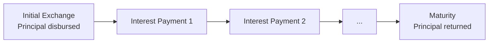

# PAM — Principal at Maturity

## Overview

PAM (Principal at Maturity) is the simplest and most common ACTUS contract type. It models instruments where the full principal is exchanged at the start, periodic interest is paid during the contract's life, and the full principal is returned at maturity. This covers: fixed and floating rate loans, bonds, term deposits, and similar instruments.

## How a PAM Contract Works

At the start (IED), the lender provides the principal. Periodically, the borrower pays interest based on the outstanding principal and the current interest rate. At maturity (MD), the borrower returns the full principal. No principal is repaid during the contract's life — it all comes back at the end.

## Contract Terms

The key parameters that define a PAM contract:

| Parameter | Description | Example |
|---|---|---|
| ContractID | Unique identifier | "PAM001" |
| StatusDate | Current evaluation date | 2025-01-01 |
| InitialExchangeDate | When the principal is disbursed | 2025-01-15 |
| MaturityDate | When the principal is returned | 2030-01-15 |
| NotionalPrincipal | The principal amount | 1,000,000 |
| NominalInterestRate | The annual interest rate | 0.05 (5%) |
| DayCountConvention | How to compute time fractions | A/365 |
| CycleOfInterestPayment | Payment frequency | P3ML (quarterly) |
| ContractRole | Lender (RPA) or borrower (RPL) | RPA |
| Currency | Payment currency | USD |

### Optional Parameters

| Parameter | Description |
|---|---|
| AccruedInterest | Interest accrued before status date |
| CycleOfRateReset + MarketObjectCodeOfRateReset | Floating rate: when and where to look up new rates |
| RateSpread / RateMultiplier | Adjustments applied to the market rate |
| LifeCap / LifeFloor | Rate bounds over the contract's lifetime |
| PeriodCap / PeriodFloor | Rate bounds per reset period |
| CycleOfFee + FeeRate + FeeBasis | Periodic fee schedule |
| CycleOfScalingIndex + scaling parameters | Index-linked scaling adjustments |
| PurchaseDate / TerminationDate | Transfer of ownership dates |

## Event Types Generated

A PAM contract generates the following event types:

| Event | Code | When | What Happens |
|---|---|---|---|
| Initial Exchange | IED | Contract start | Principal is disbursed; state is initialised |
| Interest Payment | IP | Each payment cycle | Accrued interest is paid; accrual resets to zero |
| Interest Capitalisation | IPCI | On IPCI schedule | Accrued interest is added to principal instead of paid |
| Rate Reset (Variable) | RR | On rate reset cycle | Interest rate is updated from market data |
| Rate Reset (Fixed) | RRF | On rate reset cycle | Interest rate is set to a pre-determined value |
| Fee Payment | FP | On fee cycle | Fee is paid (absolute or notional-based) |
| Scaling | SC | On scaling cycle | Notional and/or interest scaling factors are updated |
| Maturity | MD | Contract end | Full principal is returned |
| Purchase | PRD | Purchase date | Ownership transfer to new holder |
| Termination | TD | Termination date | Early termination settlement |
| Analysis | AD | Evaluation date | Snapshot of state for analysis purposes |
| Credit Default | CD | On credit event | Default-triggered settlement |

## Event Processing Order

Events are sorted by date. When multiple events fall on the same date, they are processed in a fixed priority order (IED before IP before IPCI, etc.). This deterministic ordering ensures that the same contract always produces the same results regardless of how events were generated internally.

## State Variables

The contract maintains state that carries forward between events:

| State Variable | Description |
|---|---|
| NotionalPrincipal | Current outstanding principal |
| NominalInterestRate | Current annual interest rate |
| AccruedInterest | Interest accumulated since last payment |
| FeeAccrued | Fees accumulated since last fee payment |
| NotionalScalingMultiplier | Current notional scaling factor |
| InterestScalingMultiplier | Current interest scaling factor |

Each event reads the current state, computes its payoff, and updates the state. The updated state becomes the input for the next event.

## The 42 Reference Tests

ACTUS publishes 42 official PAM test cases that cover the full range of parameter combinations. Every test specifies exact expected values for every event's payoff and state. This implementation passes all 42 tests to 10 decimal places on both the CPU and GPU engines.
