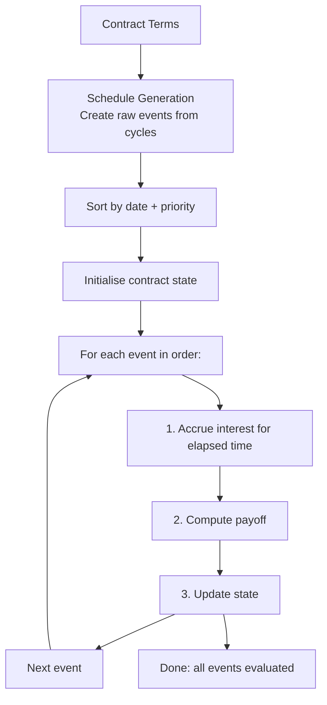

# Event System

## Overview

Every ACTUS contract produces a stream of events. An event represents something that happens at a specific point in time: a payment, a rate adjustment, a fee charge, or any other contractually defined occurrence. The event system is the core of the ACTUS engine.

## Event Lifecycle

## Schedule Generation

The schedule generator reads the contract terms and creates all events that will occur during the contract's lifetime. For each periodic event type (interest payments, rate resets, fees, scaling), it:

1. Reads the cycle definition (e.g., "P3ML" = every 3 months, long stub)
2. Reads the cycle anchor date (or uses the initial exchange date as anchor)
3. Generates dates from the anchor to maturity, respecting the cycle
4. Applies end-of-month convention if applicable
5. Applies business day convention to each date

Non-periodic events (IED, MD, PRD, TD) are generated directly from their contract term dates.

## Event Ordering

Events must be processed in a strict order. The primary sort key is the event date. When multiple events share the same date, a secondary priority ordering determines the sequence:

IED → IP → IPCI → PRD → TD → RR → RRF → FP → SC → MD → AD → CD

This ordering is defined by the ACTUS standard and is critical for correctness. For example, if a rate reset and an interest payment both fall on March 1st, the rate reset must happen first so the interest payment uses the new rate. The ordering rules ensure this.

## Interest Accrual

Between any two events, interest accrues based on:

- The outstanding notional principal
- The current nominal interest rate
- The elapsed time (computed using the contract's day count convention)

The accrual formula is: `accrued += notional × rate × yearFraction(prevDate, currDate)`

This accrual is tracked in the contract state and either paid out (IP event), capitalised (IPCI event), or carried forward.

## Payoff Computation

Each event type computes its payoff differently:

| Event | Payoff Formula |
|---|---|
| IED | −roleSign × notional × (1 − premiumDiscount) |
| IP | roleSign × accruedInterest × interestScaling |
| IPCI | 0 (interest is capitalised, not paid) |
| RR/RRF | 0 (rate changes, no payment) |
| FP | roleSign × feeAmount |
| SC | 0 (scaling changes, no payment) |
| MD | roleSign × notional × notionalScaling |
| PRD | −roleSign × (notional + accrued) × scaling |
| TD | roleSign × (notional + accrued) × scaling |

The roleSign is +1 for the receiving party and −1 for the paying party, determined by the ContractRole.

## Risk Factor Integration

Some events need external market data. Rate reset events (RR) look up the current market rate from the risk factor model. The model stores time-series of rate observations and returns the most recent observation at or before the requested date (last observation carried forward).

After lookup, the rate is adjusted: `newRate = rateMultiplier × marketRate + rateSpread`, then clamped between the contract's floor and cap values.
