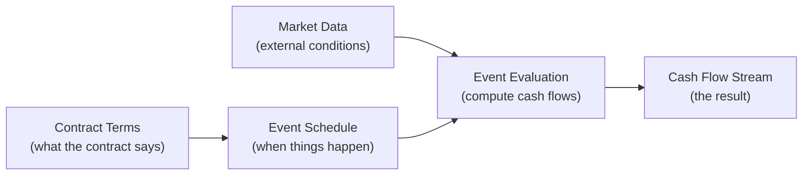

# ACTUS Financial Contracts

## What is ACTUS?

ACTUS (Algorithmic Contract Types Unified Standards) is a standard that defines how financial contracts behave in precise mathematical terms. It specifies, for every type of financial contract: when events occur (payments, rate resets, maturity), how the contract's state changes at each event, and how cash flows are calculated.

The critical property of ACTUS is **determinism**: given the same contract terms and the same market data, the calculations always produce exactly the same cash flows. There is no room for interpretation. This is what makes ACTUS valuable for regulators, auditors, and risk managers — the numbers are reproducible and independently verifiable.

## The ACTUS Data Model

Every ACTUS contract follows the same conceptual model:

**Contract terms** define the contract: principal amount, interest rate, payment frequency, maturity date, and all the parameters that characterise it.

**The event schedule** is generated from the contract terms: initial exchange, interest payments, rate resets, fees, maturity — each is a dated event.

**Event evaluation** processes each event in chronological order, computing the cash flow and updating the contract's state. Where the contract references market data (e.g., a floating interest rate), the risk factor model provides the value.

**The cash flow stream** is the final result: a time-ordered sequence of events with amounts, updated state values, and all the information needed for valuation and risk analysis.

## Contract Types

The ACTUS standard defines over 30 contract types. This implementation focuses on **PAM (Principal at Maturity)**, the foundational type that covers fixed and floating rate loans, bonds, and deposits.

PAM is characterised by:

- A principal amount that does not amortise (the full principal is returned at maturity)
- Periodic interest payments based on the outstanding principal
- Optional rate resets (for floating-rate contracts)
- Optional fees and scaling adjustments

Other ACTUS contract types (such as LAM for linear amortisation, NAM for negative amortisation, and ANN for annuity contracts) follow the same event-driven model but with different principal repayment patterns. The engine's architecture supports adding these through the same interface.

## Continue Reading

- [PAM Contract Type](./contract-types/pam.md) — detailed documentation of the PAM contract
- [Event System](./event-system/index.md) — event types, ordering, and processing
- [Risk Factors](./risk-factors/index.md) — market data, scenario models, and rate lookups
