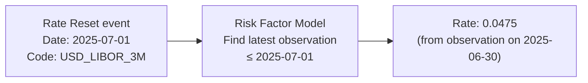
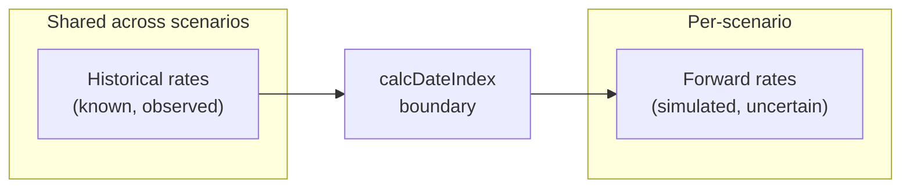

# Risk Factors

## Overview

Financial contracts do not exist in isolation. A floating-rate loan depends on market interest rates. An inflation-linked bond depends on a price index. A foreign-currency contract depends on exchange rates. The risk factor model provides these external data points to the contract evaluation engine.

## The Risk Factor Model

The risk factor model is a container for time-series of market observations. Each series is identified by a market object code (e.g., "USD_LIBOR_3M") and contains dated observations.

When a contract event needs a market rate (e.g., a rate reset), it queries the risk factor model with the market object code and the event date. The model returns the most recent observation at or before that date — a lookup policy called **last observation carried forward**.

## Scenario-Based Evaluation

For Monte Carlo simulation, the risk factor model is populated with different rate paths for each scenario. This allows the same portfolio to be evaluated under hundreds or thousands of possible futures.

The scenario generator in this project uses the **Vasicek interest rate model**, a well-established model that produces mean-reverting rate paths:

| Parameter | Symbol | Description |
|---|---|---|
| Mean reversion speed | κ | How quickly rates return to the long-term mean |
| Long-term mean | θ | The equilibrium rate level |
| Volatility | σ | How much rates fluctuate |
| Initial rate | r₀ | Starting rate value |

Each scenario is an independent stochastic path. The generator uses a deterministic seeded random number generator, so the same seed always produces the same scenarios — ensuring full reproducibility.

## CalcDateIndex Boundary

In Monte Carlo evaluation, rates are often split into two periods:

- **Prior rates** (before the calculation date): historical observations shared across all scenarios
- **After rates** (from the calculation date forward): scenario-specific simulated paths

The calcDateIndex parameter defines this boundary. This reflects real-world practice: you know what rates were in the past, but you model uncertainty about the future.

## Rate Application

When a rate reset event retrieves a market rate, the contract's terms specify how to apply it:

1. Look up the raw market rate
2. Apply the rate multiplier: `adjusted = rateMultiplier × marketRate`
3. Add the rate spread: `adjusted = adjusted + rateSpread`
4. Clamp to period bounds: `adjusted = max(periodFloor, min(periodCap, adjusted))`
5. Clamp to lifetime bounds: `adjusted = max(lifeFloor, min(lifeCap, adjusted))`

This layered adjustment allows contracts to express complex rate structures: a loan might be "LIBOR + 200bp with a 1% floor and 8% cap."

## Supported Risk Factor Types

The current implementation supports interest rate risk factors. The architecture supports adding other types (FX rates, equity indices, credit spreads, inflation indices) by extending the risk factor model with additional series types and lookup methods.
