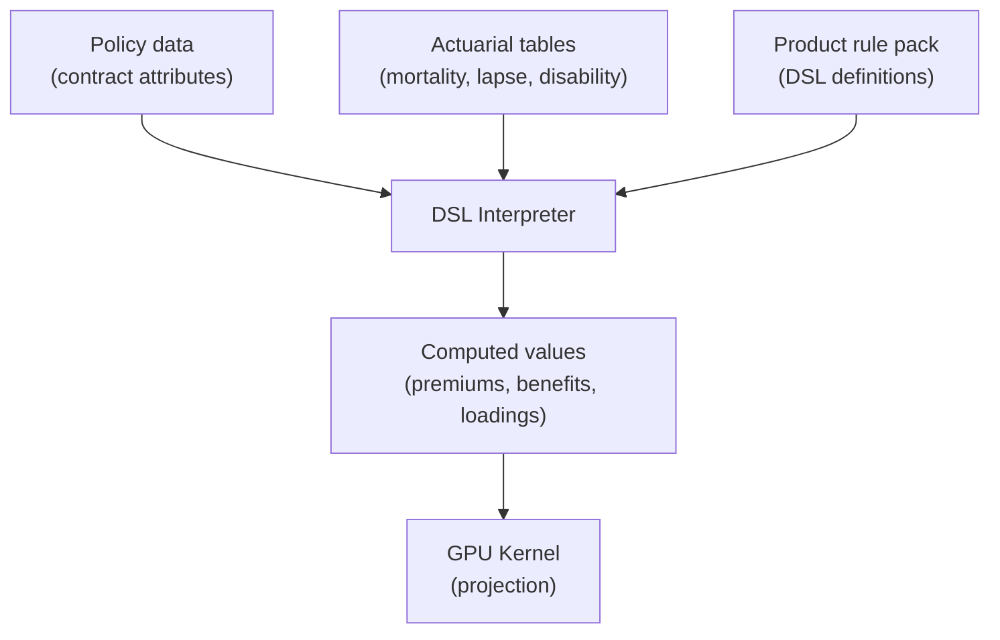

# DSL & Product Rules

## Overview

Insurance products vary enormously: a term life policy has different rules from a whole life policy, which has different rules from a critical illness policy. Hard-coding every product's rules into the engine would mean rebuilding the engine every time a new product is launched.

Instead, this project uses a **domain-specific language (DSL)** that allows product rules to be defined in structured text files. The engine interprets these rules at runtime. New products can be added by writing new rule files — no engine changes needed.

## What the DSL Expresses

- **Factor expressions** — numeric risk values computed from policy attributes (mortality rates, premiums, benefit amounts)
- **Guard rules** — boolean conditions controlling whether a state transition is allowed
- **Loading adjustments** — modifiers for risk factors such as smoking status or occupational class
- **Table lookups** — references into actuarial tables for mortality, lapse, and disability rates

## How Rules Integrate with the Engine

The DSL interpreter runs on the CPU during the setup phase. It evaluates product rules to compute per-policy parameters that are then passed to the GPU kernel as pre-computed scalars. The kernel itself operates on those values — it does not interpret DSL at runtime.

This division keeps the GPU kernel fast and simple (no string processing or dynamic dispatch), while the DSL provides the flexibility to define complex product-specific logic.

## Extensibility

Adding a new insurance product requires:

1. Define the product's factors in `factor_set.json` using DSL expressions
2. Define the product's guard rules in `rule_set.json`
3. Provide the associated actuarial lookup tables
4. Define the Markov graph (or reuse an existing one)
5. Package as a rule pack and embed in the assembly

The engine, adapter, and GPU kernel do not need to change.

---

## In This Section

| Page | Contents |
|---|---|
| [Syntax Reference](./syntax) | Type system, lexical elements, operators, conditionals |
| [Data References](./data-references) | `snapshot.*`, `facts.*`, `eval_date`, `$factor_id`, `meta.*` |
| [Built-in Functions](./built-in-functions) | `months_between`, `premium_mode_factor`, `contains`, `table_lookup` |
| [Factor Definitions](./factors) | Factor structure, evaluation order, standard factor set |
| [Guard Rules](./guard-rules) | Guard structure, reason templates, standard rule set |
| [DSL Internals](./internals) | Rule packs, compilation pipeline, lexer/parser/interpreter/evaluator |
