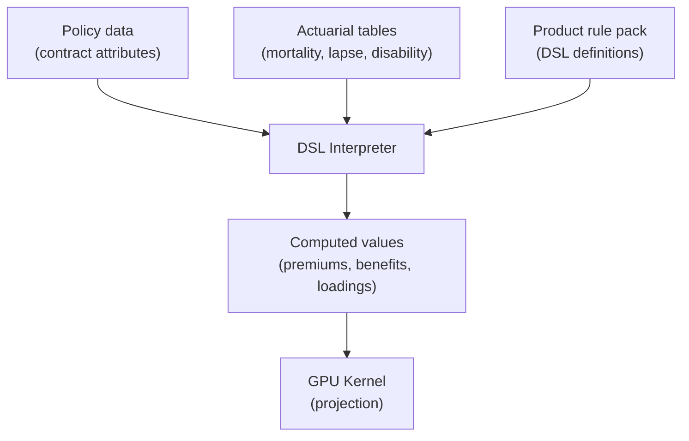

# DSL & Product Rules

## Overview

Insurance products vary enormously: a term life policy has different rules from a whole life policy, which has different rules from a critical illness policy. Hard-coding every product's rules into the engine would mean rebuilding the engine every time a new product is launched.

Instead, this project uses a **domain-specific language (DSL)** that allows product rules to be defined in structured text files. The engine interprets these rules at runtime. New products can be added by writing new rule files — no engine changes needed.

## What the DSL Expresses

The DSL can define:

- **Premium calculations** — how to compute the premium amount based on policy attributes
- **Benefit formulas** — how to calculate claim payouts
- **Eligibility conditions** — when a transition is allowed (guards)
- **Loading adjustments** — how to modify base rates for risk factors
- **Product-specific logic** — any calculation that varies by product

## DSL Components

### Lexer

The lexer tokenises rule expressions, supporting: numeric literals (integers and floats), boolean literals, string literals, operators (+, −, ×, ÷, **, comparisons, logical), keywords (if/then/else), and references to data fields.

### Parser

The parser implements a recursive-descent grammar with operator precedence:

| Precedence | Operators | Description |
|---|---|---|
| Lowest | if-then-else | Conditional expressions |
| | \|\| | Logical OR |
| | && | Logical AND |
| | ! | Logical NOT |
| | <, <=, >, >=, ==, != | Comparisons |
| | +, − | Addition, subtraction |
| | ×, ÷ | Multiplication, division |
| | ** | Exponentiation |
| Highest | −(unary), literals, references | Negation and primary values |

### Data References

Rules can reference data from multiple sources:

| Reference Syntax | Source |
|---|---|
| `snapshot.fieldName` | Current policy state (age, sum assured, premium, etc.) |
| `facts.fieldName` | External facts (market conditions, regulatory parameters) |
| `$factor_id` | Named actuarial factor or parameter |
| `eval_date` | The current evaluation date |
| `table_lookup(...)` | Lookup in an actuarial table |

### Built-in Functions

The DSL includes built-in functions for common actuarial operations: table lookups, interpolation helpers, date arithmetic, and mathematical functions.

## Rule Structure

A rule definition specifies:

```
rule rule_id {
    description: "Human-readable explanation"
    inputs: [snapshot.age, snapshot.sumAssured, $mortality_factor]
    guard: snapshot.state == "Active" && snapshot.age >= 18
    expression: snapshot.sumAssured * $mortality_factor * (1 + snapshot.extraLoadingBps / 10000)
    priority: 100
}
```

| Component | Purpose |
|---|---|
| rule_id | Unique identifier for the rule |
| description | Human-readable documentation |
| inputs | Data fields the rule reads (for dependency tracking) |
| guard | Condition that must be true for the rule to apply |
| expression | The calculation to perform |
| priority | When multiple rules match, higher priority wins |

## Rule Packs

Rules are grouped into **rule packs** — collections of rules that define a complete insurance product. A rule pack includes:

- Product metadata (name, version, effective dates)
- All rules for that product (premiums, benefits, transitions, loadings)
- Lookup table definitions referenced by the rules
- The Markov graph definition (which states and transitions apply)

Rule packs are loaded from embedded resources. Multiple products can coexist — each policy's product type determines which rule pack is used.

## How Rules Integrate with the Engine



The DSL interpreter runs on the CPU during the setup phase. It evaluates product rules to compute per-policy parameters that are then passed to the GPU kernel as pre-computed inputs. The kernel itself operates on the pre-computed values — it does not interpret DSL at runtime.

This division keeps the GPU kernel fast and simple (no string processing or dynamic dispatch), while the DSL provides the flexibility to define complex product-specific logic.

## Extensibility

Adding a new insurance product requires:

1. Define the product's rules in the DSL
2. Provide the associated actuarial tables
3. Define the Markov graph (or reuse an existing one)
4. Package as a rule pack

The engine, adapter, and GPU kernel do not need to change. This separation of concerns means that product designers and actuaries can work independently of the engineering team.
