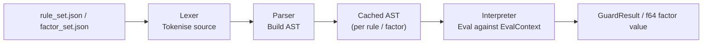

# DSL Internals

This page describes how the DSL is loaded, compiled, and evaluated at runtime — covering rule packs, the compilation pipeline, and the four main components: lexer, parser, interpreter, and rule evaluator.

---

## Rule Packs

Rules and factors are packaged into **rule packs** — a pair of JSON files that together define a complete insurance product:

| File | Contents |
|---|---|
| `rule_set.json` | All transition guard rules for the product |
| `factor_set.json` | All risk factor definitions for the product |

Each pack has a unique `id` (e.g. `life-standard-rules-v1`) and a semver `version`. Multiple products can coexist in the same assembly — each policy's product type determines which pack is used.

Rule packs are loaded from embedded assembly resources at startup by `DslRulePackLoader`. The loader parses every expression and guard with `DslParser` and caches the resulting ASTs. Parsing happens once; all subsequent evaluations operate directly on the cached AST.

---

## Compilation Pipeline



The four stages map directly to four classes:

| Stage | Class | Responsibility |
|---|---|---|
| Tokenisation | `DslLexer` | Converts a DSL source string into a `Token` stream |
| Parsing | `DslParser` | Converts the token stream into an AST |
| Evaluation | `DslInterpreter` | Tree-walks the AST against an `EvalContext` |
| Orchestration | `DslRuleEvaluator` | Loads rules/factors, manages topological order, exposes public API |

---

## Lexer (`DslLexer`)

`DslLexer` tokenises a rule expression string into a flat list of `Token` values. Each token carries a `Kind` (enum) and `Text` (the matched source string). Single-line `//` comments are silently discarded.

Example tokens from `snapshot.age_at_eval`:

| Token | Kind |
|---|---|
| `snapshot` | `Identifier` |
| `.` | `Dot` |
| `age_at_eval` | `Identifier` |

Example tokens from `$factor_smoker_loading`:

| Token | Kind |
|---|---|
| `factor_smoker_loading` | `DollarIdent` |

---

## Parser (`DslParser`)

`DslParser` implements a **recursive-descent grammar** with explicit operator precedence. It produces an Abstract Syntax Tree (AST) whose node types map one-to-one with DSL constructs:

| AST Node | Example source |
|---|---|
| `FloatLiteralExpr` | `1.35` |
| `IntLiteralExpr` | `24` |
| `BoolLiteralExpr` | `true`, `false` |
| `StringLiteralExpr` | `"Active"` |
| `SnapshotFieldExpr` | `snapshot.age_at_eval` |
| `EvalDateExpr` | `eval_date` |
| `FactsFieldExpr` | `facts.death_reported` |
| `MetaFieldExpr` | `meta.occupation_class` |
| `FactorRefExpr` | `$factor_smoker_loading` |
| `BinaryOpExpr` | `a + b`, `x >= 3.0`, `p && q` |
| `UnaryOpExpr` | `-x`, `!flag` |
| `IfExpr` | `if cond then a else b` |
| `TableLookupExpr` | `table_lookup("tbl", (k1, k2))` |
| `BuiltinCallExpr` | `months_between(a, b)`, `premium_mode_factor(m)` |

The parser entry point is `DslParser.ParseExpression()`. It never mutates shared state and is safe to call from multiple threads.

---

## Interpreter (`DslInterpreter`)

`DslInterpreter` is a **tree-walking interpreter** that evaluates an AST node against an `EvalContext`. The static method `DslInterpreter.Eval(expr, ctx)` is the single entry point.

Key evaluation rules:

- Integer literals are promoted to `DslDouble` (f64) automatically
- `&&` and `||` are **short-circuit**: the right branch is never evaluated if the left branch determines the result
- `==` performs cross-type equality: comparing a `DslBool` to a `DslDouble` is valid
- Any unresolvable field access (e.g. a `facts.*` field that was not supplied) throws `DslRuntimeException`
- Type mismatches in arithmetic (e.g. `"Active" + 1.0`) throw `DslRuntimeException`

The interpreter is **stateless** — all mutable state lives in the `EvalContext` that is passed in. It is therefore thread-safe: multiple threads can evaluate the same AST simultaneously, each with their own context.

---

## Rule Evaluator (`DslRuleEvaluator`)

`DslRuleEvaluator` is the high-level entry point for the rest of the engine. It is constructed once (a thread-safe singleton is available as `DslRuleEvaluator.Default`) and exposes two public methods.

### `EvaluateGuard(ruleId, ctx)`

Evaluates the named guard rule and returns a `GuardResult`:

```csharp
var result = DslRuleEvaluator.Default.EvaluateGuard("rule_death_benefit_eligible", ctx);
// result.Allowed    → true / false
// result.Reason     → "State Active; death reported: True."
// result.InputsUsed → { "snapshot.current_state": "Active", "facts.death_reported": "True" }
```

Throws `InvalidOperationException` if the rule ID is not found or if the guard expression evaluates to a non-boolean type.

### `EvaluateFactors(ctx)`

Evaluates all factors in topological DAG order, populating `ctx.FactorValues` incrementally:

```csharp
DslRuleEvaluator.Default.EvaluateFactors(ctx);
// ctx.FactorValues["factor_age"]                   → 54.0
// ctx.FactorValues["factor_smoker_loading"]         → 1.35
// ctx.FactorValues["factor_adjusted_mortality_qx"]  → <computed>
```

Each factor stores its result into `ctx.FactorValues` as it is computed, making it immediately available to any factor that depends on it later in the sequence. The method returns a snapshot copy of the dictionary.

### Topological sort

At construction time the evaluator runs Kahn's algorithm over the factor dependency graph to determine evaluation order. This is a one-time O(V+E) cost. If a cycle exists in the dependencies, construction fails with an `InvalidOperationException`.

---

## Evaluation Context (`EvalContext`)

`EvalContext` carries everything a DSL expression can read:

```csharp
new EvalContext
{
    SnapshotFields = /* IReadOnlyDictionary<string, DslValue> — from LifeContractGpu */,
    FactsFields    = /* IReadOnlyDictionary<string, DslValue> — from TransitionContextFacts */,
    MetaFields     = /* IReadOnlyDictionary<string, DslValue> — from IProductMetaExtractor */,
    EvalDateDays   = /* double — days since Unix epoch */,
    FactorValues   = /* Dictionary<string, double> — populated during EvaluateFactors */,
    Tables         = /* ILookupTableProvider — for table_lookup expressions */,
}
```

Use `EvalContextBuilder.Build(contract, evalDateDays, facts)` to construct a standard context, or `EvalContextBuilder.BuildWithMeta(...)` when product-specific metadata fields are needed.
