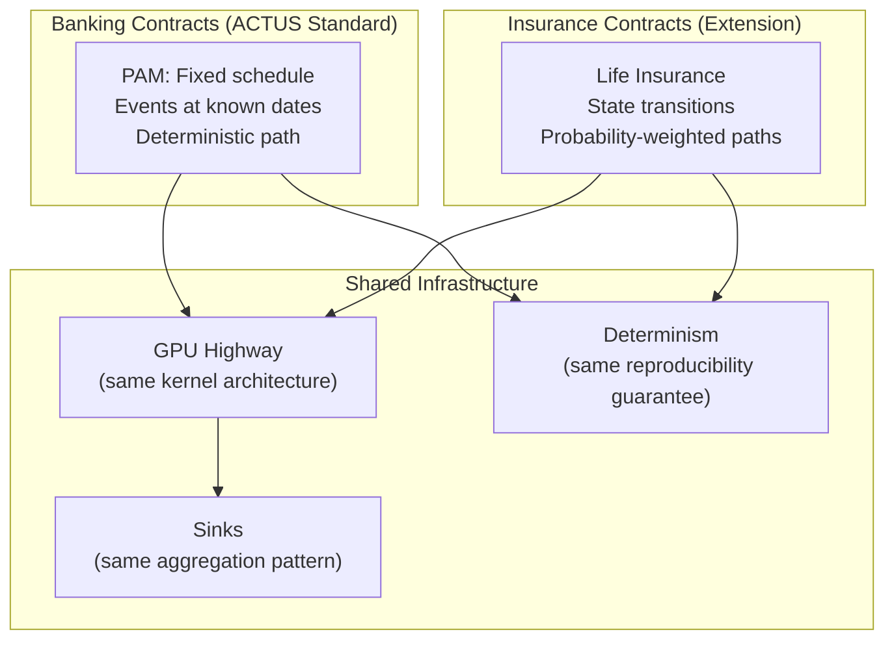

# ACTUS Insurance Extensions

## Why Insurance?

ACTUS was designed for banking contracts — loans, bonds, deposits — where the contract follows a fixed schedule. Insurance contracts are fundamentally different: a life insurance policy can be active, lapse, enter a grace period, trigger a death benefit, or be reinstated. The path a policy takes depends on probabilities, not a fixed schedule.

This project extends ACTUS to handle insurance contracts while preserving the standard's core property: **determinism**. The same policy, with the same actuarial tables and the same terms, always produces the same expected cash flows.

## The Insurance Extension Architecture

The extension adds three new capabilities:

1. **Markov state transition model** — defines all possible states a policy can be in and the probabilities of moving between them
2. **Actuarial lookup tables** — mortality, lapse, and disability rates indexed by age, gender, duration, and other factors
3. **Domain-specific language (DSL)** — configurable product rules that allow actuaries to define new insurance products without changing the engine

## How Insurance Differs from Banking

| Aspect | Banking Contract (PAM) | Insurance Contract (Life) |
|---|---|---|
| Event schedule | Fixed: payments at known dates | Dynamic: transitions depend on probabilities |
| Path | One deterministic path | Multiple possible paths (active, lapsed, claimed, etc.) |
| State changes | Predictable (rate reset, maturity) | Probabilistic (death, lapse, disability) |
| Cash flows | Exact amounts | Expected values (probability-weighted averages) |
| Time step | Event-driven (irregular dates) | Regular intervals (monthly) |
| External data | Market rates | Actuarial tables (mortality, lapse, disability) |

The key insight: while individual policy paths are uncertain, the **expected** cash flow — the probability-weighted average across all possible paths — is deterministic. Given the same actuarial assumptions, the expected cash flow is always the same.

## Continue Reading

- [Life Insurance Model](./life-insurance/index.md) — how life insurance policies are projected on the GPU
- [Markov State Transitions](./markov-model/index.md) — the state diagram and transition probabilities
- [DSL & Product Rules](./dsl-and-rules/index.md) — the domain-specific language for configurable insurance products
