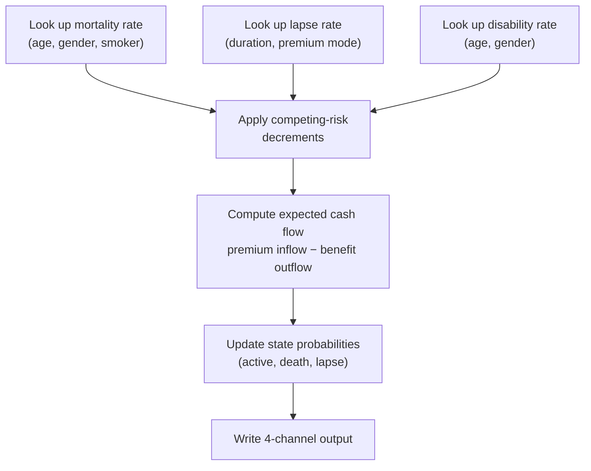

# Life Insurance Model

## Overview

The life insurance projection model takes a portfolio of insurance policies and projects each one forward over a multi-year horizon (typically 30 years), computing expected cash flows at each time step. Unlike banking contracts where events happen at fixed dates, insurance projections step through time at regular monthly intervals, applying probabilistic state transitions at each step.

## Contract Data

Each insurance policy is represented by a set of attributes:

| Attribute | Description |
|---|---|
| ContractId | Unique policy identifier |
| CurrentState | Current policy state (Active, Lapsed, etc.) |
| SumAssured | Death benefit amount |
| PremiumAmount | Regular premium payment |
| PremiumMode | Payment frequency (Monthly, Quarterly, Annual) |
| AgeAtEvaluation | Insured person's age at the evaluation date |
| InsuredGender | Male, Female, or Unspecified |
| SmokerStatus | Whether the insured is a smoker |
| YearsInForce | How long the policy has been active |
| ExtraPremiumBps | Underwriting loading in basis points |
| ClaimsCount | Number of prior claims |
| LapseCount | Number of prior lapses |

## Projection Algorithm

At each monthly time step, the kernel performs these calculations for each policy:

### Step 1: Look Up Hazard Rates

Three hazard rates are retrieved from pre-built lookup tables:

**Mortality rate** — based on the Gompertz-Makeham model: a parametric formula that increases exponentially with age. The base rate is adjusted for gender (female rates are 85% of male) and loaded for smoker status (1.35× for smokers) and underwriting adjustments.

**Lapse rate** — based on policy duration: higher in early years (8% in the first year), declining over time (2% after 10 years). Adjusted for premium mode (annual payers lapse less than monthly payers).

**Disability rate** — increases with age above 30, capped at 5%. Female rates are 1.1× male rates.

### Step 2: Apply Competing-Risk Decrements

The three hazard rates compete: a policy can only exit through one cause at a time. The total decrement is capped at 1.0 to ensure probabilities remain valid.

### Step 3: Compute Expected Cash Flow

The expected cash flow at each time step is:

`expectedCashflow = probActive × premiumInflow − probDeath × deathBenefit`

This is a probability-weighted average: the premium inflow is weighted by the probability the policy is still active, and the death benefit outflow is weighted by the probability of death in that period.

### Step 4: Update State Probabilities

Three running probabilities are maintained and updated at each step:

- **probActive** — probability the policy is still in force (decreases over time)
- **probDeathClaimed** — cumulative probability of death claim (increases)
- **probLapsed** — cumulative probability of lapse (increases)

These always satisfy: probActive + probDeathClaimed + probLapsed ≤ 1.0

## Output Structure

Each time step produces four values per policy (the "4-channel" output):

| Channel | Description |
|---|---|
| ExpectedCashflow | Net probability-weighted cash flow |
| ProbActive | Probability the policy is still active |
| ProbDeathClaimed | Cumulative probability of death claim |
| ProbLapsed | Cumulative probability of lapse |

For a portfolio of 10,000 policies projected over 30 years (360 monthly steps), the output is 10,000 × 360 × 4 = 14.4 million values. The GPU produces this in under 50 milliseconds.

## GPU Execution

The life insurance kernel maps one GPU thread per policy. Each thread independently projects its policy through all time steps, reading from shared lookup tables and writing to its own output region. Since policies are completely independent, there is no synchronisation between threads — the same parallelism principle that works for banking contracts works equally well for insurance.

For Monte Carlo (stress testing different actuarial assumptions), policies are replicated C×S times before kernel dispatch. Each replica carries scenario-specific adjustments (e.g., a 10% increase in mortality rates). The kernel processes each replica as an independent thread.
