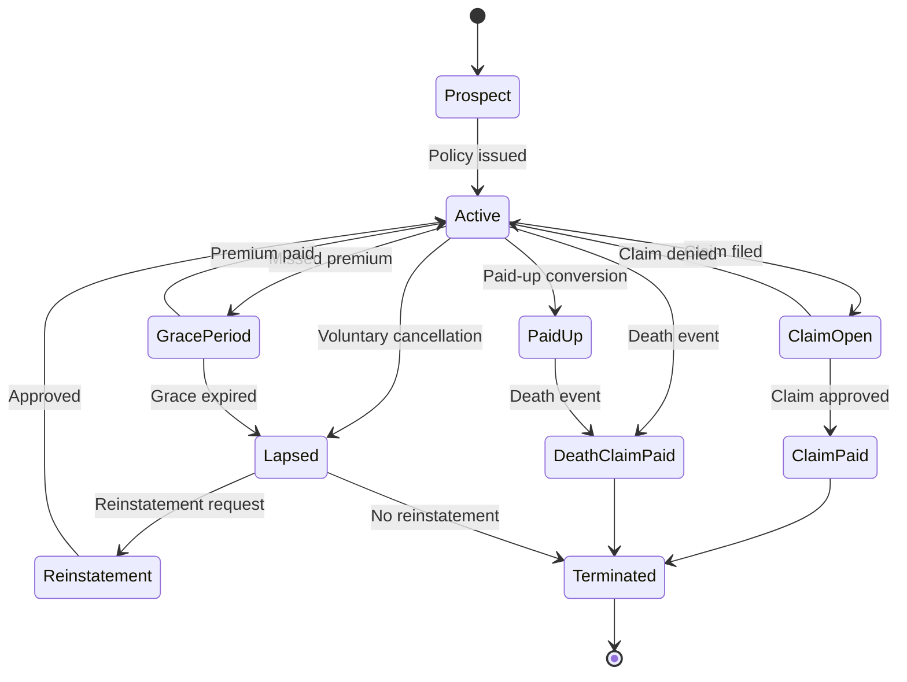

# Markov State Transitions

## Overview

A Markov model defines all possible states a system can be in and the probabilities of transitioning between them. For insurance, the "system" is a policy, and the states represent its lifecycle: from initial issuance through active coverage to eventual termination by death, lapse, or maturity.

## The 10 Policy States

| State | Code | Terminal | Description |
|---|---|---|---|
| Prospect | 0 | No | Policy application submitted, not yet active |
| Active | 1 | No | Policy is in force, premiums being paid |
| Grace Period | 2 | No | Premium missed, within grace period |
| Lapsed | 3 | No | Coverage suspended due to non-payment |
| Paid Up | 4 | No | Premiums stopped, reduced coverage continues |
| Claim Open | 5 | No | A claim has been filed and is being processed |
| Claim Paid | 6 | Yes | Claim has been approved and paid |
| Death Claim Paid | 7 | Yes | Death benefit has been paid |
| Reinstatement | 8 | No | Lapsed policy undergoing reinstatement |
| Terminated | 9 | Yes | Policy has ended (final state) |

Terminal states absorb the policy — once entered, no further transitions occur.

## Transition Hazards

Each transition between states is governed by a **hazard rate** — the probability per unit time of that transition occurring. The three primary hazard types are:

| Hazard Type | Governs Transitions From | Source |
|---|---|---|
| Mortality | Active → Death Claim Paid, Paid Up → Death Claim Paid | Mortality lookup table (age, gender, smoker) |
| Lapse | Active → Lapsed, Grace Period → Lapsed | Lapse lookup table (duration, premium mode) |
| Disability | Active → Claim Open | Disability lookup table (age, gender) |

### Mortality Model (Gompertz-Makeham)

The mortality hazard follows the Gompertz-Makeham formula, a well-established actuarial model where the force of mortality increases exponentially with age:

`μ(x) = A + B × exp(x × ln C)`

Where x is age, and A, B, C are parameters fitted to population data. The annual probability of death is derived as: `q(x) = 1 − exp(−μ(x))`

Adjustments:

- Female mortality: 85% of male mortality
- Smoker loading: 1.35× for smokers
- Underwriting loading: 1 + (ExtraPremBps / 10,000)

### Lapse Model

Lapse rates depend on policy duration (years in force) and premium payment mode:

| Duration | Base Annual Lapse Rate |
|---|---|
| 0–0.5 years | 8% |
| 0.5–1 year | 7% |
| 1–2 years | 6% |
| 2–3 years | 5% |
| 3–5 years | 4% |
| 5–10 years | 3% |
| 10+ years | 2% |

Premium mode adjustments: monthly payers have the base rate (1.00×), quarterly payers 0.95×, annual payers 0.90×.

### Disability Model

Disability incidence increases with age: base rate of 0.3% + 0.02% for each year over 30, capped at 5%. Female rates are 1.1× male rates.

## The Markov Graph Definition

The state diagram is defined in an embedded JSON resource (`markov_graph.json`) that serves as the single source of truth. This file defines:

- **States** — ID, label, and whether the state is terminal
- **Transitions** — from state, to state, hazard type, guard conditions, and effects
- **Effects** — what happens financially when a transition occurs (e.g., "pay death benefit")

The graph is loaded once at startup and used to build the hazard matrix that the GPU kernel reads. By changing the graph definition, different insurance product structures can be modelled without modifying the kernel code.

## Competing Risks

When multiple transitions are possible from the same state (e.g., from Active, a policy could die, lapse, or become disabled), the model uses **competing-risk decrements**. The total transition probability out of a state is the sum of all individual hazard rates, capped at 1.0 to maintain valid probabilities.

This ensures that: probActive + probDeath + probLapse + probDisability = 1.0 at all times.
