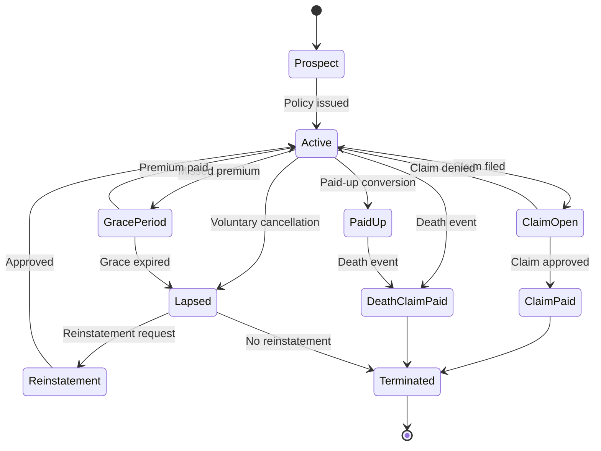
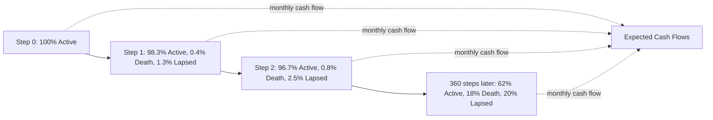
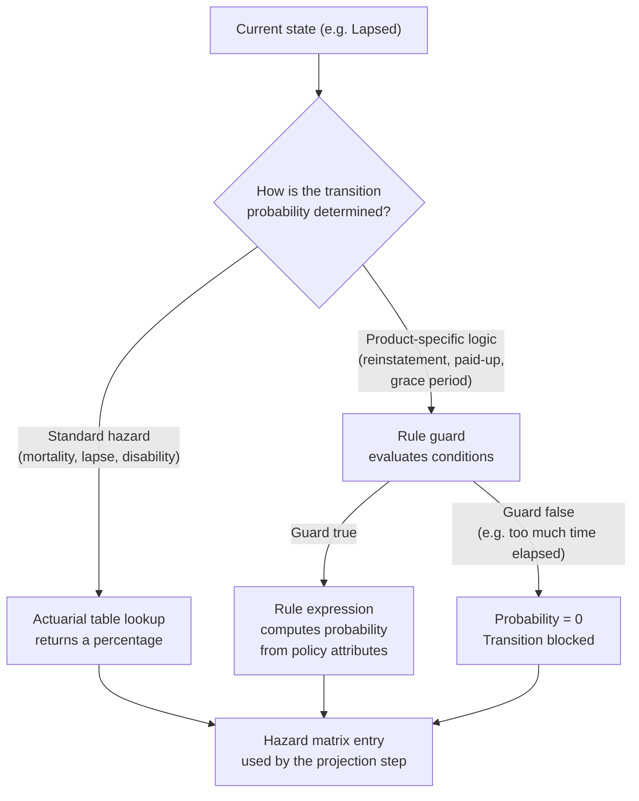
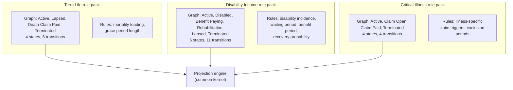

# Markov State Transitions

## Why a Markov Model?

A banking contract follows a fixed schedule. You know in advance exactly when each payment falls and exactly what the cash flow will be. An insurance policy does not work that way. The same policy — same age, same sum assured, same premium — can end in completely different ways: the insured person might die in year three, or lapse the policy in year one, or hold it for thirty years and collect at maturity. There is no single path.

The question the model needs to answer is: given everything we know today, what is the expected cash flow this policy will produce over its lifetime? To answer that you need two things — a complete map of where the policy can go, and a way of assigning probabilities to each possible route.

The Markov model provides exactly that. It defines a set of **states** (the distinct situations a policy can be in) and a set of **transitions** (the moves between states, each with an associated probability). At every point in time, instead of tracking one fixed outcome, the model carries forward a probability for each state simultaneously. A policy does not "choose" to stay active — the model says it is 92% likely to be active, 3% likely to have lapsed, 4% likely to have produced a death claim, and 1% terminated.

The "Markov" property is the key simplification: the probability of moving to the next state depends only on the **current state**, not on how the policy got there. This is both mathematically tractable and actuarially defensible — what matters for a lapse rate is how long the policy has been active, not what happened in an earlier grace period.

---

## The 10 Policy States

| State | Code | Terminal | Description |
|---|---|---|---|
| Prospect | 0 | No | Policy application submitted, not yet active |
| Active | 1 | No | Policy is in force, premiums being paid |
| Grace Period | 2 | No | Premium missed, within grace period |
| Lapsed | 3 | No | Coverage suspended due to non-payment |
| Paid Up | 4 | No | Premiums stopped, reduced coverage continues |
| Claim Open | 5 | No | A claim has been filed and is being processed |
| Claim Paid | 6 | Yes | Claim has been approved and paid |
| Death Claim Paid | 7 | Yes | Death benefit has been paid |
| Reinstatement | 8 | No | Lapsed policy undergoing reinstatement |
| Terminated | 9 | Yes | Policy has ended (final state) |

Terminal states absorb the policy — once entered, no further transitions occur.

---

## How the Model Steps Forward

The model runs in monthly time steps across the projection horizon (typically 30 years, so 360 steps). At each step, for each policy, it asks: what is the probability of moving from the current state to each possible next state?

The mechanics follow a straightforward sequence.

**Step 1 — Read the current probability distribution.** At step zero, the policy is in a known state (say, Active), so the probability for Active is 1.0 and all others are 0.0. As the model runs forward, this spreads into a probability distribution across states: perhaps 85% Active, 8% Lapsed, 4% Death Claim Paid, 3% Terminated.

**Step 2 — Look up the hazard rates.** For each transition out of the active states, the model retrieves a probability from an actuarial table. These are the primary hazard types:

| Hazard Type | Governs | Source |
|---|---|---|
| Mortality | Active to Death Claim Paid, Paid Up to Death Claim Paid | Mortality table indexed by age, gender, smoker status |
| Lapse | Active to Lapsed, Grace Period to Lapsed | Lapse table indexed by duration and premium mode |
| Disability | Active to Claim Open | Disability table indexed by age and gender |

**Step 3 — Handle competing risks.** Multiple things can happen to the same policy at the same time step, but a policy can only transition once. If the mortality rate is 0.4% and the lapse rate is 5% and the disability rate is 0.8%, the total probability of leaving the Active state is 6.2%. Each destination receives its share of that probability, and the remaining 93.8% stays Active. The model always maintains a valid probability distribution — the probabilities across all states always sum to 1.0.

**Step 4 — Compute the expected cash flow.** The cash flow at each step is the probability-weighted average:

`expected cash flow = probability(Active) x premium inflow - probability(Death) x death benefit`

This is the key output: not what will happen to this specific policy, but what a large cohort of identical policies would produce on average.

**Step 5 — Carry forward and repeat.** The updated probability distribution becomes the input for the next time step. Over 360 monthly steps, the distribution gradually migrates — Active probability declines, terminal state probabilities accumulate — producing a complete cash flow timeline from today to the end of the projection horizon.

---

## Transition Hazards

### Mortality Model (Gompertz-Makeham)

The mortality hazard follows the Gompertz-Makeham formula, a well-established actuarial model where the force of mortality increases exponentially with age:

`mu(x) = A + B x exp(x x ln C)`

Where x is age, and A, B, C are parameters fitted to population data. The annual probability of death is derived as: `q(x) = 1 - exp(-mu(x))`

Adjustments:

- Female mortality: 85% of male mortality
- Smoker loading: 1.35x for smokers
- Underwriting loading: 1 + (ExtraPremBps / 10,000)

### Lapse Model

Lapse rates depend on policy duration (years in force) and premium payment mode:

| Duration | Base Annual Lapse Rate |
|---|---|
| 0-0.5 years | 8% |
| 0.5-1 year | 7% |
| 1-2 years | 6% |
| 2-3 years | 5% |
| 3-5 years | 4% |
| 5-10 years | 3% |
| 10+ years | 2% |

Premium mode adjustments: monthly payers have the base rate (1.00x), quarterly payers 0.95x, annual payers 0.90x.

### Disability Model

Disability incidence increases with age: base rate of 0.3% + 0.02% for each year over 30, capped at 5%. Female rates are 1.1x male rates.

---

## When Lookup Tables Are Not Enough: Where Rules Come In

The three hazard tables above cover the high-volume transitions well: almost every policy has a mortality rate, a lapse rate, and a disability rate, and they all follow the same parametric or tabular form indexed by a small number of dimensions.

But insurance products are not uniform. Some transitions depend on product-specific logic that a lookup table cannot capture on its own. Consider:

- The grace period length before lapse is triggered: 30 days on some products, 60 on others
- Whether a paid-up conversion is available, and what the reduced sum assured formula is
- Whether reinstatement is permitted after a certain elapsed time since lapse, and what underwriting requirements apply
- A loading that depends on a combination of claims history and years in force

None of these fit a simple actuarial table keyed on age and duration. They depend on the product definition itself.

This is where the **DSL rule set** steps in. Rather than reading a probability directly from a table, the model evaluates a rule. The rule has access to the policy's current attributes and state, can reference actuarial factors, and can read from specialised tables. It returns either a transition probability or a guard condition.

A **guard condition** acts as a gate. It evaluates whether a transition is even possible at this time step. If the guard is false — for example, a reinstatement request arriving more than 24 months after lapse — the transition probability is set to zero regardless of any other calculation. If the guard is true, a further rule expression computes what the probability actually is.

The result is a **hybrid model**: standard actuarial tables handle the dominant probabilistic transitions, and DSL rules handle the product-specific conditional logic. The Markov projection engine itself is indifferent to the source — it receives a completed hazard matrix for each time step and advances the probability distribution. Whether a matrix cell came from a parametric formula, a lookup table, or a DSL expression makes no difference to the step-forward calculation.

This separation means actuaries can introduce new products by writing new rule packs — adjusting grace period lengths, defining conversion options, setting reinstatement windows — without touching the projection engine. The engine is common infrastructure; the product is expressed in rules.

---

## The Markov Graph Definition

The state diagram is defined in an embedded resource (markov_graph.json) that serves as the single source of truth for which states and transitions exist. This file defines:

- **States** — ID, label, and whether the state is terminal
- **Transitions** — from state, to state, hazard type, guard conditions, and effects
- **Effects** — what happens financially when a transition occurs (e.g., "pay death benefit")

By changing the graph definition, different insurance product structures can be modelled — a term life product has different transitions available than a whole life product — without modifying the projection engine. The graph and the rule pack together define the product; the engine is common infrastructure.

---

## One Graph Per Product Type

Each product type carries its own Markov graph. The graph is bundled inside the rule pack alongside the DSL rules and actuarial table references, so when a policy is processed, the engine loads the rule pack for *that* product and uses *that* product's graph. A term life policy and a disability income policy can have entirely different state structures running simultaneously in the same portfolio projection.

This matters because different products genuinely need different topologies. A term life policy is relatively simple — Active, Lapsed, Death Claim Paid, Terminated are the meaningful states. A disability income policy needs additional states such as Disabled, Benefit Paying, and Rehabilitation, plus recovery transitions back to Active that term life does not have at all. A single-premium critical illness contract may not have a Lapsed state at all, since there are no ongoing premiums to miss. Forcing all of these into one universal graph would mean carrying unreachable states and impossible transitions for every product — unnecessary complexity with no benefit.

The projection engine itself is indifferent to which graph it receives. It reads the hazard matrix, steps the probability distribution forward, and writes the cash flows. The graph tells it the shape of the matrix; the rule pack tells it the values. Neither the shape nor the values are baked into the engine.

**Mixed portfolios work naturally.** When a portfolio contains policies of different product types, each policy is projected using its own rule pack. A batch of 10,000 policies — some term life, some disability income, some critical illness — runs in a single pass. Each policy carries a reference to its product type; the engine resolves the correct rule pack and graph for each one before the projection starts.

**The kernel constraint.** The kernel's data structures have a fixed maximum state count, since GPU memory layouts are static. In practice this is resolved by padding: smaller graphs are padded to the maximum size with states that have zero transition probabilities everywhere and are never entered. The projection is mathematically correct regardless — zero-probability states contribute nothing to the probability distribution or the cash flows. The maximum state count is a deployment parameter, not a fundamental limit, and can be increased when a new product requires more states than the current ceiling allows.

---

## Competing Risks

When multiple transitions are possible from the same state (e.g., from Active, a policy could die, lapse, or become disabled), the model uses **competing-risk decrements**. The total transition probability out of a state is the sum of all individual hazard rates, capped at 1.0 to maintain valid probabilities.

This ensures that at every step: probActive + probDeath + probLapse + probDisability = 1.0
