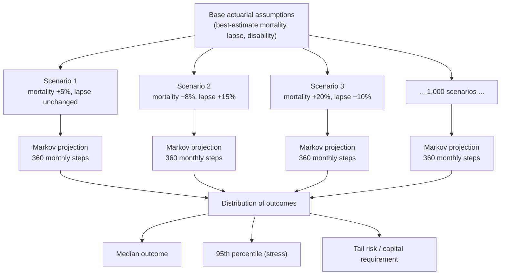
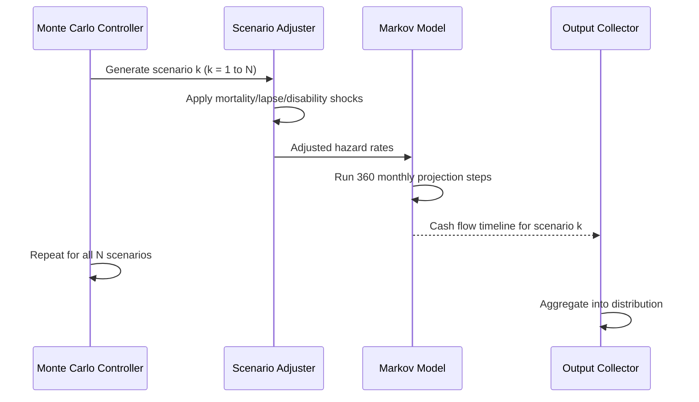
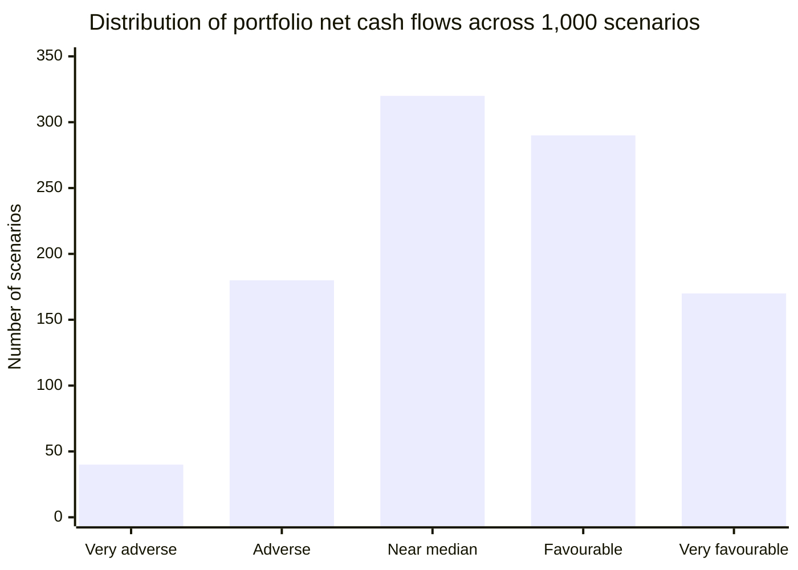

# Monte Carlo Simulation

## The Problem with a Single Projection

When you run the Markov model once with your best-estimate actuarial assumptions — your expected mortality table, your expected lapse rates, your expected disability rates — you get one answer: the expected cash flow stream for each policy.

That answer is useful, but it is not enough. Actuarial assumptions are not facts. They are estimates, and they can be wrong. What happens if mortality is 20% higher than expected over the next decade? What if lapse rates spike because interest rates rise and policyholders find better terms elsewhere? What is the realistic downside? How much capital needs to be held against the tail of bad outcomes?

A single projection cannot answer these questions. Monte Carlo simulation can.

---

## What Monte Carlo Means Here

Monte Carlo simulation runs the Markov projection not once but thousands of times. Each run uses a different set of actuarial assumptions — a different "scenario." The collection of results forms a distribution: a picture of the range of possible outcomes and how likely each region of that range is.

The name comes from the idea of repeated random sampling. Rather than trying to enumerate every possible future analytically (which would be intractable), you draw many random scenarios and observe where the results cluster. With enough scenarios, the distribution of outcomes converges to a reliable picture of the risk.

---

## How Scenarios Are Constructed

Each scenario is a set of adjustments applied to the base actuarial assumptions. Common scenario dimensions include:

**Mortality shocks** — a multiplicative adjustment to the mortality hazard rate across all ages and durations. A scenario might increase mortality by 15% (a pandemic stress), or decrease it by 10% (longevity improvement stress for products that pay on survival).

**Lapse shocks** — a shift in lapse rates, either flat across all durations or shaped (e.g., higher early lapse under financial stress scenarios where many policyholders can no longer afford premiums).

**Disability shocks** — an increase or decrease in disability incidence, often correlated with economic cycle scenarios.

**Combined shocks** — most real-world stress scenarios combine multiple adjustments simultaneously. A recession scenario might combine higher lapses, elevated disability, and slightly elevated mortality together.

The scenarios can be constructed in two ways:

- **Deterministic stress scenarios** — pre-defined shifts that represent specific named risks ("pandemic," "economic downturn," "longevity improvement"). These are used for regulatory stress testing and board-level risk reporting.
- **Stochastic scenarios** — random draws from a probability distribution over the assumption space. Each draw is a plausible but randomly chosen combination of adjustments. Running thousands of stochastic scenarios produces a full statistical distribution of outcomes.

---

## The Markov Model as the Inner Engine

The critical point is that the Markov model does not change between scenarios. The same 10-state structure, the same transition logic, the same DSL rules, the same competing-risk decrement calculation — all of it runs identically in every scenario. What changes is only the input: the hazard rates fed into the model at each time step.

This is why the architecture separates the projection engine from the actuarial assumptions. The projection engine does one thing: given a set of transition probabilities, step the probability distribution forward. The scenarios are simply different flavours of transition probabilities.

For a portfolio of 10,000 policies, running 1,000 scenarios means executing 10,000 × 1,000 = 10 million independent policy projections. Each projection consists of 360 time steps. This is the computational load that the parallel architecture is designed to absorb: each policy-scenario pair maps to an independent thread, and all threads run simultaneously.

---

## What the Output Looks Like

The result of a Monte Carlo run is a **distribution** over outcomes — typically the total net cash flow for the portfolio across the projection horizon, aggregated across all policies.

For each time step or for the full projection, you can read off:

| Statistic | What It Tells You |
|---|---|
| Median (50th percentile) | The central estimate — what you expect in a typical scenario |
| 75th percentile | A moderately adverse outcome |
| 95th percentile | A severe but plausible adverse scenario — commonly used for capital purposes |
| 99th percentile | A very severe tail event |
| Mean | The probability-weighted average across all scenarios |
| Standard deviation | How spread out the outcomes are — a measure of uncertainty |

The shape of this distribution matters as much as any single number. A narrow, symmetric distribution indicates stable, predictable outcomes. A wide distribution with a fat left tail indicates significant downside risk. The Monte Carlo output makes this visible.

---

## Stress Testing vs. Full Stochastic

Monte Carlo simulation in an insurance context is used for two related but distinct purposes.

**Stress testing** runs a specific set of named adverse scenarios and reports the outcomes under each. The goal is to understand the effect of identified risks — what does a 20% increase in mortality do to our solvency position? This is used for regulatory reporting and internal risk management.

**Full stochastic projection** runs a large number of randomly drawn scenarios and builds a complete probability distribution. The goal is to quantify the full range of uncertainty — not just "what happens if mortality goes up by 20%" but "what is the probability that the portfolio loses more than X?" This is used for economic capital calculations and for pricing the cost of risk.

The same Markov model and the same projection infrastructure serve both purposes. The only difference is how the scenarios are generated and what question is asked of the resulting distribution.

---

## Relationship to the Deterministic Best-Estimate

The single best-estimate Markov projection (running once with base assumptions) is not made redundant by Monte Carlo. It remains the primary number used for reserving and cash flow planning — it represents the most likely outcome under current assumptions.

Monte Carlo adds the uncertainty dimension: it shows how sensitive that number is to assumption changes, and it quantifies the tail risk that the best estimate cannot reveal. The two are complementary: the best-estimate projection tells you where you expect to be; the Monte Carlo distribution tells you how confident you should be in that expectation.
