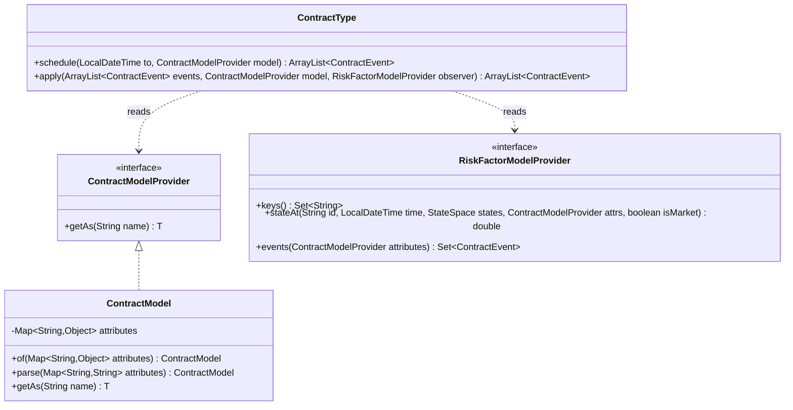

# Public API

The public API of the ACTUS Java implementation consists of three classes/interfaces. A caller needs nothing else.



---

## ContractType

`org.actus.contracts.ContractType` — `public final class`

The single dispatcher. Both methods inspect the `contractType` attribute from the model and route to the corresponding implementation class.

### `schedule`

```java
public static ArrayList<ContractEvent> schedule(
    LocalDateTime to,
    ContractModelProvider model)
```

Generates all contract events from the contract's status date up to (and including) `to`. The returned list is sorted by event time using `EventSequence` offsets, so simultaneous events of different types are in the correct processing order.

`to` is typically set to the analysis horizon — the furthest point in time for which you want projected cash flows.

### `apply`

```java
public static ArrayList<ContractEvent> apply(
    ArrayList<ContractEvent> events,
    ContractModelProvider model,
    RiskFactorModelProvider observer)
```

Evaluates each event in sequence. For each event, the payoff function computes the cash flow and the state transition function updates the `StateSpace`. The returned list is the same as `events` but each `ContractEvent` now has a populated `payoff` value and a post-event `StateSpace` snapshot.

### Dispatch Table

| `contractType` attribute | Dispatched class |
|---|---|
| `PAM` | `PrincipalAtMaturity` |
| `LAM` | `LinearAmortizer` |
| `NAM` | `NegativeAmortizer` |
| `ANN` | `Annuity` |
| `LAX` | `ExoticLinearAmortizer` |
| `CLM` | `CallMoney` |
| `UMP` | `UndefinedMaturityProfile` |
| `CSH` | `Cash` |
| `STK` | `Stock` |
| `COM` | `Commodity` |
| `FXOUT` | `ForeignExchangeOutright` |
| `SWPPV` | `PlainVanillaInterestRateSwap` |
| `SWAPS` | `Swap` |
| `CAPFL` | `CapFloor` |
| `OPTNS` | `Option` |
| `FUTUR` | `Future` |
| `CEG` | `CreditEnhancementGuarantee` |
| `CEC` | `CreditEnhancementCollateral` |
| `BCS` | `BoundaryControlledSwitch` |

Unknown contract type → throws `ContractTypeUnknownException`.

---

## ContractModelProvider

`org.actus.attributes.ContractModelProvider` — `public interface`

```java
public interface ContractModelProvider {
    <T> T getAs(String name);
}
```

All contract terms are retrieved through this single generic method. The type parameter `T` is inferred from the call site. Attribute names match the ACTUS data dictionary exactly (e.g. `"notionalPrincipal"`, `"nominalInterestRate"`, `"maturityDate"`).

Accessing a missing or unconvertible attribute throws `AttributeConversionException`.

### ContractModel

The bundled implementation. It wraps a `Map<String, Object>`.

```java
// Build from already-typed objects
ContractModel model = ContractModel.of(Map.of(
    "contractType",      ContractTypeEnum.PAM,
    "notionalPrincipal", 1_000_000.0,
    "maturityDate",      LocalDateTime.of(2030, 1, 1, 0, 0)
));

// Build from a map of strings (parses to correct types internally)
ContractModel model = ContractModel.parse(Map.of(
    "contractType",      "PAM",
    "notionalPrincipal", "1000000.0",
    "maturityDate",      "2030-01-01T00:00:00"
));
```

`ContractModel.parse` converts each String value to the correct Java type as defined by the ACTUS data dictionary — enums, doubles, `LocalDateTime`, `Period`, etc. Unrecognised values throw `AttributeConversionException`.

---

## RiskFactorModelProvider

`org.actus.externals.RiskFactorModelProvider` — `public interface`

```java
public interface RiskFactorModelProvider {

    // Returns all known risk factor identifiers
    Set<String> keys();

    // Returns the state of risk factor 'id' at 'time'
    double stateAt(String id, LocalDateTime time,
                   StateSpace states,
                   ContractModelProvider attributes,
                   boolean isMarket);

    // Returns any contingent events injected by the risk model (default: empty set)
    default Set<ContractEvent> events(ContractModelProvider attributes) {
        return new HashSet<>();
    }
}
```

The implementor is fully responsible for market data. ACTUS never stores or owns risk factor values — it only calls `stateAt` at evaluation time. This makes it trivial to plug in scenario generators, historical data sources, or simulation engines.

Risk factors are identified by string IDs that match the `marketObjectCode` attribute in the contract model (e.g. a rate index like `"USD-LIBOR-3M"` or an FX pair like `"USD/EUR"`).

If `stateAt` is called for an unknown ID, the implementation should throw `RiskFactorNotFoundException`.

The `isMarket` flag distinguishes market rate factors (`true`) from behavioural or credit factors (`false`).

### Typical Implementation Pattern

```java
public class ScenarioObserver implements RiskFactorModelProvider {
    private final Map<String, NavigableMap<LocalDateTime, Double>> timeSeries;

    @Override
    public Set<String> keys() { return timeSeries.keySet(); }

    @Override
    public double stateAt(String id, LocalDateTime time, StateSpace states,
                          ContractModelProvider attrs, boolean isMarket) {
        NavigableMap<LocalDateTime, Double> ts = timeSeries.get(id);
        if (ts == null) throw new RiskFactorNotFoundException(id);
        // Last Observation Carried Forward (LOCF)
        Map.Entry<LocalDateTime, Double> entry = ts.floorEntry(time);
        return entry != null ? entry.getValue() : 0.0;
    }
}
```

---

## Exceptions

| Class | Extends | When Thrown |
|---|---|---|
| `AttributeConversionException` | `RuntimeException` | `ContractModel.getAs()` cannot convert the stored value to the requested type |
| `ContractTypeUnknownException` | `RuntimeException` | `ContractType` dispatch receives an unrecognised `contractType` string |
| `RiskFactorNotFoundException` | `RuntimeException` | `RiskFactorModelProvider.stateAt()` is called for an ID not in `keys()` |

All three are unchecked exceptions — callers are not required to catch them.
