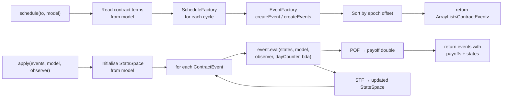
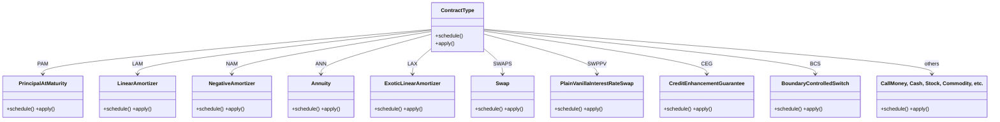

# Contract Type Implementations

## Common Pattern

Every contract type class is `public final` with two `static` methods and no state of its own.

```java
public final class PrincipalAtMaturity {

    public static ArrayList<ContractEvent> schedule(
            LocalDateTime to, ContractModelProvider model) { ... }

    public static ArrayList<ContractEvent> apply(
            ArrayList<ContractEvent> events,
            ContractModelProvider model,
            RiskFactorModelProvider observer) { ... }
}
```

**`schedule`** reads contract terms, builds date sets using `ScheduleFactory`, wraps each date into a `ContractEvent` via `EventFactory`, and returns them sorted.

**`apply`** initialises a `StateSpace` from the model, then iterates over the sorted events calling `event.eval()` on each, accumulating state changes.



---

## Contract Implementations

### PAM — Principal at Maturity

File: `PrincipalAtMaturity.java` (279 lines)

A bullet bond: interest is paid periodically over the life of the contract; the full principal is repaid at maturity.

**Events generated:**

| Event | Condition | Description |
|---|---|---|
| `IED` | Always | Initial exchange — principal disbursement |
| `IP` | `cycleOfInterestPayment` set and not fully capitalised | Periodic interest payments |
| `IPCI` | `cycleOfInterestPayment` set and capitalisation enabled | Capitalised interest (added to principal) |
| `IPCB` | `interestCalculationBase` = `NTL` | Interest calculation base fixing |
| `RR` | `cycleOfRateReset` set, floating | Rate reset — market rate observed |
| `RRF` | `cycleOfRateReset` set, fixed next rate | Rate reset — next rate fixed in contract |
| `SC` | `cycleOfScalingIndex` set | Scaling index update |
| `FP` | `cycleOfFee` set | Fee payment |
| `PRD` | `purchaseDate` set | Purchase event |
| `TD` | `terminationDate` set | Early termination |
| `MD` | Always | Maturity — principal redemption |
| `AD` | Analysis dates requested | Monitoring / valuation snapshots |

**State initialisation** (representative subset):

```java
StateSpace states = new StateSpace();
states.statusDate               = model.getAs("statusDate");
states.notionalPrincipal        = model.getAs("notionalPrincipal");
states.nominalInterestRate      = model.getAs("nominalInterestRate");
states.accruedInterest          = model.getAs("accruedInterest");
states.contractPerformance      = model.getAs("contractPerformance");
states.feeAccrued               = model.getAs("feeAccrued");
states.notionalScalingMultiplier = 1.0;  // or from model
states.interestScalingMultiplier = 1.0;
```

---

### LAM — Linear Amortizer

File: `LinearAmortizer.java` (414 lines)

Fixed periodic principal redemptions. Each `PR` event repays a constant amount of principal, and the interest payment decreases over time as the outstanding principal shrinks.

Adds the `PR` (Principal Redemption) event set to the PAM event set. The `nextPrincipalRedemptionPayment` state variable tracks the next redemption amount.

---

### NAM — Negative Amortizer

File: `NegativeAmortizer.java` (448 lines)

Payments are fixed but may be less than the accrued interest. Any shortfall is capitalised — added back to the outstanding principal — so the principal can *increase* over time before eventually amortising.

---

### ANN — Annuity

File: `Annuity.java` (500 lines)

Level periodic payments. Each payment covers the accrued interest plus a principal redemption amount. The redemption amount grows over time as the outstanding interest shrinks. The `STF_PRF_ANN` function recomputes the `nextPrincipalRedemptionPayment` state variable at each `PRF` (Payment Recalculation) event.

---

### LAX — Exotic Linear Amortizer

File: `ExoticLinearAmortizer.java` (523 lines)

A linear amortiser with additional structural features — variable redemption schedules, exotic rate reset patterns, or complex fee structures. The most complex of the amortising instruments in terms of schedule generation.

---

### CLM — Call Money

File: `CallMoney.java`

Short-term credit facility. Either party may call the outstanding balance at short notice. The maturity is not fixed at inception; it is determined by an exercise event.

---

### UMP — Undefined Maturity Profile

File: `UndefinedMaturityProfile.java`

Open-ended instrument where the balance evolves according to market risk factors rather than a fixed amortisation schedule. Maximum lifetime capped at `Constants.MAX_LIFETIME_UMP` (10 years).

---

### CSH — Cash

File: `Cash.java`

A current account or cash holding. No interest; the principal is constant. Used to model unencumbered cash positions.

---

### STK — Stock

File: `Stock.java`

Equity instrument. The schedule includes `DV` (Dividend) events based on the dividend cycle. The stock price is retrieved from the `RiskFactorModelProvider` at each evaluation date.

Maximum schedule horizon: `Constants.MAX_LIFETIME_STK` (10 years).

---

### COM — Commodity

File: `Commodity.java`

Physical or financial commodity. Similar to STK but with commodity-specific payoff conventions and `DeliverySettlement` logic.

---

### FXOUT — Foreign Exchange Outright

File: `ForeignExchangeOutright.java`

A spot or forward exchange of two currency amounts. Generates two legs with `STD` (Settlement Date) events. The payoff is computed using the FX rate from the risk factor model.

---

### SWPPV — Plain Vanilla Interest Rate Swap

File: `PlainVanillaInterestRateSwap.java`

Fixed-for-floating interest rate swap. Generates two internal legs — a PAM-like fixed leg and a floating-rate leg. Both legs share a single `StateSpace`. The `ContractReference` mechanism links the two legs.

---

### SWAPS — Swap

File: `Swap.java`

Generic swap container. Delegates to two referenced sub-contracts (Leg 1 and Leg 2), each of which can be any contract type.

---

### CAPFL — Cap/Floor

File: `CapFloor.java`

Interest rate cap or floor. At each caplet/floorlet date, the payoff is `max(rate − strike, 0) × notional × dayFraction` (cap) or `max(strike − rate, 0) × notional × dayFraction` (floor). Rates are observed from the risk factor model.

---

### OPTNS — Option

File: `Option.java`

European or American option on an underlying contract. The `OptionType` (call or put), `OptionExerciseType` (European, American, Bermudan), and `DeliverySettlement` attributes control behaviour. The `exerciseDate` and `exerciseAmount` state variables track option exercise.

---

### FUTUR — Future

File: `Future.java`

Exchange-traded futures contract. Daily margin calls (`MR` events) are generated based on the `ClearingHouse` mark-to-market. Settlement is at the `STD` event.

---

### CEG — Credit Enhancement Guarantee

File: `CreditEnhancementGuarantee.java`

Creates a triangular relationship: guarantor, obligee, and debtor. The guarantor's obligation mirrors the debtor's obligation — if the debtor defaults, the guarantee is called. The `GuaranteedExposure` attribute controls the coverage fraction.

Uses `ContractReference` to link to the underlying (covered) contract.

---

### CEC — Credit Enhancement Collateral

File: `CreditEnhancementCollateral.java`

Similar to CEG but coverage comes from a pledged collateral asset rather than a guarantor's personal obligation. The collateral value is retrieved from the risk factor model.

---

### BCS — Boundary Controlled Switch

File: `BoundaryControlledSwitch.java`

A meta-contract that monitors boundary conditions and switches between two active legs. Uses four state flags: `boundaryCrossedFlag`, `boundaryMonitoringFlag`, `boundaryLeg1ActiveFlag`, `boundaryLeg2ActiveFlag`.

When the monitored risk factor crosses the defined boundary, a `ME` (Monitoring Event) triggers a switch between legs.

---

## Class Relationships



---

## Approximate Implementation Size

| Contract | File | Lines |
|---|---|---|
| PAM | `PrincipalAtMaturity.java` | 279 |
| LAM | `LinearAmortizer.java` | 414 |
| NAM | `NegativeAmortizer.java` | 448 |
| ANN | `Annuity.java` | 500 |
| LAX | `ExoticLinearAmortizer.java` | 523 |
| Others | each ~200–400 | varies |
