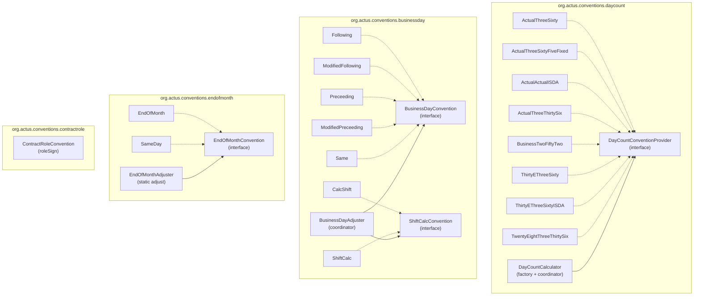
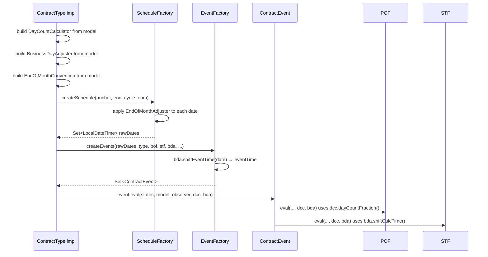

# Conventions

The Java implementation provides four convention families, each realised as a set of interfaces and implementations in `org.actus.conventions`.



---

## Day Count Conventions

### Interface — `DayCountConventionProvider`

```java
public interface DayCountConventionProvider {
    double dayCountFraction(LocalDateTime startTime, LocalDateTime endTime);
}
```

### Factory — `DayCountCalculator`

```java
// Construct from convention string + calendar
DayCountCalculator dcc = new DayCountCalculator("A/365", calendar);

// Delegate to
double fraction = dcc.dayCountFraction(startDate, endDate);
```

The constructor maps the convention string to the correct implementation class.

### Implementations

| Class | Convention | Formula |
|---|---|---|
| `ActualThreeSixty` | A/360 | `actualDays / 360` |
| `ActualThreeSixtyFiveFixed` | A/365 | `actualDays / 365` |
| `ActualActualISDA` | AA / A/A ISDA | Split at year boundaries; divide by 365 or 366 |
| `ActualThreeThirtySix` | A/336 | `actualDays / 336` |
| `BusinessTwoFiftyTwo` | B/252 | `businessDays(calendar) / 252` |
| `ThirtyEThreeSixty` | 30E/360 | `(360Δy + 30Δm + Δd) / 360` with D→30 |
| `ThirtyEThreeSixtyISDA` | 30E/360 ISDA | Same + ISDA February maturity rule |
| `TwentyEightThreeThirtySix` | 28/336 | `(336Δy + 28Δm + Δd) / 336` with D→28 |

`ThirtyEThreeSixtyISDA` requires `setMaturityDate(LocalDateTime)` before use, because the ISDA rule preserves the exact day of a February maturity date.

`BusinessTwoFiftyTwo` depends on a `BusinessDayCalendarProvider` to count only business days.

---

## Business Day Conventions

### Two Cooperating Interfaces

```java
// Shifts a non-business day to a business day
public interface BusinessDayConvention {
    LocalDateTime shift(LocalDateTime date);
}

// Decides which date to use for interest calculation
public interface ShiftCalcConvention {
    LocalDateTime shiftCalcTime(LocalDateTime date, BusinessDayConvention bdc, BusinessDayCalendarProvider cal);
}
```

### Coordinator — `BusinessDayAdjuster`

```java
LocalDateTime shiftEventTime(LocalDateTime time);  // always shifts
LocalDateTime shiftCalcTime(LocalDateTime time);   // shifted or original, per convention
```

### Shift Implementations

| Class | Behaviour |
|---|---|
| `Same` | No movement — `NOS` |
| `Following` | Advance to next business day |
| `ModifiedFollowing` | Advance, but back if month boundary crossed |
| `Preceeding` | Move back to previous business day |
| `ModifiedPreceeding` | Move back, but forward if month boundary crossed |

### Calc/Shift Implementations

| Class | Behaviour |
|---|---|
| `ShiftCalc` | `shiftCalcTime` returns the shifted date — calculation follows settlement |
| `CalcShift` | `shiftCalcTime` returns the original date — calculation stays on contractual date |

### Nine Combined Conventions

| Code | Shift Class | Calc Class | Meaning |
|---|---|---|---|
| NOS | `Same` | `ShiftCalc` | No adjustment at all |
| SCF | `Following` | `ShiftCalc` | Shift + calc both move forward |
| SCMF | `ModifiedFollowing` | `ShiftCalc` | Both move, stay in month |
| SCP | `Preceeding` | `ShiftCalc` | Both move backward |
| SCMP | `ModifiedPreceeding` | `ShiftCalc` | Both move back, stay in month |
| CSF | `Following` | `CalcShift` | Settle forward; calc on original |
| CSMF | `ModifiedFollowing` | `CalcShift` | Settle mod-forward; calc on original |
| CSP | `Preceeding` | `CalcShift` | Settle back; calc on original |
| CSMP | `ModifiedPreceeding` | `CalcShift` | Settle mod-back; calc on original |

---

## End-of-Month Convention

### Interface

```java
public interface EndOfMonthConvention {
    LocalDateTime shift(LocalDateTime date);
}
```

### Implementations

| Class | Behaviour |
|---|---|
| `EndOfMonth` | Snaps to the last calendar day of the month |
| `SameDay` | Returns the date unchanged |

### Coordinator — `EndOfMonthAdjuster`

```java
public static LocalDateTime adjust(LocalDateTime date, EndOfMonthConvention convention) {
    return convention.shift(date);
}
```

`EndOfMonth.shift` implementation:

```java
return date.withDayOfMonth(date.toLocalDate().lengthOfMonth());
```

`ScheduleFactory` applies this adjuster to each generated date when the EOM convention is active (i.e. the cycle anchor is the last day of its month and the cycle is month-based).

---

## Contract Role Convention

`org.actus.conventions.contractrole.ContractRoleConvention` — `public final class`

```java
public static int roleSign(ContractRole role) {
    switch (role) {
        case RPA: return  1;  // Receivable principal amount — inflow
        case RPL: return -1;  // Payable principal amount — outflow
        case RFL: return  1;
        case PFL: return -1;
        case RF:  return  1;
        case PF:  return -1;
        case BUY: return  1;
        case SEL: return -1;
        ...
    }
}
```

`roleSign` is called inside virtually every `POF_*` function to flip the direction of cash flows based on the contract's role in the transaction. A lender (RPA) receives principal inflow at IED and pays out at MD; a borrower (RPL) is the mirror image.

---

## How Conventions Flow Through the Engine


