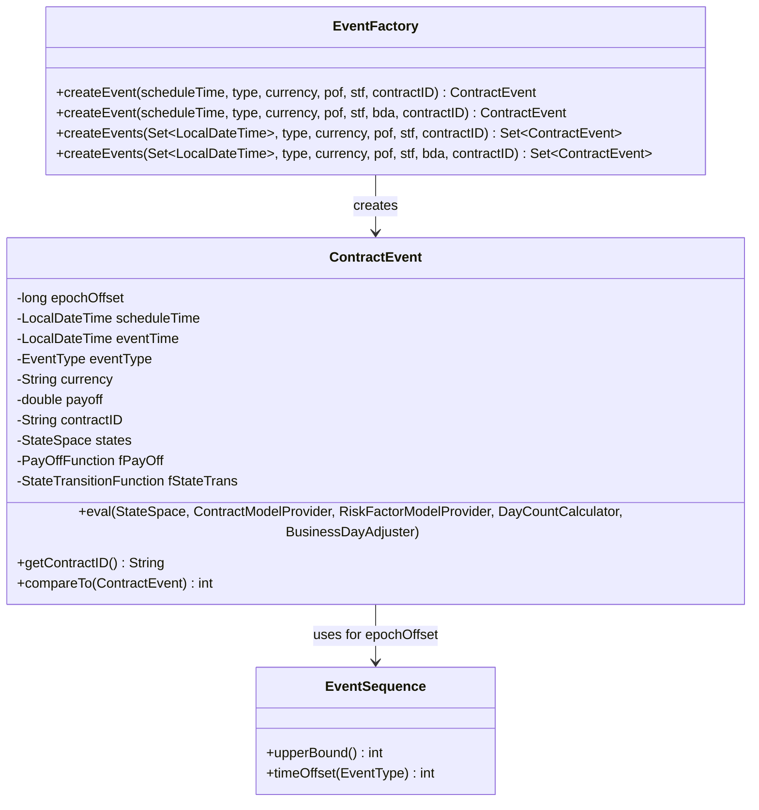
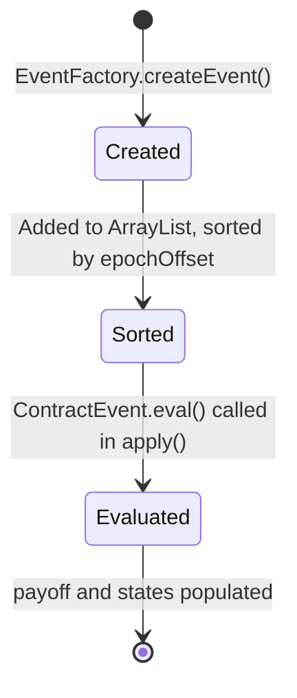

# Contract Events

## Overview

A `ContractEvent` is the fundamental unit of computation. It carries everything needed to evaluate a single point in the contract's lifecycle: its timestamp, its type, references to the payoff and state-transition functions to call, and — after evaluation — its computed payoff and post-event state.



---

## ContractEvent

`org.actus.events.ContractEvent` — `public final class implements Comparable<ContractEvent>` (256 lines)

### Fields

| Field | Type | Description |
|---|---|---|
| `epochOffset` | `long` | Sort key: epoch milliseconds of event time + event-type sequence offset |
| `scheduleTime` | `LocalDateTime` | The contractually scheduled date (used for interest accrual calculations) |
| `eventTime` | `LocalDateTime` | The actual settlement date after business day adjustment |
| `eventType` | `EventType` | The event type code (IP, MD, RR, etc.) |
| `currency` | `String` | The currency of the cash flow |
| `payoff` | `double` | Computed payoff amount — positive = received, negative = paid |
| `states` | `StateSpace` | The post-event contract state vector |
| `contractID` | `String` | The originating contract identifier |
| `fPayOff` | `PayOffFunction` | Lambda/class reference assigned at creation; called during eval() |
| `fStateTrans` | `StateTransitionFunction` | Lambda/class reference assigned at creation; called during eval() |

### Two Times: `scheduleTime` vs `eventTime`

This design is critical. The ACTUS specification distinguishes *when a payment is contractually scheduled* (the schedule time) from *when it actually settles* (the event time, after business day adjustment). Many payoff calculations — particularly interest accrual — must use the schedule time, not the settlement time.

```
scheduleTime = "2025-03-31"  (contractual — last day of March)
eventTime    = "2025-04-01"  (actual — first business day of April, because March 31 is a Sunday)

Interest accrual period → uses scheduleTime (March 31)
Bank transfer           → happens on eventTime (April 1)
```

### `eval` Method

```java
public void eval(StateSpace states,
                 ContractModelProvider model,
                 RiskFactorModelProvider observer,
                 DayCountCalculator dayCounter,
                 BusinessDayAdjuster timeAdjuster)
```

1. Calls `fPayOff.eval(eventTime, states, model, observer, dayCounter, timeAdjuster)` → stores result in `this.payoff`
2. Calls `fStateTrans.eval(eventTime, states, model, observer, dayCounter, timeAdjuster)` → stores result in `this.states`

Both functions receive the same pre-event `states` object. The STF returns a *new* (or mutated) StateSpace that becomes the input for the next event.

### `compareTo`

Events are ordered by `epochOffset`, which is computed as:

```
epochOffset = eventTime.toEpochMilli() + EventSequence.timeOffset(eventType)
```

This ensures:
- Events at different times are sorted chronologically
- Events at the *same* time are sorted by event type, in the sequence defined by the ACTUS specification

---

## EventFactory

`org.actus.events.EventFactory` — `public final class` (114 lines)

A utility class for assembling `ContractEvent` objects. All methods are static.

### Single-event creation

```java
// Without business day adjustment (eventTime == scheduleTime)
ContractEvent e = EventFactory.createEvent(
    scheduleTime,   // LocalDateTime
    eventType,      // EventType
    currency,       // String
    payOff,         // PayOffFunction
    stateTrans,     // StateTransitionFunction
    contractID      // String
);

// With business day adjustment (eventTime = bda.shiftEventTime(scheduleTime))
ContractEvent e = EventFactory.createEvent(
    scheduleTime, eventType, currency,
    payOff, stateTrans,
    bda,          // BusinessDayAdjuster
    contractID
);
```

### Batch creation from a schedule set

```java
// Creates one ContractEvent per date in eventSchedule, all with the same type/functions
Set<ContractEvent> events = EventFactory.createEvents(
    eventSchedule,  // Set<LocalDateTime> from ScheduleFactory
    eventType, currency, payOff, stateTrans, contractID
);
```

The batch variant is the most common pattern inside contract type implementations:

```java
// Typical usage inside PrincipalAtMaturity.schedule()
Set<LocalDateTime> ipDates = ScheduleFactory.createSchedule(
    ipAnchor, maturityDate, cycleOfIP, eomConvention);

events.addAll(EventFactory.createEvents(
    ipDates, EventType.IP, currency,
    new POF_IP_PAM(), new STF_IP_PAM(),
    businessDayAdjuster, contractID));
```

---

## EventSequence

`org.actus.events.EventSequence` — `public final class` (115 lines)

Defines the integer time offset added to each event's epoch millisecond to establish the processing order when multiple events fall on the same timestamp. A lower offset means earlier processing.

### Time Offsets (selected)

| Event Type | Offset | Reason for order |
|---|---|---|
| `AD` | 10 | Analysis date — snapshot before anything else |
| `IED` | 20 | Initial exchange — must precede any accrual |
| `IPCB` | 24 | Base fixing — before interest payment |
| `IP` | 40 | Interest — after principal events at same date |
| `IPCI` | 40 | Capitalisation — same priority as IP |
| `FP` | 60 | Fees — after core cash flows |
| `DV` | 70 | Dividend — after fees |
| `PR` | 30 | Principal redemption — before interest at month end |
| `RR` | 100 | Rate reset — after all payments at the reset date |
| `RRF` | 100 | Fixed rate reset — same as RR |
| `SC` | 100 | Scaling — after payments, before next period begins |
| `TD` | varies | Termination |
| `MD` | varies | Maturity |
| `CD` | 500 | Credit default — last in sequence |

`EventSequence.upperBound()` returns `900` — the maximum possible offset, used as a guard for event filtering.

### Why This Matters

Consider a contract where principal redemption (PR) and interest payment (IP) both fall on June 30. The interest for the period must be computed on the *outstanding principal before redemption*, so PR must be processed first. The offsets enforce this automatically — no contract implementation needs to sort manually.

---

## Event Lifecycle Summary



| Phase | What happens |
|---|---|
| Creation | `scheduleTime` and functions (`fPayOff`, `fStateTrans`) set; `payoff = 0`, `states = null` |
| Sorting | `compareTo` orders the list by `epochOffset` before `apply()` begins |
| Evaluation | `eval()` calls both functions; `payoff` and `states` are filled in |
| Result | Caller reads `getPayoff()` and `getStates()` from each event |
