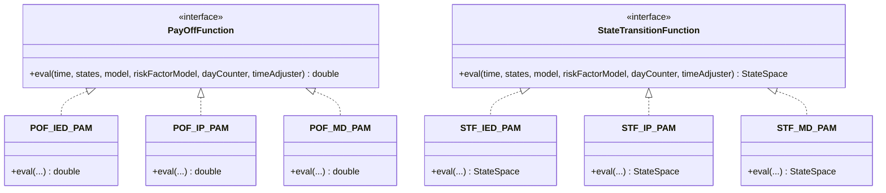

# Payoff and State Transition Functions

## The Two Interfaces

Every computation in the ACTUS engine reduces to calling one of two interfaces:

```java
// Computes the cash flow for an event
public interface PayOffFunction {
    double eval(
        LocalDateTime time,
        StateSpace states,
        ContractModelProvider model,
        RiskFactorModelProvider riskFactorModel,
        DayCountCalculator dayCounter,
        BusinessDayAdjuster timeAdjuster
    );
}

// Updates the contract state after an event
public interface StateTransitionFunction {
    StateSpace eval(
        LocalDateTime time,
        StateSpace states,
        ContractModelProvider model,
        RiskFactorModelProvider riskFactorModel,
        DayCountCalculator dayCounter,
        BusinessDayAdjuster timeAdjuster
    );
}
```

Both receive the same six arguments — the event time, the pre-event state, contract terms, market data, and the two convention calculators. `PayOffFunction` returns a `double` (the cash flow). `StateTransitionFunction` returns a `StateSpace` (the post-event state).



---

## Naming Convention

Every implementation class follows a strict naming pattern:

```
[POF|STF]_[EventType]_[ContractType]
```

| Part | Values | Meaning |
|---|---|---|
| `POF` | `POF` | Payoff Function |
| `STF` | `STF` | State Transition Function |
| `[EventType]` | `IED`, `IP`, `MD`, `RR`, … | The event type this function handles |
| `[ContractType]` | `PAM`, `LAM`, `ANN`, … | The contract type it applies to |

Examples:
- `POF_IED_PAM` — the payoff for the Initial Exchange Date on a PAM contract
- `STF_RR_LAM` — the state transition for a Rate Reset on a Linear Amortizer
- `POF_IP_ANN` — the interest payment payoff for an Annuity

---

## Example Implementations

### `POF_IED_PAM` — Initial Exchange, PAM

```java
public final class POF_IED_PAM implements PayOffFunction {
    public double eval(LocalDateTime time, StateSpace states,
                       ContractModelProvider model,
                       RiskFactorModelProvider riskFactorModel,
                       DayCountCalculator dayCounter,
                       BusinessDayAdjuster timeAdjuster) {
        return CommonUtils.settlementCurrencyFxRate(riskFactorModel, model, time, states)
             * ContractRoleConvention.roleSign(model.getAs("contractRole"))
             * (-1)
             * (model.<Double>getAs("notionalPrincipal")
                + model.<Double>getAs("premiumDiscountAtIED"));
    }
}
```

The initial exchange disburses the notional principal plus any premium or discount. The role sign (`+1` or `−1`) determines the direction from the perspective of the contract's role (lender vs. borrower). The FX rate converts to the settlement currency if needed.

### `POF_IP_PAM` — Interest Payment, PAM

```java
// Simplified representation of the logic
return fxRate
     * roleSign
     * (states.accruedInterest
        + states.nominalInterestRate
          * dayCounter.dayCountFraction(lastIP, time)
          * states.notionalPrincipal
          * states.interestScalingMultiplier);
```

Interest = accrued interest carried in state + incremental interest for the current period. The day count fraction converts the time interval to a year fraction.

### `STF_IP_PAM` — Interest Payment State Transition, PAM

```java
// After paying interest, reset accrued interest to 0 and update status date
states.accruedInterest = 0.0;
states.feeAccrued      = 0.0;
states.statusDate      = time;
return states;
```

### `STF_RR_PAM` — Rate Reset State Transition, PAM

```java
// Accrue interest up to the reset date, then apply new rate
states.accruedInterest += oldRate * dcf * notional * scalingMultiplier;
states.nominalInterestRate = riskFactorModel.stateAt(
    model.getAs("marketObjectCodeOfRateReset"), time, states, model, true);
// Apply rate caps and floors
states.nominalInterestRate = Math.min(
    model.getAs("lifeCap"), states.nominalInterestRate);
states.nominalInterestRate = Math.max(
    model.getAs("lifeFloor"), states.nominalInterestRate);
states.statusDate = time;
return states;
```

---

## Function Inventory by Contract Type

### PAM — Principal at Maturity (27 classes)

| Function | Type | Event |
|---|---|---|
| `POF_AD_PAM` | POF | Analysis Date |
| `POF_CD_PAM` | POF | Credit Default |
| `POF_FP_PAM` | POF | Fee Payment |
| `POF_IED_PAM` | POF | Initial Exchange |
| `POF_IP_PAM` | POF | Interest Payment |
| `POF_IPCI_PAM` | POF | Interest Capitalisation |
| `POF_MD_PAM` | POF | Maturity |
| `POF_PP_PAM` | POF | Prepayment |
| `POF_PRD_PAM` | POF | Purchase Date |
| `POF_PR_PAM` | POF | Principal Redemption |
| `POF_PY_PAM` | POF | Penalty |
| `POF_RR_PAM` | POF | Rate Reset (floating) |
| `POF_RRY_PAM` | POF | Rate Reset (fixed) |
| `POF_SC_PAM` | POF | Scaling |
| `POF_TD_PAM` | POF | Termination |
| `STF_AD_PAM` | STF | Analysis Date |
| `STF_CD_PAM` | STF | Credit Default |
| `STF_FP_PAM` | STF | Fee Payment |
| `STF_IED_PAM` | STF | Initial Exchange |
| `STF_IP_PAM` | STF | Interest Payment |
| `STF_IPCI_PAM` | STF | Interest Capitalisation |
| `STF_MD_PAM` | STF | Maturity |
| `STF_PP_PAM` | STF | Prepayment |
| `STF_PRD_PAM` | STF | Purchase Date |
| `STF_RR_PAM` | STF | Rate Reset (floating) |
| `STF_RRF_PAM` | STF | Rate Reset (fixed) |
| `STF_SC_PAM` | STF | Scaling |
| `STF_TD_PAM` | STF | Termination |

### LAM — Linear Amortizer (18 classes)

Extends the PAM set with PR (Principal Redemption) functions: `POF_PR_LAM`, `STF_PR_LAM`, `STF_PRF_LAM` (payment recalculation), plus all variants carrying LAM-specific redemption logic.

### NAM — Negative Amortizer (3 classes)

`POF_IP_NAM`, `STF_IP_NAM`, `STF_PRF_NAM` — overrides the IP payoff to handle shortfall capitalisation.

### LAX — Exotic Linear Amortizer (8 classes)

Full set of overrides for the exotic redemption and interest capitalisation patterns.

### ANN — Annuity (1 class)

`STF_PRF_ANN` — recomputes `nextPrincipalRedemptionPayment` so that the combined interest + principal payment remains level.

### CLM — Call Money (3 classes)

`POF_PRD_CLM`, `POF_TD_CLM`, `STF_MD_CLM`

### CSH — Cash (1 class)

`POF_MD_CSH`

### STK — Stock (7 classes)

`POF_DV_STK`, `STF_DV_STK`, and variants for purchase, termination, and monitoring dates.

### FXOUT — Foreign Exchange Outright (8 classes)

`POF_STD_FXOUT` (settlement), `STF_STD_FXOUT`, plus purchase, termination, and maturity overrides.

### SWPPV — Plain Vanilla Swap (11 classes)

Covers both fixed and floating legs: `POF_IP_SWPPV`, `STF_IP_SWPPV`, `STF_RR_SWPPV`, `STF_RRF_SWPPV`, plus termination and maturity.

### SWAPS — Swap (5 classes)

Generic swap delegation: `POF_TD_SWAPS`, `STF_TD_SWAPS`, and leg-switching functions.

### CAPFL — Cap/Floor (2 classes)

`POF_IP_CAPFL` — computes `max(rate − strike, 0)` or `max(strike − rate, 0)` times the day fraction and notional. `STF_IP_CAPFL`.

### OPTNS — Options (8 classes)

`POF_XD_OPTNS` (execution date payoff), `STF_XD_OPTNS`, `STF_PRD_OPTNS`, `STF_TD_OPTNS`, and variants for European and American exercise.

### FUTUR — Futures (4 classes)

`POF_MR_FUTUR` (margin call), `STF_MR_FUTUR`, `POF_STD_FUTUR`, `STF_STD_FUTUR`.

### CEG — Credit Enhancement Guarantee (9 classes)

Includes `STF_MD_BCS`, `STF_TD_BCS`, `POF_PRD_BCS`, `POF_TD_BCS` for the guarantee call events and the underlying exposure tracking.

### CEC — Credit Enhancement Collateral (3 classes)

`POF_PRD_CEC`, `POF_TD_CEC`, `STF_MD_CEC`.

### BCS — Boundary Controlled Switch (4 classes)

`POF_PRD_BCS`, `POF_TD_BCS`, `STF_ME_BCS` (monitoring event — triggers leg switch), `STF_TD_BCS`.

---

## How Functions Are Wired

Contract type implementations wire functions to events at schedule-generation time, not at eval time. This means the function reference is baked into each `ContractEvent` object:

```java
// Inside PrincipalAtMaturity.schedule()
events.add(EventFactory.createEvent(
    maturityDate,
    EventType.MD,
    currency,
    new POF_MD_PAM(),   // ← POF attached here
    new STF_MD_PAM(),   // ← STF attached here
    businessDayAdjuster,
    contractID
));
```

When `apply()` later calls `event.eval()`, it dispatches directly to these pre-attached function objects — no further type-checking or dispatch required.

This design means adding a new contract type requires only: a new contract class, new function classes, and registration in `ContractType`. The event and function infrastructure is entirely reused.
