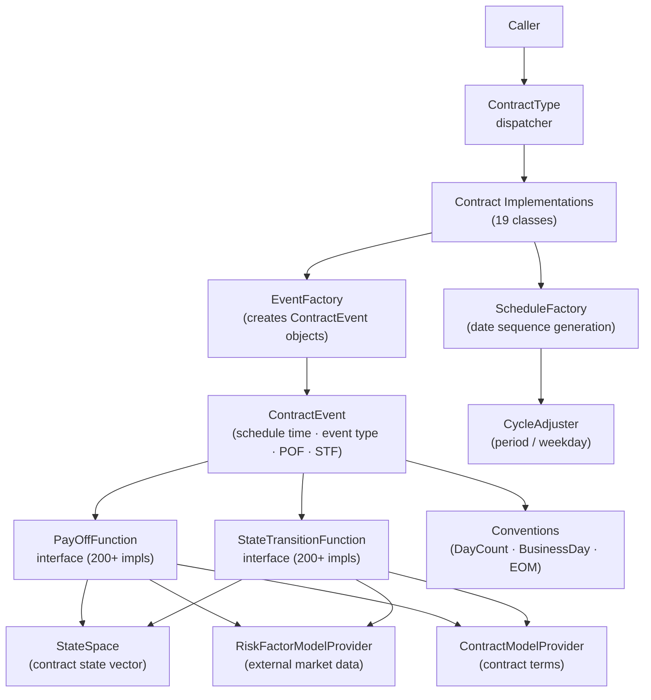
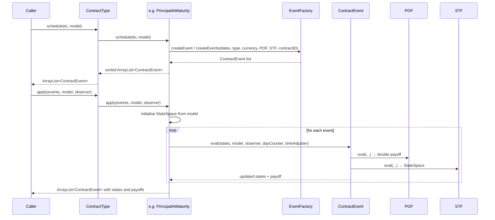

# ACTUS Java Reference Implementation

## Purpose

The Java reference implementation is the canonical realisation of the ACTUS Technical Specification. It provides a complete, testable codebase that transforms ACTUS contract terms and risk factor observations into a schedule of typed, valued contract events. It is maintained by the ACTUS Users Association and released under the ACTUS Core License.

The implementation covers **19 contract types**, **28 event types**, and **200+ individual payoff and state transition functions**.

## Entry Points

There are exactly two methods a caller needs to know:

```java
// Step 1 — generate the event schedule up to a horizon
ArrayList<ContractEvent> schedule =
    ContractType.schedule(LocalDateTime to, ContractModelProvider model);

// Step 2 — evaluate each event against the current state and risk factor model
ArrayList<ContractEvent> results =
    ContractType.apply(ArrayList<ContractEvent> events,
                       ContractModelProvider model,
                       RiskFactorModelProvider observer);
```

`ContractType` is the single public dispatcher. It inspects `model.getAs("contractType")` and routes both calls to the correct contract-type class.

## Layered Architecture



## Processing Flow



## Package Summary

| Package | Contents |
|---|---|
| `org.actus` | Three runtime exception classes |
| `org.actus.attributes` | `ContractModelProvider` interface + `ContractModel` implementation |
| `org.actus.contracts` | `ContractType` dispatcher + 19 contract type classes |
| `org.actus.events` | `ContractEvent`, `EventFactory`, `EventSequence` |
| `org.actus.functions` | `PayOffFunction` and `StateTransitionFunction` interfaces + 200+ implementations |
| `org.actus.states` | `StateSpace` — the contract state vector |
| `org.actus.conventions` | Business day, day count, end-of-month, contract role conventions |
| `org.actus.time` | `ScheduleFactory`, `CycleAdjuster`, calendars |
| `org.actus.types` | 30+ enum and type classes |
| `org.actus.externals` | `RiskFactorModelProvider` interface |
| `org.actus.util` | `CommonUtils`, `CycleUtils`, `RedemptionUtils`, `StringUtils`, `Constants` |

## Codebase Metrics

| Metric | Value |
|---|---|
| Main source files | 198 |
| Test files | 45 + 7 utilities |
| Contract types supported | 19 |
| Event types | 28 |
| Function implementations (POF + STF) | 200+ |
| Test JSON data files | 18 |
| Maximum contract lifetime constant | 50 years |

## Documentation Contents

- [Package Structure](./structure.md) — full package tree and module relationships
- [Public API](./api.md) — `ContractType`, `ContractModelProvider`, `RiskFactorModelProvider`
- [Contract Types](./contracts.md) — all 19 implementations and their schedule/apply logic
- [Contract Events](./events.md) — `ContractEvent`, `EventFactory`, event ordering
- [Functions](./functions.md) — POF and STF interfaces, naming convention, complete inventory
- [State Space](./state.md) — all state variables and how state evolves
- [Conventions](./conventions.md) — day count, business day, EOM, contract role
- [Schedule Generation](./scheduling.md) — `ScheduleFactory`, `CycleAdjuster`, calendars
- [Type System](./types.md) — all enums and value types
- [Test Infrastructure](./testing.md) — JSON test format, test utilities, test patterns
