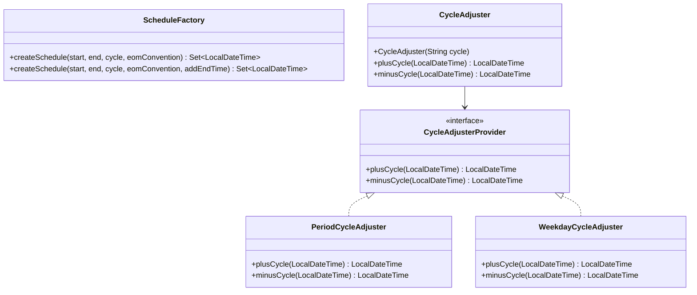
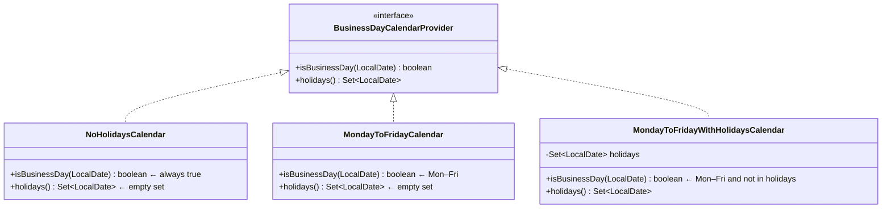

# Schedule Generation

## Overview

Schedule generation converts a contract's cycle parameters into an ordered set of `LocalDateTime` values that will become contract events. The core class is `ScheduleFactory`; it delegates cycle arithmetic to `CycleAdjuster` and date snapping to `EndOfMonthAdjuster`.



---

## ScheduleFactory

`org.actus.time.ScheduleFactory` — `public final class` (177 lines)

### Signatures

```java
public static Set<LocalDateTime> createSchedule(
    LocalDateTime startTime,
    LocalDateTime endTime,
    String cycle,
    EndOfMonthConventionEnum endOfMonthConvention)

public static Set<LocalDateTime> createSchedule(
    LocalDateTime startTime,
    LocalDateTime endTime,
    String cycle,
    EndOfMonthConventionEnum endOfMonthConvention,
    boolean addEndTime)
```

Returns a `Set<LocalDateTime>`. Using a `Set` prevents duplicates that can arise when a generated date coincidentally equals the end date.

### Algorithm

```
1. If cycle == null:
   Return {startTime} (+ endTime if addEndTime)

2. Determine if cycle is period-based (CycleUtils.isPeriod):
   - period-based → PeriodCycleAdjuster(parsePeriod(cycle))
   - weekday-based → WeekdayCycleAdjuster(parsePosition(cycle), weekday)

3. Determine EndOfMonthAdjuster:
   - If eomConvention == EOM and startTime is last day of month
     and cycle is month-based → EndOfMonth adjuster
   - else → SameDay adjuster

4. Generate dates forward from startTime:
   counter = 1
   current = startTime
   while current < endTime:
       add current to schedule
       rawNext = cycleAdjuster.plusCycle(startTime) × counter
                 (anchored to startTime, not previous date)
       current = eomAdjuster.shift(rawNext)
       counter++

5. If addEndTime: add endTime to schedule

6. Handle long stub (stub == '0'):
   If last generated date ≠ endTime and schedule.size > 2:
       remove second-to-last entry
       (merges the partial tail period into the preceding full period)

7. Return schedule
```

**Key design: anchor-relative arithmetic.** Each date is computed as `startTime + n × period`, not as `previousDate + period`. This eliminates cumulative rounding errors in month arithmetic (e.g. adding 1 month repeatedly from Jan 31 produces different results than computing Jan 31 + n months directly).

### Stub Handling

The ACTUS cycle string includes a stub indicator as its last character (after the `L`):

- `L0` — **Long stub**: the partial period at the boundary is merged into the adjacent full period, creating one longer period. The second-to-last schedule date is removed.
- `L1` — **Short stub**: the partial period stands alone as a short period. No date removal.

---

## CycleAdjuster

`org.actus.time.CycleAdjuster` — `public class`

The constructor inspects the cycle string and instantiates the correct delegate:

```java
public CycleAdjuster(String cycle) {
    if (CycleUtils.isPeriod(cycle)) {
        this.adjuster = new PeriodCycleAdjuster(CycleUtils.parsePeriod(cycle));
    } else {
        this.adjuster = new WeekdayCycleAdjuster(
            CycleUtils.parsePosition(cycle), weekdayFrom(cycle));
    }
}

public LocalDateTime plusCycle(LocalDateTime time) { return adjuster.plusCycle(time); }
public LocalDateTime minusCycle(LocalDateTime time) { return adjuster.minusCycle(time); }
```

### PeriodCycleAdjuster

For cycle strings starting with `P` (ISO 8601 period format: `P[n][unit]L[stub]`). Delegates to Java's `LocalDateTime.plus(Period)` and `LocalDateTime.minus(Period)`.

### WeekdayCycleAdjuster

For weekday cycle strings such as `"2Mon"` (the second Monday of each month).

```
plusCycle(date):
    targetMonth = date.plusMonths(1)
    firstWeekday = find first [weekday] in targetMonth
    result = firstWeekday + (position − 1) × 7 days
    if result.month ≠ targetMonth → result −= 7 days  (overflow guard)
    return result
```

---

## CycleUtils

`org.actus.util.CycleUtils` — `public final class`

| Method | Signature | Description |
|---|---|---|
| `isPeriod` | `boolean isPeriod(String cycle)` | Returns `true` if cycle starts with `'P'` |
| `parsePeriod` | `Period parsePeriod(String cycle)` | Parses `P[n][unit]` into a `java.time.Period` |
| `parsePeriod` | `Period parsePeriod(String cycle, boolean stub)` | Variant with stub awareness |
| `parsePosition` | `int parsePosition(String cycle)` | Extracts the ordinal from a weekday cycle string |

---

## Business Day Calendars

All three implementations are in `org.actus.time.calendar`.

### Interface — `BusinessDayCalendarProvider`

```java
public interface BusinessDayCalendarProvider {
    boolean isBusinessDay(LocalDate date);
    Set<LocalDate> holidays();
}
```

### Implementations



| Class | Calendar Code | Business Days |
|---|---|---|
| `NoHolidaysCalendar` | NC | Every day |
| `MondayToFridayCalendar` | MF | Monday–Friday |
| `MondayToFridayWithHolidaysCalendar` | MFH | Monday–Friday minus a `HashSet<LocalDate>` of holidays (O(1) lookup) |

The calendar is used by `Following` / `ModifiedFollowing` / `Preceeding` / `ModifiedPreceeding` shift strategies and by `BusinessTwoFiftyTwo` day count convention.

---

## TimeAdjuster

`org.actus.time.TimeAdjuster`

Normalises timestamps with sub-hour precision:

```java
if (minutes < 30) → truncate to current hour
else              → advance to next hour
```

Used when event timestamps are loaded from systems that store time with minute or second precision.

---

## Constants

`org.actus.util.Constants`

```java
public static final Period MAX_LIFETIME     = Period.ofYears(50);
public static final Period MAX_LIFETIME_STK = Period.ofYears(10);
public static final Period MAX_LIFETIME_UMP = Period.ofYears(10);
```

These are used as `endTime` guards in `ScheduleFactory.createSchedule` when the contract model does not provide a concrete maturity date (open-ended contracts like UMP and STK).
