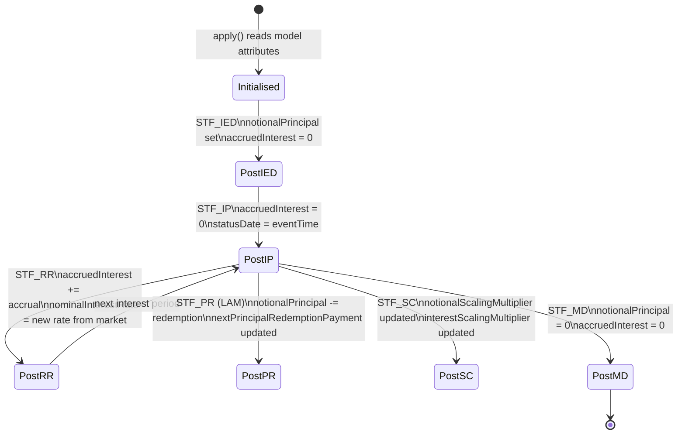

# State Space

## Purpose

`StateSpace` is the contract's memory between events. It holds the current values of all analytical variables — the outstanding principal, accrued interest, the nominal rate, and more. Every `StateTransitionFunction` reads the pre-event state and writes a post-event state.

`org.actus.states.StateSpace` — `public final class` (109 lines)

---

## All State Variables

All fields are `public` (no getters/setters). The entire class is a plain data container.

```java
public final class StateSpace {
    // Core monetary values
    public double notionalPrincipal;        // Current outstanding principal
    public double notionalPrincipal2;       // Second leg principal (swaps, BCS)
    public double accruedInterest;          // Accrued interest not yet paid
    public double accruedInterest2;         // Second leg accrued interest
    public double nominalInterestRate;      // Current interest rate
    public double nominalInterestRate2;     // Second leg interest rate

    // Fee tracking
    public double feeAccrued;              // Accrued fees not yet paid

    // Interest calculation base (for ICB-based contracts)
    public double interestCalculationBaseAmount;

    // Scaling factors
    public double notionalScalingMultiplier;  // Applied to notional in payoff
    public double interestScalingMultiplier;  // Applied to interest in payoff

    // Redemption
    public double nextPrincipalRedemptionPayment;  // LAM/NAM/ANN next payment

    // Key dates
    public LocalDateTime statusDate;       // Date of last state update
    public LocalDateTime maturityDate;     // Effective maturity (may differ from CT attribute)
    public LocalDateTime terminationDate;  // Early termination date (if exercised)
    public LocalDateTime nonPerformingDate;// Date contract first non-performed

    // Performance status
    public ContractPerformance contractPerformance;  // Default: PF

    // Last interest period (for IPCB)
    public double lastInterestPeriod;

    // Option exercise
    public double exerciseAmount;          // Payoff at exercise
    public LocalDateTime exerciseDate;     // Date option was exercised

    // Boundary control (BCS only)
    public boolean boundaryCrossedFlag;
    public boolean boundaryMonitoringFlag;
    public boolean boundaryLeg1ActiveFlag;
    public boolean boundaryLeg2ActiveFlag;
}
```

---

## Variable Roles

| Variable | Updated by | Purpose |
|---|---|---|
| `notionalPrincipal` | `STF_IED`, `STF_PR`, `STF_IPCI`, `STF_RR` | Outstanding principal — the base for interest calculation |
| `accruedInterest` | Every `STF_IP`, `STF_FP`, `STF_RR`, `STF_SC` | Accumulated interest since last payment |
| `nominalInterestRate` | `STF_RR`, `STF_RRF`, `STF_IED` | Current rate applied to principal |
| `feeAccrued` | `STF_FP`, `STF_IP` | Accumulated fees since last payment |
| `nextPrincipalRedemptionPayment` | `STF_PRF` (ANN), `STF_IED` (LAM) | The next scheduled principal amount |
| `notionalScalingMultiplier` | `STF_SC` | Applied to notional in all subsequent POF calls |
| `interestScalingMultiplier` | `STF_SC` | Applied to interest in all subsequent POF calls |
| `statusDate` | Every STF | Tracks the date of the last transition |
| `contractPerformance` | `STF_CD` | Changes to `DF` on credit default |
| `nonPerformingDate` | `STF_CD` | Set when performance first degrades |
| `exerciseAmount` / `exerciseDate` | `STF_XD` (OPTNS) | Records option exercise |
| `boundaryCrossedFlag` etc. | `STF_ME` (BCS) | Controls leg switching |

---

## State Initialisation

Before the first event in `apply()` is evaluated, each contract type initialises a `StateSpace` from the contract model. The initialisation reads the contract's current snapshot from model attributes such as `statusDate`, `notionalPrincipal`, `accruedInterest`, `nominalInterestRate`, and `contractPerformance`.

For a PAM contract at inception:
```
notionalPrincipal       = model.notionalPrincipal
nominalInterestRate     = model.nominalInterestRate
accruedInterest         = model.accruedInterest  (often 0 at inception)
feeAccrued              = model.feeAccrued        (often 0)
notionalScalingMultiplier = 1.0
interestScalingMultiplier = 1.0
statusDate              = model.statusDate
contractPerformance     = model.contractPerformance  (usually PF)
```

For a contract that has already been running (mid-life state rehydration), the accrued values and current rate come from the model attributes as of the status date.

---

## State Evolution Diagram



---

## Accrued Interest Accumulation

Interest accrues continuously between events. Any STF that does not pay interest must still accumulate the accrual into `accruedInterest` so it is available at the next IP event.

A typical STF that does not pay interest (e.g. `STF_RR_PAM`) updates:

```
states.accruedInterest +=
    states.nominalInterestRate
    × dayCounter.dayCountFraction(states.statusDate, time)
    × states.notionalPrincipal
    × states.interestScalingMultiplier
```

An IP event then pays the full `accruedInterest` and resets it to zero.

An IPCI (capitalisation) event adds the accrued interest to the principal instead:

```
states.notionalPrincipal += states.accruedInterest
states.accruedInterest = 0
```

---

## `copyStateSpace`

```java
public static StateSpace copyStateSpace(StateSpace original)
```

A deep-copy utility. Used where a snapshot of the state at a specific point is needed (e.g. for valuation or scenario analysis) without mutating the running state.

---

## `toString`

Returns a formatted string of all field values, suitable for logging and test output:

```
StatusDate: 2025-01-01 | NotionalPrincipal: 1000000.0 |
NominalInterestRate: 0.05 | AccruedInterest: 0.0 | ...
```
