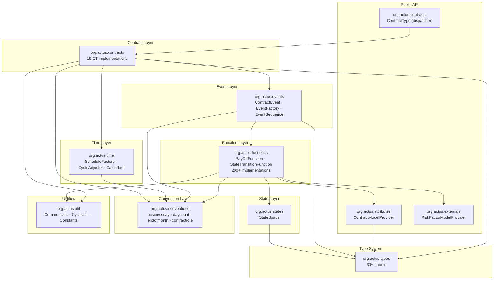

# Package Structure

## Source Tree

```
actus-core/
├── main/java/org/actus/
│   ├── AttributeConversionException.java       ← thrown when attribute cast fails
│   ├── ContractTypeUnknownException.java        ← thrown for unrecognised CT code
│   ├── RiskFactorNotFoundException.java         ← thrown when risk factor ID absent
│   │
│   ├── attributes/
│   │   ├── ContractModelProvider.java           ← interface: get attribute by name
│   │   └── ContractModel.java                  ← map-backed implementation (1035 lines)
│   │
│   ├── contracts/
│   │   ├── ContractType.java                   ← public dispatcher (schedule + apply)
│   │   ├── PrincipalAtMaturity.java             ← PAM  (279 lines)
│   │   ├── LinearAmortizer.java                 ← LAM  (414 lines)
│   │   ├── NegativeAmortizer.java               ← NAM  (448 lines)
│   │   ├── Annuity.java                         ← ANN  (500 lines)
│   │   ├── ExoticLinearAmortizer.java           ← LAX  (523 lines)
│   │   ├── CallMoney.java                       ← CLM
│   │   ├── UndefinedMaturityProfile.java        ← UMP
│   │   ├── Cash.java                            ← CSH
│   │   ├── Stock.java                           ← STK
│   │   ├── Commodity.java                       ← COM
│   │   ├── ForeignExchangeOutright.java         ← FXOUT
│   │   ├── PlainVanillaInterestRateSwap.java     ← SWPPV
│   │   ├── Swap.java                            ← SWAPS
│   │   ├── CapFloor.java                        ← CAPFL
│   │   ├── Option.java                          ← OPTNS
│   │   ├── Future.java                          ← FUTUR
│   │   ├── CreditEnhancementGuarantee.java      ← CEG
│   │   ├── CreditEnhancementCollateral.java     ← CEC
│   │   └── BoundaryControlledSwitch.java        ← BCS
│   │
│   ├── events/
│   │   ├── ContractEvent.java                   ← single event (256 lines)
│   │   ├── EventFactory.java                    ← factory (114 lines)
│   │   └── EventSequence.java                   ← ordering offsets (115 lines)
│   │
│   ├── externals/
│   │   └── RiskFactorModelProvider.java         ← interface for market data
│   │
│   ├── functions/
│   │   ├── PayOffFunction.java                  ← interface
│   │   ├── StateTransitionFunction.java         ← interface
│   │   ├── pam/   (27 POF_*/STF_* classes)
│   │   ├── lam/   (18 classes)
│   │   ├── nam/   ( 3 classes)
│   │   ├── lax/   ( 8 classes)
│   │   ├── ann/   ( 1 class)
│   │   ├── clm/   ( 3 classes)
│   │   ├── csh/   ( 1 class)
│   │   ├── stk/   ( 7 classes)
│   │   ├── fxout/ ( 8 classes)
│   │   ├── swppv/ (11 classes)
│   │   ├── swaps/ ( 5 classes)
│   │   ├── capfl/ ( 2 classes)
│   │   ├── optns/ ( 8 classes)
│   │   ├── futur/ ( 4 classes)
│   │   ├── ceg/   ( 9 classes)
│   │   ├── cec/   ( 3 classes)
│   │   ├── bcs/   ( 4 classes)
│   │   └── ump/   ( n classes)
│   │
│   ├── states/
│   │   └── StateSpace.java                     ← contract state vector (109 lines)
│   │
│   ├── conventions/
│   │   ├── businessday/
│   │   │   ├── BusinessDayConvention.java       ← interface
│   │   │   ├── BusinessDayAdjuster.java         ← coordinator
│   │   │   ├── Following.java
│   │   │   ├── ModifiedFollowing.java
│   │   │   ├── Preceeding.java
│   │   │   ├── ModifiedPreceeding.java
│   │   │   ├── Same.java
│   │   │   ├── ShiftCalcConvention.java         ← interface
│   │   │   ├── CalcShift.java
│   │   │   └── ShiftCalc.java
│   │   ├── contractrole/
│   │   │   └── ContractRoleConvention.java      ← roleSign() utility
│   │   ├── daycount/
│   │   │   ├── DayCountConventionProvider.java  ← interface
│   │   │   ├── DayCountCalculator.java          ← factory + coordinator
│   │   │   ├── ActualThreeSixty.java
│   │   │   ├── ActualThreeSixtyFiveFixed.java
│   │   │   ├── ActualActualISDA.java
│   │   │   ├── ActualThreeThirtySix.java
│   │   │   ├── BusinessTwoFiftyTwo.java
│   │   │   ├── ThirtyEThreeSixty.java
│   │   │   ├── ThirtyEThreeSixtyISDA.java
│   │   │   └── TwentyEightThreeThirtySix.java
│   │   └── endofmonth/
│   │       ├── EndOfMonthConvention.java        ← interface
│   │       ├── EndOfMonthAdjuster.java          ← static adjust()
│   │       ├── EndOfMonth.java
│   │       └── SameDay.java
│   │
│   ├── time/
│   │   ├── ScheduleFactory.java                ← date sequence builder (177 lines)
│   │   ├── CycleAdjuster.java                  ← period vs weekday dispatcher
│   │   ├── CycleAdjusterProvider.java          ← interface
│   │   ├── PeriodCycleAdjuster.java            ← ISO 8601 period arithmetic
│   │   ├── WeekdayCycleAdjuster.java           ← nth weekday of month
│   │   ├── TimeAdjuster.java                   ← sub-hour normalisation
│   │   └── calendar/
│   │       ├── BusinessDayCalendarProvider.java ← interface
│   │       ├── NoHolidaysCalendar.java          ← NC: all days are business days
│   │       ├── MondayToFridayCalendar.java      ← MF: Mon–Fri
│   │       └── MondayToFridayWithHolidaysCalendar.java ← MFH: Mon–Fri minus holidays
│   │
│   ├── types/
│   │   ├── ContractTypeEnum.java               ← 19 CT codes
│   │   ├── EventType.java                      ← 28 event type codes
│   │   ├── ContractRole.java                   ← 13 role codes
│   │   ├── ContractPerformance.java            ← PF · DL · DQ · DF · MA · TE
│   │   ├── BusinessDayConventionEnum.java
│   │   ├── DayCountConvention.java
│   │   ├── EndOfMonthConventionEnum.java
│   │   ├── Calendar.java
│   │   ├── FeeBasis.java
│   │   ├── ScalingEffect.java
│   │   ├── PenaltyType.java
│   │   ├── InterestCalculationBase.java
│   │   ├── OptionType.java
│   │   ├── OptionExerciseType.java
│   │   ├── DeliverySettlement.java
│   │   ├── ClearingHouse.java
│   │   ├── Seniority.java
│   │   ├── GuaranteedExposure.java
│   │   ├── CreditEventTypeCovered.java
│   │   ├── PrepaymentEffect.java
│   │   ├── CyclePointOfInterestPayment.java
│   │   ├── CyclePointOfRateReset.java
│   │   ├── ReferenceRole.java
│   │   ├── ReferenceType.java
│   │   └── ContractReference.java              ← class (not enum)
│   │
│   └── util/
│       ├── CommonUtils.java                    ← isNull(), FX rate helper
│       ├── CycleUtils.java                     ← cycle string parsing
│       ├── RedemptionUtils.java                ← principal redemption helpers
│       ├── StringUtils.java                    ← convention string constants
│       └── Constants.java                      ← MAX_LIFETIME (50 years)
│
└── test/java/org/actus/
    ├── contracts/  (19 test classes + AD0Test)
    ├── conventions/  (10 test classes)
    ├── time/  (3 test classes)
    ├── util/  (CycleUtilsTest)
    ├── attributes/ (ContractModelTest)
    └── testutils/
        ├── ContractTestUtils.java
        ├── TestData.java
        ├── DataObserver.java               ← implements RiskFactorModelProvider
        ├── ObservedDataSet.java
        ├── ObservedDataPoint.java
        ├── ObservedEvent.java
        └── ResultSet.java
```

## Package Dependency Map



## Class Count by Package

| Package | Interfaces | Classes | Enums | Total |
|---|---|---|---|---|
| `org.actus` | 0 | 3 (exceptions) | 0 | 3 |
| `org.actus.attributes` | 1 | 1 | 0 | 2 |
| `org.actus.contracts` | 0 | 20 | 0 | 20 |
| `org.actus.events` | 0 | 3 | 0 | 3 |
| `org.actus.externals` | 1 | 0 | 0 | 1 |
| `org.actus.functions` | 2 | 200+ | 0 | 200+ |
| `org.actus.states` | 0 | 1 | 0 | 1 |
| `org.actus.conventions` | 3 | 12 | 0 | 15 |
| `org.actus.time` | 2 | 7 | 0 | 9 |
| `org.actus.types` | 0 | 1 | 29 | 30 |
| `org.actus.util` | 0 | 5 | 0 | 5 |
| **Total** | **9** | **253+** | **29** | **291+** |
