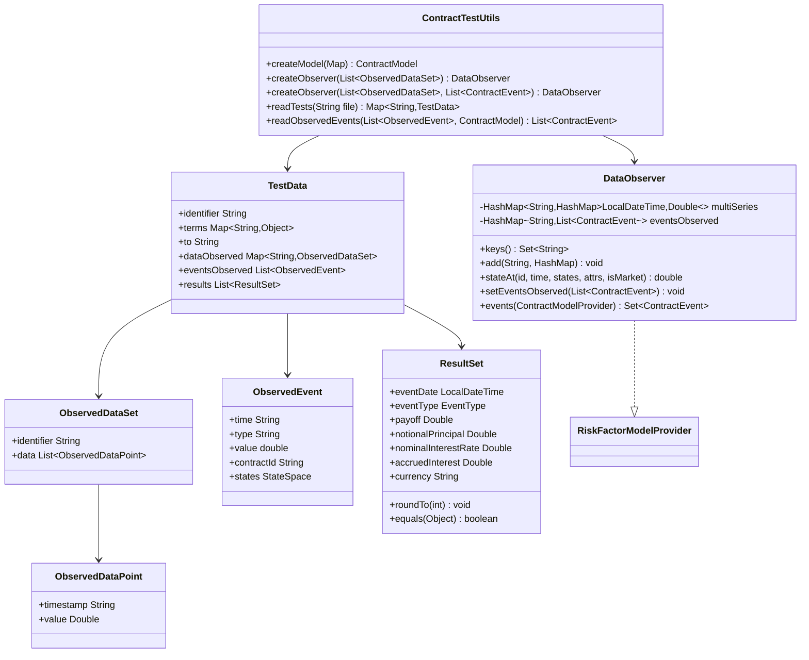
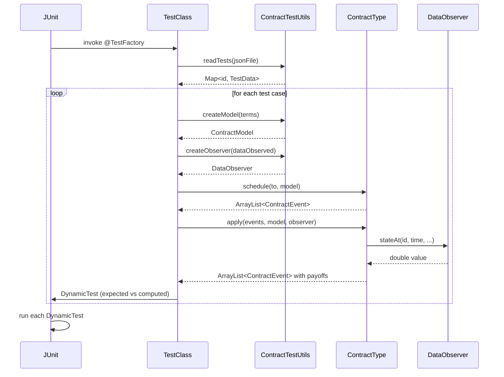

# Test Infrastructure

## Overview

The test suite validates each of the 19 contract types against JSON-encoded expected results. Tests are JUnit 5 dynamic tests — each JSON file can contain dozens or hundreds of independent test cases that the framework discovers and runs automatically.

```
test/
└── java/
    └── org/
        └── actus/
            ├── contracts/          ← 45 test classes (one or more per contract type)
            └── testutils/          ← 7 utility classes
```

---

## Test Utility Classes

### Class Diagram



---

## ContractTestUtils

`org.actus.testutils.ContractTestUtils` — `public final class`

The central factory class. All test classes use its static methods to convert JSON data into the runtime objects required by `ContractType.schedule()` and `ContractType.apply()`.

### Methods

**`readTests`**

```java
public static Map<String, TestData> readTests(String file)
```

Reads a JSON test file from the classpath using Jackson's `ObjectMapper`. Returns a `Map` keyed by test case identifier (e.g. `"pam001"`). The Jackson `ObjectMapper` is configured to deserialise `TestData` and its nested structures automatically.

**`createModel`**

```java
public static ContractModel createModel(Map<String, Object> data)
```

Converts the raw `terms` map from a `TestData` instance into a `ContractModel`. Special handling:

- `contractStructure` entries are parsed into `ContractReference` objects
- List values (e.g. arrays of schedule dates) are converted to comma-separated strings before being stored, matching the `ContractModel`'s internal string representation for cycle and schedule attributes

**`createObserver`** (two overloads)

```java
public static DataObserver createObserver(List<ObservedDataSet> data)
public static DataObserver createObserver(List<ObservedDataSet> data,
                                          List<ContractEvent> observedEvents)
```

Builds a `DataObserver` from the `dataObserved` list. Each `ObservedDataSet` becomes a `HashMap<LocalDateTime, Double>` keyed by `symbol` inside `DataObserver.multiSeries`. The second overload additionally registers pre-observed contract events (for credit enhancement tests where the covered obligation's events must be available to the covering contract).

**`readObservedEvents`**

```java
public static List<ContractEvent> readObservedEvents(
    List<ObservedEvent> eventsObserved, ContractModel terms)
```

Converts `ObservedEvent` objects (raw JSON) into fully formed `ContractEvent` objects by matching event type codes and attaching the appropriate state snapshots.

---

## DataObserver

`org.actus.testutils.DataObserver` — `implements RiskFactorModelProvider`

Provides market data and pre-observed contract events to the contract evaluation engine. This is the test-environment implementation of the `RiskFactorModelProvider` interface.

### Fields

```java
private HashMap<String, HashMap<LocalDateTime, Double>> multiSeries;
private HashMap<String, List<ContractEvent>> eventsObserved;
```

`multiSeries` is a two-level map: outer key is the market object code (e.g. `"USD_LIBOR_3M"`), inner key is a `LocalDateTime`, value is the observed rate or price. Lookup is O(1) for both dimensions.

### `stateAt` Implementation

```java
public double stateAt(String id, LocalDateTime time,
                      StateSpace contractStates,
                      ContractModelProvider contractAttributes,
                      boolean isMarket)
```

Returns the value of market object `id` at `time`. If the exact timestamp is not present, the implementation returns the value at the latest timestamp before `time` (flat forward / last-observation-carried-forward interpolation). If `id` is not found, returns `0.0`.

### `events` Implementation

```java
public Set<ContractEvent> events(ContractModelProvider model)
```

Returns the set of pre-observed events associated with the contract identified by `model.getAs("contractID")`. Used by credit enhancement contract types that need to observe events from the referenced covered obligation.

---

## TestData

`org.actus.testutils.TestData` — Jackson-deserialised test case wrapper

| Field | Type | Description |
|---|---|---|
| `identifier` | `String` | Test case ID, e.g. `"pam001"` |
| `terms` | `Map<String, Object>` | Contract terms — raw JSON key/value pairs |
| `to` | `String` | Analysis horizon date as ISO-8601 string; empty string means use maturity date |
| `dataObserved` | `Map<String, ObservedDataSet>` | Market data time series keyed by symbol |
| `eventsObserved` | `List<ObservedEvent>` | Pre-observed events (e.g. credit events on a covered contract) |
| `results` | `List<ResultSet>` | Expected output — one entry per expected contract event |

---

## ObservedDataSet and ObservedDataPoint

`org.actus.testutils.ObservedDataSet` wraps a labelled time series:

```java
String identifier;              // market object code, e.g. "USD_LIBOR_3M"
List<ObservedDataPoint> data;   // ordered list of (timestamp, value) pairs
```

`org.actus.testutils.ObservedDataPoint` is a two-field struct:

```java
String timestamp;   // ISO-8601 datetime string
Double value;       // observed rate, price, or index value
```

---

## ObservedEvent

`org.actus.testutils.ObservedEvent` — raw JSON representation of a pre-observed event

| Field | Type | Description |
|---|---|---|
| `time` | `String` | ISO-8601 datetime of the event |
| `type` | `String` | EventType code, e.g. `"CE"` |
| `value` | `double` | Numeric value associated with the event |
| `contractId` | `String` | ID of the contract this event belongs to |
| `states` | `StateSpace` | Contract state snapshot at the event time |

---

## ResultSet

`org.actus.testutils.ResultSet` — expected output record for a single contract event

### All Fields

| Field | Type | Description |
|---|---|---|
| `eventDate` | `LocalDateTime` | Scheduled event date |
| `exerciseDate` | `LocalDateTime` | Option exercise date (OPTNS only) |
| `eventType` | `EventType` | Event type code |
| `currency` | `String` | ISO 4217 currency code |
| `payoff` | `Double` | Cash flow amount |
| `accruedInterest` | `Double` | Accrued interest after event |
| `accruedInterest2` | `Double` | Secondary accrued interest (swap legs) |
| `exerciseAmount` | `Double` | Option exercise amount |
| `feeAccrued` | `Double` | Accrued fee after event |
| `interestCalculationBaseAmount` | `Double` | Active accrual base |
| `interestScalingMultiplier` | `Double` | Interest scaling factor |
| `nextPrincipalRedemptionPayment` | `Double` | Next scheduled principal repayment |
| `nominalInterestRate` | `Double` | Current interest rate |
| `nominalInterestRate2` | `Double` | Secondary rate (swap floating leg) |
| `notionalPrincipal` | `Double` | Outstanding notional after event |
| `notionalPrincipal2` | `Double` | Secondary notional (structured products) |
| `notionalScalingMultiplier` | `Double` | Notional scaling factor |

### Key Methods

**`roundTo`**

```java
public void roundTo(int decimals)
```

Rounds all non-null `Double` fields to `decimals` places using `BigDecimal.setScale(decimals, RoundingMode.HALF_UP)`. Both the computed and expected `ResultSet` are rounded to 10 decimal places before comparison to eliminate floating-point noise.

**`setValues` and `equals`**

`setValues()` populates a generic `HashMap<String, String>` from all non-null object fields using reflection. `equals(Object o)` compares `ResultSet` instances by comparing their `values` maps, so the assertion `assertArrayEquals(expected, computed)` compares all populated fields regardless of which fields the test case specifies.

---

## JUnit 5 Dynamic Test Pattern

Every contract test class follows the same structure:

```java
@TestFactory
public Stream<DynamicTest> test() throws Exception {
    // 1. Read JSON
    Map<String, TestData> tests = ContractTestUtils.readTests("actus-tests-pam.json");

    return tests.entrySet().stream().map(entry -> {
        String testId = entry.getKey();
        TestData testData = entry.getValue();

        return DynamicTest.dynamicTest("Test: " + testId, () -> {

            // 2. Build model and observer
            ContractModel terms = ContractTestUtils.createModel(testData.getTerms());
            DataObserver observer = ContractTestUtils.createObserver(
                testData.getDataObserved(), ...);

            // 3. Determine analysis horizon
            LocalDateTime to = testData.getTo().isEmpty()
                ? terms.getAs("maturityDate")
                : LocalDateTime.parse(testData.getTo());

            // 4. Schedule and apply
            ArrayList<ContractEvent> schedule = ContractType.schedule(to, terms);
            schedule = ContractType.apply(schedule, terms, observer);

            // 5. Extract computed results
            List<ResultSet> computed = schedule.stream()
                .map(e -> {
                    ResultSet rs = new ResultSet();
                    rs.setEventDate(e.eventTime());
                    rs.setEventType(e.eventType());
                    rs.setPayoff(e.payoff());
                    // ... map remaining state fields from e.states() ...
                    rs.setValues();
                    return rs;
                }).collect(Collectors.toList());

            // 6. Extract expected results and round both sides
            List<ResultSet> expected = testData.getResults();
            computed.forEach(r -> r.roundTo(10));
            expected.forEach(r -> r.roundTo(10));

            // 7. Assert
            Assertions.assertArrayEquals(
                expected.toArray(), computed.toArray());
        });
    });
}
```

The `@TestFactory` method returns a `Stream<DynamicTest>`, so JUnit 5 reports each test case as a separately named test in the test runner. A single JSON file with 500 test cases produces 500 individually trackable test results.

### Test Flow Diagram



---

## JSON Test File Format

Each JSON file contains a top-level object whose keys are test case identifiers. Each value is a `TestData` object.

### Minimal Example (CSH contract)

```json
{
  "csh01": {
    "identifier": "csh01",
    "terms": {
      "contractType": "CSH",
      "statusDate": "2015-07-15T00:00:00",
      "contractRole": "RPA",
      "contractID": "csh01",
      "currency": "CHF",
      "notionalPrincipal": "1000"
    },
    "to": "2015-08-15T00:00:00",
    "dataObserved": {},
    "eventsObserved": [
      {
        "time": "2015-07-30T00:00:00",
        "type": "AD",
        "value": 0
      }
    ],
    "results": [
      {
        "eventDate": "2015-07-30T00:00",
        "eventType": "AD",
        "payoff": 0,
        "notionalPrincipal": 1000,
        "nominalInterestRate": 0,
        "accruedInterest": 0,
        "currency": "CHF"
      }
    ]
  }
}
```

### Terms Object

Contains ACTUS Data Dictionary attribute names as keys and their values as strings or arrays:

```json
{
  "contractType": "PAM",
  "statusDate": "2012-12-31T00:00:00",
  "contractRole": "RPA",
  "contractID": "pam001",
  "currency": "USD",
  "initialExchangeDate": "2013-01-01T00:00:00",
  "maturityDate": "2016-01-01T00:00:00",
  "notionalPrincipal": "10000",
  "nominalInterestRate": "0.05",
  "cycleOfInterestPayment": "P1YL1",
  "dayCountConvention": "A365",
  "businessDayConvention": "NOS"
}
```

### dataObserved Object

Maps market object codes to time series. Empty `{}` for contracts with no market dependencies (fixed-rate, no scaling):

```json
{
  "dataObserved": {
    "USD_LIBOR_3M": {
      "identifier": "USD_LIBOR_3M",
      "data": [
        { "timestamp": "2013-01-01T00:00:00", "value": 0.02 },
        { "timestamp": "2014-01-01T00:00:00", "value": 0.025 },
        { "timestamp": "2015-01-01T00:00:00", "value": 0.03 }
      ]
    }
  }
}
```

### results Array

Each element captures a single expected contract event:

```json
{
  "eventDate": "2014-01-01T00:00",
  "eventType": "IP",
  "payoff": 500.00,
  "notionalPrincipal": 10000,
  "nominalInterestRate": 0.05,
  "accruedInterest": 0,
  "currency": "USD"
}
```

Only fields that the test case intends to assert need to be present. `ResultSet.equals()` compares only non-null values, so a result entry that omits `feeAccrued` will not fail if the computed value is non-zero.

---

## Test JSON Data Files

All 20 files reside in the test resources classpath (`src/test/resources/`).

| File | Approx. Lines | Approx. Size | Contract Type(s) |
|---|---|---|---|
| `actus-tests-ad0.json` | 434 | 13 KB | AD (Analysis Date — all contract types) |
| `actus-tests-pam.json` | 5 676 | 160 KB | PAM — Plain Amortizer |
| `actus-tests-ann.json` | 12 753 | 390 KB | ANN — Annuity |
| `actus-tests-nam.json` | 9 669 | 310 KB | NAM — Negative Amortizer |
| `actus-tests-lam.json` | 10 212 | 360 KB | LAM — Linear Amortizer |
| `actus-tests-lax.json` | 3 588 | 122 KB | LAX — Exotic Linear Amortizer |
| `actus-tests-clm.json` | 1 756 | 63 KB | CLM — Call Money |
| `actus-tests-ump.json` | 812 | 28 KB | UMP — Undefined Maturity Profile |
| `actus-tests-csh.json` | 135 | 3.6 KB | CSH — Cash |
| `actus-tests-stk.json` | 1 258 | 42 KB | STK — Stock |
| `actus-tests-com.json` | 160 | 4.7 KB | COM — Commodity |
| `actus-tests-swaps.json` | 4 172 | 137 KB | SWAPS — Swap |
| `actus-tests-swppv.json` | 2 597 | 91 KB | SWPPV — Swap with Performance Variation |
| `actus-tests-fxout.json` | 574 | 18 KB | FXOUT — FX Outright |
| `actus-tests-capfl.json` | 380 | 11 KB | CAPFL — Cap/Floor |
| `actus-tests-futur.json` | 1 411 | 46 KB | FUTUR — Futures |
| `actus-tests-optns.json` | 2 369 | 77 KB | OPTNS — Options |
| `actus-tests-ceg.json` | 1 157 | 42 KB | CEG — Credit Enhancement Guarantee |
| `actus-tests-cec.json` | 1 544 | 60 KB | CEC — Credit Enhancement Collateral |
| `actus-tests-bcs.json` | 1 334 | 32 KB | BCS — Boundary Controlled Switch |

The largest files (`actus-tests-ann.json` at ~390 KB and `actus-tests-lam.json` at ~360 KB) reflect the complexity of amortising contract types, which require testing many combinations of rate reset cycles, redemption schedules, day count conventions, and stub configurations.

---

## Test Count and Coverage

The 45 test classes and 7 test utility classes together with the 20 JSON files cover all 19 contract types. Test cases exercise:

- Normal contract lifecycle (IED through MD)
- Rate reset events (RR, RRF) with flat, upward, and downward rate scenarios
- Scaling events (SC) with combined interest and notional scaling
- Prepayment events (PP) with all three `PrepaymentEffect` values
- Credit events (CE) on CEG and CEC contracts with all covered event types
- End-of-month convention behaviour for month-end anchor dates
- Business day shifting for each of the nine `BusinessDayConventionEnum` values
- Long and short stub periods at both the leading and trailing end of a schedule
- Open-ended contracts (UMP, STK) evaluated against the `MAX_LIFETIME` guard
