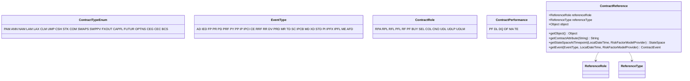
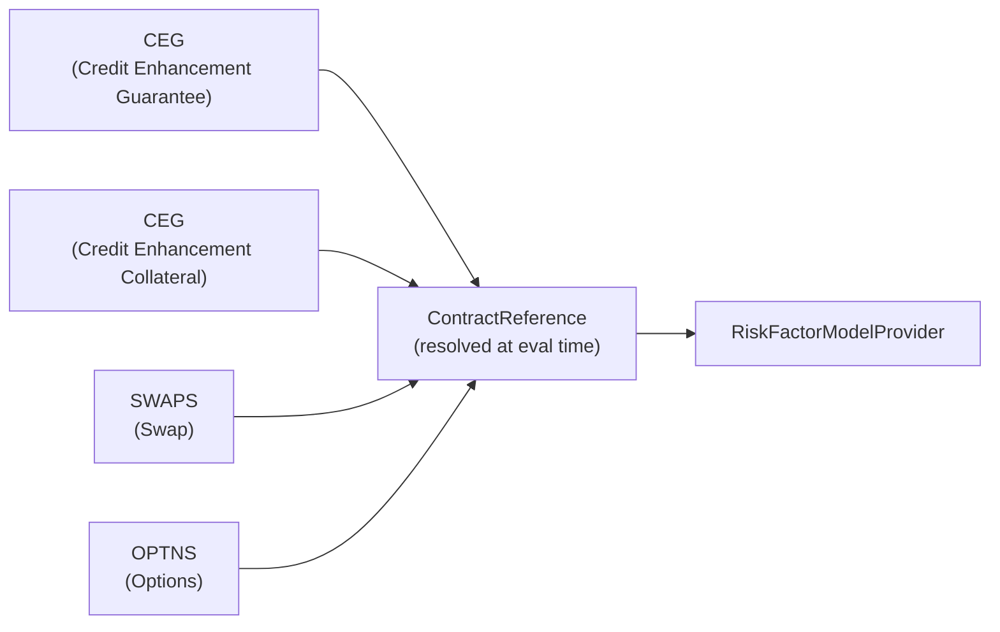

# Type System

## Overview

The `org.actus.types` package contains 25 source files: 23 enumerations and the `ContractReference` value class. Every enum constant corresponds to a code string defined in the ACTUS Data Dictionary. The package has no dependencies on other `org.actus` packages; all other packages import from here.



---

## ContractTypeEnum

`org.actus.types.ContractTypeEnum` — 19 values

| Constant | Contract Type |
|---|---|
| `PAM` | Principal at Maturity |
| `ANN` | Annuity |
| `NAM` | Negative Amortizer |
| `LAM` | Linear Amortizer |
| `LAX` | Exotic Linear Amortizer |
| `CLM` | Call Money |
| `UMP` | Undefined Maturity Profile |
| `CSH` | Cash |
| `STK` | Stock |
| `COM` | Commodity |
| `SWAPS` | Swap |
| `SWPPV` | Swap with Performance Variation |
| `FXOUT` | FX Outright |
| `CAPFL` | Cap/Floor |
| `FUTUR` | Futures |
| `OPTNS` | Options |
| `CEG` | Credit Enhancement Guarantee |
| `CEC` | Credit Enhancement Collateral |
| `BCS` | Boundary Controlled Switch |

These 19 values map one-to-one to the 19 contract implementation classes in `org.actus.contracts`. `ContractType` (the public dispatcher) uses `ContractTypeEnum.valueOf(model.getAs("contractType"))` to route calls.

---

## EventType

`org.actus.types.EventType` — 30 values

| Constant | Meaning |
|---|---|
| `AD` | Analysis Date — state snapshot with no cash flow |
| `IED` | Initial Exchange Date — contract inception; principal disbursed |
| `FP` | Fee Payment |
| `PR` | Principal Redemption |
| `PD` | Principal Drawing (UMP/CLM) |
| `PRF` | Principal Payment at Fixed Schedule |
| `PY` | Penalty Payment |
| `PP` | Principal Prepayment |
| `IP` | Interest Payment |
| `IPCI` | Interest Capitalisation — accrued interest added to principal |
| `CE` | Credit Event |
| `RRF` | Rate Reset Fixed — interest rate reset to a predefined value |
| `RR` | Rate Reset Variable — interest rate reset via market lookup |
| `DV` | Dividend Payment |
| `PRD` | Purchase Date |
| `MR` | Margin Call |
| `TD` | Termination Date |
| `SC` | Scaling Index Revision |
| `IPCB` | Interest Calculation Base Revision |
| `MD` | Maturity Date |
| `XD` | Execution Date (options) |
| `STD` | Settlement Date |
| `PI` | Principal Increase |
| `IPFX` | Interest Payment Fixed Leg |
| `IPFL` | Interest Payment Floating Leg |
| `ME` | Monitoring Event |
| `AFD` | Accrual / Fee Draw (internal scheduling) |

`EventType` values appear as the second element of the `ContractEvent` tuple and control which `POF_[EventType]_[ContractType]` and `STF_[EventType]_[ContractType]` functions are invoked during evaluation.

---

## ContractRole

`org.actus.types.ContractRole` — 13 values

| Constant | Description |
|---|---|
| `RPA` | Real Party Asset — the contract is held as an asset |
| `RPL` | Real Party Liability — the contract is held as a liability |
| `RFL` | Real Party Fixed Leg of a swap |
| `PFL` | Pay Fixed Leg of a swap |
| `RF` | Reference Fixed Leg |
| `PF` | Pay Floating Leg |
| `BUY` | Buyer (options, futures) |
| `SEL` | Seller (options, futures) |
| `COL` | Collateral provider |
| `CNO` | Collateral receiver (counterparty nominal obligation) |
| `UDL` | Underlying |
| `UDLP` | Underlying — put side |
| `UDLM` | Underlying — mortgage side |

`ContractRoleConvention.roleSign(ContractRole)` maps `RPA`, `BUY`, `RFL`, `COL`, `UDLP` to `+1.0` and the remaining roles to `−1.0`. This sign is multiplied into every cash flow so that assets and liabilities produce cash flows of opposite sign from the same formula.

---

## ContractPerformance

`org.actus.types.ContractPerformance` — 6 values

| Constant | Meaning |
|---|---|
| `PF` | Performing — contract is current |
| `DL` | Delayed — payment overdue but within grace period |
| `DQ` | Delinquent — past grace period, not yet defaulted |
| `DF` | Default — contract is in default |
| `MA` | Matured — contract has reached its maturity date |
| `TE` | Terminated — contract has been terminated early |

Stored in `StateSpace.contractPerformance`. State transitions driven by `CE` (credit event) events update this field. Many POF implementations check the performance status to determine whether a penalty applies.

---

## BusinessDayConventionEnum

`org.actus.types.BusinessDayConventionEnum` — 9 values

| Constant | Convention |
|---|---|
| `NOS` | No shift — use scheduled date regardless |
| `SCF` | Shift/Calculate Following |
| `SCMF` | Shift/Calculate Modified Following |
| `CSF` | Calculate/Shift Following |
| `CSMF` | Calculate/Shift Modified Following |
| `SCP` | Shift/Calculate Preceding |
| `SCMP` | Shift/Calculate Modified Preceding |
| `CSP` | Calculate/Shift Preceding |
| `CSMP` | Calculate/Shift Modified Preceding |

The `SC` vs `CS` prefix determines whether the date is first shifted to a business day and then used for calculation, or first used for calculation and then shifted. The Java conventions package maps each code to a `(ShiftCalcConvention, BusinessDayAdjusterProvider)` pair.

---

## EndOfMonthConventionEnum

`org.actus.types.EndOfMonthConventionEnum` — 2 values

| Constant | Behaviour |
|---|---|
| `SD` | Same Day — generated dates remain on the same calendar day as the anchor |
| `EOM` | End of Month — when the anchor falls on the last day of a month and the cycle is month-based, subsequent dates snap to the last day of each target month |

---

## Calendar

`org.actus.types.Calendar` — 3 values

| Constant | Calendar Code | Business Days |
|---|---|---|
| `NC` | No Calendar | Every calendar day |
| `MF` | Monday–Friday | Monday through Friday only |
| `MFH` | Monday–Friday + Holidays | Monday through Friday, excluding a provided holiday set |

Maps to `NoHolidaysCalendar`, `MondayToFridayCalendar`, and `MondayToFridayWithHolidaysCalendar` in `org.actus.time.calendar`.

---

## FeeBasis

`org.actus.types.FeeBasis` — 2 values

| Constant | Meaning |
|---|---|
| `A` | Absolute — fee is a fixed monetary amount |
| `N` | Notional — fee is expressed as a fraction of the current notional principal |

Controls the fee payoff formula in `POF_FP_*` implementations.

---

## ScalingEffect

`org.actus.types.ScalingEffect` — 4 values

| Constant | Interest Scaled | Notional Scaled |
|---|---|---|
| `OOO` | No | No |
| `IOO` | Yes | No |
| `ONO` | No | Yes |
| `INO` | Yes | Yes |

The two-character suffix encodes interest (`I`/`O`) and notional (`N`/`O`) scaling independently. When active, `StateSpace.interestScalingMultiplier` and `StateSpace.notionalScalingMultiplier` are applied in the relevant POF and STF.

---

## PenaltyType

`org.actus.types.PenaltyType` — 4 values

| Constant | Penalty Basis |
|---|---|
| `N` | No penalty |
| `A` | Absolute fixed amount |
| `R` | Rate — fraction of outstanding notional |
| `I` | Current interest amount |

Used in `POF_PP_PAM` and related prepayment payoff functions.

---

## InterestCalculationBase

`org.actus.types.InterestCalculationBase` — 3 values

| Constant | Base for Accrual |
|---|---|
| `NT` | Notional — accrue on current notional principal |
| `NTIED` | Notional at IED — accrue on original notional at inception |
| `NTL` | Notional at Last reset — accrue on notional at last IPCB event |

Stored in `StateSpace.interestCalculationBaseAmount`. The `IPCB` event refreshes this field when the convention requires it.

---

## OptionType

`org.actus.types.OptionType` — 3 values

| Constant | Option |
|---|---|
| `C` | Call |
| `P` | Put |
| `CP` | Call or Put (chooser) |

---

## OptionExerciseType

`org.actus.types.OptionExerciseType` — 3 values

| Constant | Exercise Style |
|---|---|
| `E` | European — exercise only at expiry |
| `B` | Bermudan — exercise on specified dates |
| `A` | American — exercise any time up to expiry |

---

## DeliverySettlement

`org.actus.types.DeliverySettlement` — 2 values

| Constant | Meaning |
|---|---|
| `S` | Settlement — cash settlement at expiry |
| `D` | Delivery — physical delivery of underlying |

---

## ClearingHouse

`org.actus.types.ClearingHouse` — 2 values

| Constant | Meaning |
|---|---|
| `Y` | Yes — cleared through a central counterparty |
| `N` | No — bilateral OTC |

---

## Seniority

`org.actus.types.Seniority` — 2 values

| Constant | Meaning |
|---|---|
| `S` | Senior |
| `J` | Junior (subordinated) |

---

## GuaranteedExposure

`org.actus.types.GuaranteedExposure` — 3 values

| Constant | Exposure Basis |
|---|---|
| `NO` | Notional — exposure is the notional principal |
| `NI` | Notional plus Interest — exposure includes accrued interest |
| `MV` | Market Value — exposure is the current market value |

Used in the credit enhancement contract types (`CEG`, `CEC`).

---

## CreditEventTypeCovered

`org.actus.types.CreditEventTypeCovered` — 3 values

| Constant | Covered Event |
|---|---|
| `DL` | Delayed payment |
| `DQ` | Delinquency |
| `DF` | Default |

---

## PrepaymentEffect

`org.actus.types.PrepaymentEffect` — 3 values

| Constant | Effect of Prepayment |
|---|---|
| `N` | No effect — schedule unchanged |
| `A` | Reduce Annuity — payment amount decreases |
| `M` | Reduce Maturity — maturity date moves earlier |

---

## CyclePointOfInterestPayment

`org.actus.types.CyclePointOfInterestPayment` — 2 values

| Constant | Payment Timing |
|---|---|
| `B` | Beginning of cycle — interest paid at the start of each period |
| `E` | End of cycle — interest paid at the end of each period |

---

## CyclePointOfRateReset

`org.actus.types.CyclePointOfRateReset` — 2 values

| Constant | Reset Timing |
|---|---|
| `B` | Beginning of cycle — rate is fixed at the start of each period |
| `E` | End of cycle — rate is fixed at the end of each period |

---

## ReferenceRole

`org.actus.types.ReferenceRole` — 6 values

| Constant | Role |
|---|---|
| `UDL` | Underlying asset or contract |
| `FIL` | First leg of a structured product |
| `SEL` | Second leg of a structured product |
| `COVE` | Covered entity (protection buyer) |
| `COVI` | Covering entity (protection seller) |
| `externalReferenceIndex` | External reference index (market rate source) |

---

## ReferenceType

`org.actus.types.ReferenceType` — 5 values

| Constant | Reference Resolves To |
|---|---|
| `CNT` | Contract — another `ContractModel` embedded inline |
| `CID` | Contract ID — a reference by string ID to be resolved at runtime |
| `MOC` | Market Object Code — a key into the `RiskFactorModelProvider` |
| `EID` | Entity ID — a counterparty or legal entity identifier |
| `CST` | Constant — a fixed numerical constant |

---

## ContractReference

`org.actus.types.ContractReference` — `public class`

`ContractReference` wraps a reference to an underlying contract, a market data series, or an external entity. It resolves the reference at evaluation time through a `RiskFactorModelProvider`.

### Fields

| Field | Type | Description |
|---|---|---|
| `referenceRole` | `ReferenceRole` | How this reference is used in the parent contract |
| `referenceType` | `ReferenceType` | What the reference points to |
| `object` | `Object` | The resolved reference (a `ContractModel`, a market object code string, or a numeric constant) |

### Constructor

```java
public ContractReference(Map<String, Object> attributes, ContractRole contractRole)
```

Parses the `contractStructure` entry from a contract's attributes map. Dispatches on `referenceType`:

- `CNT` → recursively constructs a nested `ContractModel`
- `CID` → stores the contract ID string for deferred resolution
- `MOC` → stores the market object code string
- `EID` → stores the entity ID string
- `CST` → stores the constant value as a `Double`

### Key Methods

```java
Object getObject()
```
Returns the wrapped reference value.

```java
String getContractAttribute(String contractAttribute)
```
When the reference is `CNT` or `CID`, retrieves a named attribute from the referenced contract (e.g. `"marketObjectCode"`).

```java
StateSpace getStateSpaceAtTimepoint(LocalDateTime time, RiskFactorModelProvider observer)
```
Evaluates the referenced contract up to `time` and returns its `StateSpace`. Used by credit enhancement contract types to observe the current state of the covered obligation.

```java
ContractEvent getEvent(EventType eventType, LocalDateTime time, RiskFactorModelProvider observer)
```
Retrieves a specific event from the referenced contract's evaluated schedule. Used when one contract's payoff depends on a specific event of an underlying contract.

### Usage in Contract Types

`ContractReference` is used in structured product types where one contract wraps or references another:



The parent contract's `apply()` method calls `getStateSpaceAtTimepoint()` or `getEvent()` on each `ContractReference` to obtain the state or events of the underlying at the relevant evaluation timestamps.
