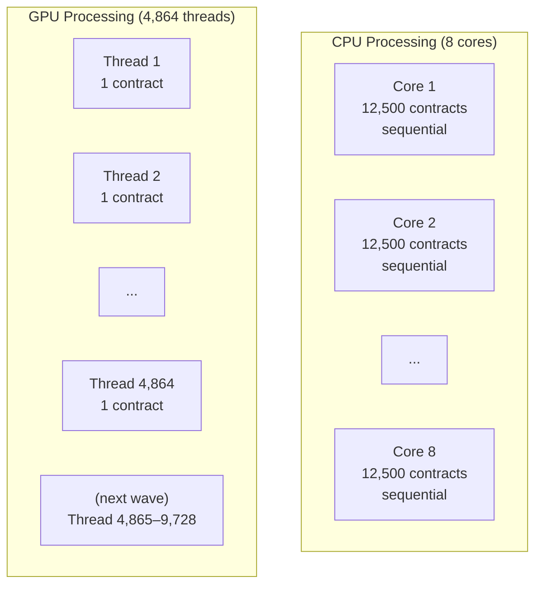
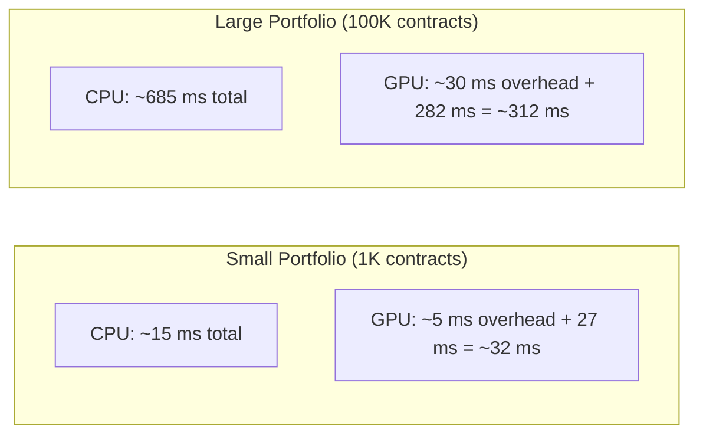

# GPU vs CPU Architecture

## Overview

CPUs and GPUs are both processors, but they are designed for fundamentally different workloads. Understanding these differences explains why certain problems benefit from GPU acceleration and why the crossover point exists (below a certain workload size, CPU is faster).

## Architecture Comparison

| Characteristic | CPU | GPU |
|---|---|---|
| Core count | 4–128 | 2,000–16,000 |
| Core complexity | High (branch prediction, out-of-order execution, large caches) | Low (simple ALU, minimal cache) |
| Clock speed | 3–5 GHz | 1–2 GHz |
| Memory bandwidth | 50–100 GB/s | 500–2,000 GB/s |
| Latency per operation | Very low (nanoseconds) | Higher (microseconds for memory access) |
| Parallelism model | Task-parallel (different tasks on different cores) | Data-parallel (same task on different data) |
| Best for | Complex logic, branching, sequential dependencies | Uniform computation on large datasets |

In this project, the CPU is an AMD Ryzen 7 3800X (8 cores, 3.90 GHz, 48 GB RAM) and the GPU is an NVIDIA GeForce RTX 3060 Ti (4,864 CUDA cores, 8 GB GDDR6X, ~448 GB/s memory bandwidth).

## How a CPU Processes a Portfolio

When a CPU evaluates a portfolio of 100,000 contracts, it uses its cores to process contracts in parallel. The approach:

1. Divide the 100,000 contracts among available CPU cores (8 cores → 12,500 contracts each)
2. Each core processes its contracts sequentially
3. Within each contract, events are processed in order

With 8 cores, this achieves 8× parallelism. The CPU's large caches and branch prediction make each individual contract evaluation fast, but the parallelism is limited by the core count.

## How a GPU Processes a Portfolio

When a GPU evaluates the same portfolio:

1. All 100,000 contracts are assigned to GPU threads (one thread per contract)
2. Thousands of threads execute simultaneously
3. Within each thread, events are processed sequentially (same as CPU)

With 4,864 active threads, this achieves massive parallelism on the contract dimension. Each individual thread is slower than a CPU core, but the sheer number of threads more than compensates.

## The Crossover Point

GPU acceleration has overhead that does not exist in CPU processing:

1. **Data packing:** Domain objects must be converted to compact numeric structs
2. **H2D transfer:** Data must be copied to GPU memory over the PCIe bus
3. **Kernel launch:** The GPU runtime has a fixed startup cost per kernel launch
4. **D2H transfer:** Results must be copied back to CPU memory

For small portfolios (under ~5,000 contracts), this overhead exceeds the time saved by parallelism. The GPU wins only when the computation time is large enough to amortise the overhead.

## When to Use CPU vs GPU

| Scenario | Recommended | Why |
|---|---|---|
| Single contract evaluation | CPU | GPU overhead dominates |
| Portfolio < 5,000 contracts | CPU | Overhead exceeds parallelism benefit |
| Portfolio 5,000–50,000 | Either (GPU slightly faster) | Break-even zone |
| Portfolio > 50,000 | GPU | Parallelism clearly dominates |
| Monte Carlo (many scenarios) | GPU | 2D parallelism (contracts × scenarios) |
| Real-time single queries | CPU | Lowest latency |
| Batch risk calculations | GPU | Maximum throughput |

## Memory Bandwidth Advantage

The GPU's memory bandwidth (often 10–20× higher than CPU) is particularly important for financial calculations. Contract evaluation requires reading many contract parameters and event descriptors from memory. The GPU's wide memory bus and coalesced access patterns allow it to feed data to thousands of cores simultaneously.

This is why the SoA (Structure of Arrays) data layout is critical: it ensures that when thousands of GPU threads read the "notional principal" field, they read from consecutive memory addresses, maximising bandwidth utilisation.
