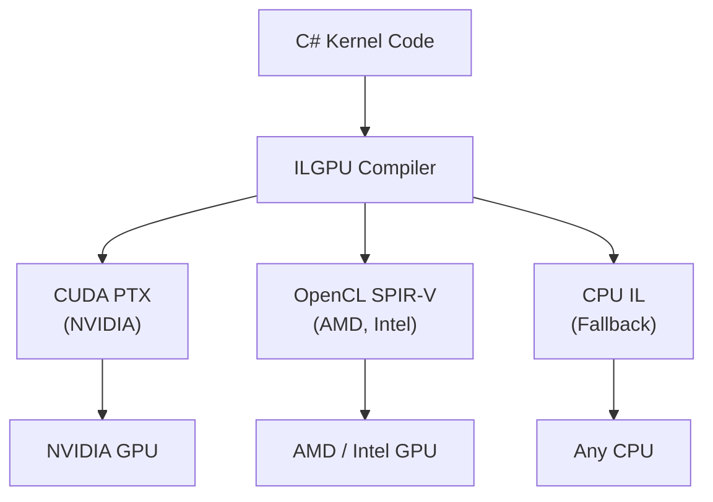

# ILGPU Framework

## Overview

ILGPU is an open-source .NET library that allows C# code to run on GPUs. It provides a unified programming model that compiles the same kernel code to CUDA (NVIDIA), OpenCL (cross-vendor), or CPU (fallback) instructions at runtime.

This page explains what ILGPU is, how it works, and why it was chosen for this project.

## What ILGPU Does

Traditional GPU programming requires writing kernels in CUDA C/C++ (for NVIDIA) or OpenCL C (for cross-vendor). This means maintaining a separate codebase in a different language, with a separate toolchain and build process.

ILGPU eliminates this by allowing kernels to be written in standard C#. At runtime, ILGPU's compiler translates the C# code into the appropriate GPU instruction set.

## The Accelerator Fallback Chain

When the executor initialises, it selects the best available backend:

1. **CUDA** — if an NVIDIA GPU is present, use CUDA for maximum performance
2. **OpenCL** — if no NVIDIA GPU but another GPU is available, use OpenCL
3. **CPU** — if no GPU is available, use the CPU backend (slower, but functional)

This means the software runs on any machine without modification. A developer can write and test on a laptop without a GPU, then deploy to a server with a high-end NVIDIA card for production performance.

## Key ILGPU Concepts

### Context and Accelerator

An ILGPU Context manages the runtime state. An Accelerator represents a specific device (GPU or CPU) and provides methods for memory allocation, kernel compilation, and execution.

### Memory Buffers

GPU memory is managed through typed buffers. These buffers hold contiguous arrays of blittable structs. The executor allocates buffers on the GPU, copies data from the CPU (H2D), runs the kernel, and copies results back (D2H).

### Kernel Compilation

Kernels are compiled from C# methods at runtime. The first compilation is slow (hundreds of milliseconds), but the compiled kernel is cached and reused for subsequent calls. In this project, kernel compilation happens once at executor initialisation.

### Index Types

ILGPU supports multi-dimensional thread indexing:

- **Index1D** — one-dimensional (used for single-batch contract evaluation)
- **Index2D** — two-dimensional (used for contract × scenario Monte Carlo evaluation)

The kernel receives its index as a parameter and uses it to determine which data element to process.

## Constraints

ILGPU kernels must operate on blittable types only. This means:

- No strings, objects, or reference types
- No lists, dictionaries, or other collection types
- No DateTime (converted to long ticks)
- No nullable reference types
- Structs must use sequential memory layout

All data passed to a kernel must be either a blittable struct parameter or a typed memory buffer. This is why the adapter layer exists: it converts rich domain objects into flat, GPU-compatible representations.

## Buffer Management in This Project

The executor uses a buffer pooling strategy to avoid repeated allocation:

1. Buffers start at the size needed for the first batch
2. If a subsequent batch needs more space, the buffer is reallocated at 1.5× the required size plus padding
3. Buffers never shrink (to avoid repeated allocation/deallocation)
4. Buffers are disposed when the executor is disposed

This ensures that the common case (repeated evaluation of similar-sized portfolios) involves zero GPU memory allocations after the first call.

## Why ILGPU Was Chosen

| Requirement | ILGPU Capability |
|---|---|
| Write kernels in C# | Yes — no separate language or toolchain |
| Run on NVIDIA GPUs | Yes — CUDA backend |
| Run on AMD GPUs | Yes — OpenCL backend |
| Run without any GPU | Yes — CPU fallback |
| .NET support | Yes — actively maintained |
| Open source | Yes — MIT licence |
| Deterministic execution | Yes — standard IEEE 754 semantics |

The main trade-off is that ILGPU may not achieve the absolute peak performance of hand-tuned CUDA C++ code, but it provides 80–90% of the performance with dramatically lower development and maintenance cost, and cross-platform compatibility.
