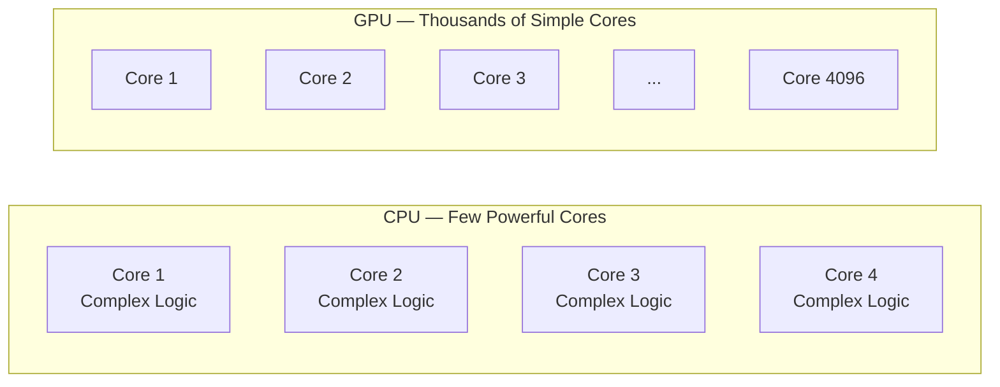

# Background — GPU Computing

## Overview

This section explains GPU computing for readers who may not have a background in parallel hardware. It starts with the basic concept of a GPU, compares it to a CPU, and then explains why the GPU's architecture is a natural fit for evaluating large portfolios of financial contracts.

If you are already familiar with GPU computing, you can skip directly to [Why GPU for ACTUS](./why-gpu-for-actus.md).

## What is a GPU?

A GPU (Graphics Processing Unit) is a processor that was originally designed to render images for computer displays. Rendering a frame of video or a 3D scene involves performing the same mathematical operation (a colour or lighting calculation) on millions of pixels simultaneously. To handle this workload, GPUs evolved a fundamentally different architecture from CPUs.

A CPU has a small number of powerful cores (typically 4–16 on consumer hardware, up to 128 on server hardware). Each core is optimised for complex, branching logic and can execute different instructions independently. A CPU is like a small team of highly skilled specialists — each one can handle any task, but there are only a few of them.

A GPU has thousands of smaller, simpler cores (typically 2,000–16,000). Each core is less powerful than a CPU core, but they work together in lockstep, all executing the same instruction on different data. A GPU is like a factory floor with thousands of workers — each one performs a simple, repetitive task, but together they achieve enormous throughput.

In this project, the GPU used is an NVIDIA GeForce RTX 3060 Ti with 8 GB of memory and 4,864 CUDA cores. The CPU is an AMD Ryzen 7 3800X with 8 cores at 3.90 GHz and 48 GB of RAM. Even this mid-range consumer GPU delivered substantial speedups for large portfolio evaluations.

## Key Concepts

Before diving deeper, here are the concepts needed to understand GPU computing in the context of this project.

### Parallelism

Parallelism means performing multiple computations at the same time. There are two kinds:

**Task parallelism** — different tasks run simultaneously on different cores. This is what a multi-core CPU does well. For example, one core handles email while another handles a spreadsheet.

**Data parallelism** — the same task runs simultaneously on many different data elements. This is what a GPU does well. For example, the same interest calculation runs on 100,000 different contracts at the same time.

Financial contract evaluation is a data-parallel problem: the same algorithm (compute cash flows) is applied to many independent contracts.

### Kernel

In GPU programming, a kernel is a function that runs on the GPU. When you launch a kernel, you specify how many threads should execute it. Each thread receives a unique index that tells it which data element to process. For example, thread 0 processes contract 0, thread 1 processes contract 1, and so on.

### Host and Device

In GPU programming, the CPU and its memory are called the "host." The GPU and its memory are called the "device." Data must be explicitly transferred between host and device:

1. **H2D (Host-to-Device):** Copy input data from CPU memory to GPU memory
2. **Kernel execution:** GPU processes the data in parallel
3. **D2H (Device-to-Host):** Copy results from GPU memory back to CPU memory

This transfer overhead is why GPUs only provide a benefit for large workloads — the computation time must be large enough to outweigh the data transfer time. In the car factory analogy from the [hackathon section](../hackathon/cpu-vs-gpu-explained.md), H2D is the on-ramp and D2H is the off-ramp.

### Memory Coalescing

GPU memory is optimised for a specific access pattern: when all threads in a group read from consecutive memory addresses. This is called coalesced access, and it delivers maximum memory bandwidth. The SoA (Structure of Arrays) data layout used in this project ensures coalesced access by storing each contract field in a contiguous array.

## Continue Reading

- [GPU vs CPU Architecture](./gpu-vs-cpu.md) — detailed comparison of the two architectures
- [Why GPU for ACTUS](./why-gpu-for-actus.md) — specific reasons GPU suits financial contract evaluation
- [ILGPU Framework](./ilgpu-framework.md) — how ILGPU bridges .NET to GPU hardware
