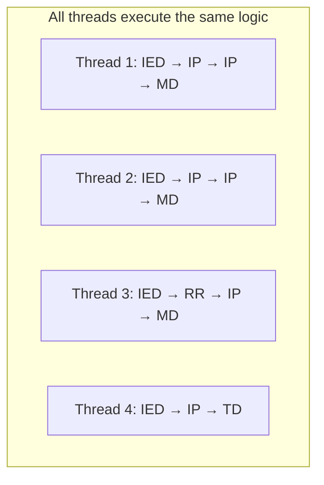

# Why GPU for ACTUS Contracts

## Overview

Not every computation benefits from GPU acceleration. The key question is: does the workload have the right properties for data parallelism? ACTUS contract evaluation has several properties that make it an excellent GPU candidate.

## Property 1: Independent Work Items

Each financial contract in a portfolio can be evaluated completely independently of every other contract. Contract A's cash flows do not depend on Contract B's state. This means there is no synchronisation needed between GPU threads — each thread can run to completion without waiting for any other thread.

Independence is the most important property for GPU parallelism. If work items depended on each other, threads would need to synchronise, which would eliminate the parallelism benefit.

In the car factory analogy: each car's test run is completely independent. No car needs to wait for another car's results.

## Property 2: Uniform Computation

All PAM contracts follow the same algorithm: generate events, process them in order, compute payoffs, update state. The specific parameters differ (different principals, rates, dates), but the computation structure is the same.

GPUs achieve peak performance when all threads execute the same instructions. This is called SIMT (Single Instruction, Multiple Threads). Because ACTUS contracts share the same processing logic, GPU threads stay in lockstep, maximising hardware utilisation.

The minor variations (some contracts have rate resets, others don't) cause slight divergence, but the overall structure is uniform enough for efficient GPU execution.

## Property 3: Scalable Parallelism

Financial risk management requires evaluating portfolios under many scenarios. A portfolio of 100,000 contracts under 1,000 Monte Carlo scenarios produces 100 million independent evaluations. This is a two-dimensional parallelism that maps naturally to the GPU's thread grid:

| Dimension | Maps To | Count |
|---|---|---|
| Contracts | GPU grid X dimension | 100,000 |
| Scenarios | GPU grid Y dimension | 1,000 |
| **Total independent threads** | | **100,000,000** |

Modern GPUs can manage millions of threads, making this scale a natural fit.

## Property 4: Bounded, Predictable Memory

Each contract evaluation requires a fixed, predictable amount of memory: the contract terms, the event list, and the working state. There are no dynamic allocations, no recursion, and no variable-length data structures during kernel execution. This predictability means:

- Memory can be pre-allocated in a single batch
- No garbage collection or memory management on the GPU
- Memory access patterns are known at compile time, enabling optimisation

## Property 5: Arithmetic Intensity

Contract evaluation involves substantial arithmetic: year fraction calculations, compound interest, discount factor application, rate cap/floor comparisons. The ratio of computation to memory access (arithmetic intensity) is high enough that the GPU's compute units are well utilised — the workload is not purely memory-bound.

## The Portfolio Scale Argument

Financial institutions manage portfolios that are naturally large:

| Sector | Typical Portfolio Size |
|---|---|
| Regional bank | 10,000–100,000 contracts |
| National bank | 100,000–1,000,000 contracts |
| Insurance company | 500,000–10,000,000 policies |
| Central bank (stress testing) | Millions of contracts across institutions |

When combined with Monte Carlo scenarios (100–10,000 paths) and multiple calculation dates (for time-series analysis), the total computation scales into billions of evaluations. This is the regime where GPU acceleration provides order-of-magnitude speedups.

## Summary

ACTUS contract evaluation satisfies all the criteria for effective GPU acceleration:

1. Work items are independent (no synchronisation)
2. Computation is uniform (same algorithm, different data)
3. Parallelism scales in two dimensions (contracts × scenarios)
4. Memory requirements are bounded and predictable
5. Arithmetic intensity is sufficient

These properties are inherent to the ACTUS standard — they are not artefacts of a particular implementation. Any correct ACTUS engine will exhibit these same properties, making GPU acceleration a natural evolution for the standard.
