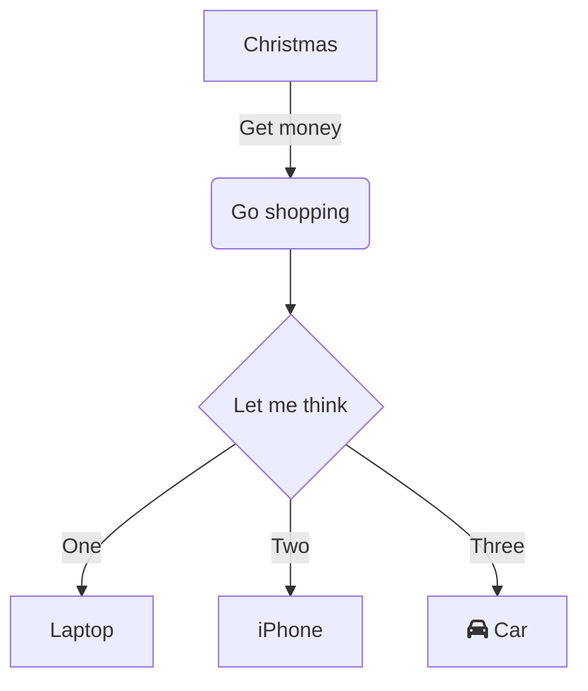

# API Development Guide

Welcome to the ACTUS API Development Guide. This section provides comprehensive resources for developers working with the ACTUS Framework APIs.

## Getting Started

The ACTUS Framework provides REST APIs for all major functionality including contract management, cash flow generation, and risk factor handling. This guide will walk you through everything you need to know to build applications on top of ACTUS.

### Prerequisites

Before you begin developing with ACTUS APIs, ensure you have:

- **API Access**: Valid API credentials (OAuth 2.0 client or API key)
- **Development Environment**: A suitable development environment for your language of choice
- **Basic Understanding**: Familiarity with RESTful APIs and JSON
- **ACTUS Concepts**: Understanding of financial contracts and ACTUS terminology

### API Architecture Overview

The ACTUS APIs are organized into several key areas:

1. **Authentication & Authorization**: Secure access to all API endpoints
2. **Contract Management**: Create, read, update, and delete financial contracts
3. **Cash Flow Generation**: Generate deterministic and scenario-based cash flows
4. **Risk Factor Management**: Handle market data and risk scenarios
5. **Portfolio Operations**: Manage groups of contracts and perform bulk operations

## Quick Start

### 1. Obtain API Credentials

First, you'll need to register your application and obtain credentials:

```bash
# Register your application
curl -X POST https://auth.actus.org/oauth/clients \
  -H "Content-Type: application/json" \
  -d '{
    "client_name": "My ACTUS App",
    "grant_types": ["client_credentials"],
    "scope": "contracts:read contracts:write cashflows:read"
  }'
```

### 2. Get Access Token

```bash
# Exchange credentials for access token
curl -X POST https://auth.actus.org/oauth/token \
  -H "Content-Type: application/x-www-form-urlencoded" \
  -d "grant_type=client_credentials&client_id=YOUR_CLIENT_ID&client_secret=YOUR_CLIENT_SECRET"
```

### 3. Make Your First API Call

```bash
# List available contracts
curl -X GET https://api.actus.org/v1/contracts \
  -H "Authorization: Bearer YOUR_ACCESS_TOKEN"
```

## Core Concepts

### Contract Lifecycle
All financial contracts in ACTUS follow a standard lifecycle:
1. **Creation**: Define contract terms and validate
2. **Activation**: Set contract to active status
3. **Processing**: Generate cash flows and perform calculations
4. **Monitoring**: Track contract state changes
5. **Maturation**: Handle contract completion

### Event-Driven Architecture
ACTUS uses an event-driven model where:
- **Contract Events** represent cash flow dates (interest payments, principal repayments)
- **Risk Factor Events** represent market data changes
- **System Events** track operational activities

### Data Consistency
The ACTUS APIs ensure data consistency through:
- **Transactional Operations**: Atomic updates across related entities
- **Validation Rules**: Comprehensive business rule enforcement  
- **Audit Trails**: Complete history of all changes

## Development Patterns

### Error Handling Best Practices

Always implement robust error handling:

```javascript
async function createContract(contractData) {
  try {
    const response = await fetch('https://api.actus.org/v1/contracts', {
      method: 'POST',
      headers: {
        'Authorization': `Bearer ${accessToken}`,
        'Content-Type': 'application/json'
      },
      body: JSON.stringify(contractData)
    })
    
    if (!response.ok) {
      const errorData = await response.json()
      throw new Error(`API Error: ${errorData.message}`)
    }
    
    return await response.json()
  } catch (error) {
    throw error
  }
}
```





### Pagination Handling

Handle large result sets with pagination:

```python
def get_all_contracts(client, filters=None):
    all_contracts = []
    offset = 0
    limit = 100
    
    while True:
        params = {
            'limit': limit,
            'offset': offset,
            **(filters or {})
        }
        
        response = client.get('/v1/contracts', params=params)
        contracts = response.json()['contracts']
        
        if not contracts:
            break
            
        all_contracts.extend(contracts)
        offset += limit
        
    return all_contracts
```

### Rate Limit Management

Implement exponential backoff for rate limits:

```java
public class RateLimitHandler {
    private static final int MAX_RETRIES = 3;
    private static final int BASE_DELAY_MS = 1000;
    
    public <T> T executeWithRetry(Supplier<T> operation) throws Exception {
        for (int attempt = 0; attempt < MAX_RETRIES; attempt++) {
            try {
                return operation.get();
            } catch (RateLimitException e) {
                if (attempt == MAX_RETRIES - 1) {
                    throw e;
                }
                
                int delay = BASE_DELAY_MS * (int) Math.pow(2, attempt);
                Thread.sleep(delay);
            }
        }
        
        return null; // Should never reach here
    }
}
```

## Testing Strategies

### Unit Testing API Calls

```javascript
// Jest example for testing API integration
describe('ACTUS API Client', () => {
  let apiClient;
  
  beforeEach(() => {
    apiClient = new ActusApiClient('test-client-id', 'test-client-secret');
  });
  
  test('should create contract successfully', async () => {
    const contractData = {
      contractType: 'PAM',
      contractID: 'TEST_BOND_001',
      // ... other contract terms
    };
    
    const result = await apiClient.createContract(contractData);
    
    expect(result.contractID).toBe('TEST_BOND_001');
    expect(result.status).toBe('created');
  });
  
  test('should handle validation errors', async () => {
    const invalidContractData = {
      contractType: 'INVALID_TYPE'
    };
    
    await expect(apiClient.createContract(invalidContractData))
      .rejects.toThrow('validation_failed');
  });
});
```

### Integration Testing

```python
import pytest
from actus_client import ActusClient

class TestActusIntegration:
    def setup_method(self):
        self.client = ActusClient(
            client_id='test-client-id',
            client_secret='test-client-secret',
            base_url='https://api-staging.actus.org'
        )
    
    def test_contract_lifecycle(self):
        # Create contract
        contract = self.client.create_contract({
            'contractType': 'PAM',
            'contractID': 'TEST_BOND_001',
            'notionalPrincipal': 1000000,
            'nominalInterestRate': 0.05
        })
        
        # Generate cash flows
        cash_flows = self.client.generate_cash_flows(
            contract_id='TEST_BOND_001',
            status_date='2024-01-15T00:00:00Z'
        )
        
        # Verify cash flows
        assert len(cash_flows['cashFlows']) > 0
        assert cash_flows['summary']['netCashFlow'] > 0
        
        # Clean up
        self.client.delete_contract('TEST_BOND_001')
```

## Performance Optimization

### Caching Strategies

Implement intelligent caching for frequently accessed data:

```javascript
class ActusCacheManager {
  constructor() {
    this.cache = new Map();
    this.cacheTTL = 5 * 60 * 1000; // 5 minutes
  }
  
  async getCachedContract(contractId) {
    const cacheKey = `contract:${contractId}`;
    const cached = this.cache.get(cacheKey);
    
    if (cached && Date.now() - cached.timestamp < this.cacheTTL) {
      return cached.data;
    }
    
    const contract = await this.apiClient.getContract(contractId);
    this.cache.set(cacheKey, {
      data: contract,
      timestamp: Date.now()
    });
    
    return contract;
  }
}
```

### Batch Operations

Use bulk endpoints for better performance:

```python
# Instead of individual calls
for contract in contracts:
    api_client.create_contract(contract)  # Multiple API calls

# Use bulk operations
api_client.bulk_create_contracts(contracts)  # Single API call
```

## Monitoring and Observability

### Request Logging

```java
@Component
public class ActusApiInterceptor implements ClientHttpRequestInterceptor {
    private static final Logger logger = LoggerFactory.getLogger(ActusApiInterceptor.class);
    
    @Override
    public ClientHttpResponse intercept(
            HttpRequest request,
            byte[] body,
            ClientHttpRequestExecution execution) throws IOException {
        
        long startTime = System.currentTimeMillis();
        
        logger.info("ACTUS API Request: {} {}", 
                   request.getMethod(), 
                   request.getURI());
        
        ClientHttpResponse response = execution.execute(request, body);
        
        long endTime = System.currentTimeMillis();
        logger.info("ACTUS API Response: {} - {}ms", 
                   response.getStatusCode(), 
                   endTime - startTime);
        
        return response;
    }
}
```

### Health Checks

```javascript
class ActusHealthCheck {
  async checkApiHealth() {
    const checks = {
      authentication: false,
      contractApi: false,
      cashFlowApi: false,
      riskFactorApi: false
    };
    
    try {
      // Test authentication
      await this.apiClient.getAccessToken();
      checks.authentication = true;
      
      // Test contract API
      await this.apiClient.searchContracts({ limit: 1 });
      checks.contractApi = true;
      
      // Test cash flow API
      await this.apiClient.getRiskFactors({ limit: 1 });
      checks.riskFactorApi = true;
      
    } catch (error) {
    }
    
    return checks;
  }
}
```

## Next Steps

- Explore the detailed [Authentication & Authorization](authentication) guide
- Learn about [Contract Management APIs](contract-apis)
- Understand [Cash Flow Generation](cashflow-apis)
- Master [Risk Factor Management](riskfactor-apis)

---

This guide provides the foundation for building robust applications with the ACTUS Framework. Continue to the specific API references for detailed implementation guidance.