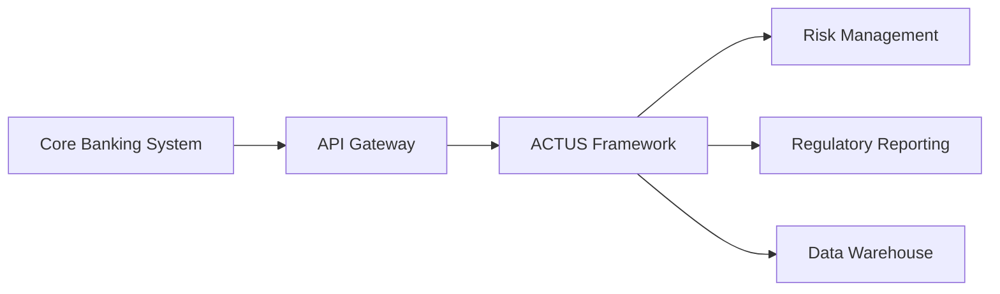

# Enterprise Integration

The ACTUS Framework is designed to integrate seamlessly with existing enterprise systems through multiple integration patterns and protocols. This guide covers best practices for integrating ACTUS into your enterprise architecture.

## Integration Patterns

### API-First Integration
The primary integration approach using RESTful APIs and event-driven architecture.



**Key Components:**
- **API Gateway**: Centralized API management and security
- **Service Registry**: Service discovery and health monitoring
- **Message Queue**: Asynchronous processing and reliability
- **Circuit Breaker**: Fault tolerance and system protection

### Batch Processing Integration
For high-volume, scheduled processing scenarios.

#### ETL Pipeline
```
┌─────────────┐    ┌─────────────┐    ┌─────────────┐    ┌─────────────┐
│   Extract   │    │  Transform  │    │    Load     │    │   Process   │
│             │    │             │    │             │    │             │
│ • Files     │───►│ • Validate  │───►│ • Import    │───►│ • Calculate │
│ • Database  │    │ • Cleanse   │    │ • Stage     │    │ • Export    │
│ • APIs      │    │ • Enrich    │    │ • Index     │    │ • Notify    │
└─────────────┘    └─────────────┘    └─────────────┘    └─────────────┘
```

#### Batch Job Configuration
```yaml
# batch-job-config.yml
batchJobs:
  dailyPortfolioProcessing:
    schedule: "0 2 * * *"  # 2 AM daily
    source: 
      type: "database"
      connection: "core-banking-db"
      query: "select * from contracts where last_modified >= ?"
    processing:
      chunkSize: 1000
      parallelism: 4
      timeout: "2h"
    output:
      formats: ["json", "csv"]
      destinations: ["s3://results/", "sftp://reporting/"]
```

### Real-time Event Processing
For immediate processing of financial events and market changes.

#### Event Streaming Architecture
```
┌─────────────┐    ┌─────────────┐    ┌─────────────┐
│   Producers │    │  Event Bus  │    │  Consumers  │
│             │    │             │    │             │
│ • Payments  │───►│ • Kafka     │───►│ • ACTUS     │
│ • Rates     │    │ • Pulsar    │    │ • Analytics │
│ • Trades    │    │ • EventHub  │    │ • Alerts    │
└─────────────┘    └─────────────┘    └─────────────┘
```

## System Integration Protocols

### Database Integration

#### JDBC Configuration
```java
// Database connection configuration
@Configuration
@EnableJpaRepositories
public class DatabaseConfig {
    
    @Primary
    @Bean
    public DataSource actusPrimary() {
        HikariConfig config = new HikariConfig();
        config.setJdbcUrl("jdbc:postgresql://actus-db:5432/actus");
        config.setUsername("${actus.db.username}");
        config.setPassword("${actus.db.password}");
        config.setMaximumPoolSize(20);
        config.setMinimumIdle(5);
        return new HikariDataSource(config);
    }
    
    @Bean
    public DataSource corebanking() {
        // Core banking system connection
        return DataSourceBuilder.create()
            .url("jdbc:oracle:thin:@//corebank:1521/prod")
            .username("${corebank.username}")
            .password("${corebank.password}")
            .build();
    }
}
```

#### Data Synchronization
```sql
-- Incremental synchronization query
SELECT 
    contract_id,
    contract_type,
    status,
    terms,
    last_modified
FROM contracts 
WHERE last_modified > ?
  AND status IN ('ACTIVE', 'SUSPENDED')
ORDER BY last_modified
LIMIT 1000;
```

### File-based Integration

#### Supported Formats
- **CSV**: Structured contract data
- **JSON**: API-compatible format  
- **XML**: Legacy system compatibility
- **Parquet**: Big data analytics
- **ACTUS JSON**: Native format

#### File Processing Configuration
```yaml
fileProcessing:
  watchDirectories:
    - path: "/imports/contracts"
      pattern: "*.csv"
      processor: "ContractImporter"
      archiveAfter: true
    - path: "/imports/rates"
      pattern: "rates_*.json" 
      processor: "RateUpdater"
      validateSchema: true
  
  outputs:
    - path: "/exports/cashflows"
      format: "json"
      schedule: "0 */4 * * *"
    - path: "/exports/reports"
      format: "csv"
      schedule: "0 6 * * 1"
```

### Message Queue Integration

#### Apache Kafka Integration
```java
@Component
public class ContractEventProducer {
    
    @Autowired
    private KafkaTemplate<String, ContractEvent> kafkaTemplate;
    
    public void publishContractEvent(ContractEvent event) {
        kafkaTemplate.send("contract-events", event.getContractId(), event);
    }
}

@KafkaListener(topics = "market-data-updates")
public class MarketDataConsumer {
    
    @Autowired
    private RiskFactorService riskFactorService;
    
    public void handleMarketUpdate(MarketDataUpdate update) {
        riskFactorService.updateFactors(update.getFactors());
    }
}
```

#### RabbitMQ Configuration
```yaml
spring:
  rabbitmq:
    host: rabbitmq-cluster
    port: 5672
    username: ${RABBITMQ_USER}
    password: ${RABBITMQ_PASSWORD}
    exchanges:
      - name: actus.contracts
        type: topic
        durable: true
      - name: actus.cashflows  
        type: fanout
        durable: true
    queues:
      - name: contract.processing
        exchange: actus.contracts
        routingKey: "contract.*"
        dlq: contract.processing.dlq
```

## Enterprise Service Bus (ESB)

### MuleSoft Integration
```xml
<!-- mule-config.xml -->
<mule xmlns="http://www.mulesoft.org/schema/mule/core">
    
    <http:listener-config name="actus-http-config">
        <http:listener-connection host="0.0.0.0" port="8081" />
    </http:listener-config>
    
    <flow name="contract-sync-flow">
        <scheduler>
            <scheduling-strategy>
                <fixed-frequency frequency="1" timeUnit="HOURS"/>
            </scheduling-strategy>
        </scheduler>
        
        <db:select config-ref="corebank-db">
            <db:sql>SELECT * FROM contracts WHERE last_sync > ?</db:sql>
        </db:select>
        
        <transform doc:name="Transform to ACTUS format">
            <dw:set-payload><![CDATA[
                %dw 2.0
                output application/json
                ---
                payload map {
                    contractId: $.contract_id,
                    contractType: $.type,
                    terms: $.contract_terms
                }
            ]]></dw:set-payload>
        </transform>
        
        <http:request method="POST" url="http://actus-api/contracts">
            <http:headers>
                <http:header headerName="Authorization" 
                           value="Bearer ${actus.api.token}" />
            </http:headers>
        </http:request>
    </flow>
    
</mule>
```

### IBM Integration Bus (IIB)
```javascript
// Contract transformation node
CREATE COMPUTE MODULE ContractTransform
    CREATE FUNCTION Main() RETURNS BOOLEAN
    BEGIN
        -- Transform core banking format to ACTUS
        SET OutputRoot.JSON.Data.contractId = InputRoot.JSON.Data.account_number;
        SET OutputRoot.JSON.Data.contractType = 
            CASE InputRoot.JSON.Data.product_code
                WHEN 'LOAN' THEN 'PAM'
                WHEN 'MORTGAGE' THEN 'ANN'
                ELSE 'UMP'
            END;
        
        SET OutputRoot.JSON.Data.contractTerms.notionalPrincipal = 
            InputRoot.JSON.Data.principal_amount;
        SET OutputRoot.JSON.Data.contractTerms.nominalInterestRate = 
            InputRoot.JSON.Data.interest_rate / 100;
            
        RETURN TRUE;
    END;
END MODULE;
```

## Security Integration

### Single Sign-On (SSO)
Integration with enterprise identity providers.

#### SAML Configuration
```xml
<!-- saml-security-config.xml -->
<beans xmlns="http://www.springframework.org/schema/beans">
    
    <security:authentication-manager alias="authenticationManager">
        <security:authentication-provider ref="samlAuthenticationProvider"/>
    </security:authentication-manager>
    
    <bean id="samlAuthenticationProvider" 
          class="org.springframework.security.saml.SAMLAuthenticationProvider">
        <property name="userDetailsService" ref="samlUserDetailsService"/>
    </bean>
    
    <bean id="metadataManager" 
          class="org.springframework.security.saml.metadata.CachingMetadataManager">
        <constructor-arg>
            <list>
                <bean class="org.springframework.security.saml.metadata.ExtendedMetadataDelegate">
                    <constructor-arg value="https://idp.company.com/metadata"/>
                </bean>
            </list>
        </constructor-arg>
    </bean>
    
</beans>
```

#### OAuth 2.0 Integration
```java
@EnableResourceServer
@Configuration
public class OAuth2ResourceServerConfig extends ResourceServerConfigurerAdapter {
    
    @Override
    public void configure(HttpSecurity http) throws Exception {
        http
            .authorizeRequests()
                .antMatchers("/api/public/**").permitAll()
                .antMatchers("/api/contracts/**").hasScope("contracts:read")
                .antMatchers(HttpMethod.POST, "/api/contracts").hasScope("contracts:write")
                .antMatchers("/api/admin/**").hasRole("ADMIN")
                .anyRequest().authenticated();
    }
    
    @Bean
    public TokenStore tokenStore() {
        return new JwtTokenStore(jwtAccessTokenConverter());
    }
}
```

## Monitoring and Observability

### Application Performance Monitoring
Integration with enterprise monitoring solutions.

#### Prometheus Metrics
```java
@Component
public class ActusMetrics {
    
    private final MeterRegistry meterRegistry;
    private final Counter contractProcessingCounter;
    private final Timer cashflowGenerationTimer;
    
    public ActusMetrics(MeterRegistry meterRegistry) {
        this.meterRegistry = meterRegistry;
        this.contractProcessingCounter = Counter.builder("contracts.processed")
            .description("Number of contracts processed")
            .register(meterRegistry);
        this.cashflowGenerationTimer = Timer.builder("cashflow.generation.time")
            .description("Time taken to generate cash flows")
            .register(meterRegistry);
    }
    
    public void incrementContractsProcessed() {
        contractProcessingCounter.increment();
    }
    
    public Timer.Sample startCashflowGeneration() {
        return Timer.start(meterRegistry);
    }
}
```

#### Health Check Endpoints
```java
@Component
public class ActusHealthIndicator implements HealthIndicator {
    
    @Autowired
    private DataSource dataSource;
    
    @Autowired 
    private RiskFactorService riskFactorService;
    
    @Override
    public Health health() {
        try {
            // Check database connectivity
            try (Connection conn = dataSource.getConnection()) {
                conn.createStatement().execute("SELECT 1");
            }
            
            // Check risk factor service
            if (!riskFactorService.isHealthy()) {
                return Health.down()
                    .withDetail("riskFactorService", "unavailable")
                    .build();
            }
            
            return Health.up()
                .withDetail("database", "connected")
                .withDetail("riskFactorService", "healthy")
                .build();
                
        } catch (Exception e) {
            return Health.down(e).build();
        }
    }
}
```

## Best Practices

### Performance Optimization
1. **Connection Pooling**: Use connection pooling for database connections
2. **Caching Strategy**: Implement multi-level caching for frequently accessed data
3. **Async Processing**: Use asynchronous processing for non-blocking operations
4. **Batch Processing**: Group operations for better throughput

### Error Handling
1. **Circuit Breaker**: Implement circuit breaker pattern for external systems
2. **Retry Logic**: Configure exponential backoff for transient failures
3. **Dead Letter Queue**: Use DLQ for failed message processing
4. **Graceful Degradation**: Provide fallback mechanisms

### Security
1. **Least Privilege**: Grant minimum required permissions
2. **Token Management**: Secure token storage and rotation
3. **Audit Logging**: Log all security-relevant events
4. **Network Segmentation**: Use network policies to isolate services

---

This integration guide provides the foundation for incorporating ACTUS into your enterprise architecture while maintaining security, performance, and reliability standards.