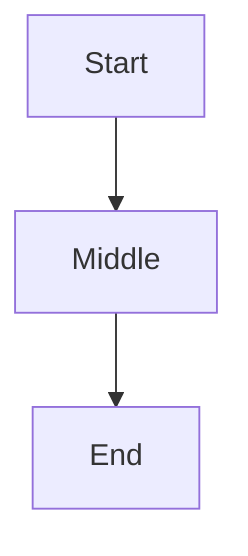

# About This Documentation Site

This page explains how the documentation site itself is built — how the project is laid out, where content lives, how pages are loaded, and how to add or change things without touching the application code.

The site was built entirely during the hackathon. There was no existing template or CMS. Every part — from the sidebar to the search index to the PDF export — was written from scratch.

---

## Technology Stack

The site is a **Next.js 16** application written in **TypeScript**, styled with **Tailwind CSS**, and rendered as a static export. All content is written in Markdown and read directly from the filesystem at build time. There is no database and no CMS.

Key libraries used:

| Purpose | Library |
|---|---|
| Markdown rendering | `react-markdown` with `remark-gfm` and `rehype-highlight` |
| Diagram rendering | `mermaid` (client-side) |
| Full-text search | `fuse.js` |
| Frontmatter parsing | `gray-matter` |
| PDF generation | `puppeteer` (or WeasyPrint as fallback) |

---

## Project Structure

```
Actus-Insurance.Documentation/
│
├── app/                        # Next.js App Router
│   ├── page.tsx                # Landing page (/)
│   ├── layout.tsx              # Root HTML shell
│   ├── globals.css             # Global styles
│   └── docs/
│       ├── layout.tsx          # Docs layout (sidebar + content area)
│       ├── page.tsx            # /docs root redirect
│       └── [...slug]/
│           └── page.tsx        # Catch-all: renders any /docs/* URL
│
├── components/                 # Shared React components
│   ├── Sidebar.tsx             # Left navigation panel
│   ├── DocumentRenderer.tsx    # Markdown → HTML renderer
│   ├── TableOfContents.tsx     # Right-hand TOC (generated from headings)
│   ├── SearchModal.tsx         # Full-text search overlay
│   ├── MermaidChart.tsx        # Mermaid diagram renderer
│   ├── ResourceList.tsx        # Downloadable resource cards
│   ├── LayoutContext.tsx        # Sidebar/TOC collapse state
│   └── ClientLayout.tsx        # Client wrapper for context
│
├── config/                     # Site configuration (JSON, no code changes needed)
│   ├── sections.json           # Top-level sections (defines navigation tabs)
│   ├── resources.json          # Downloadable files and videos
│   └── proper-nouns.json       # Terms that bypass sentence-case normalization
│
├── docs/                       # All documentation content (Markdown files)
│   ├── hackathon/              # "The Hackathon Story" section
│   ├── actus-org/              # "ACTUS Organization" section
│   ├── background-gpu/         # "Background — GPU Computing" section
│   ├── technical/              # "Technical Documentation" section
│   ├── actus-insurance/        # "ACTUS Insurance Extensions" section
│   └── shared/                 # Cross-section pages (e.g. navigation map)
│
├── lib/                        # Server-side utilities
│   ├── markdown.ts             # File discovery, frontmatter parsing, slug resolution
│   ├── search.ts               # Search index builder
│   └── sentenceCase.ts         # Title normalization
│
├── public/
│   └── downloads/              # Static downloadable files (PDFs, videos, zip)
│
├── scripts/
│   ├── generate-section-pdfs.js    # PDF generator (one PDF per section)
│   └── mermaid-render.mjs          # Server-side Mermaid SVG renderer
│
└── Dockerfile                  # Container build for self-hosted deployment
```

---

## How Pages Work

Every page in the documentation maps to a Markdown file under `docs/`. The URL path mirrors the file path:

| URL | File |
|---|---|
| `/docs/hackathon` | `docs/hackathon/index.md` |
| `/docs/hackathon/timeline` | `docs/hackathon/timeline.md` |
| `/docs/technical/core-engine` | `docs/technical/core-engine/index.md` |
| `/docs/technical/core-engine/state-machine` | `docs/technical/core-engine/state-machine.md` |

The slug resolution logic (in `lib/markdown.ts`) tries each path in order: `{slug}.md`, then `{slug}/index.md`, then `{slug}/README.md`. This means a folder's landing page can be either `index.md` or `README.md` — both work.

---

## Frontmatter Reference

Every Markdown file can include a YAML frontmatter block at the top. This controls how the page appears in the sidebar and in generated PDFs.

```markdown
---
title: My Page Title
description: A one-sentence summary shown below the title.
category: Hackathon
order: 10
---
```

| Field | Required | Default | Description |
|---|---|---|---|
| `title` | No | Inferred from first H1, or filename | Page title shown in sidebar and page header |
| `description` | No | — | Subtitle shown below the title on the page |
| `category` | No | Parent folder name (capitalized) | Groups pages under a sidebar heading |
| `order` | No | `999` | Determines sort position within the category |

Pages without frontmatter will still appear — titles and categories are inferred automatically.

---

## How the Sidebar Works

The sidebar reads all Markdown files at build time and groups them by `category`. Within each category, pages are sorted by `order` (ascending). The sidebar is section-aware: it only shows pages whose slug starts with the current section ID (e.g. `hackathon/`).

Sections themselves are defined in `config/sections.json` and appear in the section dropdown at the top of the sidebar.

---

## Adding a New Page

To add a page to an existing section, create a `.md` file in the appropriate folder under `docs/`:

```markdown
---
title: My New Topic
description: What this page covers.
category: Hackathon
order: 50
---

# My New Topic

Content goes here...
```

The page will automatically appear in the sidebar the next time the site is built. No code changes needed.

> **Tip:** Choose an `order` value that places your page between existing ones. The current hackathon pages use a spaced scale (1, 7, 8, 10, 15, 20, 25, 30…) which leaves room to insert pages without renumbering.

---

## Adding a New Section

Sections are defined in `config/sections.json`. Each entry controls the section tab in the sidebar dropdown and the landing page card on the home page.

```json
{
  "id": "my-section",
  "title": "My New Section",
  "shortTitle": "My Section",
  "icon": "DocumentText",
  "description": "A longer description shown on the home page card.",
  "blurb": "A sentence used as the PDF cover page description.",
  "features": [
    "Feature one",
    "Feature two"
  ]
}
```

After adding the entry, create a folder `docs/my-section/` and place an `index.md` inside it. The section will appear in the sidebar dropdown and the home page immediately.

**Available icon names** (from `@heroicons/react`): `BuildingOffice`, `CurrencyDollar`, `Heart`, `DocumentText`, `ShieldCheck`, `Beaker`, `ChartBar`, `GlobeAlt`, `Cog`, `LightBulb`, `CommandLine`, `WrenchScrewdriver`, `Sparkles`.

---

## Adding Downloadable Resources

Resources (PDFs, videos, zip files, JSON) are listed in `config/resources.json`. Each entry renders as a download card wherever a `<ResourceList />` component is placed in Markdown.

```json
{
  "id": "my-resource",
  "title": "My Download Title",
  "description": "What this file contains.",
  "type": "pdf",
  "size": "1.2 MB",
  "url": "/downloads/my-file.pdf",
  "viewUrl": "/downloads/my-file.pdf"
}
```

Place the file itself in `public/downloads/`. Supported types: `pdf`, `video`, `zip`, `json`, `powerpoint`.

To embed the resource list in a Markdown page, add the following anywhere in the content:

```markdown
<ResourceList />
```

This renders all resources. To show only specific ones by ID:

```markdown
<ResourceList ids="my-resource,other-resource" />
```

---

## Special Markdown Features

### Mermaid Diagrams

Fenced code blocks with `mermaid` as the language are rendered as interactive diagrams:

````markdown

````

Mermaid diagrams are also rendered server-side when generating PDFs.

### Relative Images

Images stored alongside a Markdown file can be referenced with a relative path:

```markdown

```

The site resolves these through the `/api/docs-assets/` route so that images inside the `docs/` folder are served correctly. SVG files are fully supported and are the recommended format for diagrams.

### Tables

GitHub-Flavoured Markdown tables are fully supported and rendered with a styled header and alternating row colours.

### Syntax Highlighting

Code blocks with a language tag are syntax-highlighted. A language label is shown in the top-left corner of each block.

---

## Generating PDFs

Each section can be exported as a standalone PDF that mirrors the visual style of the site. The script collects all Markdown files in a section folder, renders them, and produces a single paginated document with a cover page and table of contents.

```bash
# Generate PDFs for all sections
npm run generate-pdfs

# Generate PDF for one section only
npm run generate-pdfs -- hackathon

# Generate HTML previews only (no Chrome required)
npm run generate-pdfs:preview
```

Generated PDFs are saved to `public/downloads/` and the corresponding entries in `config/resources.json` are updated automatically.

The script requires either **Puppeteer** (included in `devDependencies` — install with `npm install`) or **WeasyPrint** (`pip install weasyprint`). Puppeteer is preferred as it renders Mermaid diagrams correctly.

---

## Running Locally

```bash
# Install dependencies
npm install

# Start development server (with hot reload)
npm run dev

# Build for production
npm run build

# Serve the production build
npm start
```

The development server starts on `http://localhost:3000` by default.

---

## Docker Deployment

The site ships with a `Dockerfile` for self-hosted deployment. Two GitHub Actions workflows handle automated builds:

| Workflow | File | Trigger |
|---|---|---|
| Preview build | `.github/workflows/docker-preview.yml` | Push to feature branches |
| Release build | `.github/workflows/docker-release.yml` | Version tags (`v*`) |

To build and run locally with Docker:

```bash
docker build -t actus-docs .
docker run -p 3000:3000 actus-docs
```

---

## Proper Nouns

The site applies sentence-case normalisation to all titles and headings (only the first letter of each sentence is capitalised). Terms that should always retain their original capitalisation — such as `ACTUS`, `ILGPU`, `Next.js`, `GitHub` — are listed in `config/proper-nouns.json`. Add entries there to prevent any term from being lowercased.
