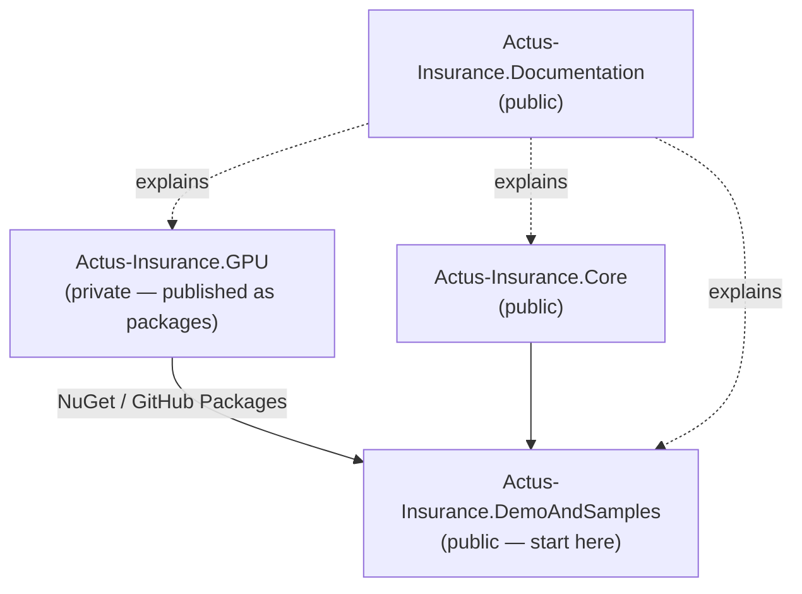

# Code Resources

The ACTUS Insurance extension is spread across four repositories under the [FransVanEk](https://github.com/FransVanEk) GitHub organisation.

---

## Repositories

**[Actus-Insurance.Documentation](https://github.com/FransVanEk/Actus-Insurance.Documentation)** — Public

The documentation you are reading now. Contains all conceptual and technical documentation for the insurance extension: the Markov model, DSL and product rules, Monte Carlo simulation, and the life insurance projection model.

**[Actus-Insurance.Core](https://github.com/FransVanEk/Actus-Insurance.Core)** — Public

The C# implementation of the insurance contract extensions. Contains the Markov state machine, the DSL interpreter, actuarial lookup tables, the rule pack loader, and the insurance contract adapter that connects to the ACTUS contract engine.

**[Actus-Insurance.GPU](https://github.com/FransVanEk/Actus-Insurance.GPU)** — Private

The high-performance GPU kernel that runs the portfolio projection. This repository is proprietary and not publicly available. It publishes compiled packages to GitHub Packages, which the other repositories consume as dependencies.

**[Actus-Insurance.DemoAndSamples](https://github.com/FransVanEk/Actus-Insurance.DemoAndSamples)** — Public

End-to-end examples showing how to use the insurance extension in your own solution. This is the recommended starting point for implementers. It consumes the published GPU packages as a dependency and demonstrates how the Core, GPU, and Documentation components work together in practice.

---

## How They Fit Together

The GPU component is the only proprietary piece. Because it ships as a package, you can build and run the demo and samples without access to the GPU source — the compiled package is sufficient. The Core and DemoAndSamples repositories are fully open and show the complete integration pattern.
