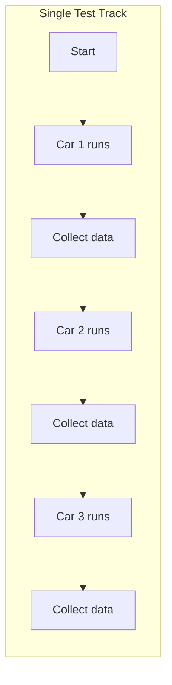
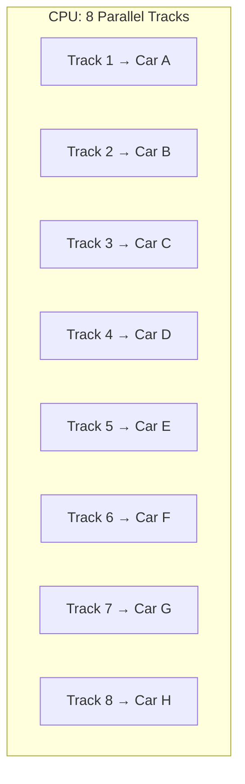
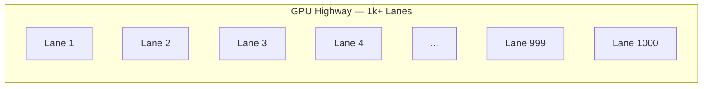
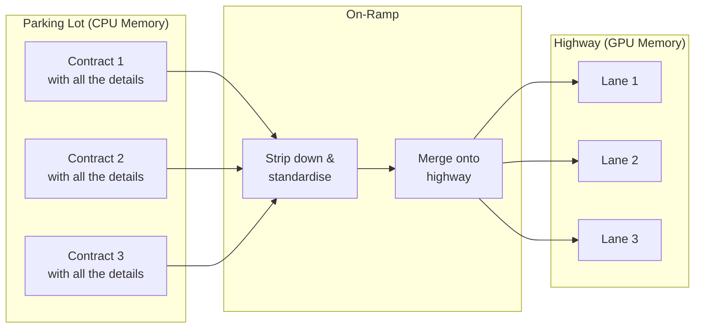
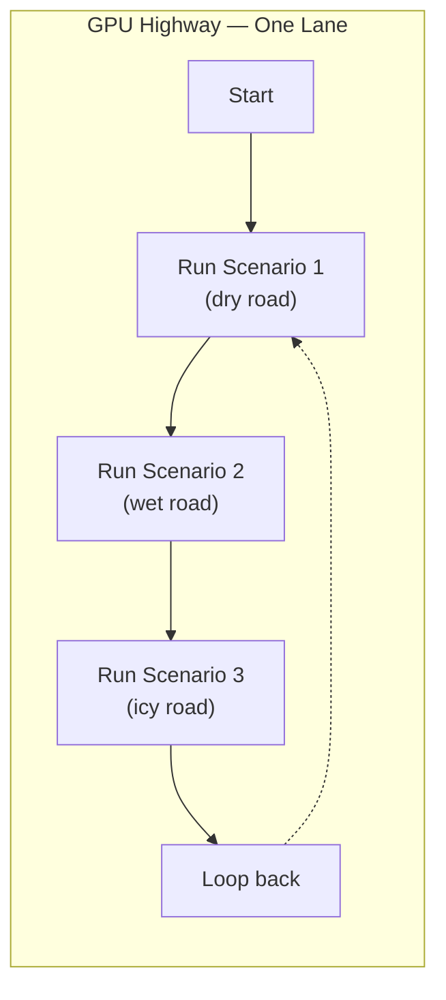
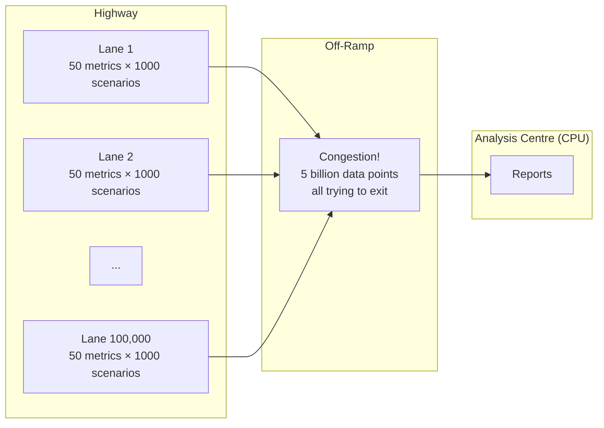
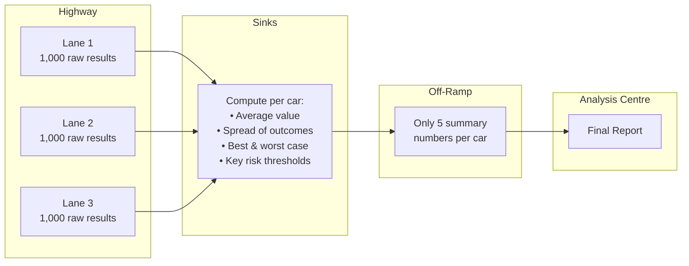
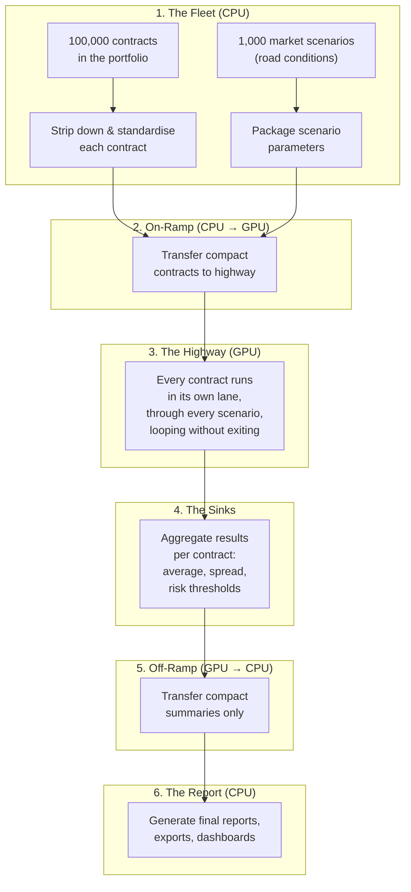

# Understanding CPU and GPU — The Car Factory

This is the foundational story for the entire hackathon section. If you read one document, read this one. Every concept in the other documents maps back to the analogy introduced here.

## The Factory Floor

You are the head of testing at a car factory. Your company has designed many different car models — some are small city cars, some are heavy trucks, some are luxury sedans. Before any of them can go to market, you need to know how they perform under every imaginable condition: dry asphalt, wet roads, icy mountain passes, scorching desert heat, freezing Nordic winters, city stop-and-go, and open highway cruising.

For each combination of car and road condition, your team puts the car on the track, runs the scenario, and collects data: fuel consumption, brake wear, tyre grip, engine temperature, suspension load, emissions, and dozens of other measurements.

This is **exactly** what financial contract evaluation does:

| Car Factory | Financial World |
|---|---|
| A car model | A financial contract (loan, bond, deposit, insurance policy) |
| A road condition (wet, icy, hot) | A market scenario (rising rates, falling rates, crisis) |
| A test run on the track | Evaluating a contract's cash flows under one scenario |
| Measurements collected | Cash flow amounts, present values, risk metrics |
| The full fleet of cars | The institution's portfolio |
| All road conditions tested | Monte Carlo simulation across thousands of scenarios |

Now the question is: how fast can you test the entire fleet?

---

## Stage 1 — One Car, One Track

In the simplest setup, you have a single test track. One car goes out, drives the scenario, comes back. The next car goes out. One at a time.

For 100,000 cars under 1,000 road conditions, that is 100 million runs. Sequentially. You will be here for a very long time.

**This is how the original ACTUS reference implementation works.** It evaluates one contract at a time, one scenario at a time. The results are correct — the track itself is excellent — but the throughput is limited to the speed of one track.

---

## Stage 2 — Eight Parallel Tracks (the CPU)

A modern computer processor — the CPU — is not one track. It has multiple cores, typically 8 to 16, each of which can run a test independently. Think of it as upgrading your facility from one track to eight:

Now 8 cars are tested at the same time. Each track is powerful and versatile — it can handle complex test programmes, change conditions mid-run, and adapt to very different car types. But there are only 8 tracks.

For 100,000 cars, this is 8 times faster than before. "Impossibly long" becomes "long but feasible."

**This is the optimised CPU engine I built during the hackathon.** Same ACTUS calculations, but running on all available processor cores simultaneously.

---

## Stage 3 — The Thousand-Lane Highway (the GPU)

A GPU is a fundamentally different kind of facility. Instead of 8 sophisticated tracks, it is a **massive highway with thousands of lanes** where thousands of cars drive at the same time.

Each individual lane is simpler than a CPU track. A lane cannot handle complex mid-run changes the way a CPU track can. But the sheer number of lanes — a thousand or more running at once — means you can test the entire fleet in a fraction of the time.

There is one crucial property that makes this possible: **every car's test is independent.** The result of testing Car A on wet roads has no effect on the result of testing Car B on icy roads. They do not need to wait for each other or share information. This kind of workload — thousands of completely independent tasks — is exactly what a highway is built for.

**This is the GPU engine.** The same ACTUS calculations, but running on thousands of GPU lanes simultaneously.

---

## The First Bottleneck: The On-Ramp

Here is where it gets interesting. The highway is enormously fast, but the on-ramp is narrow.

Before a car can enter the highway, it has to be prepared. In a real factory, that might mean fuelling up, checking tyre pressure, and programming the navigation system. In the financial world, it means **converting each contract from its natural, human-readable format into the compact format the highway demands**.

The highway lanes are uniform and standardised. They do not accept cars with custom bodywork sticking out, trailers attached, or luggage strapped to the roof. Every car must be stripped down to a sleek, uniform shape that fits perfectly into a lane.

No matter how many lanes the highway has, if the on-ramp is congested, lanes sit empty waiting for traffic. **The on-ramp is often the real bottleneck — not the highway itself.**

### The solution: make the cars as small and uniform as possible.

In the financial world, this means converting contract data into the most compact possible form:

| What the contract carries naturally | What it looks like on the highway |
|---|---|
| The text "Annual" for payment frequency | The number 12 |
| A date like "March 15, 2025" | A single number (a tick count) |
| A list of 20 scheduled events | A position and count in a shared flat list |
| A label like "Fixed Rate" | A code: 1 |

The smaller and more uniform the packages, the faster they flow through the on-ramp. I built a dedicated translation layer that handles this compression automatically — the engine works with contracts in their natural form; only when the highway is needed does the streamlining happen.

---

## Staying on the Highway

After a car completes one test run, it needs to run the next scenario. If it exits the highway, drives all the way back to the parking lot, gets re-prepared, and enters through the on-ramp again — you have just doubled the on-ramp congestion.

The much better approach: **keep the car on the highway.** After completing one run, each car loops back to the start of its lane and begins the next scenario immediately. No off-ramp, no parking lot, no on-ramp. Just a change of road conditions.

The contract data stays on the highway — it is loaded once and reused for every scenario. Only the scenario parameters (the road conditions) change between runs. This is a lightweight update: instead of moving the entire car, you just change the weather on the track.

This is enormously powerful for Monte Carlo simulation, where the same portfolio of 100,000 contracts is tested under 1,000 or even 10,000 different interest rate scenarios. The portfolio crosses the on-ramp once. The scenarios flow in as small, fast updates.

---

## The Second Bottleneck: The Off-Ramp

Now the highway is running at full speed. Thousands of cars are completing their runs and producing data. But here is the new problem: **every car generates a huge number of measurements during its run.**

For 100,000 cars, each producing 50 data points per scenario, under 1,000 scenarios, that is **5 billion individual measurements** trying to get off the highway and back to the analysis centre.

The off-ramp becomes the new bottleneck. If you are not careful, the time spent getting data off the highway exceeds the time saved by running on it.

### The solution: aggregate before leaving the highway.

Instead of sending every raw measurement off the highway, I built **sinks** — structured collection points that gather the raw results and then compute compact summaries. Each sink takes the thousand scenario results for one car and produces just a handful of numbers: the average, the spread, the best case, the worst case, and a few key risk percentiles.

Now instead of 5 billion raw data points, only 500,000 summary values cross the off-ramp (5 numbers per car × 100,000 cars). That is a **10,000× reduction** in off-ramp traffic. The analysis centre receives exactly what it needs for reporting — compact, pre-digested, ready to use.

The key design insight is that the raw measurements are collected in a structured, flat format that makes aggregation extremely efficient. The sinks are not an afterthought — they are a core part of the highway architecture, designed from the start to prevent the off-ramp from becoming the bottleneck.

---

## The Complete Journey

Here is the full picture, from fleet to final report:

The bottlenecks are never on the highway itself — the GPU handles the raw computation easily. The engineering challenge is entirely in the **on-ramp** (getting data onto the highway efficiently) and the **off-ramp** (getting results back without congestion):

| Bottleneck | Problem | Solution |
|---|---|---|
| **On-ramp** | Contracts must be converted to highway-compatible format | Strip to compact numeric form — make the cars as small as possible |
| **Staying on** | Re-entering the on-ramp for every scenario wastes time | Keep contracts resident on the highway — loop, don't exit |
| **Off-ramp** | Raw results from millions of runs create congestion | Sinks aggregate the results — exit with just the summary |

---

## From Cars to ACTUS Contracts

Everything in this analogy maps directly to the ACTUS financial contract engine I built during the hackathon:

| Car Factory | ACTUS Engine |
|---|---|
| A car model | A financial contract (PAM loan, insurance policy, etc.) |
| The test track rulebook | The ACTUS standard — deterministic rules for every contract type |
| Road conditions (dry, wet, icy) | Market scenarios (different interest rate paths) |
| A single test run | Projecting one contract's cash flows under one scenario |
| Measurements (fuel, brakes, grip) | Financial metrics (payments, present value, risk) |
| One track (original) | The reference Java implementation — one contract at a time |
| 8 parallel tracks (CPU) | 8 CPU cores evaluating contracts simultaneously |
| 1,000-lane highway (GPU) | Thousands of GPU threads evaluating contracts simultaneously |
| Stripping cars for the on-ramp | Converting contracts to compact GPU-compatible format |
| Looping without exiting | Reusing contract data in GPU memory across all scenarios |
| Sinks at the off-ramp | Aggregating risk metrics before transfer |
| The analysis centre report | Excel exports, dashboards, grouped portfolio summaries |

The hackathon proved two things: first, that the highway produces **exactly the same test results** as the original track for every car (all 42 ACTUS test cases pass to 10 decimal places). And second, that for large fleets — the kind real institutions manage — the highway is **dramatically faster**.

The other documents in this section tell the story of how the highway was built:

- [Development Timeline](./timeline.md) — the construction phases
- [Key Decisions](./decisions.md) — why I built it this way
- [Challenges & Solutions](./challenges.md) — the roadblocks I hit
- [Outcomes & Benchmarks](./results.md) — the final test results
