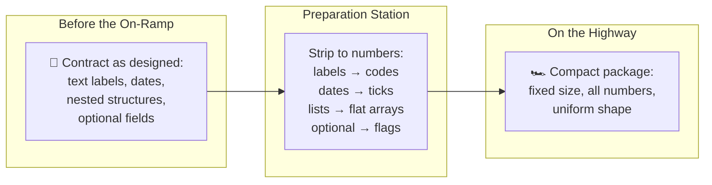
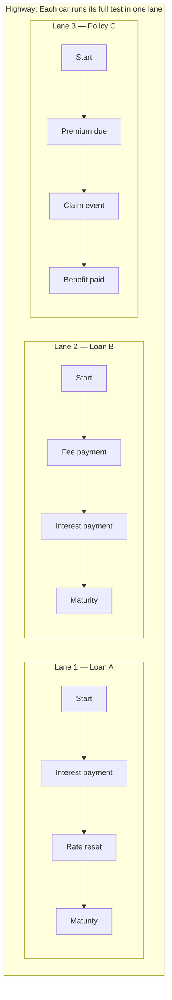
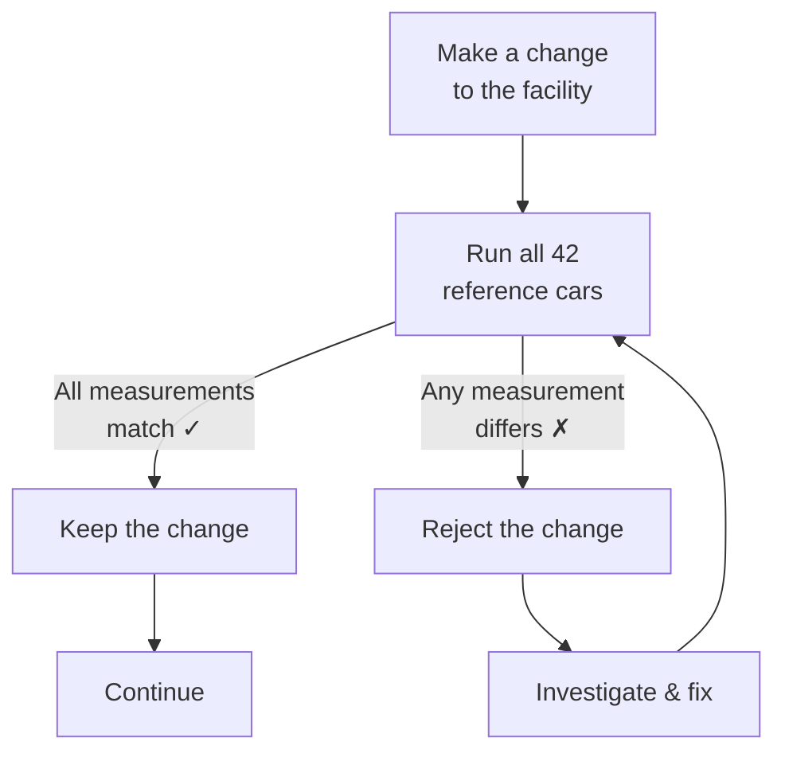
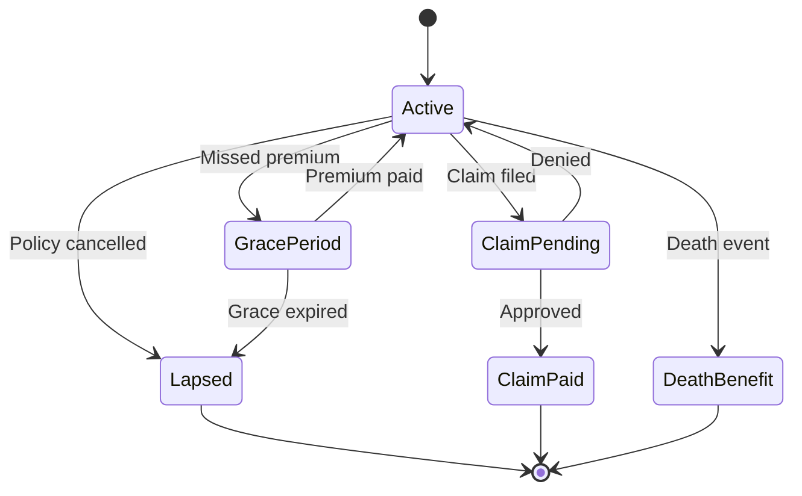

# Key Decisions — Designing the Highway

## Overview

Building a thousand-lane highway is not just a matter of laying asphalt. Every design choice — where to put the on-ramp, how to shape the lanes, what the cars look like — affects how fast and how reliably the system performs. This document records the decisions that shaped the project and the reasoning behind each one.

## Decision 1: Build a New Track Instead of Modifying the Original

The ACTUS standard already has a certified test track — the Java reference implementation. I could have tried to widen that existing track into a highway. Instead, I built from scratch.

**Why:** The original track was designed for one car at a time. Its internal layout — how cars are stored, how checkpoints are organised, how measurements are recorded — is optimised for clarity and human readability, not for highway throughput.

A highway requires cars to be stripped down to compact, uniform shapes. Retrofitting the original track to support both its natural car format and the highway format would have been like trying to turn a scenic mountain road into a motorway without closing it — possible in theory, but slower and riskier than building a new road alongside it.

The risk of building new — that my track might produce different measurements — was managed by the 42 reference cars. As long as every reference car produces identical results on both tracks, the new one is certified.

## Decision 2: Strip Down the Cars for the Highway

This was the most impactful design choice. (See [Understanding CPU and GPU](./cpu-vs-gpu-explained.md) for the full explanation.)

Contracts in their natural form carry rich, human-friendly descriptions: text labels like "Annual" for payment frequency, date objects, nested lists of events, and optional fields. On the 8-track facility (CPU), this is fine — each track is powerful enough to handle the complexity.

The highway (GPU) cannot work with this kind of data. Its lanes are simple and uniform. Every car must be the same shape, the same size, with no loose parts.

I built a translation layer — an automated preparation station at the on-ramp — that converts every contract into the most compact possible form:

This means the engine works with contracts in their natural, readable form for everything except highway execution. The stripping happens automatically and transparently.

## Decision 3: One Car Per Lane

How should work be divided across the highway? There were two options:

**Option A: Split each car's test across multiple lanes.** A single car's checkpoints are spread across several lanes, running in parallel. This sounds efficient but creates a problem: checkpoint 5 depends on the result of checkpoint 4, which depends on checkpoint 3. The lanes would constantly need to wait for each other.

**Option B: One car per lane.** Each lane handles one car, running all its checkpoints sequentially from start to finish. The car goes through checkpoint 1, then 2, then 3, in order — as it must, because each checkpoint depends on the state left by the previous one.

I chose **Option B**. The parallelism comes not from splitting one car's work, but from running **thousands of cars simultaneously**, each in its own lane. Since cars are completely independent of each other, there is no waiting, no coordination, no bottleneck between lanes.

For Monte Carlo scenarios, the parallelism becomes two-dimensional: each combination of (car, road condition) gets its own lane. For 10,000 cars under 1,000 scenarios, that is 10 million independent lanes — exactly what the highway was designed for.

## Decision 4: The Highway Runs on Any Road Surface

GPU hardware comes from different manufacturers — NVIDIA, AMD, Intel — and each has its own highway specification. Some facilities do not have a highway at all.

I chose a construction method that builds the same highway design on whatever surface is available:

| Surface Available | What Happens |
|---|---|
| NVIDIA GPU | Highway is built using NVIDIA's highest-performance specification |
| AMD or Intel GPU | Highway is built using a cross-platform specification |
| No GPU at all | Highway is simulated on the 8-track facility (slower, but works) |

This means the software runs everywhere. A developer can test on a laptop without a GPU. A production server can use a high-end NVIDIA card for maximum speed. The measurements are identical regardless of which surface the highway is built on.

## Decision 5: Every Car Must Produce the Same Results, Every Time

In car testing, if you run the same car under the same conditions twice and get different measurements, your track is unreliable. In financial computation, this property is called **determinism** and it is non-negotiable.

Regulators, auditors, and risk managers need to reproduce results exactly. If a risk report says the portfolio's worst-case loss is €2.3 million, that number must be the same whether you run the calculation on Monday or Friday, on a laptop or a server, on a CPU or a GPU.

I enforced determinism everywhere:

- Scenario generators use a fixed starting seed, so the "random" road conditions are actually perfectly reproducible
- The same contract under the same conditions produces the same cash flows on the single track, the 8-track facility, and the highway
- There is no source of variation anywhere in the pipeline — same inputs, same outputs, always

## Decision 6: Re-Certify After Every Change

Many construction projects do a final safety inspection at the end. I inspected at every stage.

After every change — every track modification, every on-ramp optimisation, every lane adjustment — all 42 reference cars were re-run and their measurements compared to the certified values. If even one measurement drifted by more than a billionth, the change was rejected.

This means the facility was never in an incorrect state. Every version, from the first to the last, passes all tests.

## Decision 7: Insurance Products Are Templates, Not Hard-Wired

Insurance car models behave differently from banking car models. A loan follows a fixed route; an insurance policy can take different turns at each intersection. The rules governing these turns — premium calculations, claim eligibility, benefit formulas — vary by product.

Hard-wiring these rules into the highway would mean rebuilding a section of highway every time a new insurance product is launched.

Instead, I made insurance rules into **configurable templates**:

| Who | Does What |
|---|---|
| **Highway engineers** | Build and maintain the highway — the lanes, the on-ramp, the sinks |
| **Product designers / actuaries** | Write the templates — premium formulas, claim rules, benefit calculations |
| **Data teams** | Provide the statistical tables — mortality rates, lapse rates, disability rates |

A new insurance product is launched by writing a new template. The highway does not change.

## Decision 8: Insurance Vehicles Use a State Map

Banking cars follow a pre-programmed route: start → periodic checkpoints → destination. Every turn is known in advance.

Insurance vehicles need a **state map** — a diagram of all the places the car might be (Active, Grace Period, Claim Pending, Lapsed, Terminated) and the probabilities of moving from one place to another at each intersection.

The probabilities come from actuarial tables — the same tables insurers use to set premiums. At each checkpoint, the highway looks up the probability of each transition and computes the expected cash flow as a weighted average across all possible paths.

This approach is mathematically precise, widely used in actuarial science, and works naturally on the highway — the table lookups are fast, uniform operations that the GPU lanes handle efficiently.
