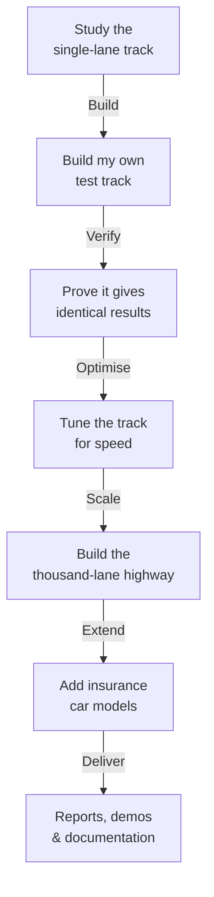

# The Hackathon Story

## How It Started

In late 2025, I was introduced to the ACTUS standard — Algorithmic Contract Types Unified Standards — by Francis Gross and Willi Brammertz. I had never worked with ACTUS before, and concepts like Monte Carlo simulation, financial contract projections, and deterministic cash flow modelling were entirely new to me. What I did bring was deep experience in the insurance domain, where I had seen the same fundamental challenge play out over and over: the need for both **accuracy** and **speed** when evaluating large portfolios.

When I learned about the **ACTUS Algorithmic Financial Contracts Use Case Competition**, I saw a chance to prove that this challenge could be solved — not just in theory, but with a working system.

I started in December 2025. The competition deadline was March 16, 2026. This is the story of what I built.

We started with nothing. No codebase, no framework, no prior experience with ACTUS — just a blank slate and a deadline. Every line of code, every architecture decision, every interface and integration was built from scratch over the course of the competition. Even this documentation site — the one you're reading right now — was conceived, designed, and written entirely within the hackathon window. From December 2025 to March 16, 2026, everything you see here was created for this competition and this competition alone.

> A note on the Technical Concepts
>
> Before going deeper, it is worth acknowledging something important.
>
>The implementation behind this project involves concepts such as CPU parallelism, GPU computing, vectorization, and large-scale simulation pipelines. These are common topics in high-performance computing, but they are not concepts everyone works with daily — especially in finance, insurance, or business roles where the focus is usually on models, contracts, and outcomes rather than hardware execution strategies.
>
>Because of that, I will not explain the system purely in technical terms.
>
> Instead, I will use an analogy to explain both the reasoning and the architecture behind the implementation. The analogy is intentionally simple, but it maps directly to how the system actually works. If you understand the analogy, you will understand the design decisions that made the system fast.
>
> For readers who are interested in the deeper technical details — GPUs, thread blocks, memory layouts, and simulation kernels — those will be explained later as well. But first, the analogy.

## Imagine a Car Factory

You run a car factory. You have built 100,000 different car models and you need to know how every single one of them performs — on dry roads, wet roads, icy roads, in extreme heat, in extreme cold, uphill, downhill, fully loaded, and empty. Each combination of car and road condition is a test run that produces data: fuel consumption, brake wear, tyre grip, engine temperature, and dozens more measurements.

That is exactly the problem financial institutions face. Each "car" is a financial contract — a loan, a deposit, a bond, an insurance policy. Each "road condition" is a possible future — different interest rates, different economic climates. Each "test run" projects the contract's cash flows under that future and produces risk metrics. To understand the risk in a portfolio, you need to test every contract under every scenario.

With 100,000 contracts and 1,000 scenarios, that is **100 million test runs**.

If you have one test track and run them one by one, it takes hours. This project was about building a **thousand-lane highway** that runs them all at the same time — and proving that every car still produces exactly the same test results as it would on the original single track.

## What is ACTUS?

ACTUS (Algorithmic Contract Types Unified Standards) is the rulebook for the test track. It defines, in precise mathematical terms, how every type of financial contract behaves: when payments occur, how interest accrues, what happens at maturity, and how the contract responds to changing market conditions.

The critical property of ACTUS is **determinism**: given the same contract and the same market data, the rules always produce exactly the same cash flows. No interpretation, no ambiguity. This is what regulators, auditors, and risk managers need — numbers they can trust and independently verify.

The ACTUS standard already had a reference implementation — a working single-lane test track written in Java. It is correct and well-tested. But it processes one contract at a time. For institutional-scale portfolios, it is simply too slow.

## What I Built

Working largely on my own, with a little help from one other person, I followed a disciplined sequence — like upgrading a test facility one step at a time, verifying that test results stay identical at every stage:

The result:

| In the Car Factory | In the Financial World |
|---|---|
| 42 reference cars tested on both tracks — identical results to 10 decimal places | All 42 official ACTUS test cases pass on both the CPU and GPU engines |
| The highway handles 100,000 cars simultaneously, over 2× faster than the 8-track facility | GPU evaluates 100,000 life insurance policies in 273 ms vs. 735 ms on CPU (2.7× faster) |
| Cars stay on the highway and loop through 1,000 road conditions without re-entering | Monte Carlo: 10,000 contracts × 10,000 scenarios in 28 seconds (5× faster than CPU) |
| New car types added — insurance vehicles with different test programmes | Life insurance contracts with state transitions and actuarial tables |
| Highway sinks aggregate measurements before sending them off the highway | Risk metrics computed on the GPU before transfer — no off-ramp congestion |
| Full reporting: results by car type, by road condition, by factory division | Excel-friendly exports grouped by segment, region, product line |

## Why Insurance?

My background is in the insurance industry. I came to this project not from the banking or finance side, but from having seen first-hand how insurers struggle with the same problems ACTUS was designed to solve — just in a different product domain. Accuracy is non-negotiable (regulators demand it), but so is speed (actuaries need answers in seconds, not hours).

ACTUS gave me a rigorous, deterministic framework that could handle financial contracts. The question I wanted to answer was: can this framework be extended to insurance, and can it be made fast enough for real institutional use? The hackathon gave me the deadline and the motivation to find out.

## The Guiding Rule

Throughout the entire project, one rule was never broken: **every car must produce the same test results on the highway as it does on the original single track.** If any optimisation changed even one measurement by more than a billionth, it was rejected.

This is what makes the system trustworthy. It is not just fast — it is provably correct.

## Continue Reading

Start with the car factory story — it explains everything else:

1. [Understanding CPU and GPU](./cpu-vs-gpu-explained.md) — the full car factory analogy: single track, eight tracks, the highway, the on-ramp bottleneck, staying on the highway, sinks on the off-ramp
2. [Development Timeline](./timeline.md) — how the facility was built, phase by phase
3. [Key Decisions](./decisions.md) — why I built a new track, how I designed the highway, and other critical choices
4. [Challenges & Solutions](./challenges.md) — the problems I ran into and how I solved them
5. [Outcomes & Benchmarks](./results.md) — the test results: how fast, how correct, and what it means
6. [Installation & Getting Started](./installation.md) — how to install and run the system: Docker demo, CLI tool, developer build, and documentation site
