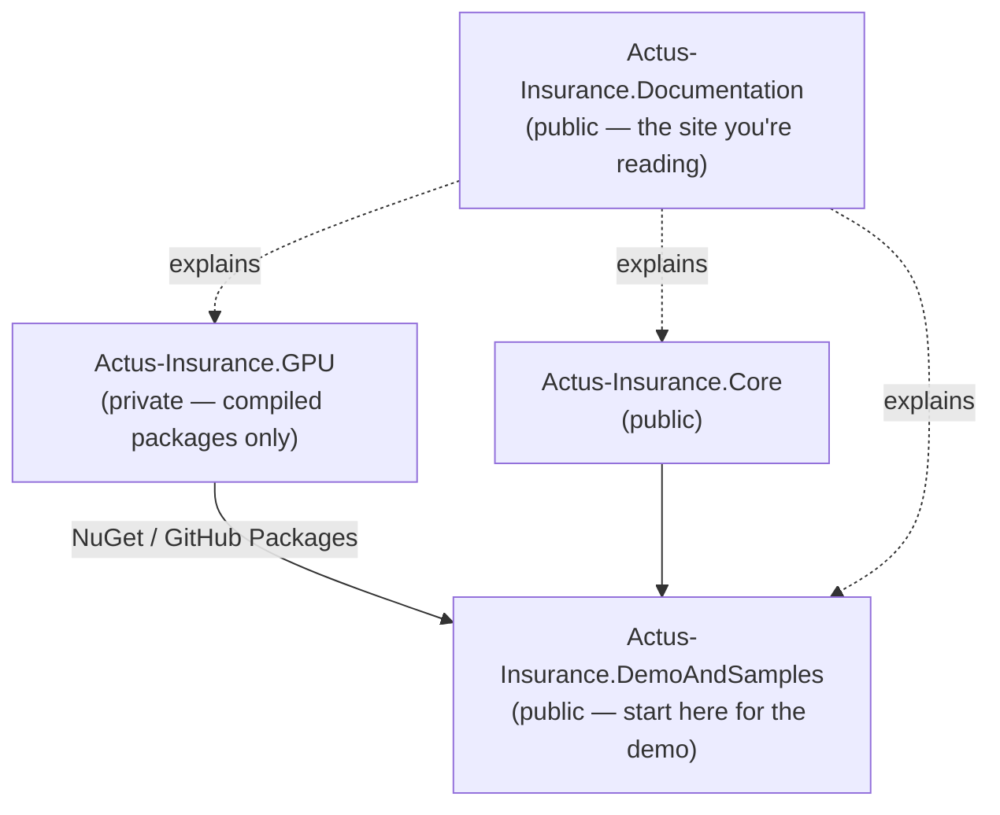

# Installation & Getting Started

## Overview

The ACTUS Insurance extension is delivered across four repositories. You do not need all of them — which ones you need depends on what you want to do.

| Goal | What to use | Time |
|---|---|---|
| See the demo UI running | Docker Compose — DemoAndSamples | ~5 min |
| Run the CLI projection tool | CLI inside DemoAndSamples | ~10 min |
| Build and test the Core engine | Actus-Insurance.Core | ~10 min |
| Run the docs site locally | Actus-Insurance.Documentation | ~5 min |
| Use GPU packages in your own project | NuGet from GitHub Packages | See below |



The GPU component is the only proprietary piece. It ships as compiled packages, so you can build and run everything else without access to the GPU source.

---

## Prerequisites

### For the Docker demo (recommended starting point)

- [Docker Desktop](https://www.docker.com/products/docker-desktop/) (Windows, macOS, or Linux)
- Docker Compose (included with Docker Desktop)
- Git

> **Windows note:** Docker Desktop requires WSL 2 on Windows. During installation, Docker Desktop will prompt you to enable it if it is not already active.

### For building the Core engine

- [.NET 9 SDK](https://dotnet.microsoft.com/download/dotnet/9.0)
- Git

### For GPU acceleration (optional)

> **TODO:** Document the specific GPU driver requirements (NVIDIA CUDA version, AMD ROCm version, or Intel OpenCL version) needed for GPU execution. Without a compatible GPU, the system automatically falls back to CPU execution — so GPU is optional for evaluation purposes.

### For the documentation site

- [Node.js 18+](https://nodejs.org/) and npm (or yarn / pnpm / bun)
- Git

---

## Option A — Quick Start: Docker Demo

This is the fastest way to see the full system running. The Docker Compose setup starts the .NET backend API (port 8080) and the Next.js frontend (port 3000) together with a single command.

### 1. Clone the repository

```bash
git clone https://github.com/FransVanEk/Actus-Insurance.DemoAndSamples.git
cd Actus-Insurance.DemoAndSamples
```

### 2. Configure the environment

Copy or review the `.env` file in the repository root. The key variables are:

| Variable | Default | Description |
|---|---|---|
| `API_PORT` | `8080` | Port for the backend API |
| `FRONTEND_PORT` | `3000` | Port for the frontend |
| `PREFER_GPU` | `false` | Set to `true` to enable GPU acceleration |
| `API_KEY` | — | Authentication key for API access |

> **TODO:** Document the default value for `API_KEY` and whether it must be set before first run, or whether a development default is already present in the `.env` file.

To use the default configuration, no changes are needed. To enable GPU execution, set `PREFER_GPU=true` — but see the GPU prerequisites above first.

### 3. Start the services

```bash
docker-compose up -d --build
```

The `--build` flag ensures Docker builds the images from source. On first run this takes a few minutes. Subsequent starts are faster.

To watch the startup logs:

```bash
docker-compose logs -f
```

### 4. Access the applications

Once the containers are running:

| Service | URL | Description |
|---|---|---|
| Frontend (ACTUS Designer) | http://localhost:3000 | Dashboard, contract management, risk visualisation |
| Backend API | http://localhost:8080 | REST API for calculations and data |
| API documentation | http://localhost:8080/swagger | Interactive Swagger UI |

### 5. Stop the services

```bash
docker-compose down
```

### Development mode

For development with live reload and overrides:

```bash
docker-compose -f docker-compose.yml -f docker-compose.override.yml up -d
```

> **TODO:** Document what the `docker-compose.override.yml` changes relative to the production compose file (e.g. volume mounts, hot reload, debug ports).

---

## Option B — CLI Tool: Portfolio Projection

The `PamMonteCarlo50Y` CLI tool runs the full evaluation pipeline from the command line — no UI required. It is the best way to exercise the GPU/CPU engine and see benchmark results directly.

### Location

The CLI tool is located inside the DemoAndSamples repository:

```
Actus-Insurance.DemoAndSamples/
└── CLI/
    └── PamMonteCarlo50Y/
```

> **TODO:** Confirm whether the CLI tool is built and available as a standalone binary inside the Docker image, or whether it must be built separately with `dotnet build`. Document the exact path and how to invoke it (e.g. `dotnet run`, `dotnet publish`, or a pre-built executable).

### Prerequisites for CLI

The CLI requires access to the GPU packages from GitHub Packages. Before building, you must configure NuGet authentication:

> **TODO:** Document the exact steps to authenticate against GitHub Packages to restore the GPU NuGet dependency. Specifically:
> - Whether a GitHub Personal Access Token (PAT) with `read:packages` scope is needed
> - How to configure the `nuget.config` with the token (environment variable, `dotnet nuget add source`, or direct edit)
> - Whether the packages are available publicly or require organisation membership

A typical `nuget.config` setup for GitHub Packages looks like:

```xml
<?xml version="1.0" encoding="utf-8"?>
<configuration>
  <packageSources>
    <add key="github" value="https://nuget.pkg.github.com/FransVanEk/index.json" />
  </packageSources>
  <packageSourceCredentials>
    <github>
      <add key="Username" value="YOUR_GITHUB_USERNAME" />
      <add key="ClearTextPassword" value="YOUR_GITHUB_PAT" />
    </github>
  </packageSourceCredentials>
</configuration>
```

> **TODO:** Confirm whether the `nuget.config` in the repository already contains the correct source URL and only needs credentials filled in, or whether additional configuration is required.

### Running the CLI

**Synthetic mode** — generate a random portfolio and run the full Monte Carlo pipeline:

```bash
PamMonteCarlo50Y --backend gpu --contracts 10000 --scenarios 1000 --months 600 --seed 42
```

**Input-directory mode** — load an existing portfolio from files:

```bash
PamMonteCarlo50Y --backend gpu --input ./samples/input --out ./results
```

**CPU-only mode** (no GPU required):

```bash
PamMonteCarlo50Y --backend cpu --contracts 10000 --scenarios 100
```

**Compare CPU and GPU** (runs both and reports timings):

```bash
PamMonteCarlo50Y --backend both --contracts 10000 --scenarios 100
```

### Key CLI options

| Option | Description | Default |
|---|---|---|
| `--backend` | `cpu`, `gpu`, or `both` | `both` |
| `--contracts` | Number of synthetic contracts to generate | `1000` |
| `--scenarios` | Number of Monte Carlo scenarios | `100` |
| `--months` | Projection horizon in months (600 = 50 years) | `600` |
| `--seed` | Random seed for reproducibility | `42` |
| `--input` | Input directory for pre-built portfolio | — |
| `--out` | Output directory for results | `./out` |
| `--reporting` | Enable detailed CSV reporting exports | `false` |
| `--export-fact` | Export long-format fact table | `false` |
| `--export-portfolio` | Export generated portfolio to CSV | `false` |
| `--metadata` | Path to contract metadata CSV for joined reporting | — |

### Example: benchmarking CPU vs GPU

```bash
PamMonteCarlo50Y --backend both --contracts 100000 --scenarios 1000 --seed 42
```

This runs 100 million projections on both backends and prints timing results. Expected outcome on a modern workstation: GPU approximately 2× faster than CPU for this workload.

### Expected output files

When `--reporting true` is set, the output directory contains:

| File | Content |
|---|---|
| `{runId}_portfolio_by_scenario.csv` | Portfolio present value per scenario |
| `{runId}_contract_summary.csv` | Per-contract statistics: Mean, StdDev, P05–P95, ES95, ES99 |
| `{runId}_fact_results_long.csv` | Long-format fact table (when `--export-fact true`) |
| `runs.csv` | Run dimension table with metadata |

These files are designed to open directly in Excel or be imported into BI tools.

### Input directory structure

When using `--input`, the directory must follow this layout:

```
input_dir/
├── portfolio.csv                    — Contract terms in CSV format
├── scenarios/
│   ├── scenario_set.json            — Scenario metadata
│   └── riskfactors/
│       ├── interest_rate_prior.csv  — Historical rates (before calcDateIndex)
│       └── interest_rate_after.csv  — Forward rates (scenario-specific)
├── runs.json                        — (optional) Multi-run definitions
└── contract_metadata.csv            — (optional) Extra contract attributes for reporting
```

> **TODO:** Link to or include a sample `portfolio.csv` and `scenario_set.json` so a first-time user can see the expected format without building synthetic data first. The `samples/` directory in the repository may already contain these.

---

## Option C — Developer Build: Core Engine

Use this if you want to read, modify, or extend the core C# engine — the PAM contract implementation, conventions, state machine, or actuarial components.

### 1. Clone the repository

```bash
git clone https://github.com/FransVanEk/Actus-Insurance.Core.git
cd Actus-Insurance.Core
```

### 2. Restore and build

```bash
dotnet restore
dotnet build
```

The solution contains three projects:

| Project | Description |
|---|---|
| `ActusInsurance.Core` | Shared abstractions: interfaces, conventions, domain models, risk factors |
| `ActusInsurance.Core.CPU` | PAM contract implementation: schedule generation and event evaluation |
| `ActusInsurance.Tests.CPU` | 42 reference test cases from the official ACTUS test suite |

### 3. Run the tests

```bash
dotnet test
```

All 42 official ACTUS reference test cases should pass. These validate every event type, financial convention, and edge case against known-correct results to 10 decimal places.

```
Test run summary:
  Passed: 42
  Failed: 0
```

> **TODO:** Confirm the exact output format from `dotnet test` and whether there are any expected skipped or pending tests in the current state of the repository.

### 4. Explore the project structure

```
src/
├── ActusInsurance.Core/           # Pure C# — no external dependencies
│   ├── Contracts/                 # IContractScheduler interface
│   ├── Conventions/               # Day count, business day, EOM, calendars
│   ├── Events/                    # ContractEvent: Evaluate, ComputePayoff, UpdateState
│   ├── Models/                    # PamContractTerms (40+ fields)
│   ├── States/                    # StateSpace value struct
│   ├── Time/                      # ScheduleFactory, cycle arithmetic
│   └── Types/                     # Enums: EventType, ContractRole, etc.
├── ActusInsurance.Core.CPU/
│   └── Contracts/PAM.cs           # PrincipalAtMaturity: Schedule + Apply
└── ActusInsurance.Tests.CPU/
    ├── PamTests.cs                # 42 test cases
    └── Resources/
        └── actus-tests-pam.json   # Test data: terms, market data, expected results
```

### 5. Making changes

The Core library has no external dependencies — it is pure C#. Changes to conventions, event logic, or contract terms do not require any package authentication. Run `dotnet test` after every change to verify correctness.

If you are extending the insurance components (Markov model, DSL, actuarial tables), those live in a separate layer on top of Core — see the [Actus-Insurance.Core documentation](https://actus-insurance-documentation.vercel.app/) for the architecture.

---

## Option D — Documentation Site (Local)

Run the documentation website locally to preview documentation changes before publishing.

### 1. Clone the repository

```bash
git clone https://github.com/FransVanEk/Actus-Insurance.Documentation.git
cd Actus-Insurance.Documentation
```

### 2. Install dependencies

```bash
npm install
```

### 3. Start the development server

```bash
npm run dev
```

The site is available at [http://localhost:3000](http://localhost:3000). Changes to files in `docs/` are reflected immediately without restarting.

### 4. Build for production

```bash
npm run build
npm run start
```

> **TODO:** Confirm whether there are any environment variables required to run the documentation site locally (e.g. for the resource list components or video embeds). If the site runs without any configuration, this section can be removed.

---

## Using the GPU Packages in Your Own Project

The GPU component (`Actus-Insurance.GPU`) is private and is not available as open source. It is published as compiled NuGet packages to GitHub Packages, which you can consume in your own .NET solution.

### Step 1 — Request access

> **TODO:** Document how a developer requests access to the GPU packages. Options might include:
> - Contacting Frans Van Ek directly via GitHub or LinkedIn
> - Being added as a collaborator to the private repository
> - Whether the packages are accessible to anyone with a GitHub account, or only to invited collaborators

### Step 2 — Configure NuGet

Add the GitHub Packages source to your project's `nuget.config`:

```xml
<?xml version="1.0" encoding="utf-8"?>
<configuration>
  <packageSources>
    <add key="nuget.org" value="https://api.nuget.org/v3/index.json" />
    <add key="actus-gpu" value="https://nuget.pkg.github.com/FransVanEk/index.json" />
  </packageSources>
  <packageSourceCredentials>
    <actus-gpu>
      <add key="Username" value="YOUR_GITHUB_USERNAME" />
      <add key="ClearTextPassword" value="YOUR_GITHUB_PAT" />
    </actus-gpu>
  </packageSourceCredentials>
</configuration>
```

Create a GitHub Personal Access Token (PAT) with the `read:packages` scope at [github.com/settings/tokens](https://github.com/settings/tokens) and replace `YOUR_GITHUB_PAT` with it.

> **Tip:** Store the token as an environment variable and reference it from `nuget.config` using `%VARIABLE_NAME%` (Windows) or `$VARIABLE_NAME` (Linux/macOS) rather than putting it in the file directly.

### Step 3 — Add the package reference

> **TODO:** Document the exact package name(s) and recommended version to reference. For example:
>
> ```xml
> <PackageReference Include="ActusInsurance.GPU" Version="x.x.x" />
> ```

### Step 4 — Reference the Core library

The GPU package depends on `Actus-Insurance.Core`. Add a reference to the Core project or its NuGet package:

> **TODO:** Confirm whether `Actus-Insurance.Core` is also published as a NuGet package (in addition to being available as source), and if so, provide the package name and source.

---

## Troubleshooting

### Docker: containers fail to start

Check the logs for the specific container that failed:

```bash
docker-compose logs backend
docker-compose logs frontend
```

Common causes:
- Port 3000 or 8080 already in use by another process — change `API_PORT` or `FRONTEND_PORT` in `.env`
- Docker Desktop not running — start Docker Desktop first
- WSL 2 not enabled (Windows) — Docker Desktop will prompt to enable it

### dotnet restore fails with authentication error

This happens when the NuGet source for GitHub Packages is not configured or the token is missing. See the "Using the GPU Packages" section above for configuration steps.

If you are building only `Actus-Insurance.Core` (without the GPU dependency), no GitHub Packages authentication is needed — the Core library has no external dependencies.

### Tests fail with locale-related number formatting errors

If test results show wildly incorrect values (interest rates of 525% instead of 5.25%), the system may be reading decimal numbers using the locale of the operating system rather than the fixed locale-independent format the engine enforces. This was an early challenge in the project and is described in detail in [Roadblocks](./challenges.md#roadblock-1-the-comma-vs-period-crash).

Make sure you are running the latest version of the repository — this issue was resolved by enforcing invariant culture parsing throughout the engine.

### GPU not detected / falling back to CPU

If `PREFER_GPU=true` is set but the system falls back to CPU, the most likely causes are:
- No compatible GPU is present in the machine
- GPU drivers are not installed or are outdated
- The ILGPU framework used by the engine does not support the GPU model

The system is designed to fall back to CPU automatically — this is not an error condition, just a performance difference. See [GPU vs CPU](../background-gpu/gpu-vs-cpu.md) for guidance on when GPU acceleration is worthwhile.

> **TODO:** Document the minimum supported GPU driver versions for NVIDIA, AMD, and Intel. Also document how to confirm which backend is actually being used at runtime (log output, environment variable, or CLI flag).

---

## What to Read Next

- [Code Resources](./code-resources.md) — description of all four repositories and how they fit together
- [CLI Tool Reference](../technical/demos-and-samples/cli-tool/index.md) — full CLI option reference and pipeline explanation
- [Core Engine Overview](../technical/core-engine/index.md) — architecture of the C# engine
- [GPU Acceleration](../technical/gpu-acceleration/index.md) — how the GPU execution layer works
