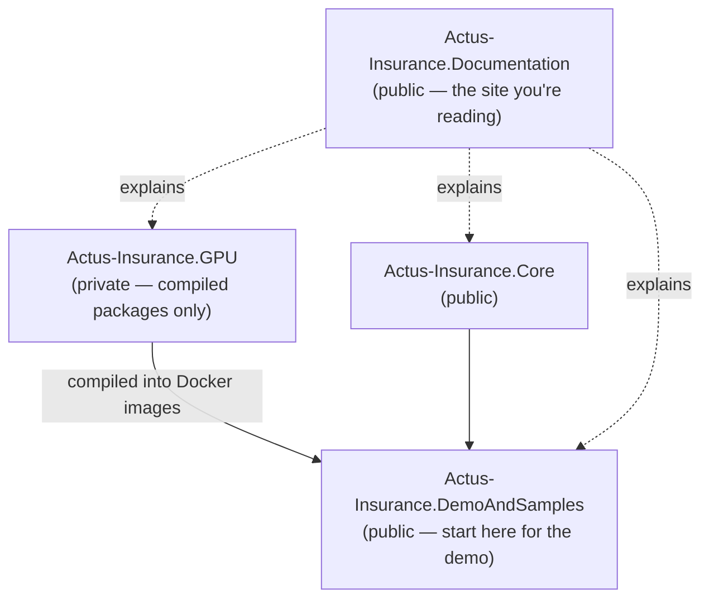

# Installation & Getting Started

## Overview

The ACTUS Insurance extension is delivered across four repositories. You do not need all of them — which ones you need depends on what you want to do.

| Goal | What to use | Time |
|---|---|---|
| Run pre-built images immediately | Pre-built Docker images from Docker Hub | ~2 min |
| See the demo UI running | Docker Compose — DemoAndSamples | ~5 min |
| Run PAM Monte Carlo analysis (containerised) | Pre-built `pam-monte-carlo` image | ~2 min |
| Run the CLI projection tool | CLI inside DemoAndSamples | ~10 min |
| Build and test the Core engine | Actus-Insurance.Core | ~10 min |
| Run the docs site locally | Actus-Insurance.Documentation | ~5 min |
| Use GPU acceleration in your own pipeline | Pre-built Docker images (GPU engine is proprietary) | ~2 min |



The GPU component is the only proprietary piece. It is **not publicly available** as source code or as a NuGet package. GPU acceleration is accessible exclusively through the pre-built Docker images on Docker Hub. All other components are open source and buildable without GPU access.

---

## Prerequisites

### For the Docker demo (recommended starting point)

- [Docker Desktop](https://www.docker.com/products/docker-desktop/) (Windows, macOS, or Linux)
- Docker Compose (included with Docker Desktop)
- Git

> **Windows note:** Docker Desktop requires WSL 2 on Windows. During installation, Docker Desktop will prompt you to enable it if it is not already active.

### For building the Core engine

- [.NET 9 SDK](https://dotnet.microsoft.com/download/dotnet/9.0)
- Git

### For GPU acceleration (optional)

GPU acceleration is entirely optional. Without a compatible GPU the engine falls back to CPU automatically — no configuration change is needed.

If you do want GPU execution inside Docker, the requirements depend on your GPU vendor:

| Vendor | Technology | Minimum driver | Extra software |
|---|---|---|---|
| NVIDIA | CUDA | 450+ (CUDA 11), 525+ recommended (CUDA 12) | [NVIDIA Container Toolkit](https://docs.nvidia.com/datacenter/cloud-native/container-toolkit/install-guide.html) |
| AMD | ROCm / OpenCL | ROCm 5.4+ | ROCm drivers (Linux only) |
| Intel | OpenCL | Latest Intel GPU drivers | Intel compute-runtime / OpenCL ICD |

See the [GPU Access for Docker Containers](#gpu-access-for-docker-containers) section below for step-by-step setup instructions.

### For the documentation site

- [Node.js 18+](https://nodejs.org/) and npm (or yarn / pnpm / bun)
- Git

---

## GPU Access for Docker Containers

By default, Docker containers are **completely isolated from the host's GPU**. Even if your machine has an NVIDIA GPU with drivers installed, a container cannot use it unless you explicitly configure both the host and the `docker run` command to allow access. This section explains exactly what needs to be set up, step by step.

The engine uses [ILGPU](https://ilgpu.net/) for GPU acceleration. ILGPU supports three backends — NVIDIA CUDA, AMD ROCm/OpenCL, and Intel OpenCL. If no compatible device is found inside the container, ILGPU falls back transparently to `CPUAccelerator`, which runs the same GPU kernel code on CPU threads. **GPU setup is always optional**: the containers run correctly without it.

### Platform support at a glance

| Platform | NVIDIA (CUDA) | AMD (ROCm) | Intel (OpenCL) |
|---|---|---|---|
| Linux | ✅ Full support | ✅ Full support | ✅ Full support |
| Windows (Docker Desktop + WSL 2) | ✅ Full support | ❌ Not supported | ⚠️ Limited |
| macOS (Apple Silicon or Intel) | ❌ Not supported | ❌ Not supported | ❌ Not supported |

> macOS does not expose GPU hardware to Docker containers. The engine always runs on `CPUAccelerator` on macOS regardless of flags — this is a platform limitation, not a bug.

---

### NVIDIA GPU (CUDA) — step by step

NVIDIA has the best Docker GPU support and is the recommended path. There are three layers that must all be in place before a container can use the GPU:

```
[Your NVIDIA GPU]
      ↓  host driver (nvidia-smi must work)
[NVIDIA Container Toolkit]
      ↓  bridges host driver into Docker
[Docker + --gpus all flag]
      ↓  exposes GPU inside the container
[ILGPU inside the container]
      ↓  picks up the CUDA device automatically
[Engine runs on GPU]
```

If any layer is missing, the engine falls back to CPU without an error.

#### Step 1 — Install and verify the host driver

```bash
nvidia-smi
```

Expected output (example):

```
+-----------------------------------------------------------------------------------------+
| NVIDIA-SMI 537.13    Driver Version: 537.13    CUDA Version: 12.2                      |
|-----------------------------------------+------------------------+---------------------+
|   0  NVIDIA GeForce RTX 3060 Ti   WDDM |   1068MiB /  8192MiB  |      0%      Default |
+-----------------------------------------------------------------------------------------+
```

**Minimum driver versions:**

| CUDA version | Minimum NVIDIA driver |
|---|---|
| CUDA 11.0 | ≥ 450.80 |
| CUDA 12.0 | ≥ 525.85 ← recommended |
| CUDA 12.2 | ≥ 535.54 |

The engine has been tested on an RTX 3060 Ti with driver 537.13 (CUDA 12.2) on Windows. Driver ≥ 525 is recommended. If `nvidia-smi` is not found, install the NVIDIA driver before continuing:
- **Windows:** [nvidia.com/Download](https://www.nvidia.com/Download/index.aspx)
- **Ubuntu/Debian:** `sudo apt-get install -y nvidia-driver-535`

#### Step 2 — Install the NVIDIA Container Toolkit (Linux only)

On Linux, the **NVIDIA Container Toolkit** is the bridge that makes the host GPU available inside containers. Without it, `--gpus all` has no effect.

**Ubuntu / Debian:**

```bash
# Add the NVIDIA Container Toolkit repository
curl -fsSL https://nvidia.github.io/libnvidia-container/gpgkey \
  | sudo gpg --dearmor -o /usr/share/keyrings/nvidia-container-toolkit-keyring.gpg

curl -s -L https://nvidia.github.io/libnvidia-container/stable/deb/nvidia-container-toolkit.list \
  | sed 's#deb https://#deb [signed-by=/usr/share/keyrings/nvidia-container-toolkit-keyring.gpg] https://#g' \
  | sudo tee /etc/apt/sources.list.d/nvidia-container-toolkit.list

sudo apt-get update && sudo apt-get install -y nvidia-container-toolkit

# Register the NVIDIA runtime with Docker
sudo nvidia-ctk runtime configure --runtime=docker

# Restart Docker to apply the change
sudo systemctl restart docker
```

Verify the toolkit is working:

```bash
docker run --gpus all --rm ubuntu nvidia-smi
```

If this prints your GPU details, the toolkit is installed correctly.

**Windows (Docker Desktop + WSL 2):**

The NVIDIA Container Toolkit is **not needed** on Windows. Docker Desktop handles GPU passthrough automatically through WSL 2. You only need to:
1. Install the [NVIDIA driver for Windows](https://www.nvidia.com/Download/index.aspx) on the host — do **not** install a separate driver inside WSL
2. Enable WSL 2 backend in Docker Desktop (Settings → General → "Use the WSL 2 based engine")
3. Verify the GPU is visible inside WSL: `wsl nvidia-smi`

#### Step 3 — Pass the GPU into the container with `--gpus all`

This is the flag that connects the host GPU to the running container. **Without it, the container has no GPU access** even if all other setup is correct.

```bash
# Linux / macOS
docker run --gpus all --rm \
  -v $(pwd)/out-gpu:/app/out \
  neobluetechlabs/pam-monte-carlo:latest \
  --backend gpu

# Windows (PowerShell)
docker run --gpus all --rm `
  -v c:/temp/actus-docker/output:/app/out `
  neobluetechlabs/pam-monte-carlo:latest `
  --backend gpu
```

On a multi-GPU machine, target a specific GPU by index:

```bash
# Use only GPU 0
docker run --gpus '"device=0"' --rm \
  -v $(pwd)/out-gpu:/app/out \
  neobluetechlabs/pam-monte-carlo:latest --backend gpu
```

#### Step 4 — Confirm the GPU is being used

Watch the container's startup log. The `accelerator=` value tells you exactly which backend ILGPU selected:

```bash
docker run --gpus all --rm \
  -v $(pwd)/out:/app/out \
  neobluetechlabs/pam-monte-carlo:latest \
  --backend gpu --contracts 500 --scenarios 50
```

**GPU active** — look for `CudaAccelerator`:
```
[run0_gpu] PROVISIONING started  (accelerator=CudaAccelerator, device=NVIDIA GeForce RTX 3060 Ti, ...)
```

**Falling back to CPU** — look for `CPUAccelerator`:
```
[run0_gpu] PROVISIONING started  (accelerator=CPUAccelerator, ...)
```

`CPUAccelerator` means Docker could not see the GPU. The most common reason is a missing `--gpus all` flag.

The output summary file (`run0_gpu_summary.json`) also records the backend used:

```json
{
  "backend": "CudaAccelerator",
  "device": "NVIDIA GeForce RTX 3060 Ti",
  "contracts": 500,
  "scenarios": 50
}
```

---

### AMD GPU (ROCm / OpenCL) — Linux only

```bash
# Add your user to the required groups
sudo usermod -aG video,render $USER
# Log out and back in for the group to take effect

# Run with device passthrough (AMD does not use --gpus)
docker run --rm \
  --device /dev/kfd \
  --device /dev/dri \
  --group-add video \
  --group-add render \
  -v $(pwd)/out-gpu:/app/out \
  neobluetechlabs/pam-monte-carlo:latest \
  --backend gpu
```

Look for `OpenCLAccelerator` in the container log to confirm the GPU is active.

---

### Intel GPU (OpenCL)

```bash
# Ubuntu — install Intel compute-runtime
sudo apt-get install -y intel-opencl-icd
clinfo | grep "Device Name"   # verify OpenCL devices are visible

# Run with device passthrough
docker run --rm \
  --device /dev/dri \
  -v $(pwd)/out-gpu:/app/out \
  neobluetechlabs/pam-monte-carlo:latest \
  --backend gpu
```

---

### Docker Compose with GPU (NVIDIA)

Add a `deploy` block to any service that needs GPU access. Requires **Compose v2** (`docker compose`, not `docker-compose`):

```yaml
version: '3.8'
services:
  actus-insurance-api:
    image: neobluetechlabs/actus-insurance-api:latest
    ports:
      - "8080:8080"
    environment:
      - Calculation__PreferGpu=true
    deploy:
      resources:
        reservations:
          devices:
            - driver: nvidia
              count: 1
              capabilities: [gpu]

  monte-carlo:
    image: neobluetechlabs/pam-monte-carlo:latest
    command: ["--backend", "gpu", "--contracts", "5000", "--scenarios", "500"]
    volumes:
      - ./monte-carlo-output:/app/out
    deploy:
      resources:
        reservations:
          devices:
            - driver: nvidia
              count: 1
              capabilities: [gpu]
```

> **Compose v1 (`docker-compose`)** does not support `deploy.devices`. Use `docker run --gpus all` directly, or upgrade to Docker Desktop 4.x which ships Compose v2 by default. Check your version: `docker compose version`.

---

### Confirming the active backend

| Log line | Meaning |
|---|---|
| `accelerator=CudaAccelerator` | NVIDIA GPU active via CUDA |
| `accelerator=OpenCLAccelerator` | AMD or Intel GPU active via OpenCL |
| `accelerator=CPUAccelerator` | No GPU found — running on CPU threads |

Quick one-liner to check without a full analysis run:

```bash
# Linux
docker run --gpus all --rm neobluetechlabs/pam-monte-carlo:latest \
  --backend gpu --contracts 10 --scenarios 1 2>&1 | grep accelerator

# Windows (PowerShell)
docker run --gpus all --rm neobluetechlabs/pam-monte-carlo:latest `
  --backend gpu --contracts 10 --scenarios 1 2>&1 | Select-String "accelerator"
```

---

### GPU troubleshooting

**`unknown flag: --gpus`** — Docker Engine is older than 19.03. Run `docker --version` and upgrade.

**`could not select device driver "" with capabilities: [[gpu]]`** — The NVIDIA Container Toolkit is not installed or Docker was not restarted after installation:
```bash
sudo nvidia-ctk runtime configure --runtime=docker && sudo systemctl restart docker
```

**Log shows `CPUAccelerator` even though `--gpus all` was passed** — Verify end-to-end:
```bash
docker run --gpus all --rm ubuntu nvidia-smi
```
If this also fails, the toolkit is not configured correctly. Reinstall it and restart Docker.

**On Windows: container shows `CPUAccelerator` despite GPU working in WSL 2** — Go to Docker Desktop → Settings → General and confirm "Use the WSL 2 based engine" is enabled. Check Settings → Resources → WSL Integration and ensure your distro is listed. Restart Docker Desktop.

**AMD: `Permission denied` on `/dev/kfd` or `/dev/dri`** — Run `sudo usermod -aG video,render $USER`, log out, and log back in.

**macOS: engine always shows `CPUAccelerator`** — Expected. Docker on macOS does not expose the host GPU to containers. Run on a Linux or Windows host for real GPU execution.

---

## Option A — Pre-built Docker Images

Ready-to-use containerised applications are published to Docker Hub. Pull and run them directly without cloning any repository or building from source. This is the fastest way to get results.

### Available images

The following 5 images are published under the `neobluetechlabs` organisation on Docker Hub:

| Image | Description |
|---|---|
| `neobluetechlabs/actus-insurance-api:latest` | ACTUS Insurance REST API (FastEndpoints, port 8080) |
| `neobluetechlabs/actus-designer:latest` | ACTUS Designer UI — contract design and portfolio management (port 3000) |
| `neobluetechlabs/pam-monte-carlo:latest` | PAM Monte Carlo 50-Year Analysis CLI |
| `neobluetechlabs/scenario-calc-demo:latest` | Scenario Calculation Demo |
| `neobluetechlabs/actus-insurance-documentation:latest` | Documentation site |

All images support `linux/amd64` (Intel/AMD 64-bit) and `linux/arm64` (ARM 64-bit, including Apple Silicon). Docker automatically selects the correct variant for your system when pulling.

Pull all images at once:

```bash
docker pull neobluetechlabs/actus-insurance-api:latest
docker pull neobluetechlabs/actus-designer:latest
docker pull neobluetechlabs/pam-monte-carlo:latest
docker pull neobluetechlabs/scenario-calc-demo:latest
docker pull neobluetechlabs/actus-insurance-documentation:latest
```

---

### PAM Monte Carlo Analysis

#### 1. Pull the image

```bash
docker pull neobluetechlabs/pam-monte-carlo:latest
```

#### 2. Create an output directory

```bash
# Linux / macOS
mkdir -p out-monte-carlo

# Windows (PowerShell or Command Prompt)
mkdir c:\temp\actus-docker\output
```

#### 3. Run the analysis

```bash
# Linux / macOS
docker run --rm -v $(pwd)/out-monte-carlo:/app/out neobluetechlabs/pam-monte-carlo:latest

# Windows (PowerShell)
docker run --rm -v c:/temp/actus-docker/output:/app/out neobluetechlabs/pam-monte-carlo:latest
```

By default this runs both CPU and GPU backends with 10 000 contracts, 1 000 scenarios, and a 50-year (600-month) horizon.

#### Backend selection

```bash
# GPU only
docker run --gpus all --rm -v $(pwd)/out-monte-carlo:/app/out \
  neobluetechlabs/pam-monte-carlo:latest --backend gpu

# CPU only
docker run --rm -v $(pwd)/out-monte-carlo:/app/out \
  neobluetechlabs/pam-monte-carlo:latest --backend cpu

# Both (default)
docker run --gpus all --rm -v $(pwd)/out-monte-carlo:/app/out \
  neobluetechlabs/pam-monte-carlo:latest --backend both
```

#### Custom parameters

```bash
# Smaller test run
docker run --rm -v $(pwd)/out-monte-carlo:/app/out neobluetechlabs/pam-monte-carlo:latest \
  --backend cpu \
  --contracts 1000 \
  --scenarios 100 \
  --months 240

# Export portfolio for reuse
docker run --rm -v $(pwd)/out-monte-carlo:/app/out neobluetechlabs/pam-monte-carlo:latest \
  --backend cpu \
  --contracts 500 \
  --scenarios 200 \
  --export-portfolio true
```

#### Parameters reference

| Parameter | Default | Description |
|---|---|---|
| `--backend` | `both` | Execution backend: `cpu`, `gpu`, or `both` |
| `--contracts` | `10000` | Portfolio size |
| `--scenarios` | `1000` | Monte Carlo scenarios |
| `--months` | `600` | Time horizon (600 = 50 years) |
| `--seed` | `12345` | Random seed for reproducibility |
| `--calcDateIndex` | `0` | Calculation date month index |
| `--export-portfolio` | — | Export generated portfolio to CSV when set to `true` |

#### Expected output files

```
out-monte-carlo/
├── run0_cpu_portfolio_pv_by_scenario.csv
├── run0_cpu_summary.json
├── run0_gpu_portfolio_pv_by_scenario.csv
├── run0_gpu_summary.json
├── run1_backtest_cpu_*
└── run1_backtest_gpu_*
```

---

### Customising portfolio and contract type

By default the container generates a synthetic portfolio of PAM (Principal-At-Maturity) contracts. You can control portfolio composition and contract terms through CLI parameters, and for more advanced control by mounting your own input files.

#### Changing portfolio size and contract type via parameters

```bash
# Run with 500 contracts, 200 scenarios, 20-year horizon
docker run --rm -v c:/temp/actus-docker/output:/app/out \
  neobluetechlabs/pam-monte-carlo:latest \
  --contracts 500 \
  --scenarios 200 \
  --months 240

# Export the generated portfolio to CSV so you can inspect and modify it
docker run --rm -v c:/temp/actus-docker/output:/app/out \
  neobluetechlabs/pam-monte-carlo:latest \
  --contracts 1000 \
  --scenarios 100 \
  --export-portfolio true
```

The exported `portfolio.csv` shows the generated contract terms. The fastest way to get a working template is to run with `--export-portfolio true` — you can then edit the file and feed it back in as a custom portfolio.

#### Using a custom portfolio

Mount a directory containing your own `portfolio.csv` using the `--input` flag:

```bash
# Linux / macOS
docker run --rm \
  -v $(pwd)/my-input:/app/input \
  -v $(pwd)/out:/app/out \
  neobluetechlabs/pam-monte-carlo:latest \
  --input /app/input \
  --backend cpu

# Windows (PowerShell)
docker run --rm `
  -v c:/temp/actus-docker/my-input:/app/input `
  -v c:/temp/actus-docker/output:/app/out `
  neobluetechlabs/pam-monte-carlo:latest `
  --input /app/input `
  --backend cpu
```

The input directory must follow this layout:

```
my-input/
├── portfolio.csv              — Contract terms (one row per contract)
└── scenarios/
    └── riskfactors/
        ├── interest_rate_prior.csv   — Historical rates (before calcDateIndex)
        └── interest_rate_after.csv   — Forward rates (scenario-specific)
```

#### portfolio.csv column reference

Each row in `portfolio.csv` defines one PAM contract. The key columns that control contract behaviour are:

| Column | Example | Description |
|---|---|---|
| `ContractID` | `C001` | Unique contract identifier |
| `ContractType` | `PAM` | Contract type — currently `PAM` (Principal-At-Maturity) |
| `ContractRole` | `RPA` | `RPA` = receiver of principal (lender), `RPL` = payer (borrower) |
| `StatusDate` | `2020-01-01` | Date from which the contract is live |
| `MaturityDate` | `2040-01-01` | Final repayment date |
| `NotionalPrincipal` | `100000` | Face value of the contract |
| `NominalInterestRate` | `0.05` | Annual interest rate (decimal, e.g. `0.05` = 5%) |
| `DayCountConvention` | `A365` | Day-count basis for interest calculation |
| `Currency` | `USD` | Contract currency |
| `CycleOfInterestPayment` | `P1YL1` | Interest payment cycle (e.g. `P1YL1` = annually) |
| `BusinessDayConvention` | `NULL` | How to shift dates that fall on non-business days |

#### Changing the calculation date

The `--calcDateIndex` parameter shifts the calculation date forward along the scenario timeline. Index `0` means start of the scenario; higher values advance the date, allowing stress-testing at future points in time:

```bash
# Calculate at month 12 (one year into the projection)
docker run --rm -v c:/temp/actus-docker/output:/app/out \
  neobluetechlabs/pam-monte-carlo:latest \
  --calcDateIndex 12 \
  --scenarios 200
```

#### Reproducibility and seed

Use `--seed` to fix the random number generator and get identical portfolios and scenario draws across runs:

```bash
docker run --rm -v c:/temp/actus-docker/output:/app/out \
  neobluetechlabs/pam-monte-carlo:latest \
  --seed 42 \
  --contracts 1000 \
  --scenarios 500
```

---

### Scenario Calculation Demo

#### 1. Pull the image

```bash
docker pull neobluetechlabs/scenario-calc-demo:latest
```

#### 2. Create an output directory

```bash
# Linux / macOS
mkdir -p out-scenario

# Windows (PowerShell or Command Prompt)
mkdir c:\temp\actus-docker\out-scenario
```

#### 3. Run the demo

```bash
# Linux / macOS
docker run --rm -v $(pwd)/out-scenario:/app/out neobluetechlabs/scenario-calc-demo:latest

# Windows (PowerShell)
docker run --rm -v c:/temp/actus-docker/out-scenario:/app/out neobluetechlabs/scenario-calc-demo:latest
```

This runs three experiments and writes results to the output directory.

| Experiment | Description |
|---|---|
| Experiment 1 | CPU vs GPU backend comparison — validates 15/15 pairs within tolerance |
| Experiment 2 | Interest rate scenario impact analysis |
| Experiment 3 | Calculation date causality effects |

#### Customising the scenario demo

```bash
# Custom seed and contract count — Linux / macOS
docker run --rm -v $(pwd)/out-scenario:/app/out \
  neobluetechlabs/scenario-calc-demo:latest \
  --contracts 20 \
  --seed 99

# Windows (PowerShell)
docker run --rm -v c:/temp/actus-docker/out-scenario:/app/out `
  neobluetechlabs/scenario-calc-demo:latest `
  --contracts 20 `
  --seed 99
```

Mount your own portfolio and scenarios by providing an `--input` directory (same layout as the `pam-monte-carlo` image):

```bash
# Windows (PowerShell)
docker run --rm `
  -v c:/temp/actus-docker/my-input:/app/input `
  -v c:/temp/actus-docker/out-scenario:/app/out `
  neobluetechlabs/scenario-calc-demo:latest `
  --input /app/input
```

#### Expected output files

```
out-scenario/
├── portfolio.csv
├── scenarios.csv
├── exp1_cpu_vs_gpu.csv
├── exp2_scenario_impact.csv
└── exp3_calcdate_impact.csv
```

---

### API and Designer UI (Pre-built)

#### Pull the images

```bash
docker pull neobluetechlabs/actus-insurance-api:latest
docker pull neobluetechlabs/actus-designer:latest
```

#### Run individual services

```bash
# Start the ACTUS Insurance API server
docker run --rm -p 8080:8080 neobluetechlabs/actus-insurance-api:latest

# Start the ACTUS Designer UI
docker run --rm -p 3000:3000 neobluetechlabs/actus-designer:latest
```

#### Run the complete stack with Docker Compose

Create a `docker-compose.yml` file:

```yaml
version: '3.8'
services:
  actus-insurance-api:
    image: neobluetechlabs/actus-insurance-api:latest
    ports:
      - "8080:8080"
    volumes:
      - actus-data:/app/data

  actus-designer:
    image: neobluetechlabs/actus-designer:latest
    ports:
      - "3000:3000"
    environment:
      - API_BASE_URL=http://actus-insurance-api:8080
    depends_on:
      - actus-insurance-api

volumes:
  actus-data:
```

Then start the stack:

```bash
# Start both services
docker compose up -d

# Check service status
docker compose ps

# Stop services
docker compose down
```

#### Access URLs

| Service | URL |
|---|---|
| ACTUS Designer UI | http://localhost:3000 |
| ACTUS Insurance API | http://localhost:8080 |
| API documentation (Swagger) | http://localhost:8080/swagger |
| Health check | http://localhost:8080/health |

---

### Volume mounting

```bash
# Mount the current directory's output folder
docker run --rm -v $(pwd)/out:/app/out neobluetechlabs/pam-monte-carlo:latest

# Mount a specific absolute path
docker run --rm -v /path/to/output:/app/out neobluetechlabs/pam-monte-carlo:latest

# Mount with explicit read-write permissions
docker run --rm -v $(pwd)/out:/app/out:rw neobluetechlabs/pam-monte-carlo:latest

# API data persistence
docker run --rm -p 8080:8080 -v $(pwd)/api-data:/app/data neobluetechlabs/actus-insurance-api:latest
```

---

### Environment variables

#### ACTUS Insurance API (`actus-insurance-api`)

| Variable | Default | Description |
|---|---|---|
| `ASPNETCORE_URLS` | `http://+:8080` | Server binding |
| `Calculation__PreferGpu` | `false` | GPU preference |
| `Logging__LogLevel__Default` | `Information` | Log level |

#### ACTUS Designer UI (`actus-designer`)

| Variable | Default | Description |
|---|---|---|
| `NODE_ENV` | `production` | Environment mode |
| `API_BASE_URL` | `http://actus-insurance-api:8080` | API endpoint (update when running standalone) |
| `PORT` | `3000` | Server port |

---

### Performance and resource limits

Limit CPU and memory usage to avoid contention with other processes:

```bash
docker run --rm --cpus="2.0" --memory="4g" \
  -v $(pwd)/out:/app/out neobluetechlabs/pam-monte-carlo:latest
```

Run multiple containers in parallel for different parameter sets:

```bash
docker run --gpus all --rm -v $(pwd)/out-gpu:/app/out neobluetechlabs/pam-monte-carlo:latest --backend gpu --scenarios 500 &
docker run --rm -v $(pwd)/out-cpu:/app/out neobluetechlabs/pam-monte-carlo:latest --backend cpu --scenarios 500 &
wait
```

---

### CI/CD integration example

```yaml
# .github/workflows/docker.yml
name: Test Monte Carlo
on: [push, pull_request]
jobs:
  test:
    runs-on: ubuntu-latest
    steps:
      - uses: actions/checkout@v3
      - name: Pull and test Monte Carlo
        run: |
          docker pull neobluetechlabs/pam-monte-carlo:latest
          mkdir -p test-output
          docker run --rm -v $(pwd)/test-output:/app/out neobluetechlabs/pam-monte-carlo:latest --contracts 100 --scenarios 50
          ls -la test-output/
```

---

### Custom orchestration example

```yaml
# custom-docker-compose.yml
version: '3.8'
services:
  monte-carlo:
    image: neobluetechlabs/pam-monte-carlo:latest
    command: ["--backend", "gpu", "--contracts", "5000"]
    volumes:
      - ./monte-carlo-output:/app/out
    deploy:
      resources:
        reservations:
          devices:
            - driver: nvidia
              count: 1
              capabilities: [gpu]

  actus-insurance-api:
    image: neobluetechlabs/actus-insurance-api:latest
    ports:
      - "8080:8080"
    environment:
      - Calculation__PreferGpu=true
    deploy:
      resources:
        reservations:
          devices:
            - driver: nvidia
              count: 1
              capabilities: [gpu]

  actus-designer:
    image: neobluetechlabs/actus-designer:latest
    ports:
      - "3000:3000"
    environment:
      - API_BASE_URL=http://actus-insurance-api:8080
    depends_on:
      - actus-insurance-api
```

---

## Option B — Docker Compose: Full Stack (Build from Source)

This starts the .NET backend API (port 8080) and the Next.js frontend (port 3000) together by building images from source. Use this when you want to modify the code or need the latest unreleased changes.

### 1. Clone the repository

```bash
git clone https://github.com/FransVanEk/Actus-Insurance.DemoAndSamples.git
cd Actus-Insurance.DemoAndSamples
```

### 2. Configure the environment

Copy or review the `.env` file in the repository root. The key variables are:

| Variable | Default | Description |
|---|---|---|
| `API_PORT` | `8080` | Port for the backend API |
| `FRONTEND_PORT` | `3000` | Port for the frontend |
| `PREFER_GPU` | `false` | Set to `true` to enable GPU acceleration |
| `API_KEY` | — | Authentication key for API access |

`API_KEY` is optional for local development. The `.env` file ships without a key set, meaning the API runs without authentication in development mode. Set it to a non-empty string to enable bearer-token authentication on all endpoints — required before any internet-facing deployment.

To use the default configuration, no changes are needed. To enable GPU execution, set `PREFER_GPU=true` — but see the GPU prerequisites above first.

### 3. Start the services

```bash
docker-compose up -d --build
```

The `--build` flag ensures Docker builds the images from source. On first run this takes a few minutes. Subsequent starts are faster.

To watch the startup logs:

```bash
docker-compose logs -f
```

### 4. Access the applications

Once the containers are running:

| Service | URL | Description |
|---|---|---|
| Frontend (ACTUS Designer) | http://localhost:3000 | Dashboard, contract management, risk visualisation |
| Backend API | http://localhost:8080 | REST API for calculations and data |
| API documentation | http://localhost:8080/swagger | Interactive Swagger UI |

### 5. Stop the services

```bash
docker-compose down
```

### Development mode

For development with live reload and overrides:

```bash
docker-compose -f docker-compose.yml -f docker-compose.override.yml up -d
```

The override file follows standard Docker Compose conventions — it adds development-specific settings on top of the base file without modifying it. Typical overrides include source-code volume mounts for live reload, relaxed environment settings, and exposed debug ports. If the file is not present in the repository, omit the `-f docker-compose.override.yml` argument and use the base file alone.

---

## Option C — CLI Tool: Portfolio Projection

The `PamMonteCarlo50Y` CLI tool runs the full evaluation pipeline from the command line — no UI required. It is the best way to exercise the GPU/CPU engine and see benchmark results directly.

### Location

The CLI is pre-built and embedded in the `neobluetechlabs/pam-monte-carlo` Docker image — no local build is required. All arguments are passed directly to `docker run` as shown in the sections above. The source path below is provided for reference if you are browsing the repository:

```
Actus-Insurance.DemoAndSamples/
└── CLI/
    └── PamMonteCarlo50Y/
```

### Prerequisites for CLI

No build step or NuGet authentication is required. The GPU engine is compiled into the image; it is proprietary and not distributed as a standalone package. If you want to build the CLI from source, note that the GPU dependency is not publicly available and the build will only produce a CPU-only binary from `Actus-Insurance.Core`.

### Running the CLI

**Synthetic mode** — generate a random portfolio and run the full Monte Carlo pipeline:

```bash
docker run --gpus all --rm -v $(pwd)/out:/app/out \
  neobluetechlabs/pam-monte-carlo:latest \
  --backend gpu --contracts 10000 --scenarios 1000 --months 600 --seed 42
```

**Input-directory mode** — load an existing portfolio from files:

```bash
docker run --gpus all --rm \
  -v $(pwd)/my-input:/app/input \
  -v $(pwd)/out:/app/out \
  neobluetechlabs/pam-monte-carlo:latest \
  --backend gpu --input /app/input --out /app/out
```

**CPU-only mode** (no GPU required):

```bash
docker run --rm -v $(pwd)/out:/app/out \
  neobluetechlabs/pam-monte-carlo:latest \
  --backend cpu --contracts 10000 --scenarios 100
```

**Compare CPU and GPU** (runs both and reports timings):

```bash
docker run --gpus all --rm -v $(pwd)/out:/app/out \
  neobluetechlabs/pam-monte-carlo:latest \
  --backend both --contracts 10000 --scenarios 100
```

### Key CLI options

| Option | Description | Default |
|---|---|---|
| `--backend` | `cpu`, `gpu`, or `both` | `both` |
| `--contracts` | Number of synthetic contracts to generate | `1000` |
| `--scenarios` | Number of Monte Carlo scenarios | `100` |
| `--months` | Projection horizon in months (600 = 50 years) | `600` |
| `--seed` | Random seed for reproducibility | `42` |
| `--input` | Input directory for pre-built portfolio | — |
| `--out` | Output directory for results | `./out` |
| `--reporting` | Enable detailed CSV reporting exports | `false` |
| `--export-fact` | Export long-format fact table | `false` |
| `--export-portfolio` | Export generated portfolio to CSV | `false` |
| `--metadata` | Path to contract metadata CSV for joined reporting | — |

### Example: benchmarking CPU vs GPU

```bash
docker run --gpus all --rm -v $(pwd)/out:/app/out \
  neobluetechlabs/pam-monte-carlo:latest \
  --backend both --contracts 100000 --scenarios 1000 --seed 42
```

This runs 100 million projections on both backends and prints timing results. Expected outcome on an RTX 3060 Ti: GPU approximately 5–7× faster than CPU at this scale.

### Expected output files

When `--reporting true` is set, the output directory contains:

| File | Content |
|---|---|
| `{runId}_portfolio_by_scenario.csv` | Portfolio present value per scenario |
| `{runId}_contract_summary.csv` | Per-contract statistics: Mean, StdDev, P05–P95, ES95, ES99 |
| `{runId}_fact_results_long.csv` | Long-format fact table (when `--export-fact true`) |
| `runs.csv` | Run dimension table with metadata |

These files are designed to open directly in Excel or be imported into BI tools.

### Input directory structure

When using `--input`, the directory must follow this layout:

```
input_dir/
├── portfolio.csv                    — Contract terms in CSV format
├── scenarios/
│   ├── scenario_set.json            — Scenario metadata
│   └── riskfactors/
│       ├── interest_rate_prior.csv  — Historical rates (before calcDateIndex)
│       └── interest_rate_after.csv  — Forward rates (scenario-specific)
├── runs.json                        — (optional) Multi-run definitions
└── contract_metadata.csv            — (optional) Extra contract attributes for reporting
```

The fastest way to get a working sample is to run the container once with `--export-portfolio true` — it writes a `portfolio.csv` to your output directory in the correct format, which you can then edit and use as your `--input`.

---

## Option D — Developer Build: Core Engine

Use this if you want to read, modify, or extend the core C# engine — the PAM contract implementation, conventions, state machine, or actuarial components.

### 1. Clone the repository

```bash
git clone https://github.com/FransVanEk/Actus-Insurance.Core.git
cd Actus-Insurance.Core
```

### 2. Restore and build

```bash
dotnet restore
dotnet build
```

The solution contains three projects:

| Project | Description |
|---|---|
| `ActusInsurance.Core` | Shared abstractions: interfaces, conventions, domain models, risk factors |
| `ActusInsurance.Core.CPU` | PAM contract implementation: schedule generation and event evaluation |
| `ActusInsurance.Tests.CPU` | 42 reference test cases from the official ACTUS test suite |

### 3. Run the tests

```bash
dotnet test
```

All 42 official ACTUS reference test cases pass with no skipped or pending cases. These validate every event type, financial convention, and edge case against known-correct results to 10 decimal places.

```
Test run summary:
  Passed: 42
  Failed: 0
```

### 4. Explore the project structure

```
src/
├── ActusInsurance.Core/           # Pure C# — no external dependencies
│   ├── Contracts/                 # IContractScheduler interface
│   ├── Conventions/               # Day count, business day, EOM, calendars
│   ├── Events/                    # ContractEvent: Evaluate, ComputePayoff, UpdateState
│   ├── Models/                    # PamContractTerms (40+ fields)
│   ├── States/                    # StateSpace value struct
│   ├── Time/                      # ScheduleFactory, cycle arithmetic
│   └── Types/                     # Enums: EventType, ContractRole, etc.
├── ActusInsurance.Core.CPU/
│   └── Contracts/PAM.cs           # PrincipalAtMaturity: Schedule + Apply
└── ActusInsurance.Tests.CPU/
    ├── PamTests.cs                # 42 test cases
    └── Resources/
        └── actus-tests-pam.json   # Test data: terms, market data, expected results
```

### 5. Making changes

The Core library has no external dependencies — it is pure C#. Changes to conventions, event logic, or contract terms do not require any package authentication. Run `dotnet test` after every change to verify correctness.

If you are extending the insurance components (Markov model, DSL, actuarial tables), those live in a separate layer on top of Core — see the [Actus-Insurance.Core documentation](https://actus-insurance-documentation.vercel.app/) for the architecture.

---

## Option E — Documentation Site (Local)

Run the documentation website locally to preview documentation changes before publishing.

### 1. Clone the repository

```bash
git clone https://github.com/FransVanEk/Actus-Insurance.Documentation.git
cd Actus-Insurance.Documentation
```

### 2. Install dependencies

```bash
npm install
```

### 3. Start the development server

```bash
npm run dev
```

The site is available at [http://localhost:3000](http://localhost:3000). Changes to files in `docs/` are reflected immediately without restarting. No environment variables are required — the site runs out of the box with no external services.

### 4. Build for production

```bash
npm run build
npm run start
```

You can also run the documentation as a Docker container using the pre-built image:

```bash
docker pull neobluetechlabs/actus-insurance-documentation:latest
docker run --rm -p 3000:3000 neobluetechlabs/actus-insurance-documentation:latest
```

---

## Using GPU Acceleration in Your Project

The GPU component (`Actus-Insurance.GPU`) is **proprietary and not publicly available** as source code or as a NuGet package. GPU acceleration is distributed exclusively through the pre-built Docker images on Docker Hub.

If you need GPU-accelerated ACTUS Insurance calculations in your own workflows, use the Docker images directly — they embed the compiled GPU engine and expose it through the CLI and API interfaces.

### Via the REST API

Start `actus-insurance-api` with GPU enabled and call it from any language or tool:

```bash
docker run --gpus all --rm -p 8080:8080 \
  -e Calculation__PreferGpu=true \
  neobluetechlabs/actus-insurance-api:latest
```

Then send requests to `http://localhost:8080` — see the Swagger UI at `http://localhost:8080/swagger` for the full endpoint reference.

### Via the Monte Carlo CLI image

```bash
# Linux / macOS
docker run --gpus all --rm \
  -v $(pwd)/my-portfolio:/app/input \
  -v $(pwd)/results:/app/out \
  neobluetechlabs/pam-monte-carlo:latest \
  --input /app/input --backend gpu --scenarios 1000

# Windows (PowerShell)
docker run --gpus all --rm `
  -v c:/temp/actus-docker/my-portfolio:/app/input `
  -v c:/temp/actus-docker/results:/app/out `
  neobluetechlabs/pam-monte-carlo:latest `
  --input /app/input --backend gpu --scenarios 1000
```

### Automating multi-run pipelines

```bash
#!/bin/bash
for SCENARIOS in 100 500 1000; do
  docker run --gpus all --rm \
    -v $(pwd)/portfolio:/app/input \
    -v $(pwd)/results/s${SCENARIOS}:/app/out \
    neobluetechlabs/pam-monte-carlo:latest \
    --input /app/input --backend gpu \
    --scenarios $SCENARIOS --seed 42
done
```

> See the [GPU Access for Docker Containers](#gpu-access-for-docker-containers) section for instructions on passing your GPU through to the containers on NVIDIA, AMD, and Intel hardware.

---

## Troubleshooting

### Pre-built images: empty output directory

If no files appear in the output directory after the container exits, check that the volume mount points to `/app/out` (for CLI images), that the host directory exists before running, and that Docker has write permissions to it. Inspect the container logs for errors:

```bash
docker logs <container-id>
```

### Pre-built images: port conflicts

If Docker reports `Port already allocated`, stop the conflicting container or use a different host port:

```bash
# Stop a named container
docker stop <container-name>

# Map to a different host port
docker run --rm -p 8081:8080 neobluetechlabs/actus-insurance-api:latest

# List running containers
docker ps
```

### Pre-built images: image cannot be pulled

Verify the image name and tag against the [Available images](#available-images) table, then try pulling explicitly. The five valid image names are:
- `neobluetechlabs/actus-insurance-api:latest`
- `neobluetechlabs/actus-designer:latest`
- `neobluetechlabs/pam-monte-carlo:latest`
- `neobluetechlabs/scenario-calc-demo:latest`
- `neobluetechlabs/actus-insurance-documentation:latest`

### Pre-built images: GPU backend not producing GPU output files

GPU acceleration uses a CPU fallback if no compatible GPU is detected inside the container. Verify which backend was used by checking the `accelerator=` value in the container startup log (see [Confirming the active backend](#confirming-the-active-backend)). The most common cause is a missing `--gpus all` flag in the `docker run` command.

### Pre-built images: debugging container internals

```bash
# Interactive shell access
docker run --rm -it neobluetechlabs/pam-monte-carlo:latest /bin/bash

# List files inside the container
docker run --rm neobluetechlabs/pam-monte-carlo:latest ls -la /app/

# Monitor resource usage
docker stats <container-name>

# View available CLI options
docker run --rm neobluetechlabs/pam-monte-carlo:latest --help
```

### Docker Compose: containers fail to start

Check the logs for the specific container that failed:

```bash
docker-compose logs actus-insurance-api
docker-compose logs actus-designer
```

Common causes:
- Port 3000 or 8080 already in use by another process — change `API_PORT` or `FRONTEND_PORT` in `.env`
- Docker Desktop not running — start Docker Desktop first
- WSL 2 not enabled (Windows) — Docker Desktop will prompt to enable it

### dotnet restore fails with authentication error

This happens when building from source and the project references the GPU component. The GPU engine is proprietary and not publicly available as a NuGet package — use the pre-built Docker images instead (see [Using GPU Acceleration in Your Project](#using-gpu-acceleration-in-your-project)).

If you are building only `Actus-Insurance.Core` from source, no NuGet authentication is needed — the Core library has no external dependencies.

### Tests fail with locale-related number formatting errors

If test results show wildly incorrect values (interest rates of 525% instead of 5.25%), the system may be reading decimal numbers using the OS locale rather than the fixed locale-independent format the engine enforces. This was an early challenge in the project and is described in detail in [Roadblocks](./challenges.md#roadblock-1-the-comma-vs-period-crash).

Make sure you are running the latest version of the repository — this issue was resolved by enforcing invariant culture parsing throughout the engine.

### GPU not detected / falling back to CPU

If `--backend gpu` is set but the engine falls back to CPU, you will see this in the container log:

```
[run0_gpu] PROVISIONING started  (accelerator=CPUAccelerator, ...)
```

`CPUAccelerator` means ILGPU found no CUDA or OpenCL device. Results are still correct — only performance is affected.

**Minimum driver versions required for a real GPU backend:**

| Vendor | Backend | Minimum host driver | Notes |
|---|---|---|---|
| NVIDIA | CUDA | ≥ 450.80 (CUDA 11.0) | ≥ 525 recommended (CUDA 12). Tested on RTX 3060 Ti, driver 537.13 |
| AMD | ROCm / OpenCL | ROCm 5.4+ | Linux only |
| Intel | OpenCL | Latest Intel GPU driver + `intel-opencl-icd` | Integrated and discrete Arc GPUs |

**How to confirm which backend the engine actually used:**

```
# GPU active (CUDA):
[run0_gpu] PROVISIONING started  (accelerator=CudaAccelerator, device=NVIDIA GeForce RTX 3060 Ti, ...)

# GPU active (OpenCL):
[run0_gpu] PROVISIONING started  (accelerator=OpenCLAccelerator, device=AMD Radeon RX 6800, ...)

# Fallback — no GPU found:
[run0_gpu] PROVISIONING started  (accelerator=CPUAccelerator, ...)
```

The most common cause of falling back to `CPUAccelerator` when you expect GPU is **forgetting `--gpus all`** in the `docker run` command. See the [GPU Access for Docker Containers](#gpu-access-for-docker-containers) section for the full setup checklist.

---

## What to Read Next

- [Code Resources](./code-resources.md) — description of all four repositories and how they fit together
- [CLI Tool Reference](../technical/demos-and-samples/cli-tool/index.md) — full CLI option reference and pipeline explanation
- [Core Engine Overview](../technical/core-engine/index.md) — architecture of the C# engine
- [GPU Acceleration](../technical/gpu-acceleration/index.md) — how the GPU execution layer works
