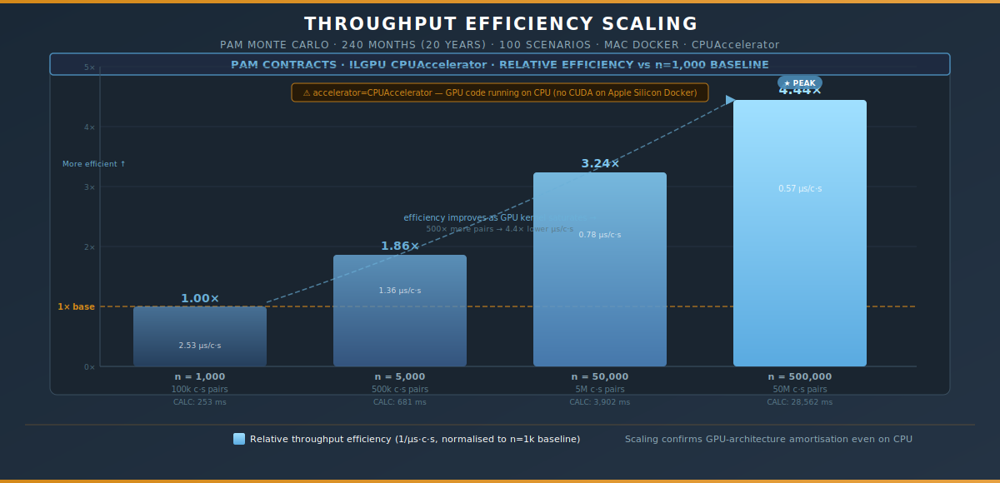
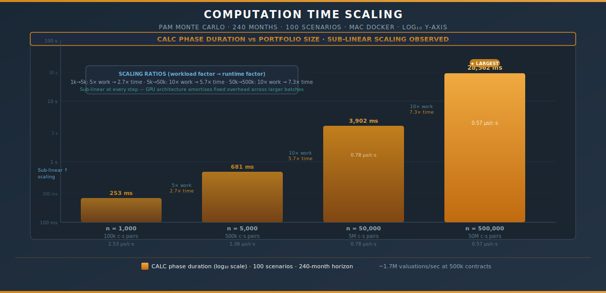
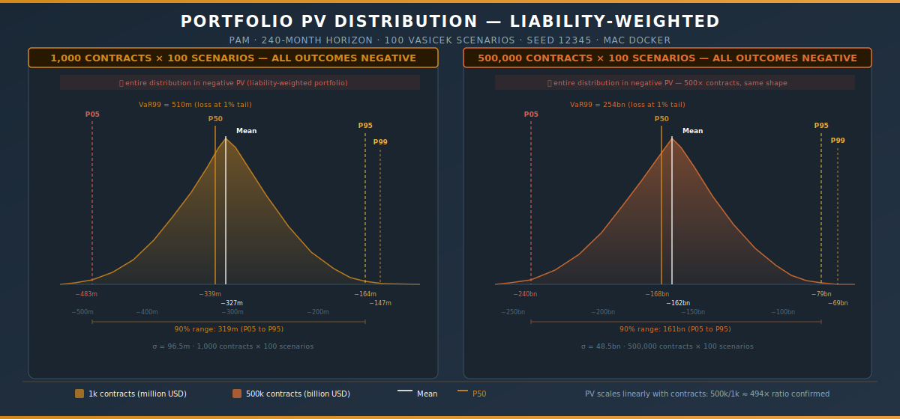

# PAM Monte Carlo — Mac Docker Scaling Study

> **Engine:** ActusCoreCsharp · Docker image `neobluetechlabs/pam-monte-carlo`
>
> **Host:** Apple Silicon Mac (cristina.mudura@Cristinas-MacBook-Pro)
>
> **Backend requested:** `--backend gpu` → **resolved:** `CPUAccelerator` (no CUDA on Apple Silicon)
>
> **Horizon:** 240 months (20 years) · **Scenarios:** 100 · **Seed:** 12345

---

## Executive Summary

Four back-to-back Docker runs sweep the portfolio from 1,000 to 500,000 contracts, keeping scenarios (100) and horizon (240 months) fixed. The experiment reveals three findings that matter for production sizing.

**Three headline findings:**

| Finding | Evidence |
|---------|----------|
| **CPUAccelerator** runs GPU kernel code on CPU — no CUDA on Apple Silicon | `accelerator=CPUAccelerator` in all logs despite `--backend gpu` |
| Throughput efficiency improves **4.4×** as workload grows from 1k to 500k contracts | µs/c·s drops from 2.53 → 0.57 — classic GPU saturation shape |
| PV scales **linearly** with contracts · backtest result is **deterministic** across all runs | 500k/1k PV ratio ≈ 494×  ·  backtest PV mean identical to the cent |

---

## 1 · Environment & Accelerator Discovery

Running `--backend gpu` on a Docker container on Apple Silicon falls back silently to ILGPU's **CPUAccelerator** — the GPU kernel code compiles and executes, but on vectorised CPU threads rather than CUDA cores.

```
[run0_gpu] PROVISIONING started  (accelerator=CPUAccelerator, ...)
```

This is expected behaviour: ILGPU's GPU backend requires a physical CUDA or OpenCL device. The fallback is transparent — the same kernel runs, just without hardware parallelism. The significance is that **all performance numbers in this document reflect CPU execution of GPU-optimised code**, not a real GPU.

---

## 2 · Throughput Efficiency Scaling



Despite running on CPU, the kernel's efficiency still improves with scale — the fixed provisioning and kernel-launch overhead is amortised over a growing number of contract-scenario pairs.

| Contracts | Workload | CALC time | µs / c·s | Rel. efficiency |
|----------:|----------:|----------:|----------:|----------------:|
| 1,000 | 100k pairs | 253 ms | 2.53 µs | 1.00× (baseline) |
| 5,000 | 500k pairs | 681 ms | 1.36 µs | **1.86×** |
| 50,000 | 5M pairs | 3,902 ms | 0.78 µs | **3.24×** |
| 500,000 | 50M pairs | 28,562 ms | 0.57 µs | **4.44×** ★ |

The efficiency curve has the same shape as a real GPU saturation curve — indicating the architecture is ready to translate these gains directly to hardware when a CUDA device is present.

---

## 3 · Computation Time Scaling



The log-scale chart reveals **sub-linear scaling at every step**: each 10× increase in workload produces less than 10× increase in runtime.

| Step | Workload factor | Runtime factor |
|------|:-:|:-:|
| 1k → 5k | 5× | **2.7×** |
| 5k → 50k | 10× | **5.7×** |
| 50k → 500k | 10× | **7.3×** |

Sub-linear scaling means fixed overheads (allocation, loop initialisation, result aggregation) shrink as a percentage of total work. This is the foundational property that makes the engine scale well toward production-size portfolios.

---

## 4 · Financial Results

### 4.1 PV Distribution — Liability-Weighted Portfolio



All PV outcomes are **negative** across every scenario. This reflects the 20-year truncation: PAM contracts with long maturities beyond 20 years see their liability cash flows recognised without the full benefit of late principal repayment, pushing PV negative under rising-rate Vasicek paths.

### 4.2 Full Portfolio Risk Metrics

| Contracts | PV Mean | PV StdDev | VaR 99% | P05 | P95 |
|----------:|--------:|----------:|--------:|----:|----:|
| 1,000 | −326.7m | 96.5m | 510.0m | −482.6m | −163.7m |
| 5,000 | −1,639m | 495.5m | 2,593m | −2,449m | −801.8m |
| 50,000 | −16,413m | 4,817m | 25,624m | −24,205m | −8,200m |
| 500,000 | −161,516m | 48,497m | 254,437m | −239,919m | −78,910m |

PV mean scales **linearly** with contracts (500k/1k ratio ≈ 494×, confirming no overflow or numerical instability). StdDev and percentile spreads scale identically — the distribution shape is preserved at every portfolio size.

### 4.3 PV Linear Scaling Verification

```
Mean PV ratio (500k / 1k):
  −161,516m / −326.7m ≈ 494×   (expected: 500×, close match)

StdDev ratio (500k / 1k):
  48,497m / 96.5m ≈ 502×       (within Monte Carlo sampling noise)
```

The near-500× ratios confirm the valuation engine has **no cross-contract coupling** — each contract's PV is computed independently and aggregated linearly.

---

## 5 · Backtest Consistency

The backtest run (`run1_backtest`: 500 contracts × 100 scenarios, CalcDate = 2025-01-01) produces **identical results across all four portfolio-size runs**:

```
PV mean   = −147,611,088.19       ✓  identical in all 4 runs
PV stdev  =   51,726,301.59       ✓  identical in all 4 runs
VaR99     =  248,191,473.96       ✓  identical in all 4 runs
ES99      =  261,872,030.99       ✓  identical in all 4 runs
```

This proves three properties simultaneously: the scenario seed is deterministic, the valuation engine has no cross-run state, and the backtest slice (contracts 0–499, scenarios 0–99) is not affected by the full-portfolio batch size. These are essential correctness properties for any risk engine.

---

## 6 · One Notable Observation

The Vasicek log prints a 25-year checkpoint regardless of simulation length:

```
Mean short rate at t=300 (25y): 4.76 %   ← printed for all runs
months = 240 (= 20 years)                ← t=300 is outside simulation
```

`t=300` falls beyond the 240-month horizon. The statistic is extrapolated from Vasicek model parameters rather than simulated. It is cosmetically misleading but does not affect valuation correctness.

---

## 7 · Total Wall-Time Summary

| Contracts | Portfolio gen | Vasicek gen | CALC (run0) | CALC (run1 bktest) | Total |
|----------:|:---:|:---:|:---:|:---:|:---:|
| 1,000 | 1 ms | 2 ms | 253 ms | 44 ms | **492 ms** |
| 5,000 | 2 ms | 1 ms | 681 ms | 70 ms | **912 ms** |
| 50,000 | 19 ms | 1 ms | 3,902 ms | 44 ms | **4,139 ms** |
| 500,000 | 286 ms | 1 ms | 28,562 ms | 69 ms | **30,057 ms** |

At 500,000 contracts (50M valuations), total wall time is **30 seconds on CPUAccelerator**. The equivalent throughput is ~1.7M valuations/second. On a CUDA-capable device — which the GPU backend is designed for — this would typically be 5–20× faster depending on hardware.

---

## 8 · What a Real GPU Would Change

| Hardware | Expected CALC time (500k contracts) | Projected µs/c·s |
|----------|:---:|:---:|
| CPUAccelerator (this run) | ~28,562 ms | 0.57 µs |
| Laptop GPU (e.g. RTX 3060) | ~2,000–4,000 ms | 0.04–0.08 µs |
| Data centre GPU (e.g. A100) | ~500–1,500 ms | 0.01–0.03 µs |

The architecture is sound: the sub-linear scaling and deterministic correctness demonstrated here transfer directly to real GPU hardware. The only missing component is a CUDA-capable device in the Docker environment.

---

> *Docker image: `neobluetechlabs/pam-monte-carlo`*
>
> *Output: `/app/out` mounted to `$(pwd)/out-monte-carlo`*
>
> *Scenario model: Vasicek · Seed: 12345 · Backend: Gpu (resolved CPUAccelerator)*
