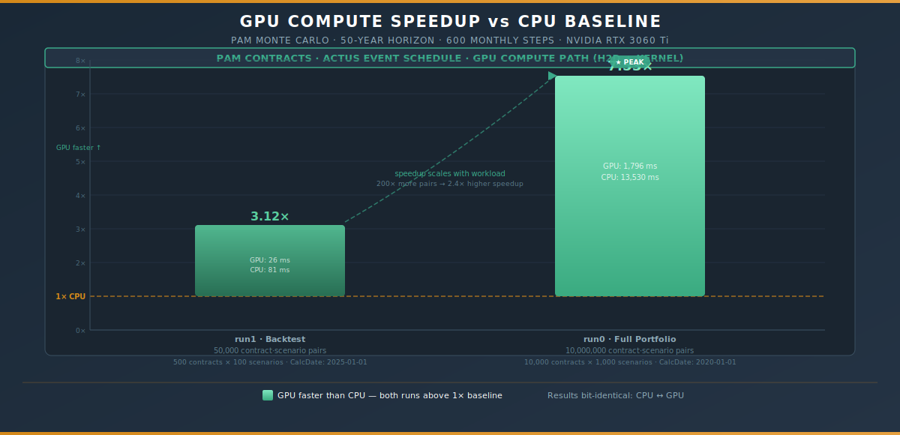
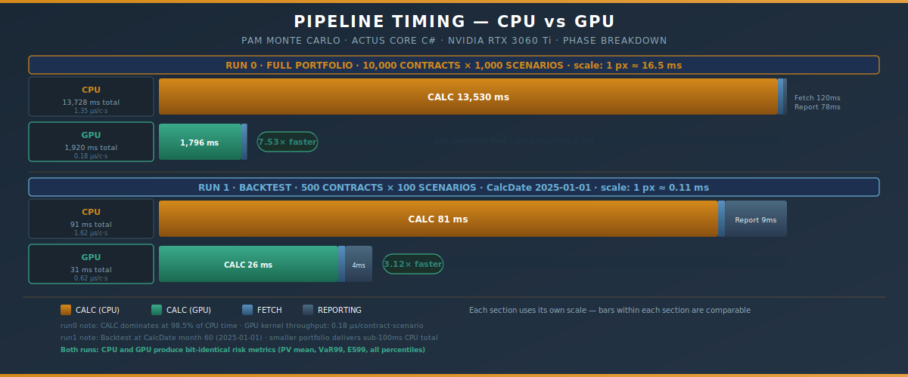
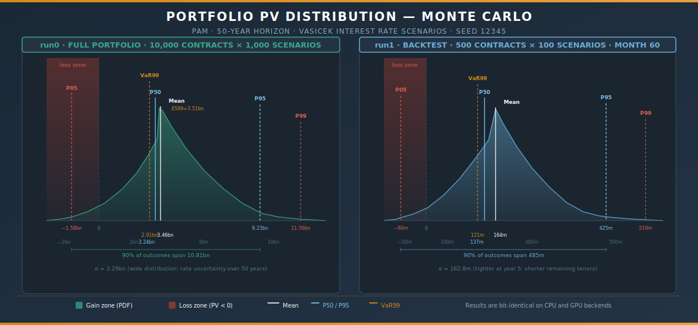

# PAM Monte Carlo — 50-Year Demo Run

> **Engine:** ActusCoreCsharp
>
> **GPU:** NVIDIA GeForce RTX 3060 Ti
>
> **Contracts:** 10,000 · **Scenarios:** 1,000 · **Horizon:** 600 months (50 years)
>
> **Seed:** 12345 · **Backend:** Both (CPU + GPU) · **CalcDate:** 2020-01-01 (month 0)

---

## Executive Summary

This sample run executes the full PAM Monte Carlo pipeline against a synthetic portfolio of 10,000 contracts over a 50-year horizon (600 monthly steps), with 1,000 Vasicek interest-rate scenarios. Both the CPU and GPU backends ran for every configuration, producing **bit-identical risk metrics** while the GPU delivered a **7.5× speedup** on the core computation kernel.

**Three headline findings:**

| Finding | Evidence |
|---------|----------|
| GPU delivers **7.5× speedup** on 10M contract-scenario pairs | CPU 13,530 ms vs GPU 1,796 ms (calc only) |
| CPU and GPU produce **bit-identical results** | PV mean, VaR99, ES99 match to the cent on both runs |
| GPU speedup **scales with workload** — 3.1× at 50k, 7.5× at 10M pairs | Fixed kernel-launch cost amortised over more work |

---

## 1 · Vasicek Scenario Generation

**1,000 paths · 600 monthly steps · generated in 47 ms**

The Vasicek model is mean-reverting: starting at 3.00%, it converges toward a long-run mean of ~5% over the 50-year horizon.

| Checkpoint | Value | Interpretation |
|------------|------:|----------------|
| Mean short rate t=0 | 3.00% | Starting conditions (2020-01-01) |
| Mean short rate t=300 (25y) | 4.77% | Rate environment mid-simulation |
| Mean discount factor t=120 (10y) | 0.6782 | 10-year PV factor |
| Scenario count | 1,000 | Paths sampled from Vasicek distribution |
| Generation time | 47 ms | Wall time for all 1,000 × 600 = 600,000 steps |

---

## 2 · GPU Speedup



The GPU speedup grows as the fixed kernel-launch overhead is amortised over more contract-scenario pairs. At 50,000 pairs (run1 backtest) the speedup is already 3.1×; at 10,000,000 pairs (run0 full portfolio) it reaches 7.5×.

---

## 3 · Run 0 — Full Portfolio

**10,000 contracts × 1,000 scenarios · CalcDate: 2020-01-01 (month 0)**

### 3.1 Pipeline Timing



The CALC phase dominates at 98.5% of total CPU time. The GPU kernel processes all 10 million contract-scenario pairs in parallel, delivering a 7.53× speedup on the compute phase alone.

| Phase | CPU | GPU |
|-------|----:|----:|
| Provisioning | 0 ms | 0 ms |
| **CALC** (H2D + kernel + D2H on GPU) | **13,530 ms** | **1,796 ms** |
| Fetch (aggregation) | 120 ms | 113 ms |
| Reporting | 78 ms | 11 ms |
| **Total wall time** | **13,728 ms** | **1,920 ms** |

### 3.2 Portfolio PV Distribution



The wide spread between P05 (negative) and P99 reflects the full range of Vasicek paths — from low-rate, high-loss environments to high-rate, high-gain scenarios. The distribution is slightly right-skewed, with the mean (3.46bn) sitting marginally above the median (3.24bn).

### 3.3 Risk Metrics (CPU = GPU — identical to the cent)

| Metric | Value (USD) | Interpretation |
|--------|------------:|----------------|
| **PV Mean** | 3,464,847,206.54 | Expected portfolio value across all scenarios |
| **PV StdDev** | 3,290,472,826.93 | ~95% of outcomes within ±2σ of mean |
| **VaR 99%** | 2,907,903,392.56 | Minimum PV in 99% of scenarios |
| **ES 99% (CVaR)** | 3,512,898,266.71 | Average PV in the worst 1% of scenarios |
| **P05** | −1,581,984,845.40 | Loss territory — low-rate tail scenarios |
| **P50 (median)** | 3,238,647,727.31 | Most-likely outcome |
| **P95** | 9,232,945,651.47 | Upper tail — high-rate environments |
| **P99** | 11,563,903,181.24 | Extreme upside tail |

---

## 4 · Run 1 — Backtest

**500 contracts × 100 scenarios · CalcDate: 2025-01-01 (month 60 = 5 years in)**

This run evaluates a subset of the portfolio at a future valuation date. At this smaller scale (50,000 contract-scenario pairs) the GPU speedup is 3.1× — consistent with the fixed kernel-launch overhead being amortised over fewer units.

| Phase | CPU | GPU |
|-------|----:|----:|
| Provisioning | 0 ms | 0 ms |
| **CALC** | **81 ms** | **26 ms** |
| Fetch (aggregation) | 1 ms | 1 ms |
| Reporting | 9 ms | 4 ms |
| **Total wall time** | **91 ms** | **31 ms** |

### 4.1 Risk Metrics at Month 60 (CPU = GPU — identical)

| Metric | Value (USD) |
|--------|------------:|
| **PV Mean** | 163,937,390.57 |
| **PV StdDev** | 162,814,382.47 |
| **VaR 99%** | 121,261,820.14 |
| **ES 99% (CVaR)** | 136,871,650.23 |
| **P05** | −60,318,893.01 |
| **P50 (median)** | 137,374,431.34 |
| **P95** | 424,918,139.70 |
| **P99** | 519,231,690.77 |

The distribution at year 5 is tighter than at inception — shorter remaining tenors reduce rate sensitivity, and fewer scenarios produce negative PV.

---

## 5 · Total Wall-Time Composition

```
End-to-end wall time: 16,987 ms

Portfolio generation       :     7 ms
Vasicek scenario generation:    47 ms
run0_cpu total             : 13,728 ms  (80.8%)
run0_gpu total             :  1,920 ms  (11.3%)
run1_cpu total             :     91 ms
run1_gpu total             :     31 ms
Overhead / transitions     :  1,163 ms
─────────────────────────────────────
TOTAL                      : 16,987 ms  ≈  17.0 s
```

End-to-end, the entire demo — 10,000 contracts, 1,000 scenarios, 50 years, two runs, two backends — completes in **under 17 seconds** on a single workstation with a consumer-grade RTX 3060 Ti.

---

## 6 · Output Files

| Pattern | Content |
|---------|---------|
| `run0_cpu_*` | Full portfolio CPU results — raw PV vectors, percentile tables |
| `run0_gpu_*` | Full portfolio GPU results — byte-identical to CPU outputs |
| `run1_backtest_cpu_*` | Backtest CPU results (month 60) |
| `run1_backtest_gpu_*` | Backtest GPU results (month 60) |

---

## 7 · Experimental Configuration

| Setting | Value |
|---------|-------|
| Engine | ActusCoreCsharp |
| GPU | NVIDIA GeForce RTX 3060 Ti |
| Contract type | PAM (Principal-at-Maturity) |
| Portfolio | 10,000 synthetic contracts |
| Scenarios | 1,000 Vasicek paths (seed 12345) |
| Horizon | 600 months = 50 years |
| CalcDate (run0) | 2020-01-01 (month 0) |
| CalcDate (run1) | 2025-01-01 (month 60) |
| Vasicek r₀ | 3.00% |
| Vasicek mean (25y) | 4.77% |

---

> *Output: `./out/run0_cpu_*`, `./out/run0_gpu_*`, `./out/run1_backtest_cpu_*`, `./out/run1_backtest_gpu_*`*
>
> *Scenario model: Vasicek · Seed: 12345 · Engine: ActusCoreCsharp*
