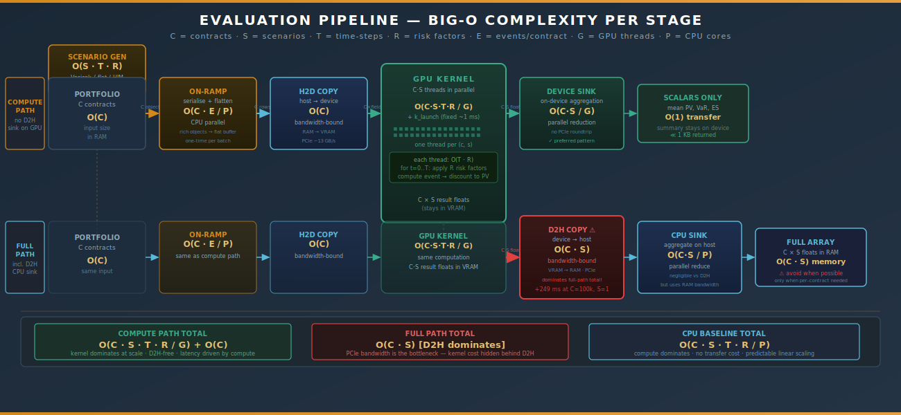
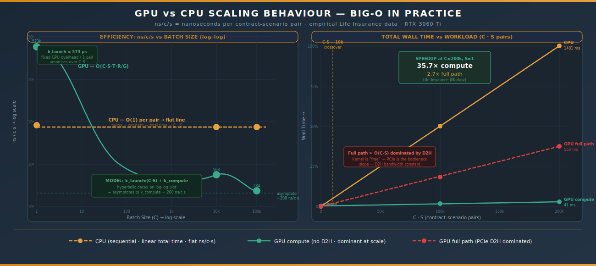
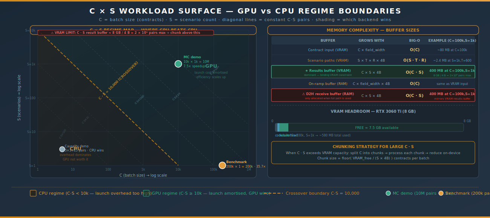
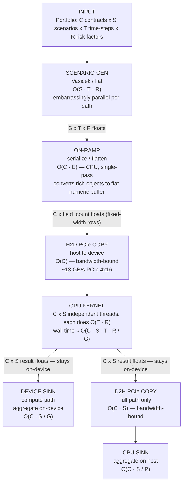
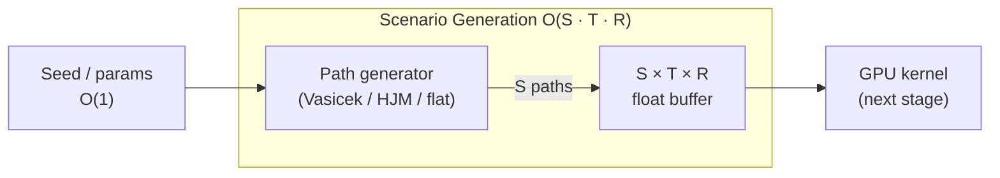
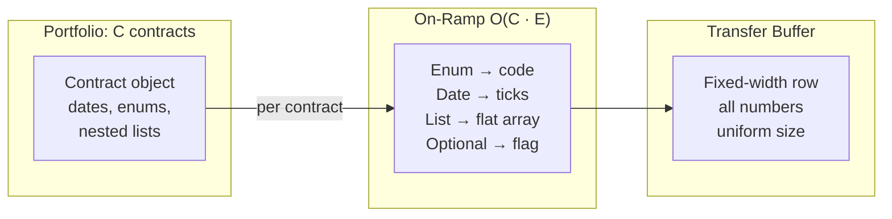
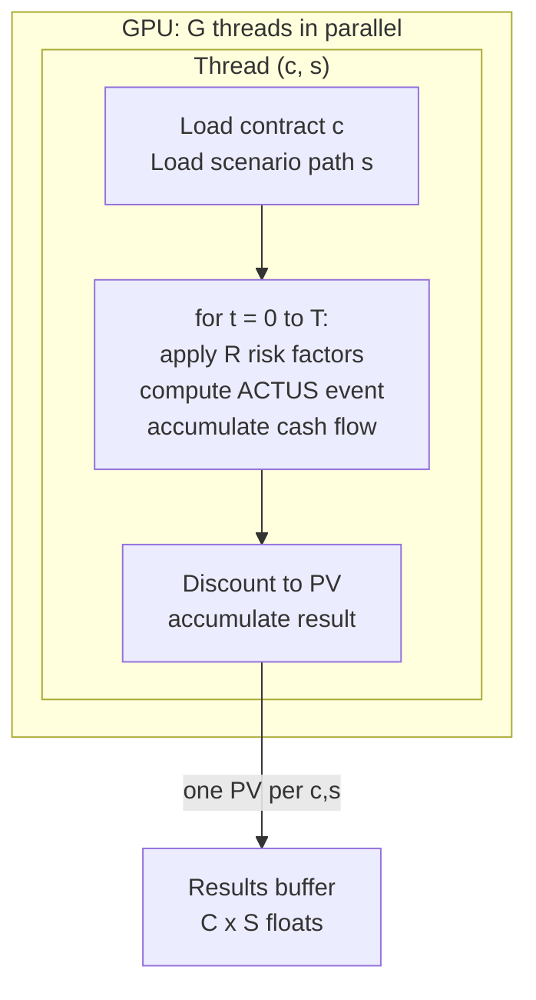
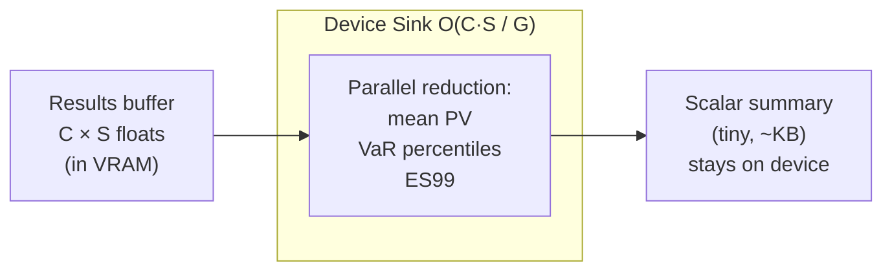
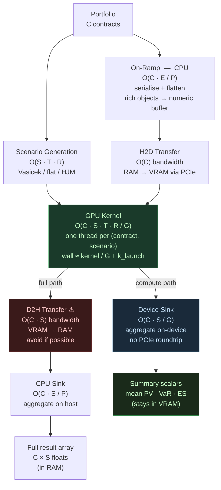

> **Scope:** Big-O characterisation of every stage in the evaluation pipeline — on-ramp, kernel, off-ramp, sinks, and Monte Carlo scenario generation. Numbers reference the Windows / RTX 3060 Ti benchmark runs; the complexity shapes apply to any hardware.

---

## 0 · Visual Overview







---

## 1 · Variables

| Symbol | Meaning | Typical Range |
|--------|---------|---------------|
| **C** | Contracts in the portfolio (batch size) | 1 – 1 000 000 |
| **S** | Scenarios (rate paths / Monte Carlo draws) | 1 – 10 000 |
| **T** | Time steps per contract-scenario pair (horizon × frequency) | 600 (50 y monthly) |
| **E** | ACTUS events per contract (PAM: ~602 IP events; Life: implicit via Markov) | 100 – 1 000 |
| **R** | Risk factors / state variables per step (interest rate, mortality rate, lapse rate…) | 1 – 20 |
| **G** | GPU parallelism — number of concurrent threads (SIMT width) | 4 000 – 10 000 effective |
| **P** | CPU parallelism — number of logical cores | 8 – 128 |
| **B** | Transfer buffer size in bytes ≈ C × S × sizeof(result) | — |

---

## 2 · Full Pipeline — Big-O at a Glance



---

## 3 · Stage-by-Stage Complexity

### 3.1 Scenario Generation

Generates `S` independent rate paths, each of `T` steps, optionally with `R` correlated risk factors.

```
O( S · T · R )
```



**Key properties:**
- Fully embarrassingly parallel across paths — each path is independent
- On GPU this becomes `O(T · R)` wall time (all `S` paths run in parallel)
- Vasicek: `R = 1` (short rate only); HJM: `R = M` (number of tenor points)
- At `S=1000, T=600, R=1` → 600 000 arithmetic ops, negligible vs kernel

---

### 3.2 On-Ramp — Serialise & Flatten

Converts each contract from its rich domain object (text fields, dates, nested lists) into a fixed-width numeric row suitable for GPU VRAM.

```
O( C · E )
```



**Key properties:**
- Pure CPU work; parallelisable over `P` cores → `O(C · E / P)` wall time
- Output buffer size grows linearly with `C` — the only allocation that scales with portfolio size
- One-time cost per batch; the flat buffer is reused across all `S` scenarios
- **PAM**: `E ≈ 602` (schedule events); **Life**: `E ≈ T` (one state per step, no pre-built schedule)

---

### 3.3 H2D Transfer (Host-to-Device)

Copies the flat contract buffer from RAM to VRAM over PCIe.

```
O( C )   — bandwidth-bound, not compute-bound
```

| What moves | Size formula | Example (C=100k) |
|---|---|---|
| Contract buffer | `C × field_width × 4 bytes` | ~80 MB |
| Scenario buffer | `S × T × R × 4 bytes` | ~2.4 MB (S=1k) |
| Result buffer (pre-allocated) | `C × S × 4 bytes` | ~400 MB |

**Key insight:** at large `C`, the contract buffer dominates. Because field width is constant and each contract is independent, the copy is a single `memcpy` — constant time per byte, linear total.

---

### 3.4 GPU Kernel — The Core Computation

Each thread handles exactly one `(contract, scenario)` pair and runs the full `T`-step ACTUS evaluation.

```
Algorithmic work:    O( C · S · T · R )          (total operations)
Wall-clock time:     O( C · S · T · R / G )       (parallelised over G threads)
```



**Scaling behaviour:**

| Axis | CPU wall time | GPU wall time |
|------|--------------|--------------|
| Double `C` | `2×` | `≤ 2×` (more threads needed, may still fit in `G`) |
| Double `S` | `2×` | `≤ 2×` (same reasoning) |
| Double `T` | `2×` | `2×` (per-thread work doubles) |
| Double `R` | `2×` | `2×` (per-thread work doubles) |
| Double `G` | — | `÷ 2×` (more parallelism absorbs more `C·S`) |

**The fundamental asymmetry:**

```
CPU:   T_wall ≈ k · C · S · T · R / P          (P cores, typically 8–128)
GPU:   T_wall ≈ k · C · S · T · R / G + k_launch
                                           └─ constant launch overhead (~0.5–1.2 ms)
```

The GPU wins when `C · S` is large enough that the launch overhead is negligible. That crossover is empirically at `C · S ≈ 10 000`.

---

### 3.5 Device Sink (On-Device Aggregation — Compute Path)

Aggregates results while they remain in VRAM. No data crosses PCIe.

```
O( C · S / G )   — parallel reduction on-device
```



This is the **preferred sink** for risk engines. Only summary scalars are ever returned to the CPU.

---

### 3.6 D2H Transfer (Device-to-Host — Full Path Only)

Copies the full result buffer from VRAM to RAM.

```
O( C · S )   — bandwidth-bound
```

Empirical cost (RTX 3060 Ti, PCIe 4×16):

| Size (C×S pairs) | D2H time | Note |
|---|---|---|
| 100k | +249.9 ms | Life benchmark, vs 23.4 ms compute |
| 200k | ~500 ms (extrapolated) | Linear in C·S |

**Design recommendation:** Avoid D2H unless individual contract-level results are required. On-device aggregation reduces the transferred payload from `O(C · S)` floats to `O(1)` scalars.

---

### 3.7 CPU Sink (Off-Ramp Aggregation)

Post-D2H aggregation on the host.

```
O( C · S / P )   — parallel reduction on CPU
```

In practice negligible compared to D2H transfer cost.

---

## 4 · Total Pipeline Complexity

### 4.1 Compute Path (GPU, on-device sink)

```
T_total = T_onramp + T_H2D + T_kernel + T_device_sink

       = O(C·E/P)  +  O(C)  +  O(C·S·T·R/G + k_launch)  +  O(C·S/G)

Dominant term at scale:  O( C · S · T · R / G )
```

### 4.2 Full Path (GPU, CPU sink)

```
T_total = T_onramp + T_H2D + T_kernel + T_D2H + T_cpu_sink

       = O(C·E/P)  +  O(C)  +  O(C·S·T·R/G)  +  O(C·S)  +  O(C·S/P)

Dominant term at scale:  O( C · S )   ← D2H dominates, not the kernel!
```

### 4.3 CPU Baseline

```
T_total = O( C · S · T · R / P )

No transfer cost, no launch overhead.
Dominant term: the computation itself.
```

### 4.4 Comparison Table

| Path | Dominant term | Bottleneck | Notes |
|------|--------------|------------|-------|
| CPU sequential | `C · S · T · R` | compute | fully predictable |
| CPU parallel | `C · S · T · R / P` | compute | P=8–128 |
| GPU compute | `C · S · T · R / G` | compute | G≫P when C·S large |
| GPU full path | `C · S` | D2H transfer | kernel cost hidden by PCIe |

---

## 5 · Empirical Big-O Fit

The benchmark data confirms the analytical shapes:

### 5.1 CPU ns/c/s — constant (O(1) per pair, O(C·S) total)

```
Life CPU:   BatchSize=1 →    8,152 ns/c/s
            BatchSize=10k →  7,342 ns/c/s   (flat)
            BatchSize=100k → 7,345 ns/c/s   (flat)
            BatchSize=200k → 7,406 ns/c/s   (flat)

Fitted:  ns/c/s ≈ constant  →  total time ∝ C · S  (confirmed linear)
```

### 5.2 GPU ns/c/s — falling (amortising fixed launch cost)

```
Life GPU compute:   BatchSize=1 →    573,169 ns/c/s  (launch overhead / 1)
                    BatchSize=10k →      563 ns/c/s  (overhead / 10k)
                    BatchSize=100k →     234 ns/c/s  (overhead / 100k)
                    BatchSize=200k →     208 ns/c/s  (overhead / 200k)

Fitted:  ns/c/s ≈ k_launch / (C·S) + k_compute
                   └─ hyperbolic decay, asymptotes to k_compute ≈ 200 ns/c/s
```

```
GPU ns/c/s model:

ns/c/s
  │
  573k ┤ ●  (n=1)
       │  \
       │   \  overhead dominates
       │    \
   563 ┤     ●──●──● (n=10k→200k)
       │         asymptote ≈ 200 ns/c/s
       └──────────────────────────────────► C·S
            1    10k   100k  200k
```

---

## 6 · Monte Carlo Scaling — Two-Dimensional Complexity

Monte Carlo adds the `S` dimension. Total work scales as `C × S`:

```
Work_MC = C · S · T · R

For fixed T and R, this is a 2D surface:

        S
    10k ┤                       ░░░░████  GPU sweet spot
        │                  ░░░████████
     1k ┤             ░░███████████
        │         ░███████████
    100 ┤     ░████████
        │  ░█████
      1 ┤ ██
        └────────────────────────────► C
          1   1k   10k  100k  1M

  ████  CPU competitive   ░░░░  GPU competitive   (boundary: C·S ≈ 10k)
```

**Design guideline:** the GPU kernel launch amortises over `C·S` pairs. For Monte Carlo workloads where S ≥ 100 and C ≥ 1000, the GPU is always in its efficient regime.

---

## 7 · Memory Complexity

| Buffer | Size | Grows with |
|--------|------|-----------|
| Contract input buffer (VRAM) | `C × field_width × 4B` | `O(C)` |
| Scenario buffer (VRAM) | `S × T × R × 4B` | `O(S · T · R)` |
| Results buffer (VRAM) | `C × S × 4B` | `O(C · S)` ← dominant |
| On-ramp CPU buffer (RAM) | same as contract input | `O(C)` |
| D2H receive buffer (RAM) | `C × S × 4B` | `O(C · S)` |

**At scale**, the `C × S` results buffer is the binding VRAM constraint. An RTX 3060 Ti has 8 GB VRAM; at 4 bytes/result:

```
Max C·S at full VRAM ≈ 8 GB / 4 B = 2 × 10⁹ pairs

Practical limit (leaving headroom for code + scenarios):
  ~1 × 10⁹ pairs  →  e.g.  10k contracts × 100k scenarios
                        or  100k contracts × 10k scenarios
```

For larger workloads, the batch is chunked along `C` and results are reduced on-device before the next chunk overwrites the buffer.

---

## 8 · Contract-Type Complexity Profile

| Contract Type | T (steps) | R (risk factors) | Branch-heavy? | GPU efficiency |
|---|---|---|---|---|
| **PAM** (Principal-at-Maturity) | 600 (50 y monthly) | 1 (interest rate) | ✓ (event schedule, conditionals) | moderate — branching reduces SIMT efficiency |
| **Life** (Markov mortality) | 600 (50 y monthly) | 2–4 (mortality, lapse, disability) | ✗ (table lookups, no branching) | high — uniform arithmetic, ideal SIMT |

This explains the empirical speedup difference:

```
Life GPU speedup at 200k:  35.7×  (branch-free Markov, SIMT utilisation ~100%)
PAM  GPU speedup at 100k:   1.7×  (event branching reduces SIMT utilisation)
```

---

## 9 · Pipeline Summary — Mermaid Diagram



---

## 10 · Quick-Reference Complexity Card

| Stage | Complexity | Bottleneck |
|---|---|---|
| Scenario gen | O(S · T · R) | memory bandwidth |
| On-ramp | O(C · E / P) | CPU serialisation |
| H2D copy | O(C) — bandwidth | PCIe lane width |
| GPU kernel | O(C·S·T·R / G) + k_launch | compute (or occupancy) |
| Device sink | O(C·S / G) | VRAM bandwidth |
| D2H copy ⚠ | O(C·S) — bandwidth | PCIe lane width |
| CPU sink | O(C·S / P) | CPU memory bandwidth |
| **TOTAL (compute)** | **O(C·S·T·R / G)** | kernel dominates |
| **TOTAL (full)** | **O(C·S) — D2H dominates** | PCIe transfer |
| **TOTAL (CPU)** | **O(C·S·T·R / P)** | compute dominates |
| Memory | O(C·S) VRAM for results | results buffer |
| GPU crossover | C·S ≈ 10 000 pairs | launch cost amortised |
| GPU sweet spot | C·S ≥ 100 000 pairs | efficiency plateau |

**Variables:** C = contracts (batch size) · S = scenarios · T = time steps / contract · R = risk factors / step · E = events / contract · P = CPU cores · G = GPU threads (effective) · k_launch ≈ 0.5–1.2 ms fixed overhead

---

> *This document is a complexity reference — it describes asymptotic behaviour, not exact wall-clock predictions. Empirical data from `benchmarkAnalysis.md` and the Demo-Samples validates the shapes. Exact constants depend on hardware, memory bandwidth, and SIMT occupancy.*
