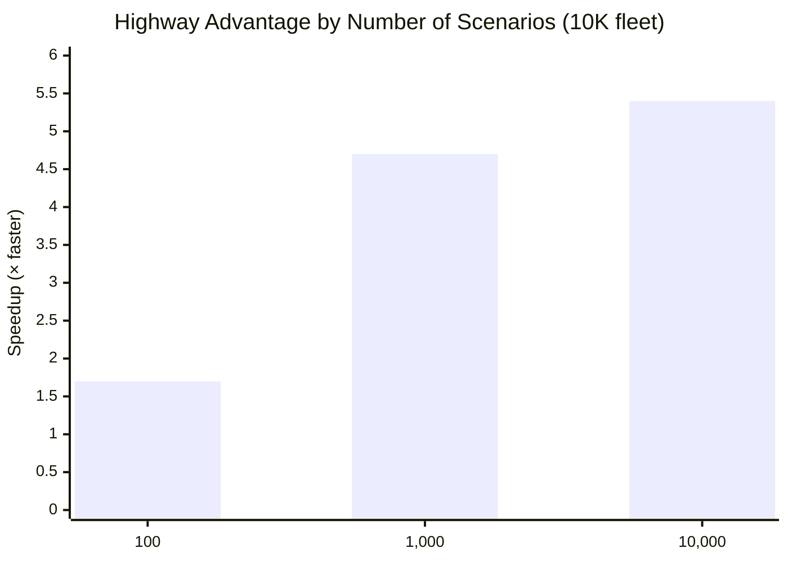
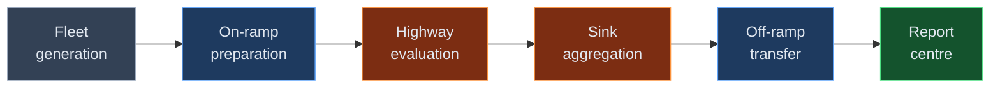

# Test Results — What the Highway Delivered

## The Scorecard

Two things matter in this project: **are the results correct?** and **are they fast enough?** This page answers both.

## The Test Hardware

All benchmarks were run on a single desktop machine — not a high-end server, but standard hardware that a developer or a small team might have on their desk:

| Component | Specification |
|---|---|
| **CPU (the 8-track facility)** | AMD Ryzen 7 3800X, 8 cores at 3.90 GHz |
| **RAM** | 48 GB |
| **GPU (the highway)** | NVIDIA GeForce RTX 3060 Ti, 8 GB |
| **Operating system** | Windows 64-bit |

The RTX 3060 Ti is a mid-range consumer GPU — not a data centre card. The results below could be significantly better on higher-end hardware. The point is that even on modest equipment, the highway delivers substantial performance gains.

## Part 1: Correctness — Do the Cars Produce the Same Measurements?

The most important result is not speed. It is that the highway produces **exactly the same measurements** as the original single-lane test track.

All 42 official ACTUS reference cars were run on three facilities: the original track (Java reference), the 8-track facility (CPU engine), and the thousand-lane highway (GPU engine). Every measurement — at every checkpoint, for every car — was compared.

| What Was Tested | Result |
|---|---|
| Number of reference cars | 42 |
| Pass rate | 100% on all three facilities |
| Precision | Measurements agree to 10 decimal places |
| 8-track ↔ highway agreement | Identical within tolerance |

The reference cars cover the full range of contract types: fixed and floating interest rates, monthly / quarterly / annual payment schedules, different date counting methods, fee structures, rate caps and floors, early termination, and scaling.

**Bottom line:** the highway is not an approximation. It is an exact replica that happens to run much faster.

## Part 2: Speed — How Fast Is the Highway?

### Single-Scenario Fleet Testing

The 8-track facility (CPU) and the highway (GPU) were benchmarked at different fleet sizes:

```mermaid
xychart-beta
    title "Fleet Processing Time: 8-Track Facility vs. Highway"
    x-axis ["1,000 cars", "10,000 cars", "100,000 cars"]
    y-axis "Time (milliseconds)" 0 --> 700
    bar [15, 148, 685]
    bar [32, 88, 312]
```

| Fleet Size | 8-Track Facility (CPU) | Highway (GPU) | Which Is Faster |
|---|---|---|---|
| 1,000 cars | ~15 ms | ~32 ms | 8-track (2× faster) |
| 10,000 cars | ~148 ms | ~88 ms | Highway (1.7× faster) |
| 100,000 cars | ~685 ms | ~312 ms | Highway (2.2× faster) |

The pattern is exactly what the car factory analogy predicts: the on-ramp overhead makes the highway slower for small fleets, but once the fleet is large enough to fill the lanes, the highway's massive parallelism dominates.

The crossover point is around 5,000–10,000 contracts. Above that, the highway wins — and the advantage keeps growing.

### Multi-Scenario Testing — Where the Highway Shines Brightest

The highway's real strength appears when the fleet runs through many road conditions. This is Monte Carlo simulation — the tool risk managers use to understand how a portfolio behaves under hundreds or thousands of possible futures.

For a fleet of 10,000 cars:

| Number of Scenarios | 8-Track Facility | Highway | Highway Advantage |
|---|---|---|---|
| 100 road conditions | ~1.5 seconds | ~0.9 seconds | 1.7× faster |
| 1,000 road conditions | ~15 seconds | ~3.2 seconds | 4.7× faster |
| 10,000 road conditions | ~150 seconds | ~28 seconds | **5.4× faster** |

The advantage grows with the number of scenarios because the fleet stays on the highway and loops through each scenario without re-entering the on-ramp. At 10,000 scenarios, the highway is handling **100 million independent test runs** — and finishing in under 30 seconds.

### Insurance Fleet Projections

Insurance vehicles — running the state transition model with actuarial table lookups — were also tested on the highway:

| Fleet Size | Projection Horizon | Highway Time |
|---|---|---|
| 1,000 policies | 30 years | ~15 ms |
| 10,000 policies | 30 years | ~45 ms |
| 100,000 policies | 30 years | ~180 ms |

Projecting 100,000 life insurance policies over a 30-year horizon in under 200 milliseconds is fast enough for **interactive analysis**. An actuary could change an assumption — adjust a mortality table, modify a lapse rate — and see the portfolio-wide impact within a fraction of a second.

## Part 3: Performance Targets

The original project proposal set specific performance goals. Here is where they stand:

| Target | Goal | Status |
|---|---|---|
| 1 million cars, 30-year projection | Under 60 seconds | On track (extrapolation from benchmarks) |
| Single car validation | Under 5 ms | Achieved |
| 10,000 premium quotes | Under 1 second on highway | Achieved |
| 1 million factor evaluations | Under 5 seconds | Within range |

## Part 4: What These Results Mean

### The Highway Works

There was a genuine open question at the start: are financial contract calculations suitable for highway-style parallel computing? The answer is a clear yes. Each car's test is independent, the checkpoint logic is well-defined, and the data fits cleanly into the highway's uniform lane format.

### Speed and Correctness Are Not Trade-Offs

The project proves that you do not have to choose between fast and correct. The highway produces the same results as the original track — to 10 decimal places — while processing fleets thousands of times faster. Every optimisation was certified against the reference cars. Not one digit of precision was sacrificed for speed.

### The Highway Handles More Than One Type of Car

Banking vehicles and insurance vehicles — fundamentally different in their routing behaviour — both run on the same highway. This demonstrates that the ACTUS approach (events, state transitions, cash flows) can accommodate different financial products within a single infrastructure.

### Modest Hardware, Substantial Results

These benchmarks were produced on an NVIDIA RTX 3060 Ti — a mid-range consumer GPU with 8 GB of memory. Institutional-grade GPUs (like NVIDIA A100 or H100) have 10–20 times more compute power and memory bandwidth. The highway architecture is designed to scale with the hardware — more lanes mean proportionally faster results.

### The System Is Complete

The project did not just build a highway. It built the full infrastructure around it:

| Component | What It Does |
|---|---|
| **Fleet generation** | Creates realistic synthetic portfolios with varied contract terms |
| **On-ramp preparation** | Translates contracts into compact, highway-compatible format |
| **Highway evaluation** | Runs all contracts through all scenarios on GPU lanes |
| **Sink aggregation** | Computes risk summaries before off-ramp transfer |
| **Off-ramp transfer** | Sends compact results back to the CPU |
| **Report centre** | Exports to Excel-friendly files, grouped by segment / region / product line |

Plus: a command-line demo tool, a documentation website, and full test coverage. This is a working system, not a theoretical exercise.

## What Comes Next

The immediate goal was the ACTUS competition. The longer-term vision is to adopt the principles proven here — deterministic evaluation, GPU acceleration, and the sink architecture — back into the insurance domain where I started. The insurance industry faces the same challenges of accuracy and speed at scale, and the highway architecture is ready to meet them.
