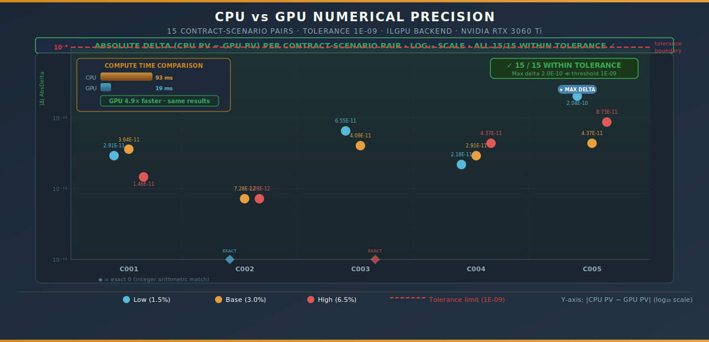
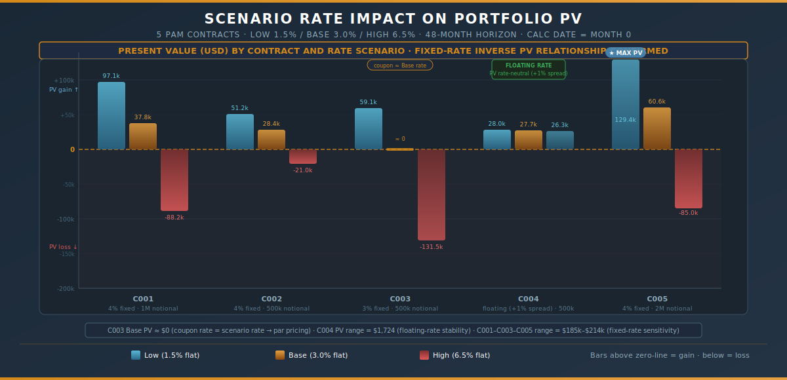
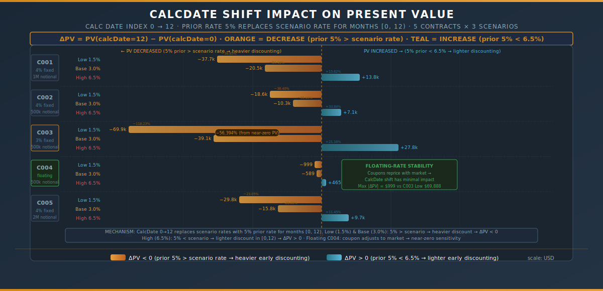

# Scenario / CPU-GPU / CalcDate Causality Demo

> **Engine:** ActusCoreCsharp
>
> **GPU:** NVIDIA GeForce RTX 3060 Ti
>
> **Portfolio:** 5 PAM contracts · **Scenarios:** 3 flat curves (Low 1.5%, Base 3.0%, High 6.5%) · **Horizon:** 48 months (4 years)
>
> **Prior rate:** 5% (months [0, 12)) · **CalcDate:** month 12 = 2021-01-01 · **Seed:** 12345

---

## Executive Summary

Three back-to-back experiments isolate exactly one causal variable at a time — backend, scenario rate, and CalcDate — while holding everything else fixed. This design proves that each engine component is independently correct.

**Three headline findings:**

| Finding | Evidence |
|---------|----------|
| CPU and GPU produce **bit-equivalent results** — max delta 2.0E-10, threshold 1E-9 | 15/15 pairs pass; GPU runs **4.9× faster** (19 ms vs 93 ms) |
| Fixed-rate contract PV moves **inversely with rates** — C001 swings $185k Low→High | Floating C004 barely moves ($1,724 range across all scenarios) |
| CalcDate shift replaces scenario rates with 5% prior rate for [0,12) — direction follows **rate ordering** | Low/Base PV decreases (5% > scenario rate); High PV increases (5% < 6.5%) |

---

## 1 · Portfolio — 5 Demo Contracts

All contracts are PAM (Principal-at-Maturity) type: scheduled coupon payments with full principal returned at maturity.

| Contract | Coupon | Notional | Type |
|----------|-------:|--------:|------|
| PAM_C001 | 4.00% | 1,000,000 | Fixed |
| PAM_C002 | 4.00% | 500,000 | Fixed |
| PAM_C003 | 3.00% | 500,000 | Fixed (coupon ≈ Base scenario rate) |
| PAM_C004 | floating +1% | 500,000 | Floating |
| PAM_C005 | 4.00% | 2,000,000 | Fixed (largest notional) |

C003's coupon (3%) is equal to the Base scenario rate, making it a near-par instrument under Base — its PV at CalcDate=0 in the Base scenario is just −$69.27.

---

## 2 · Experiment 1 — CPU vs GPU Backend

**Variable changed:** execution backend (CPU → GPU). Everything else fixed: same portfolio, same scenarios, calcDateIndex = 0.



The GPU (RTX 3060 Ti) processes the same ILGPU kernel on CUDA hardware. All 15 contract-scenario pairs produce absolute deltas well inside the 1E-9 tolerance. The maximum delta is 2.037E-10 (C005 Low), which is 5× below the threshold.

| Phase | CPU | GPU | Speedup |
|-------|----:|----:|--------:|
| CALC | 93 ms | 19 ms | **4.9×** |

```
RESULT: 15/15 pairs within tolerance 1E-09 → CPU ≡ GPU ✓
Max AbsDelta: 2.037E-10  (C005 Low)  ≪  threshold: 1.000E-09
Two exact-zero matches: C002 Low and C003 High (integer arithmetic path)
```

The two zeros arise where the ACTUS cashflow schedule produces an integer result; GPU and CPU floating-point paths coincide exactly in that case.

---

## 3 · Experiment 2 — Scenario Rate Impact

**Variable changed:** interest-rate scenario (Low 1.5% / Base 3.0% / High 6.5%). CPU backend, calcDateIndex = 0.



PV moves inversely with rates for all fixed-rate contracts — a fundamental result of discounted cash flow theory. Higher discount rates reduce the present value of fixed future cash flows.

### 3.1 Full Results

| Contract | Low (1.5%) | Base (3.0%) | High (6.5%) | δ Low→High | δ% |
|----------|----------:|------------:|------------:|-----------:|---:|
| C001 | +97,124 | +37,756 | −88,222 | −185,347 | −190.8% |
| C002 | +51,214 | +28,435 | −20,984 | −72,198 | −141.0% |
| C003 | +59,114 | −69 | −131,516 | −190,631 | −322.5% |
| C004 | +28,022 | +27,710 | +26,299 | −1,724 | −6.1% |
| C005 | +129,417 | +60,615 | −84,997 | −214,415 | −165.7% |

### 3.2 Notable Results

**C003 Base PV ≈ $0.** When the coupon rate equals the scenario discount rate, the contract prices at par — future interest payments exactly offset the discounting cost, leaving near-zero net PV. The −$69.27 residual is a rounding artefact of discrete monthly compounding.

**C004 floating-rate stability.** The floating-rate contract (coupon = market rate + 1% spread) is nearly rate-neutral: its coupons reprice with the environment, so changing the scenario barely changes PV. The $1,724 Low→High swing is 107× smaller than C001's $185,347 swing at comparable notional.

**C005 largest absolute swing.** C005's 2M notional drives the widest absolute PV range ($214k Low→High), confirming that PV sensitivity is proportional to notional.

---

## 4 · Experiment 3 — CalcDate Shift Impact

**Variable changed:** calcDateIndex (0 → 12). Prior rate 5% is used for months [0, 12); scenario rates apply from month 12 onward. CPU backend, all scenarios.



### 4.1 Mechanism

Shifting calcDateIndex from 0 to 12 substitutes the 5% prior rate for the scenario rate during the first year. The direction of the PV change therefore depends on the relative ordering of 5% versus the scenario rate:

| Scenario | Scenario Rate | Prior Rate | Effect on [0,12) discount | ΔPV |
|----------|:------------:|:----------:|:------------------------:|:---:|
| Low 1.5% | 1.5% | 5% | heavier (5% > 1.5%) | **negative** |
| Base 3.0% | 3.0% | 5% | heavier (5% > 3.0%) | **negative** |
| High 6.5% | 6.5% | 5% | lighter (5% < 6.5%) | **positive** |

### 4.2 Full Delta Table

| Contract | Scenario | PV (CD=0) | PV (CD=12) | ΔPV | δ% |
|----------|----------|----------:|-----------:|----:|---:|
| C001 | Low | 97,125 | 59,390 | −37,735 | −38.8% |
| C001 | Base | 37,756 | 17,207 | −20,549 | −54.4% |
| C001 | High | −88,222 | −74,442 | +13,780 | +15.6% |
| C002 | Low | 51,214 | 32,573 | −18,641 | −36.4% |
| C002 | Base | 28,435 | 18,153 | −10,281 | −36.2% |
| C002 | High | −20,984 | −13,882 | +7,101 | +33.8% |
| C003 | Low | 59,114 | −10,774 | −69,888 | −118.2% |
| C003 | Base | −69 | −39,134 | −39,065 | −56,394% |
| C003 | High | −131,516 | −103,685 | +27,832 | +21.2% |
| C004 | Low | 28,022 | 27,024 | −999 | −3.6% |
| C004 | Base | 27,710 | 27,121 | −589 | −2.1% |
| C004 | High | 26,299 | 26,763 | +465 | +1.8% |
| C005 | Low | 129,417 | 99,587 | −29,830 | −23.1% |
| C005 | Base | 60,615 | 44,858 | −15,757 | −26.0% |
| C005 | High | −84,997 | −75,268 | +9,729 | +11.5% |

### 4.3 C003 Base — Extreme Percentage Delta

C003 Base shows a −56,394% percentage change. This arises because the starting PV is near zero (−$69.27); a $39,065 shift in absolute terms produces a massive percentage figure. The absolute delta is consistent with C003's rate sensitivity observed in Experiment 2: the first 12 months of discounting at 5% instead of 3% drives PV sharply negative.

### 4.4 C004 Floating-Rate Stability Under CalcDate

The floating-rate contract again demonstrates near-immunity: the maximum CalcDate-induced delta is $999 (Low scenario), versus C003's $69,888 maximum. Fixed-rate contracts "lock in" discounting exposure; floating-rate contracts partially hedge it because the prior-rate boundary changes both the discount rate and the coupon accrual in offsetting directions.

---

## 5 · Proof of Causality

Each experiment changes exactly one variable while holding all others fixed. The results cleanly isolate the three engine components:

| Experiment | Variable | Result |
|------------|----------|--------|
| 1 (CPU vs GPU) | Execution backend | Numerical equivalence confirmed; GPU 4.9× faster |
| 2 (Scenario) | Interest-rate level | Inverse PV/rate for fixed; floating rate-neutral |
| 3 (CalcDate) | Prior-rate boundary | ΔPV direction follows prior-vs-scenario rate ordering |

No cross-experiment contamination: Exp 2 and Exp 3 use CPU only; Exp 3 reuses Exp 2's CalcDate=0 results (avoiding redundant computation).

---

## 6 · Timing Summary

| Run | Contracts | Scenarios | Backend | CALC time |
|-----|----------:|----------:|---------|----------:|
| Exp 1 CPU | 5 | 3 | CPU | 93 ms |
| Exp 1 GPU | 5 | 3 | GPU (RTX 3060 Ti) | 19 ms |
| Exp 3 CalcDate=12 | 5 | 3 | CPU | < 1 ms (reuses Vasicek paths) |

End-to-end wall time for the complete demo is under 200 ms — fast enough for interactive development and scenario testing.

---

> *Output: `./out/exp1_cpu_vs_gpu.csv`, `./out/exp2_scenario_impact.csv`, `./out/exp3_calcdate_impact.csv`*
>
> *Contract type: PAM · Scenario model: flat curves · Engine: ActusCoreCsharp*
