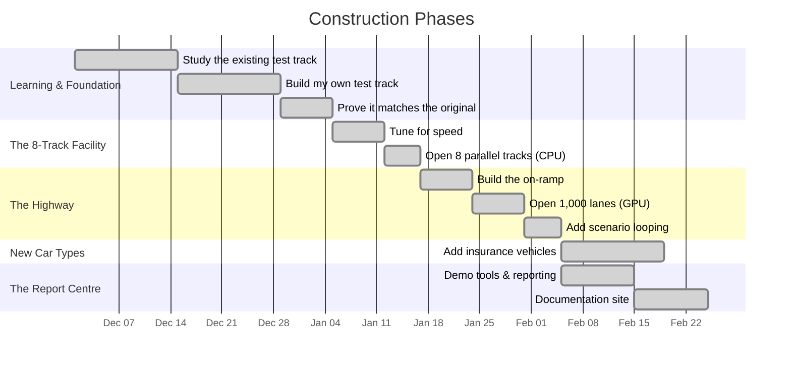

# Building the Highway — Development Timeline

## Overview

I started this project in December 2025, after being introduced to ACTUS by Francis Gross and Willi Brammertz. The competition deadline was March 16, 2026 — roughly three and a half months to go from knowing nothing about ACTUS to delivering a working GPU-accelerated engine with insurance extensions.

The project followed a strict rule: before upgrading the facility, prove that the current version produces correct results. Before adding lanes, prove the single track works. Before opening the highway, prove the 8-track facility matches. Before adding new car types, prove the highway matches the 8-track facility.

This discipline means every layer of the system stands on a verified foundation.

## Phase 1: Studying the Existing Track

The ACTUS standard already had a working test track — the reference implementation in Java. Before building anything new, I needed to understand exactly how it works: how cars enter the track, what measurements are taken at each checkpoint, and how the results are computed.

This was my first encounter with ACTUS. I had no prior experience with financial contract projections, Monte Carlo simulations, or deterministic cash flow modelling. But I could relate it to what I knew from insurance — where accuracy and speed are equally critical — and the car factory analogy quickly took shape in my mind.

Four core mechanics emerged:

**Contract types** are the car models. I started with PAM (Principal at Maturity) — the most common model, covering loans and deposits. Think of it as the standard sedan that every track must be able to handle.

**Event schedules** are the checkpoint markers along the track. Interest payments, rate adjustments, fee payments, and the final maturity — each is a checkpoint where the car is measured and its state is updated.

**State transitions** define what changes at each checkpoint. After an interest payment checkpoint, the accrued interest counter resets to zero. After a rate reset checkpoint, the interest rate is updated from market conditions. The state carries forward to the next checkpoint.

**Cash flow calculations** are the measurements themselves. At each checkpoint, a formula computes the payment amount based on the car's current state. These are the numbers that end up in the final report.

## Phase 2: Building My Own Track

I built a new track from scratch rather than modifying the original, for two reasons.

First, my deepest expertise is in my chosen development environment. Under time pressure, working in your strongest tool reduces mistakes and increases speed.

Second — and more importantly — **the highway I planned to build later requires cars to be prepared in a very specific way.** The original Java track accepts cars in their full, natural form — rich descriptions with text labels, nested structures, and flexible formats. A highway demands stripped-down, compact, uniform shapes. Designing the new track with this future requirement in mind from the start was far more efficient than retrofitting the original.

The new track follows the same rulebook as the original — the same checkpoints, the same state transitions, the same measurement formulas. The goal was not a better track, but an equally correct track built on a foundation that could later support a highway.

## Phase 3: Proving the New Track Matches

This was the most critical phase. ACTUS publishes 42 official reference cars — test cases that define exactly what measurements should be produced at every checkpoint. Think of them as 42 precision-engineered test vehicles with known, certified performance data.

I ran all 42 reference cars on my new track and compared every measurement to the certified values. The tolerance: **10 decimal places** — matching to within a billionth.

This phase surfaced a subtle problem: regional formatting. The certified data uses periods for decimal points (1234.56), but depending on the computer's regional settings, numbers can be silently misinterpreted (as 1234,56 — a completely different value). I eliminated this by enforcing a fixed, locale-independent interpretation everywhere.

Once all 42 cars produced identical measurements on my track, the track was certified.

## Phase 4: Tuning for Speed (the 8-Track Facility)

With a certified track in place, I focused on making it faster — without changing any measurement.

This is like streamlining the track operations: eliminating unnecessary stops between checkpoints, reusing measurement equipment instead of setting it up fresh each time, reorganising the garage so cars can be retrieved faster.

After every tuning change, all 42 reference cars were re-run. Any change that altered even one measurement by more than a billionth was rejected. Speed that compromises correctness is worthless in financial computation.

The result was an 8-track facility — the CPU engine — where 8 cars are tested in parallel on 8 optimised tracks.

## Phase 5: Building the Highway (the GPU)

This was the pivotal phase. The full story of how a highway works — with its on-ramp, lanes, looping, sinks, and off-ramp — is told in [Understanding CPU and GPU](./cpu-vs-gpu-explained.md). Here is the construction summary.

**The on-ramp.** I built a translation layer that converts every contract from its natural form into a compact, highway-compatible package. Text labels become codes. Dates become numbers. Nested structures become flat, uniform blocks. The smaller the package, the faster it flows through the on-ramp.

**The lanes.** Each lane on the highway runs exactly the same measurement programme as the single track and the 8-track facility — the same checkpoints, the same formulas, the same state transitions. The only difference is that thousands of lanes run at once.

**The looping.** After a car completes one scenario, it loops back to the start of its lane for the next scenario without ever exiting the highway. Contract data stays resident in GPU memory across all scenarios. Only the road conditions (scenario parameters) change.

**The validation.** All 42 reference cars were run on the highway and compared to the 8-track results. The measurements are identical to within the same 10-decimal-place tolerance. The highway is certified.

## Phase 6: Large-Scale Fleet Testing

With the highway certified, I tested it at scale — not 42 reference cars, but fleets of tens of thousands.

A fleet generator was built that creates realistic synthetic portfolios: contracts with varied loan amounts, interest rates, maturities, and payment schedules. The generator is deterministic — the same settings always produce the same fleet — so results are reproducible.

The benchmarks confirmed what the highway analogy predicts: for small fleets (under ~5,000 cars), the on-ramp overhead makes the 8-track facility faster. Above 10,000 cars, the highway dominates. At 100,000 cars, it is over twice as fast.

## Phase 7: Monte Carlo — Thousands of Road Conditions

Real risk management does not test the fleet under one set of road conditions. It asks: "What happens under a thousand different futures?"

A scenario generator was built using a well-established interest rate model. It creates thousands of plausible future rate paths — each one a different set of road conditions for the entire fleet.

This is where the highway's looping capability shines. The fleet is loaded onto the highway once (one pass through the on-ramp). Then the road conditions cycle through all 1,000 scenarios while the cars stay on the highway. The result is not one set of measurements but a full distribution: the range of outcomes, the average, the worst case, the key risk thresholds.

At 10,000 contracts under 10,000 scenarios, the highway completes 100 million runs in 28 seconds — more than 5 times faster than the 8-track facility.

## Phase 8: Adding Insurance Vehicles

This was the part closest to my own expertise. To prove the highway can handle more than one type of car, I added insurance vehicles — a fundamentally different design.

A banking contract (like a loan) follows a fixed schedule: interest payments happen on known dates, and the principal returns at maturity. It is like a car that follows a pre-programmed route — every checkpoint is known in advance.

An insurance policy is different. It can change state unpredictably: active, lapsed, in a grace period, under a claim, death benefit triggered. The transitions depend on probabilities — mortality rates, lapse rates — rather than fixed dates. It is like a car that can take different turns at each intersection, with the probability of each turn determined by statistical tables.

To handle this, the highway was extended with two new capabilities:

**A state transition map** — at each checkpoint, the insurance vehicle consults a probability table (derived from actuarial data) to determine which state it moves to, and computes the expected cash flow as a probability-weighted average across all possible paths.

**A configurable rule system** — instead of hard-coding insurance product rules into the highway, product rules are defined in structured templates. New insurance products can be added by creating a new template — no highway reconstruction needed. Actuaries and product designers define the rules; the highway executes them.

## Phase 9: The Report Centre

The final phase connected the highway to the real world.

A **command-line demonstration tool** runs the full journey end to end: generate a fleet (or load one from disk), generate scenarios, run the fleet through the highway, aggregate results through the sinks, and export everything to files that can be opened in Excel.

A **documentation website** was built to explain the system — what it does, how the concepts work, and how to use the tools. The site is searchable, navigable, and supports diagrams.

A **reporting layer** produces business-ready outputs: contract-level summaries, portfolio-level aggregations, and grouped reports by segment, region, or product line. This connects the highway's raw speed to the kind of reporting that risk managers and regulators actually need.

## What Surprised Me Most

The single biggest surprise of this project was the complexity of financial contract evaluation combined with the enormous performance that GPU acceleration delivered. Coming from insurance, I knew these calculations were complex — but seeing the highway handle 100 million independent test runs in under 30 seconds, while producing results identical to the original single track down to 10 decimal places, was genuinely remarkable. It confirmed that the approach works — and that the principles could be brought back to the insurance domain I came from.
