# Documentation Navigation Map

This page provides a visual overview of the entire documentation structure. Each section is a folder that becomes a navigation branch in the documentation site.

## Section Overview

```mermaid
graph TD
    ROOT[ACTUS-I Documentation] --> H[Hackathon]
    ROOT --> BG[Background GPU]
    ROOT --> T[Technical]
    ROOT --> AF[ACTUS Financial]
    ROOT --> AI[ACTUS Insurance]
    ROOT --> S[Shared]

    H --> H0[cpu-vs-gpu-explained.md<br/>Car Factory Analogy]
    H --> H1[index.md<br/>Story Overview]
    H --> H2[timeline.md<br/>Development Timeline]
    H --> H3[decisions.md<br/>Key Decisions]
    H --> H4[challenges.md<br/>Challenges & Solutions]
    H --> H5[results.md<br/>Outcomes & Benchmarks]

    BG --> BG1[index.md<br/>What is a GPU]
    BG --> BG2[gpu-vs-cpu.md<br/>Architecture Comparison]
    BG --> BG3[why-gpu-for-actus.md<br/>Why GPU for ACTUS]
    BG --> BG4[ilgpu-framework.md<br/>ILGPU Framework]

    T --> T1[Core Engine]
    T1 --> T1a[PAM Contract]
    T1 --> T1b[State Machine]
    T1 --> T1c[Conventions]
    T1 --> T1d[Schedule Generation]
    T1 --> T1e[Risk Factor Model]
    T1 --> T1f[Technical Reference]
    T --> T2[GPU Acceleration]
    T2 --> T2a[Data Structures]
    T2 --> T2b[Kernels]
    T2 --> T2c[Executors]
    T --> T3[Demos & Samples]
    T3 --> T3a[CLI Tool]
    T3 --> T3b[Scenario Demo]
    T --> T4[Testing]
    T4 --> T4a[Overview]
    T4 --> T4b[Running Tests]

    AF --> AF1[Contract Types]
    AF1 --> AF1a[PAM]
    AF --> AF2[Event System]
    AF --> AF3[Risk Factors]

    AI --> AI1[Life Insurance]
    AI --> AI2[Markov Model]
    AI --> AI3[DSL & Rules]

    S --> S1[terminology.md]
    S --> S2[navigation-map.md]
```

## How to Read This Documentation

Each section follows the same pattern: a short high-level overview first, then progressively more detail. You can stop reading at any level and still have a useful understanding of the topic.

| Level | What You Get |
|---|---|
| Section index page | 2-minute overview of the entire topic |
| First-level documents | 10-minute understanding of key concepts |
| Sub-documents | Full implementation details |

## Section Descriptions

**Hackathon** tells the story of the project: what was built, why, in what order, and what decisions were made along the way. The car factory analogy is the central narrative — start here for the story.

**Background GPU** explains GPU computing for readers who are not familiar with it. It covers why GPUs are suited for financial contract evaluation and how ILGPU bridges the .NET ecosystem to GPU hardware.

**Technical** is the implementation reference. It covers the core ACTUS engine (PAM, state machine, conventions), GPU acceleration (data structures, kernels, executors), demo tools (CLI, scenarios), and testing (42 reference tests, GPU validation).

**ACTUS Financial** documents the financial contract standard itself: the PAM contract type, the event system, state transitions, and risk factor handling.

**ACTUS Insurance** documents the insurance extensions: life insurance projection, the Markov state transition model, and the DSL for configurable product rules.

**Shared** contains cross-cutting reference material: this navigation map and the terminology glossary.

## Quick Paths

| I want to... | Start here |
|---|---|
| Understand the project story | [Hackathon → index.md](../hackathon/index.md) |
| Understand CPU vs GPU | [Hackathon → cpu-vs-gpu-explained.md](../hackathon/cpu-vs-gpu-explained.md) |
| Learn about ACTUS contracts | [ACTUS Financial → index.md](../actus-financial/index.md) |
| Understand the insurance extension | [ACTUS Insurance → index.md](../actus-insurance/index.md) |
| See the code architecture | [Technical → index.md](../technical/index.md) |
| Run the demo tool | [Technical → CLI Tool](../technical/demos-and-samples/cli-tool/index.md) |
| Run the tests | [Technical → Running Tests](../technical/testing/running-tests.md) |
| Look up a term | [Shared → Terminology](./terminology.md) |
