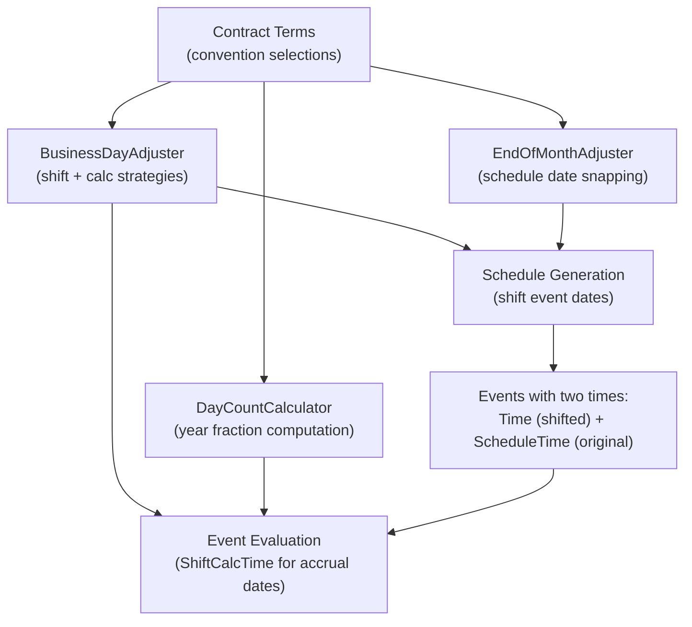

# Financial Conventions

## Overview

Financial contracts use a set of conventions to handle the practical details of dates and time measurement. These conventions determine three things: how much interest accrues between two dates (day count conventions), when payments actually settle (business day conventions), and how schedule dates align to month boundaries (end-of-month conventions).

Getting conventions right is critical: the same contract evaluated with different conventions produces different cash flows. For large portfolios, convention differences aggregate into material amounts. The ACTUS standard specifies each convention precisely, and this engine implements all of them.

## Concepts Before Details

Before diving into the implementations, three concepts need to be clear:

**Year fraction.** Interest is quoted as an annual rate (e.g., 5% per year), but payments happen at arbitrary intervals (monthly, quarterly, etc.). A "year fraction" converts the time between two dates into a fraction of a year. Multiply the year fraction by the annual rate and the principal to get the interest amount. Different conventions define "fraction of a year" differently — and that is the entire source of complexity.

**Business day.** A calendar day when financial markets are open and settlements can occur. Typically Monday through Friday, excluding public holidays. When a scheduled payment falls on a non-business day, a convention determines what happens: the payment might move to the next business day, the previous one, or stay put.

**Calc vs. Shift.** There are two separate questions about a payment that falls on a non-business day: (1) when does the payment actually settle? and (2) what dates do you use to calculate interest? These can have different answers. "CalcShift" means: calculate interest using the original date, but shift the settlement. "ShiftCalc" means: both the calculation and the settlement use the shifted date.

## Day Count Conventions

A day count convention defines how to measure the time between two dates for interest calculation. The engine implements seven conventions through the `IDayCountConventionProvider` interface, which has two methods:

- `DayCount(startDate, endDate)` — the raw number of days (or adjusted days)
- `DayCountFraction(startDate, endDate)` — the year fraction (days divided by the year basis)

The `DayCountCalculator` class acts as a factory, taking a convention string and returning the correct implementation.

### A/365 (Actual/365 Fixed)

The simplest convention. Count the actual calendar days between the two dates and divide by 365. Always 365 — even in leap years.

```
YearFraction = ActualDays / 365
```

Used for UK government bonds and many non-USD instruments. Example: from January 15 to April 15 (90 days) → 90/365 = 0.24658.

### A/360 (Actual/360)

Count actual calendar days, divide by 360. Because the denominator is smaller than the actual year, this convention produces slightly higher interest amounts than A/365 for the same period.

```
YearFraction = ActualDays / 360
```

Used for USD money markets and LIBOR-based instruments. Example: from January 15 to April 15 (90 days) → 90/360 = 0.25000.

### A/A ISDA (Actual/Actual ISDA)

The most accurate convention — it accounts for leap years. When a period falls entirely within one calendar year, divide by the actual number of days in that year (365 or 366). When a period spans multiple years, split it at the year boundary and compute each segment separately.

```
If same year:
    YearFraction = ActualDays / DaysInYear(year)

If spanning years:
    YearFraction = DaysInFirstYear / BasisOfFirstYear
                 + DaysInLastYear / BasisOfLastYear
                 + CompleteYearsInBetween
```

Where `BasisOfYear` is 366 for leap years and 365 for non-leap years.

Used for government bonds where leap-year accuracy matters. Example: from December 1, 2023 to March 1, 2024 (91 days, spanning a leap year) → 31/365 + 60/366 = 0.24867.

### 30E/360 (European 30/360)

An artificial convention that assumes every month has 30 days and every year has 360 days. Day 31 of any month is treated as day 30.

```
DayCount = 360 × (Y2 − Y1) + 30 × (M2 − M1) + (D2_adj − D1_adj)
YearFraction = DayCount / 360
```

Where D1_adj and D2_adj replace day 31 with day 30.

Used for many European bonds and standardized calculations. Example: from January 31 to March 31 → 360×0 + 30×2 + (30−30) = 60 days → 60/360 = 0.16667.

### 30E/360 ISDA

A variant of 30E/360 with an ISDA-specific rule: if either date is the last day of its month, treat it as day 30, except that the maturity date in February is not adjusted. This prevents a February 28 maturity from being treated as February 30.

The implementation requires knowledge of the maturity date, which is set via a `SetMaturityDate()` method before calculation.

### B/252 (Business/252)

Instead of counting calendar days, count only business days (as determined by the calendar provider) and divide by 252 — the assumed number of business days per year.

```
YearFraction = BusinessDays / 252
```

Used in the Brazilian market. This convention requires a calendar that defines which days are business days, making it the only day count convention with an external dependency.

### A/336 (Actual/336)

Count actual calendar days, divide by 336 (28 days × 12 months). This convention is specific to certain insurance applications where a "month" is always 28 days.

```
YearFraction = ActualDays / 336
```

### 28/336

A companion to A/336 that treats day counts similarly to 30E/360 but with a 28-day month and 336-day year. Days 28 through 31 of any month are treated as day 28, and the formula uses 336 × ΔY + 28 × ΔM + ΔD.

## Business Day Conventions

When a scheduled event falls on a non-business day, the business day convention determines two things: where the event actually settles (the "shifted" date), and what date is used for interest calculations.

The engine implements this through two cooperating interfaces:

- `IBusinessDayConvention` — the shift strategy: how to move a non-business day to a business day
- `IShiftCalcConvention` — the calc strategy: whether calculations follow the shift or stay on the original date

The `BusinessDayAdjuster` class coordinates both, exposing two methods:
- `ShiftEventTime(date)` — returns the shifted settlement date
- `ShiftCalcTime(date)` — returns the date to use for interest calculations

### Shift Strategies

**Same (No Adjustment):** The event stays on its scheduled date regardless of whether it is a business day. Used with the NOS convention.

**Following:** Move forward to the next business day. If an event falls on Saturday, it settles on Monday.

```
while (date is not a business day):
    date = date + 1 day
```

**Modified Following:** Move forward to the next business day, but if that would cross a month boundary, move backward instead. This prevents a month-end payment from settling in the next month.

```
shiftedDate = apply Following(date)
if shiftedDate.Month ≠ date.Month:
    shiftedDate = apply Preceding(date)  // go backward instead
```

**Preceding:** Move backward to the previous business day.

```
while (date is not a business day):
    date = date − 1 day
```

**Modified Preceding:** Move backward, but if that would cross a month boundary, move forward instead.

```
shiftedDate = apply Preceding(date)
if shiftedDate.Month ≠ date.Month:
    shiftedDate = apply Following(date)  // go forward instead
```

### Calc/Shift Strategies

**ShiftCalc:** Both the event settlement and the calculation use the shifted date. The `ShiftCalcTime()` method applies the business day shift.

**CalcShift:** The event settles on the shifted date, but calculations use the original unshifted date. The `ShiftCalcTime()` method returns the original date unchanged.

### The Nine Conventions

Combining the shift and calc strategies yields nine conventions:

| Code | Shift Strategy | Calc Strategy | Description |
|---|---|---|---|
| NOS | Same | ShiftCalc | No adjustment — everything uses the original date |
| CSF | Following | CalcShift | Settle forward, calculate on original |
| CSMF | Modified Following | CalcShift | Settle modified forward, calculate on original |
| CSP | Preceding | CalcShift | Settle backward, calculate on original |
| CSMP | Modified Preceding | CalcShift | Settle modified backward, calculate on original |
| SCF | Following | ShiftCalc | Both settle and calculate on the shifted forward date |
| SCMF | Modified Following | ShiftCalc | Both on the modified forward date |
| SCP | Preceding | ShiftCalc | Both on the shifted backward date |
| SCMP | Modified Preceding | ShiftCalc | Both on the modified backward date |

The "CS" prefix (Calc-Shift) means calculations use the original date. The "SC" prefix (Shift-Calc) means calculations follow the shift. The suffix indicates the direction: "F" for following, "MF" for modified following, "P" for preceding, "MP" for modified preceding.

### When the Convention Matters

Consider a quarterly interest payment scheduled for Saturday, March 31. With convention SCF (ShiftCalc Following), the payment settles on Monday, April 2, and the interest accrual period runs to April 2. With CSF (CalcShift Following), the payment also settles on April 2, but the interest accrual period runs to March 31 (the original date). The difference in interest can be non-trivial.

## End-of-Month Convention

When a schedule cycle starts on the last day of a month (e.g., January 31 or February 28), the end-of-month convention determines whether subsequent dates also snap to month-ends.

The `EndOfMonthAdjuster` evaluates two conditions before activating:
1. The reference date (cycle anchor) must be the last day of its month
2. The cycle must have a month-based period (months > 0)

If both conditions are met and the EOM convention is enabled, every generated schedule date is shifted to the last day of its month. Otherwise, the SameDay convention applies (no adjustment).

| EOM Convention | Starting Jan 31 | February | March | April |
|---|---|---|---|---|
| EOM (enabled) | Jan 31 | Feb 28/29 | Mar 31 | Apr 30 |
| SD (disabled) | Jan 31 | Feb 28/29 | Mar 31 | Apr 30* |

*In practice, SD keeps the day-of-month where possible (e.g., 31st → 28/29 → 31st → 30th).

### Implementation Detail

The `EndOfMonth` shift implementation:
```
Shift(date) → new DateTime(date.Year, date.Month, DaysInMonth(date.Year, date.Month))
```

The `SameDay` implementation returns the date unchanged.

## Calendars

The calendar determines which days are business days. Three calendar types are supported:

### NC — No Calendar

All days are business days. No shifting ever occurs. This is the default and is used when no business day adjustments are needed.

### MF — Monday to Friday

Standard weekday calendar. Saturdays and Sundays are non-business days. No holiday support.

### MFH — Monday to Friday with Holidays

Weekdays minus a specific set of holiday dates. The implementation stores holidays as a `HashSet<DateTime>` for O(1) lookup. A day is a business day if it is Monday–Friday and not in the holiday set.

### Calendar Providers

All calendars extend the `BusinessDayCalendarProvider` base class, which defines the `IsBusinessDay(DateTime)` method. The base implementation returns true for weekdays (used by MF). The `NoHolidaysCalendar` always returns true (used by NC). The `MondayToFridayWithHolidaysCalendar` additionally checks against the holiday set.

## How Conventions Flow Through the Engine



The convention selections in the contract terms instantiate the appropriate implementations at the start of processing. These implementations are then threaded through schedule generation (for date shifting and EOM snapping) and event evaluation (for year fraction calculation using the correct date pair).

## Continue Reading

- [Schedule Generation](./scheduling.md) — how cycle strings produce periodic date sequences
- [State Machine](./state-machine.md) — how conventions affect interest accrual between events
- [PAM Contract](./pam-contract.md) — where conventions are used in the full contract pipeline
- [Technical Reference](./reference.md) — enum values for all convention types
