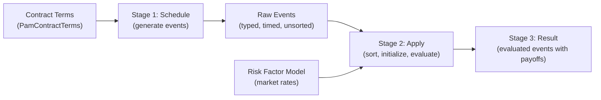
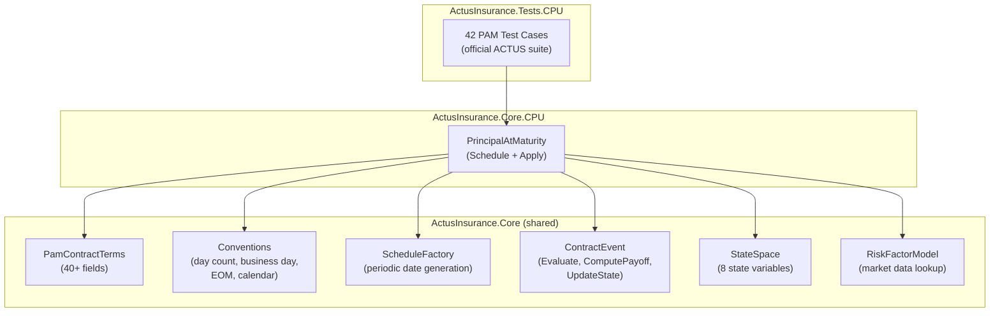

# Core Engine Overview

## Overview

The core engine is the heart of the ACTUS implementation. It takes a set of contract terms — the legal and financial parameters that define a financial instrument — and produces a complete, time-ordered list of evaluated events. Each event carries a date, a type, a cash flow amount (payoff), and a snapshot of the contract's state after the event occurred. Every other component in the system (GPU acceleration, Monte Carlo simulation, insurance extensions) builds on top of this deterministic evaluation pipeline.

The engine is split across two .NET projects that separate abstraction from implementation:

- **ActusInsurance.Core** — shared abstractions: interfaces, domain models, type enumerations, financial conventions (day count, business day, end-of-month, calendars), time utilities (schedule generation, cycle parsing), and the risk factor model. This project has zero external dependencies — it is pure C#.
- **ActusInsurance.Core.CPU** — contract-type implementations that use the Core abstractions. Currently contains the full PAM (Principal at Maturity) implementation: schedule generation and sequential event evaluation.

A third project, **ActusInsurance.Tests.CPU**, provides 42 reference test cases derived from the official ACTUS test suite in JSON format, validating every event type, convention, and edge case against known-correct results.

## Design Principles

Three principles govern the engine's design:

**Deterministic execution.** Given the same contract terms and the same market data, the engine always produces exactly the same output. This is not optional — financial contracts must be auditable and independently verifiable. The engine achieves determinism through strict event ordering (time first, then priority), pure functions for payoff computation, and no dependence on floating-point operation order.

**Separation of terms and logic.** Contract terms are plain data objects with no behavior. All computation lives in the contract processor (e.g., `PrincipalAtMaturity`), which reads terms but never modifies them. This separation makes it straightforward to serialize terms, send them to a GPU, or store them in a database.

**Convention-driven computation.** Financial contracts differ not just in their structure but in the conventions they use for dates, interest accrual, and calendar adjustments. Rather than hard-coding these rules, the engine parameterizes them: each contract specifies which day count convention, business day convention, end-of-month convention, and calendar to use. The engine dispatches to the correct implementation at runtime.

## The Three-Stage Pipeline

Every contract evaluation follows the same three-stage pipeline:



### Stage 1: Schedule Generation

The `Schedule()` method reads the contract terms and generates every event that will occur during the contract's lifetime. It creates mandatory events (Initial Exchange Date, Maturity Date) and then generates periodic events from cycle definitions (interest payments, rate resets, fee payments, scaling updates). Each event is stamped with two times: the original schedule time (the contractually specified date) and the shifted time (the date adjusted for business day conventions). Events are not yet sorted or evaluated — they are raw placeholders.

### Stage 2: Event Application

The `Apply()` method takes the raw events, sorts them by time and priority, initializes the contract state from the terms, and then processes each event in strict sequence. For each event, the engine:

1. Accrues interest from the previous event's date to the current event's date
2. Computes the event's payoff using its type-specific formula
3. Updates the contract state using the event's type-specific transition logic
4. Records a snapshot of the payoff and the updated state into the event

The risk factor model is consulted whenever an event needs external market data (rate resets, scaling index lookups).

### Stage 3: Result

The output is the same list of events, now populated with computed payoffs and state snapshots. Each event in the result contains: the event date, event type, payoff amount, and the full contract state (notional principal, nominal interest rate, accrued interest, fee accrued) as it stood immediately after the event was processed.

## Key Abstractions

### IContractScheduler

The generic interface that all contract types implement:

```
IContractScheduler<TTerms>
├── Schedule(DateTime to, TTerms terms) → List<ContractEvent>
└── Apply(List<ContractEvent> events, TTerms terms, RiskFactorModel) → List<ContractEvent>
```

`TTerms` is the contract-specific terms type. For PAM, it is `PamContractTerms`. Other ACTUS contract types (LAM, NAM, ANN) would implement this interface with their own terms type, reusing the shared conventions and event infrastructure.

### PamContractTerms

The domain model that carries all parameters of a PAM contract: over 40 fields organized into identity and dates, principal and interest, payment cycles, rate reset parameters, fee settings, scaling configuration, and convention selections. Terms are plain data — no behavior, no side effects. They can be deserialized from JSON using a `FromDictionary()` factory method that maps the official ACTUS test format directly.

### ContractEvent

A sealed class representing a single event in a contract's life. Each event knows its type, its scheduled and adjusted times, and contains the logic to compute its own payoff and update the contract state via the `Evaluate()` method. Events implement `IComparable<ContractEvent>`, sorting first by adjusted time and then by event-type priority to ensure deterministic ordering.

### StateSpace

A value struct that captures the complete state of a contract at a point in time: notional principal, nominal interest rate, accrued interest, fee accrued, notional and interest scaling multipliers, status date, and contract performance. Using a struct ensures copy-by-value semantics, which matters for thread safety when the same contract is evaluated under multiple scenarios in parallel.

### RiskFactorModel

A lookup service for external market data. Stores rates as either constant values (a single rate for all times) or time series (rates keyed by date). When a time series lookup does not find an exact date match, it uses Last Observation Carried Forward (LOCF) — returning the most recent rate on or before the requested date.

## Project Structure

```
ActusInsurance.Core/
├── Contracts/
│   └── IContractScheduler.cs          — Generic contract scheduler interface
├── Conventions/
│   ├── BusinessDay/                    — BusinessDayAdjuster + 9 convention implementations
│   │   ├── BusinessDayAdjuster.cs      — Main coordinator (ShiftEventTime, ShiftCalcTime)
│   │   ├── IBusinessDayConvention.cs   — Shift strategy interface
│   │   ├── IShiftCalcConvention.cs     — Calc/Shift strategy interface
│   │   ├── Same.cs                     — NOS: no adjustment
│   │   ├── Following.cs               — Move forward to next business day
│   │   ├── ModifiedFollowing.cs        — Forward, but stay in same month
│   │   ├── Preceeding.cs              — Move backward to previous business day
│   │   ├── ModifiedPreceeding.cs       — Backward, but stay in same month
│   │   ├── ShiftCalc.cs               — Calculations use shifted dates
│   │   └── CalcShift.cs               — Calculations use original dates
│   ├── ContractRoles/
│   │   └── ContractRoleConvention.cs   — RoleSign computation (+1 or -1)
│   ├── DayCount/
│   │   ├── DayCountCalculator.cs       — Factory: string → convention instance
│   │   ├── IDayCountConventionProvider.cs — Interface: DayCount + DayCountFraction
│   │   ├── ActualThreeSixtyFiveFixed.cs — A/365: actual days ÷ 365
│   │   ├── ActualThreeSixty.cs         — A/360: actual days ÷ 360
│   │   ├── ActualActualISDA.cs         — A/A ISDA: leap-year-aware
│   │   ├── ThirtyEThreeSixty.cs        — 30E/360: day-31 → 30
│   │   ├── ThirtyEThreeSixtyISDA.cs    — 30E/360 ISDA: maturity-aware variant
│   │   ├── BusinessTwoFiftyTwo.cs      — B/252: business days ÷ 252
│   │   ├── ActualThreeThirtySix.cs     — A/336: actual days ÷ 336
│   │   └── TwentyEightThreeThirtySix.cs — 28/336: day-28 convention
│   └── EndOfMonth/
│       ├── EndOfMonthAdjuster.cs       — Main coordinator (EOM vs SD)
│       ├── IEndOfMonthConvention.cs    — Shift interface
│       ├── EndOfMonth.cs               — Snap to last day of month
│       └── SameDay.cs                  — No adjustment
├── Events/
│   └── ContractEvent.cs                — Event with Evaluate, ComputePayoff, UpdateState
├── Externals/
│   └── RiskFactorModel.cs              — Market data: constant rates + time series + LOCF
├── Models/
│   ├── IContractTerms.cs               — Base interface (ContractID, ContractType)
│   └── PamContractTerms.cs             — 40+ fields, FromDictionary() factory
├── States/
│   └── StateSpace.cs                   — Value struct: 8 state variables
├── Time/
│   ├── ScheduleFactory.cs              — Periodic date sequence generation
│   ├── CycleAdjuster.cs                — Period vs weekday cycle dispatch
│   ├── PeriodCycleAdjuster.cs          — Period-based cycle arithmetic
│   ├── WeekdayCycleAdjuster.cs         — Weekday-based cycle arithmetic
│   ├── TimeAdjuster.cs                 — Hour rounding utility
│   └── Calendar/
│       ├── BusinessDayCalendarProvider.cs — Base: weekday check
│       ├── MondayToFridayCalendar.cs     — MF: Mon–Fri only
│       ├── MondayToFridayWithHolidaysCalendar.cs — MFH: Mon–Fri minus holidays
│       └── NoHolidaysCalendar.cs         — NC: all days are business days
├── Types/
│   └── Enums.cs                        — EventType, ContractRole, DayCountConvention,
│                                          BusinessDayConventionEnum, Calendar,
│                                          EndOfMonthConventionEnum, ContractTypeEnum,
│                                          ContractPerformance, FeeBasis, CyclePoints
└── Util/
    ├── CycleUtils.cs                   — Cycle string parsing (period, stub, weekday)
    ├── Constants.cs                    — MAX_LIFETIME (50 years), stub characters
    ├── StringUtils.cs                  — Convention string constants
    ├── CommonUtils.cs                  — Null-check helper
    └── AttributeConversionException.cs — Parsing error type

ActusInsurance.Core.CPU/
└── Contracts/
    └── PAM.cs                          — PrincipalAtMaturity: Schedule + Apply (346 lines)

ActusInsurance.Tests.CPU/
├── PamTests.cs                         — 42 test cases from official ACTUS suite
└── Resources/
    └── actus-tests-pam.json            — Test data: terms, market data, expected results
```

## How It All Connects



## Continue Reading

- [PAM Contract](./pam-contract.md) — full walkthrough of the PAM implementation: terms, schedule generation, event evaluation, and all payoff formulas
- [State Machine](./state-machine.md) — how events modify contract state, with detailed transition logic for each event type
- [Conventions](./conventions/index.md) — day count, business day, end-of-month, and calendar convention implementations
- [Schedule Generation](./scheduling.md) — how periodic date sequences are built from cycle strings
- [Risk Factor Model](./risk-factors.md) — market data storage, lookup strategies, and the LOCF algorithm
- [Technical Reference](./reference.md) — complete listing of all types, enumerations, interfaces, and structs
