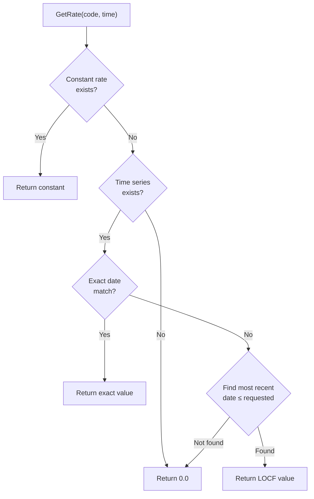

# Risk Factor Model

## Overview

The risk factor model is the engine's interface to the outside world. While contract terms and event logic are fully deterministic, certain events need external data — a current market interest rate for a rate reset, or a current index value for a scaling update. The `RiskFactorModel` class provides this data.

The model is deliberately simple: it stores rates keyed by a market object code (a string identifier) and a timestamp, and provides a single lookup method. It does not model interest rate dynamics, generate scenarios, or forecast future rates. Those responsibilities belong to higher-level components (the Monte Carlo simulation layer, the Vasicek rate model). The risk factor model is purely a lookup service.

## Concepts

### Market Object Code

A market object code is a string that uniquely identifies a market observable — such as an interest rate index, an inflation index, or a foreign exchange rate. In the ACTUS test suite, codes like "LIBOR_6M" or "EURIBOR_3M" are typical. The contract terms reference these codes (e.g., `MarketObjectCodeOfRateReset = "LIBOR_6M"`), and the risk factor model stores the corresponding values.

### Last Observation Carried Forward (LOCF)

Market data is not available at every point in time. When the engine needs a rate for a specific date and that exact date is not in the time series, the model uses LOCF: it returns the most recent observation on or before the requested date. This is the standard approach in financial time series — the assumption is that the last known rate remains valid until a new observation arrives.

## Storage

The `RiskFactorModel` maintains two parallel storage mechanisms:

### Constant Rates

```
Dictionary<string, double> _constantRates
```

A single value per market object code, valid at all times. This is the fastest lookup path and handles the common case where a rate does not change over the contract's life.

### Time Series Rates

```
Dictionary<string, Dictionary<DateTime, double>> _rates
```

Multiple values per market object code, each keyed by a date. This handles rates that change over time — for example, a rate reset schedule where different dates have different market rates.

## Adding Data

Two methods populate the model:

**`AddConstantRate(marketObjectCode, value)`** — sets a single rate for all times. If a constant rate already exists for that code, it is overwritten.

**`AddRate(marketObjectCode, time, value)`** — adds a time-stamped rate. Multiple calls with the same code but different times build up a time series. If a rate already exists for the same code and time, it is overwritten.

Both methods can be used for the same market object code. When both exist, the constant rate takes precedence in lookups (see below).

## Lookup

The `GetRate(marketObjectCode, time)` method retrieves a rate value. It follows a four-step priority chain:

**Step 1 — Check constant rates.** If a constant rate exists for the given code, return it immediately. This is the fastest path and covers the most common case.

**Step 2 — Check exact time match.** If a time series exists for the code, look for the exact requested date. If found, return that value.

**Step 3 — LOCF fallback.** If no exact match exists in the time series, scan all entries to find the most recent date that is on or before the requested date. Return that value.

**Step 4 — Default.** If no data exists at all (no constant rate, no time series, or no observations before the requested date), return 0.0.

### Lookup Priority Diagram



### LOCF Example

Given a time series for "LIBOR_6M":

| Date | Value |
|---|---|
| 2025-01-01 | 0.030 |
| 2025-04-01 | 0.035 |
| 2025-07-01 | 0.032 |

Lookups:
- `GetRate("LIBOR_6M", 2025-01-01)` → 0.030 (exact match)
- `GetRate("LIBOR_6M", 2025-03-15)` → 0.030 (LOCF from Jan 1)
- `GetRate("LIBOR_6M", 2025-04-01)` → 0.035 (exact match)
- `GetRate("LIBOR_6M", 2025-05-15)` → 0.035 (LOCF from Apr 1)
- `GetRate("LIBOR_6M", 2024-12-15)` → 0.0 (no observation on or before)

## Usage in the Engine

The risk factor model is used in three contexts:

### Rate Resets (RR Events)

When a rate reset event is processed, the engine calls:

```
marketRate = riskFactors.GetRate(model.MarketObjectCodeOfRateReset, eventTime)
```

This market rate is then transformed by the rate reset algorithm (multiplier, spread, caps, floors) to produce the new nominal interest rate.

### Fixed Rate Resets (RRF Events)

RRF events use the `NextResetRate` from the contract terms instead of a market lookup. However, if `NextResetRate` is not set, the engine falls back to a market lookup using the same mechanism as RR events.

### Scaling Updates (SC Events)

When a scaling event is processed, the engine calls:

```
scalingIndex = riskFactors.GetRate(model.MarketObjectCodeOfScalingIndex, eventTime)
```

The returned index value is divided by the base index (`ScalingIndexAtContractDealDate`) to compute the scaling factor.

### Foreign Exchange Rates

The payoff formulas include an `fxRate` term, which is obtained via:

```
fxRate = riskFactors.GetRate(model.Currency, eventTime)
```

In the current implementation, this always returns 1.0 (no multi-currency support). The infrastructure is in place for future extension.

## Test Data Format

The ACTUS reference test suite provides market data in a specific JSON format:

```json
{
    "dataObserved": {
        "market_index_code": {
            "marketObjectCode": "LIBOR_6M",
            "data": [
                { "timestamp": "2025-01-01", "value": "0.030" },
                { "timestamp": "2025-04-01", "value": "0.035" }
            ]
        }
    }
}
```

The test harness populates the `RiskFactorModel` by iterating over each data set and calling `AddRate()` for each timestamp/value pair. This structure allows multiple market object codes, each with their own time series.

## Design Notes

The risk factor model is intentionally minimal. It does not:

- Generate future rate scenarios (that is the Monte Carlo layer's job)
- Interpolate between observations (LOCF is the only strategy)
- Validate that rates are reasonable (negative rates are valid in some markets)
- Support complex term structures (each code is a flat time series)

This simplicity is by design. The core engine's job is deterministic evaluation: given inputs, produce outputs. The risk factor model is one of those inputs — how it gets populated is the responsibility of the caller. For the 42 reference tests, the test harness populates it from JSON. For Monte Carlo simulation, the Vasicek rate model populates it with simulated rate paths. For GPU batch evaluation, the executor populates it from scenario data.

## Continue Reading

- [State Machine](./state-machine.md) — how rate resets and scaling updates use the risk factor model
- [PAM Contract](./pam-contract.md) — the full contract evaluation pipeline
- [Technical Reference](./reference.md) — RiskFactorModel class details
