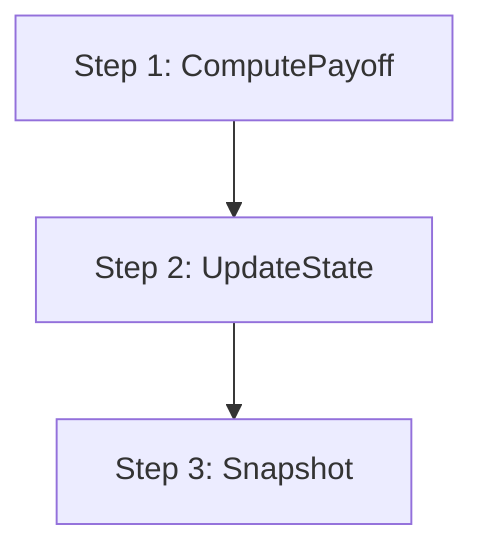
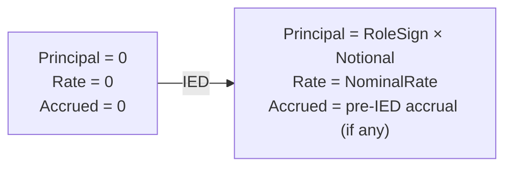
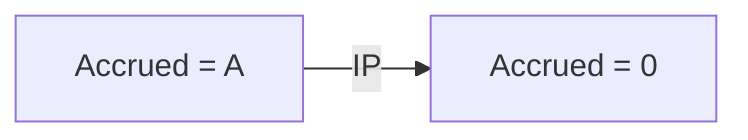
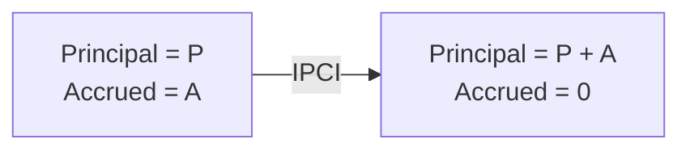
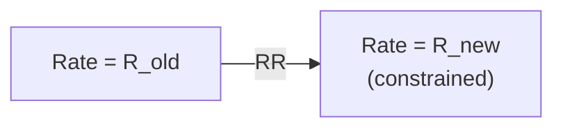
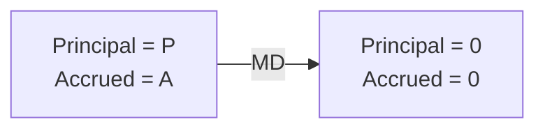
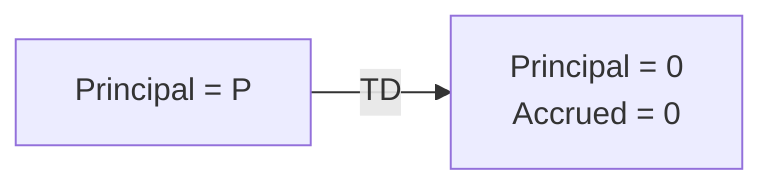
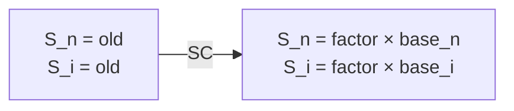
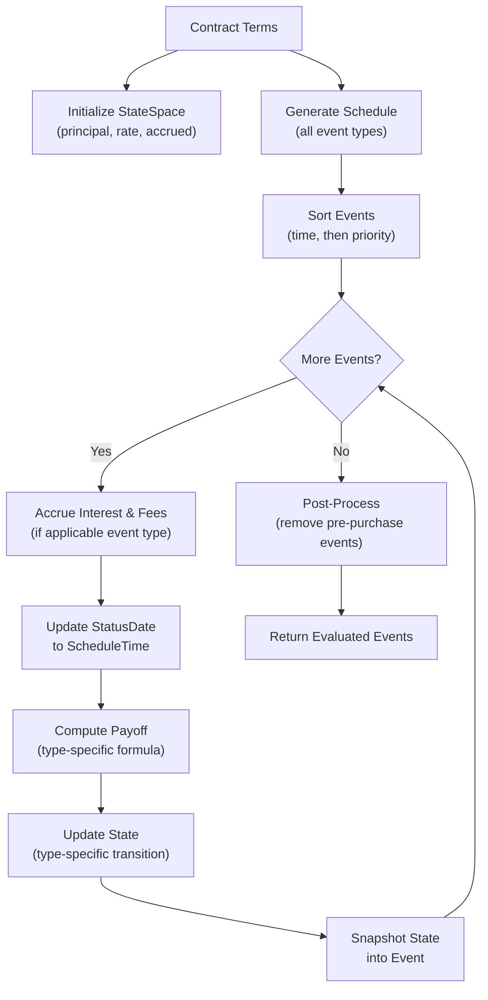

# State Machine

## Overview

Every ACTUS contract is modeled as a deterministic state machine. The contract carries a state — a set of numeric variables — that evolves over time as events are processed. Each event reads the current state, computes a cash flow (its payoff), and produces a new state. Events are processed in strict chronological order. Given the same inputs (contract terms, market data, evaluation date), the engine always produces exactly the same output.

This page describes the state machine in full detail: what the state variables are, how interest accrues between events, and exactly how each event type transforms the state.

## The State Space

The state of a PAM contract at any point in time is captured by the `StateSpace` value struct. This struct is passed by reference through the event processing loop, modified in place by each event.

Using a value struct (rather than a reference type) is a deliberate design choice: structs have copy-by-value semantics, which means passing a state to a parallel evaluation thread automatically creates an isolated copy. This is essential for the GPU and Monte Carlo extensions, where thousands of scenarios evaluate the same contract in parallel without thread-safety concerns.

### State Variables

| Variable | Type | Description | Initial Value |
|---|---|---|---|
| NotionalPrincipal | double | Current face value, signed by contract role | 0 or RoleSign × NotionalPrincipal |
| NominalInterestRate | double | Current annual interest rate | 0 or NominalInterestRate from terms |
| AccruedInterest | double | Interest accumulated since the last IP event | Computed or from terms |
| FeeAccrued | double | Fees accumulated since the last FP event | 0 or from terms |
| NotionalScalingMultiplier | double | Multiplier for notional-dependent cash flows | 1.0 from terms |
| InterestScalingMultiplier | double | Multiplier for interest-dependent cash flows | 1.0 from terms |
| StatusDate | DateTime | Date of the current state (advances with each event) | StatusDate from terms |
| ContractPerformance | string? | Performance status (performing, delayed, default, etc.) | From terms |

The first four variables — principal, rate, accrued interest, and accrued fees — are the "working" state that changes with most events. The scaling multipliers only change on SC events. The StatusDate advances to the schedule time of each event as it is processed.

## Interest Accrual

Interest accrual is the engine's most frequently executed calculation. It happens before certain events are processed, updating the AccruedInterest (and optionally FeeAccrued) to reflect the time that has passed since the last event.

### When Accrual Occurs

Accrual is triggered before these event types: IP, IPCI, RR, RRF, FP, and SC. It is not triggered before IED (the contract does not yet exist), MD (accrual is handled by the IP formula on the same date), PRD (purchase does not affect accrual), or TD (handled similarly to MD).

### The Accrual Formula

```
AccruedInterest += NominalInterestRate × NotionalPrincipal × YearFraction(prevDate, currentDate)
```

Where:
- `prevDate` is the StatusDate (the date of the previous event)
- `currentDate` is the ScheduleTime of the current event
- `YearFraction` is computed using the contract's day count convention

Accrual only occurs when two conditions are met:
1. The StatusDate is strictly before the current event's ScheduleTime (no zero-length accrual)
2. The NotionalPrincipal is non-zero (no accrual on an inactive contract)

### Fee Accrual

For notional-basis fees (FeeBasis = "N"), fee accrual follows the same pattern:

```
FeeAccrued += FeeRate × NotionalPrincipal × YearFraction(prevDate, currentDate)
```

Absolute fees (FeeBasis = "A") do not accrue — they are paid as a fixed amount per period.

### Date Selection for Calculations

The dates used in the year fraction calculation depend on the business day convention's Calc/Shift strategy:

- **CalcShift conventions** (CSF, CSMF, CSP, CSMP): calculations use the original, unshifted schedule dates. The `ShiftCalcTime()` method returns the original date.
- **ShiftCalc conventions** (SCF, SCMF, SCP, SCMP): calculations use the business-day-adjusted dates. The `ShiftCalcTime()` method returns the shifted date.
- **NOS** (No Shift): no adjustment — both dates are the same.

This distinction matters when an event date falls on a weekend. A CalcShift convention says "calculate interest as if the payment happened on the scheduled date, but actually settle on the next business day." A ShiftCalc convention says "the payment date is the business day, and interest accrues to that date."

## Event Evaluation: The Three-Step Process

Every event's `Evaluate()` method follows the same three-step pattern:



**Step 1 — ComputePayoff:** Calculate the cash flow for this event type. The payoff depends on the event type and the current state (see [PAM Contract](./pam-contract.md) for all formulas).

**Step 2 — UpdateState:** Modify the state space according to this event type's transition rules. This is where interest accrual happens (for applicable event types), followed by the type-specific state change.

**Step 3 — Snapshot:** Copy the four key state variables (NotionalPrincipal, NominalInterestRate, AccruedInterest, FeeAccrued) from the state space into the event object. This creates a permanent record of the state after this event, which appears in the output.

## State Transitions by Event Type

### IED — Initial Exchange Date

The contract begins. The principal is established and the interest rate is set.



**State changes:**
- `NotionalPrincipal` = `RoleSign × model.NotionalPrincipal`
- `NominalInterestRate` = `model.NominalInterestRate`
- If the cycle anchor date is before the IED, accrued interest is computed from the anchor to the IED using the day count convention. This handles the case where interest starts accruing before the principal is exchanged.

**Payoff:**
```
fxRate × RoleSign × (−1) × (NotionalPrincipal + PremiumDiscountAtIED)
```

### IP — Interest Payment

Accrued interest is paid out and the accrual counter resets to zero.



**State changes:**
- Interest accrual is computed (adding to AccruedInterest) before the state update
- `AccruedInterest` = 0 (reset after payment)
- All other state variables unchanged

**Payoff:**
```
fxRate × InterestScalingMultiplier × (AccruedInterest + Δt × Rate × Principal)
```

The payoff includes both the previously accrued amount and the interest for the final sub-period. The scaling multiplier adjusts for inflation-linked contracts.

### IPCI — Interest Capitalization

Instead of paying interest out as cash, the accrued interest is added to the principal. This increases the base for future interest calculations (compound interest).



**State changes:**
- Interest accrual is computed before the state update
- `NotionalPrincipal` += `AccruedInterest`
- `AccruedInterest` = 0

**Payoff:** 0 (no cash flow — the interest stays inside the contract)

### RR — Rate Reset (Market-Driven)

The interest rate is updated from market data. The new rate is derived from an external market rate, adjusted by a multiplier and spread, and constrained by period-level and lifetime caps and floors.



**The rate reset algorithm has four steps:**

1. **Look up the market rate:** Query the RiskFactorModel using the `MarketObjectCodeOfRateReset` and the event time.

2. **Apply multiplier and spread:**
   ```
   candidateRate = marketRate × RateMultiplier + RateSpread
   ```

3. **Apply period constraints:** Compute the change from the current rate and clamp it:
   ```
   deltaRate = candidateRate − currentRate
   deltaRate = clamp(deltaRate, PeriodFloor, PeriodCap)
   newRate = currentRate + deltaRate
   ```

4. **Apply lifetime constraints:** Clamp the absolute rate:
   ```
   newRate = clamp(newRate, LifeFloor, LifeCap)
   ```

**State changes:**
- Interest accrual is computed before the rate change
- `NominalInterestRate` = constrained new rate

**Payoff:** 0 (administrative event — no cash flow)

**Why two-stage clamping?** Period caps/floors limit how much the rate can change in a single reset — protecting borrowers from sudden rate spikes. Lifetime caps/floors set absolute bounds over the contract's entire duration. Both constraints are standard in floating-rate loan agreements.

### RRF — Rate Reset Fixed

A variant of rate reset where the new rate comes from the contract terms (`NextResetRate`) rather than market data. This is used for the first reset event after the StatusDate when a fixed next rate has been pre-agreed.

**State changes:** Same as RR, but using `model.NextResetRate` instead of a market lookup. Period and lifetime caps/floors still apply.

**Payoff:** 0

### MD — Maturity Date

The contract ends. The principal is returned and all state variables are zeroed.



**State changes:**
- `NotionalPrincipal` = 0
- `AccruedInterest` = 0

**Payoff:**
```
fxRate × NotionalScalingMultiplier × NotionalPrincipal
```

### TD — Termination Date

Early contract termination. Functionally similar to maturity, but the payoff is the agreed termination price rather than the notional.



**State changes:**
- `NotionalPrincipal` = 0
- `AccruedInterest` = 0

**Payoff:**
```
fxRate × RoleSign × PriceAtTerminationDate
```

### PRD — Purchase Date

A secondary market purchase. The buyer pays the purchase price. No state change occurs — the contract's terms continue unchanged.

**State changes:** None

**Payoff:**
```
fxRate × RoleSign × (−1) × PriceAtPurchaseDate
```

### FP — Fee Payment

Accumulated fees are paid out and the fee accrual counter resets.

**State changes:**
- Fee accrual is computed before the state update
- `FeeAccrued` = 0

**Payoff** (absolute basis):
```
fxRate × RoleSign × FeeRate
```

**Payoff** (notional basis):
```
fxRate × (FeeAccrued + NotionalPrincipal × FeeRate × Δt)
```

### SC — Scaling

Scaling multipliers are updated from an external index. This changes the magnitude of future notional-dependent and interest-dependent cash flows.



**The scaling algorithm:**
```
scalingFactor = currentIndex / ScalingIndexAtContractDealDate
```

Then, depending on the `ScalingEffect`:
- If it contains "N": `NotionalScalingMultiplier = scalingFactor × model.NotionalScalingMultiplier`
- If it contains "I": `InterestScalingMultiplier = scalingFactor × model.InterestScalingMultiplier`

**State changes:**
- Interest accrual is computed before the scaling update
- Scaling multipliers updated as described above

**Payoff:** 0 (administrative event)

## Event Priority

When multiple events occur on the same date, they must be processed in a deterministic order. The engine assigns a priority number to each event type — lower numbers are processed first:

| Priority | Event Type | Rationale |
|---|---|---|
| 0 | IED | Contract must be activated before anything else |
| 1 | IP | Interest is paid at the old rate before any rate change |
| 2 | IPCI | Interest is capitalized at the old rate before any rate change |
| 3 | PRD | Purchase is recorded after interest events |
| 4 | TD | Termination happens after interest settlement |
| 5 | RR | Rate reset takes effect after the old rate's payments |
| 6 | RRF | Fixed rate reset, same ordering as RR |
| 7 | FP | Fee payment follows rate changes |
| 8 | SC | Scaling updates follow all payment events |
| 9 | MD | Maturity is last — principal is returned after all other processing |
| 10 | CD | Credit default is the final event type |

This ordering ensures correct behavior. For example, on a date where both an IP and an RR event occur, the interest is paid at the old rate (IP at priority 1) before the rate changes (RR at priority 5). Similarly, on the maturity date, any final interest payment (IP at priority 1) is processed before the principal return (MD at priority 9).

## The Complete Processing Flow

Putting it all together, here is the complete sequence for evaluating a PAM contract:



## Continue Reading

- [PAM Contract](./pam-contract.md) — contract terms and schedule generation details
- [Conventions](./conventions/index.md) — how day count and business day conventions affect accrual
- [Schedule Generation](./scheduling.md) — how event dates are generated from cycle strings
- [Technical Reference](./reference.md) — complete listing of all types and enumerations
