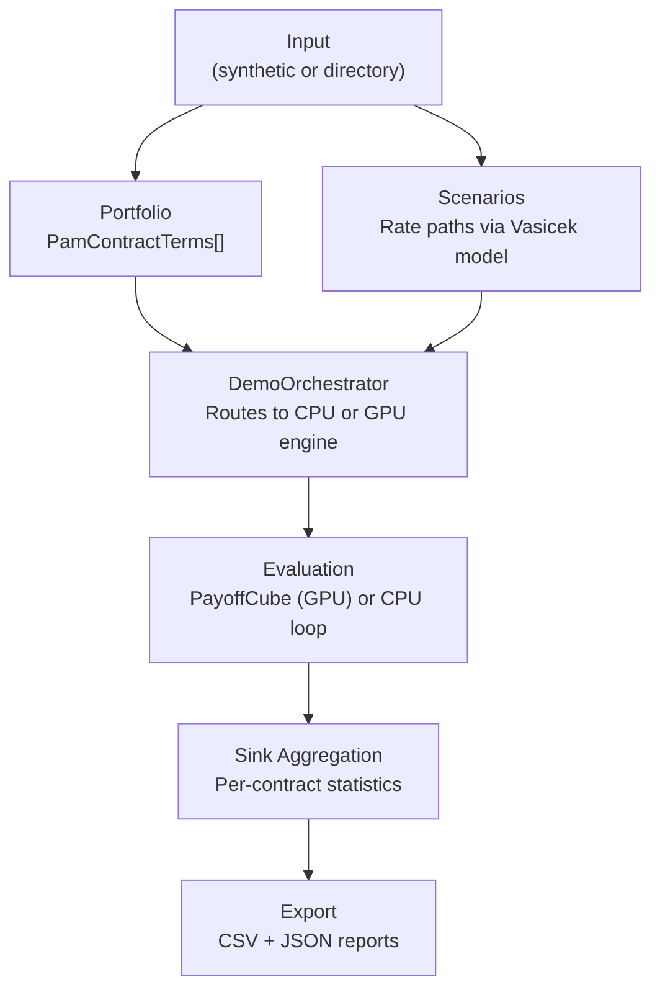

# CLI Demo Tool — Monte Carlo Portfolio Valuation

## Overview

The PamMonteCarlo50Y CLI tool demonstrates the complete pipeline: portfolio generation (or loading), scenario generation, GPU (or CPU) evaluation, sink aggregation, and reporting. It is the primary way to exercise the system end to end.

## Modes of Operation

The CLI supports two input modes:

**Synthetic mode** — generates a random portfolio and Monte Carlo scenarios from parameters:

```
PamMonteCarlo50Y --backend gpu --contracts 10000 --scenarios 1000 --months 600 --seed 42
```

**Input-directory mode** — loads a pre-built portfolio and scenarios from CSV/JSON files:

```
PamMonteCarlo50Y --backend gpu --input ./samples/input --out ./results
```

## Key CLI Options

| Option | Description | Default |
|---|---|---|
| `--backend` | cpu, gpu, or both | both |
| `--contracts` | Number of synthetic contracts | 1000 |
| `--scenarios` | Number of Monte Carlo scenarios | 100 |
| `--months` | Projection horizon in months | 600 (50 years) |
| `--seed` | Random seed for reproducibility | 42 |
| `--calcDateIndex` | Boundary between historical and forward rates | 0 |
| `--runs` | Path to runs.json for multi-run configuration | — |
| `--input` | Input directory for pre-built portfolios | — |
| `--out` | Output directory | ./out |
| `--reporting` | Enable detailed reporting exports | false |
| `--export-fact` | Export long-format fact table | false |
| `--export-portfolio` | Export generated portfolio to CSV | false |
| `--metadata` | Path to contract metadata CSV for joined reporting | — |

## Execution Pipeline



## Portfolio Generator

The synthetic portfolio generator creates realistic PAM contracts with varied parameters:

- Notional principal (randomised within configurable range)
- Interest rates (randomised, possibly floating with rate resets)
- Maturity dates (varied horizons)
- Payment frequencies (monthly, quarterly, semi-annual, annual)
- Day count conventions (varied across contracts)

The generator is **deterministic** — the same seed always produces the same portfolio.

## Vasicek Rate Generator

Monte Carlo scenarios are generated using the Vasicek interest rate model, which produces mean-reverting rate paths characterised by:

| Parameter | Description |
|---|---|
| κ (kappa) | Mean reversion speed |
| θ (theta) | Long-term mean rate |
| σ (sigma) | Volatility |
| r₀ | Initial rate |

Each scenario is an independent rate path. The generator uses a seeded PRNG for full reproducibility.

## Reporting Exports

When `--reporting true` is enabled, the tool produces:

| File | Content |
|---|---|
| `{runId}_portfolio_by_scenario.csv` | RunId, ScenarioId, PortfolioPV |
| `{runId}_contract_summary.csv` | Per-contract statistics: Mean, StdDev, P05, P25, Median, P75, P95, ES95, ES99 |
| `{runId}_fact_results_long.csv` | Long-format fact table (when --export-fact true) |
| `runs.csv` | Run dimension table with metadata |

These outputs are designed to be opened directly in Excel or imported into BI tools for further analysis.

## Input Directory Structure

When using `--input`, the directory must follow this structure:

```
input_dir/
├── portfolio.csv                    — Contract terms in CSV format
├── scenarios/
│   ├── scenario_set.json            — Scenario metadata
│   └── riskfactors/
│       ├── interest_rate_prior.csv  — Historical rates (before calcDateIndex)
│       └── interest_rate_after.csv  — Forward rates (scenario-specific)
├── runs.json                        — (optional) Multi-run definitions
└── contract_metadata.csv            — (optional) Extra contract attributes for reporting
```
