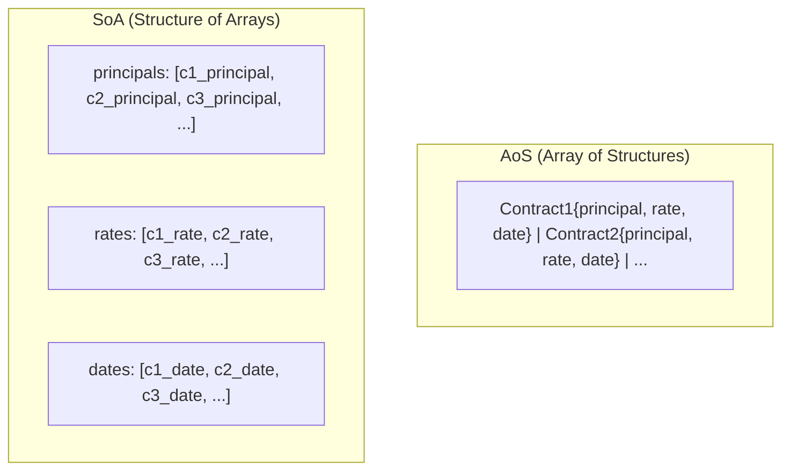

# GPU Data Structures

## Overview

GPU kernels operate exclusively on blittable types — fixed-size structs containing only primitive numeric fields. This page documents the GPU data structures and the transformation rules that convert rich CPU domain objects into GPU-compatible format.

## PamContractGpu

The primary contract representation on the GPU. Each contract is a single fixed-size struct containing all parameters needed for event evaluation.

| Field | Type | Source |
|---|---|---|
| StatusDateTicks | long | StatusDate converted to ticks (0 = null) |
| InitialExchangeDateTicks | long | InitialExchangeDate → ticks |
| MaturityDateTicks | long | MaturityDate → ticks |
| PurchaseDateTicks | long | PurchaseDate → ticks (0 = none) |
| TerminationDateTicks | long | TerminationDate → ticks (0 = none) |
| NotionalPrincipal | double | Direct copy |
| NominalInterestRate | double | Direct copy |
| AccruedInterest | double | Direct copy |
| RateSpread | double | Direct copy |
| RateMultiplier | double | Direct copy |
| NextResetRate | double | Direct copy |
| LifeCap / LifeFloor | double | Rate cap and floor |
| PeriodCap / PeriodFloor | double | Per-period rate bounds |
| FeeRate | double | Direct copy |
| FeeAccrued | double | Direct copy |
| FeeBasis | int | "A"=0, "N"=1 |
| DayCountConventionCode | int | Enum → integer code |
| ContractRoleSign | double | +1.0 or −1.0 |
| EventOffset / EventCount | int | Slice into shared PamEventGpu[] |
| MarketRateOffset / MarketRateCount | int | Slice into shared GpuMarketRate[] |
| Initial state fields | double | NotionalPrincipal, rates, accrued at IED |

### Key Design Decisions

**Dates as ticks:** DateTime objects cannot exist on the GPU. All dates are converted to `long` tick counts. A value of 0 indicates a null/absent date.

**Enum codes:** String-based enums (like "Annual" for payment frequency) are converted to integer codes during adaptation.

**Event offset/count:** Rather than giving each contract its own event array, all events are packed into a single flat array. Each contract stores its starting offset and event count. This eliminates per-contract memory allocation on the GPU.

## PamEventGpu

Each scheduled event is represented as a fixed-size struct in the shared event array.

| Field | Type | Description |
|---|---|---|
| ScheduleTimeTicks | long | Original scheduled date (before business day shifting) |
| EventTimeTicks | long | Actual event date (after business day shifting) |
| CalcTimeTicks | long | Calculation reference date (for CalcShift conventions) |
| EventType | int | GpuEventType code (IED=0, IP=1, ... CD=11) |
| RateIndex | int | Index into GpuMarketRate[] array (−1 if no rate lookup) |

## PamEventResultGpu

The output struct written by the kernel for each event.

| Field | Type | Description |
|---|---|---|
| Payoff | double | Computed payoff amount |
| NotionalPrincipal | double | State: notional after this event |
| NominalInterestRate | double | State: interest rate after this event |
| AccruedInterest | double | State: accrued interest after this event |
| FeeAccrued | double | State: fee accrued after this event |

Struct is padded to 8-byte alignment for optimal GPU memory access.

## GpuMarketRate

Market rate observations for rate-reset events.

| Field | Type | Description |
|---|---|---|
| TimeTicks | long | Observation date |
| Value | double | Rate value |

## GpuEventType Enum

Maps CPU EventType to GPU integer codes:

| Code | Event Type | Description |
|---|---|---|
| 0 | IED | Initial Exchange Date |
| 1 | IP | Interest Payment |
| 2 | IPCI | Interest Payment Capitalisation |
| 3 | PRD | Purchase Date |
| 4 | TD | Termination Date |
| 5 | RR | Rate Reset (variable) |
| 6 | RRF | Rate Reset (fixed) |
| 7 | FP | Fee Payment |
| 8 | SC | Scaling |
| 9 | MD | Maturity Date |
| 10 | AD | Analysis Date |
| 11 | CD | Credit Default |

## SoA vs AoS Layout

The GPU layer uses **Structure of Arrays** (SoA) rather than Array of Structures (AoS) for memory layout. This ensures coalesced memory access when thousands of GPU threads read the same field across different contracts.

When all threads read the `principal` field simultaneously, SoA ensures these reads hit consecutive memory addresses, maximising GPU memory bandwidth.
