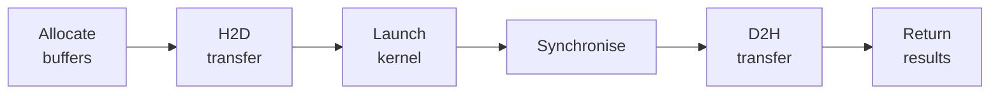

# GPU Executors

## Overview

Executors manage the full lifecycle of GPU execution: device selection, buffer allocation, data transfer, kernel dispatch, and result retrieval. They encapsulate all ILGPU-specific code, presenting a clean API to the rest of the system.

## PamGpuExecutor

The primary executor for single-batch PAM contract evaluation.

### Accelerator Selection

The factory method selects the best available device:

1. **CUDA** — highest performance on NVIDIA GPUs
2. **OpenCL** — cross-vendor fallback
3. **CPU** — always available, slowest but functional

Selection happens once at construction time. The chosen accelerator is reused for all subsequent evaluations.

### Execution Modes

**EvaluateBatch** — all-in-one pipeline:

**UploadAndExecute + DownloadResults** — split phases for batching:

This split mode is used by the Monte Carlo pipeline to submit multiple scenario batches before downloading.

### Buffer Pooling

GPU memory allocation is expensive. The executor pools buffers to avoid repeated allocation:

1. On first call, buffers are allocated to match the input size
2. If a subsequent call needs more space, buffers are reallocated at 1.5× the required size + 16 elements of padding
3. Buffers never shrink — the high-water mark persists
4. All buffers are disposed when the executor is disposed

This means the common case (repeated evaluation of similar-sized portfolios) incurs zero GPU memory allocation after the first call.

### Kernel Caching

The ILGPU kernel is compiled from C# to GPU instructions on first use. This compilation takes hundreds of milliseconds. The compiled kernel is cached and reused for all subsequent calls, making repeat evaluations fast.

## PayoffCubeExecutor

Extends the execution model for Monte Carlo scenario evaluation with 2D kernels.

### Scenario Batching

For large scenario counts, the executor batches scenarios to fit within GPU memory. Each batch uploads a subset of scenario rates, executes the 2D kernel, and accumulates results into the payoff cube.

### Output Cube Management

The output cube is a flat array of size K × C × S × T. The executor allocates this on the GPU, the kernel writes to it via atomic accumulation, and the executor downloads the complete cube after all scenario batches are processed.

## Life Insurance Executor

Manages the life insurance projection pipeline with its specialised data requirements.

### Lookup Table Upload

Before kernel execution, the executor uploads the pre-built lookup tables (mortality, lapse, disability, Markov hazards) to GPU memory. These tables are shared across all policy threads and remain resident for the duration of the evaluation.

### Scenario Replication

For life insurance Monte Carlo, policies are replicated C×S times before kernel dispatch. Each replica carries per-scenario adjustments (e.g., different mortality stress factors). This replication happens on the CPU before upload, and the kernel processes each replica as an independent thread.

## Profiling

The GPU profiler (enabled via the `ACTUS_GPU_PROFILE=1` environment variable) instruments the execution pipeline to measure time spent in each phase: buffer allocation, H2D transfer, kernel execution, synchronisation, and D2H transfer. This helps identify bottlenecks and verify that the kernel execution dominates over transfer overhead for large portfolios.
